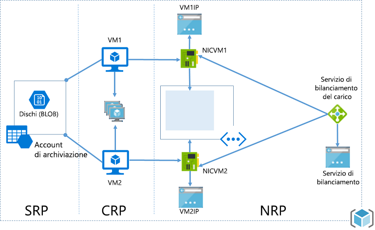
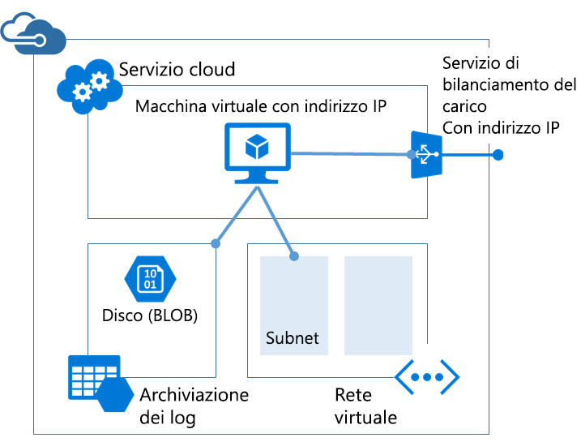

# <a name="azure-resource-manager-vs-classic-deployment-understand-deployment-models-and-the-state-of-your-resources"></a>Confronto tra distribuzione di Azure Resource Manager e classica: comprensione dei modelli di implementazione e dello stato delle risorse
Questo argomento illustra i modelli di distribuzione classica e Azure Resource Manager, lo stato delle risorse e i motivi per cui le risorse sono state distribuite con un metodo o con l'altro. I modelli di distribuzione classica e Resource Manager rappresentano due diversi modi di distribuire e gestire le soluzioni Azure. Vengono usati con due diversi set di API e le risorse distribuite possono contenere differenze significative. I due modelli non sono completamente compatibili tra loro. Questo argomento descrive tali differenze.

Per semplificare la distribuzione e la gestione delle risorse, è consigliabile usare Resource Manager per tutte le nuove risorse e, se possibile, ridistribuire le risorse esistenti con Resource Manager.

Se non si conosce Resource Manager, è opportuno vedere prima la terminologia definita in [Panoramica di Azure Resource Manager](resource-group-overview.md).

## <a name="history-of-the-deployment-models"></a>Cronologia dei modelli di distribuzione
In origine, Azure metteva a disposizione solo il modello di distribuzione classica. In questo modello ogni risorsa era indipendente, non era possibile raggruppare le risorse correlate. Era invece necessario verificare manualmente quali risorse componessero la soluzione o l'applicazione e ricordare di gestirle in un approccio coordinato. Per distribuire una soluzione era necessario creare ogni risorsa singolarmente con il portale classico oppure creare uno script che distribuisse tutte le risorse nell'ordine corretto. Per eliminare una soluzione era necessario eliminare ogni risorsa singolarmente. Non era semplice applicare e aggiornare i criteri di controllo di accesso per le risorse correlate. Non era infine possibile applicare i tag alle risorse per etichettarle con i termini che consentono di monitorare le risorse e gestire la fatturazione.

Nel 2014, Azure ha introdotto Resource Manager e il nuovo concetto di gruppo di risorse. Un gruppo di risorse è un contenitore di risorse che condividono un ciclo di vita comune. Il modello di distribuzione di Resource Manager offre diversi vantaggi:

* È possibile distribuire, gestire e monitorare tutti i servizi per la soluzione come un gruppo, anziché gestire singolarmente questi servizi.
* È possibile distribuire ripetutamente la soluzione nel corso del ciclo di vita garantendo al contempo che le risorse vengano distribuite in uno stato coerente.
* È possibile applicare il controllo di accesso a tutte le risorse nel gruppo di risorse e tali criteri vengono applicati automaticamente quando si aggiungono nuove risorse al gruppo di risorse.
* È possibile applicare tag alle risorse per organizzare in modo logico tutte le risorse nella sottoscrizione.
* È possibile usare JavaScript Object Notation (JSON) per definire l'infrastruttura per la soluzione. Il file JSON è noto come modello di Resource Manager.
* È possibile definire le dipendenze tra risorse e pertanto esse vengono distribuite nell'ordine corretto.

Quando è stato aggiunto Gestione risorse, tutte le risorse retroattive sono state aggiunti ai gruppi di risorse predefiniti. Se ora si crea una risorsa tramite la distribuzione classica, la risorsa viene creata automaticamente all'interno di un gruppo di risorse predefinito per tale servizio anche se non è stato specificato il gruppo di risorse in fase di distribuzione. Tuttavia, il solo fatto di esistere all'interno di un gruppo di risorse non significa che la risorsa è stata convertita nel modello di Gestione risorse. La sezione successiva illustra il modo in cui ogni servizio gestisce i due modelli di distribuzione. 

## <a name="understand-support-for-the-models"></a>Informazioni sul supporto dei modelli
Quando si decide quale modello di distribuzione usare per le risorse, esistono tre scenari da tenere presenti:

1. Il servizio supporta Resource Manager e offre un solo tipo di distribuzione.
2. Il servizio supporta Resource Manager, ma offre due tipi di distribuzione, uno per Resource Manager e uno per la distribuzione classica. Questo scenario si applica solo alle macchine virtuali, agli account di archiviazione e alle reti virtuali.
3. Il servizio non supporta Resource Manager.

Per verificare se un servizio supporta Resource Manager, vedere [Provider e tipi di risorse](resource-manager-supported-services.md).

Se il servizio che si vuole usare non supporta Resource Manager è necessario continuare a usare la distribuzione classica.

Se il servizio supporta Resource Manager e **non è** una macchina virtuale, un account di archiviazione o una rete virtuale, è possibile usare Resource Manager senza problemi.

Per le macchine virtuali, gli account di archiviazione e le reti virtuali, se la risorsa è stata creata con una distribuzione classica è necessario continuare eseguire operazioni classiche sulla risorsa. Se per creare la macchina virtuale, l'account di archiviazione o la rete virtuale è stata usata la distribuzione di Resource Manager è necessario continuare a eseguire operazioni di Resource Manager. Questa distinzione può creare confusione quando la sottoscrizione contiene una combinazione di risorse create con Resource Manager e con la distribuzione classica. Questa combinazione di risorse può produrre risultati imprevisti perché le risorse non supportano le stesse operazioni.

In alcuni casi, un comando di Resource Manager può recuperare informazioni su una risorsa creata con la distribuzione classica o può eseguire attività amministrative, come lo spostamento di una risorsa classica in un altro gruppo di risorse, ma non per questo il tipo supporta le operazioni di Resource Manager. Si supponga ad esempio di avere un gruppo di risorse che contiene una macchina virtuale creata con la distribuzione classica. Se si esegue questo comando PowerShell di Resource Manager:

```powershell
Get-AzureRmResource -ResourceGroupName ExampleGroup -ResourceType Microsoft.ClassicCompute/virtualMachines
```

Verrà restituita la macchina virtuale:

```powershell
Name              : ExampleClassicVM
ResourceId        : /subscriptions/{guid}/resourceGroups/ExampleGroup/providers/Microsoft.ClassicCompute/virtualMachines/ExampleClassicVM
ResourceName      : ExampleClassicVM
ResourceType      : Microsoft.ClassicCompute/virtualMachines
ResourceGroupName : ExampleGroup
Location          : westus
SubscriptionId    : {guid}
```

Il cmdlet **Get-AzureRmVM** di Resource Manager restituisce tuttavia solo le macchine virtuali distribuite con Resource Manager. Il comando seguente non restituisce la macchina virtuale creata tramite distribuzione classica.

```powershell
Get-AzureRmVM -ResourceGroupName ExampleGroup
```

Solo le risorse create tramite il tag di supporto di Gestione risorse. Non è possibile applicare i tag alle risorse classiche.

## <a name="resource-manager-characteristics"></a>Caratteristiche di Gestione risorse
Per comprendere i due modelli è opportuno esaminare le caratteristiche dei tipi di Resource Manager:

* Risorse create tramite il [portale di Azure](https://portal.azure.com/).
  
     
  
     Per le risorse di calcolo, archiviazione e rete, è possibile usare sia Resource Manager che la distribuzione classica. Selezionare **Gestione risorse**.
  
     
* Risorse create con la versione dei cmdlet Azure PowerShell di Resource Manager. Questi comandi hanno il formato *Verbo-AzureRmNome*.

  ```powershell
  New-AzureRmResourceGroupDeployment
  ```

* Risorse create tramite l' [API REST di Azure Resource Manager](https://docs.microsoft.com/rest/api/resources/) per le operazioni REST.
* Risorse create tramite i comandi dell'interfaccia della riga di comando di Azure nella modalità **arm** .
  
  ```azurecli
  azure config mode arm
  azure group deployment create
  ```

* Il tipo di risorsa non include **(classico)** nel nome. Nell'immagine seguente, il tipo è visualizzato come **Account di archiviazione**.
  
    

## <a name="classic-deployment-characteristics"></a>Caratteristiche della distribuzione classica
È inoltre possibile conoscere il modello di distribuzione classico come modello di gestione dei servizi.

Le risorse create nel modello di distribuzione classica condividono le caratteristiche seguenti:

* Risorse create tramite il [portale classico](https://manage.windowsazure.com)
  
     
  
     oppure il portale di Azure specificando la distribuzione **Classica** per i servizi di calcolo, archiviazione e rete.
  
     
* Risorse create con la versione dei cmdlet Azure PowerShell di Gestione dei servizi. Questi nomi di comando hanno il formato *Verbo-AzureNome*.

  ```powershell
  New-AzureVM
  ```

* Risorse create tramite l' [API REST Gestione dei servizi](https://msdn.microsoft.com/library/azure/ee460799.aspx) per le operazioni REST.
* Risorse create tramite i comandi dell'interfaccia della riga di comando di Azure nella modalità **asm** .

  ```azurecli
  azure config mode asm
  azure vm create
  ```
   
* Il tipo di risorsa include **(classico)** nel nome. Nell'immagine seguente, il tipo è visualizzato come **Account di archiviazione (classico)**.
  
    

È possibile usare il portale di Azure per gestire risorse create con la distribuzione classica.

## <a name="changes-for-compute-network-and-storage"></a>Cambiamenti a livello di calcolo, rete e archiviazione
Il diagramma seguente illustra le risorse di calcolo, rete e archiviazione distribuite con Resource Manager.



Tenere presenti le relazioni tra le risorse elencate di seguito:

* Tutte le risorse si trovano in un gruppo di risorse.
* La macchina virtuale dipende da un account di archiviazione specifico definito nel provider di risorse di archiviazione per archiviare i dischi nell'archivio BLOB (obbligatorio).
* La macchina virtuale fa riferimento a una scheda di interfaccia di rete specifica definita nel provider di risorse di rete (obbligatorio) e a un set di disponibilità definito nel provider di risorse di calcolo (facoltativo).
* La scheda di interfaccia di rete fa riferimento all'indirizzo IP assegnato della macchina virtuale (obbligatorio), alla subnet della rete virtuale per la macchina virtuale (obbligatorio) e a un gruppo di sicurezza di rete (facoltativo).
* La subnet all'interno di una rete virtuale fa riferimento a un gruppo di sicurezza di rete (facoltativo).
* L'istanza del servizio di bilanciamento del carico fa riferimento al pool back-end di indirizzi IP che includono la scheda di interfaccia di rete di una macchina virtuale (facoltativo) e a un indirizzo IP pubblico o privato del servizio di bilanciamento del carico (facoltativo).

Di seguito sono illustrati i componenti e le relative relazioni per la distribuzione classica:



La soluzione classica per l'hosting di una macchina virtuale include:

* Un servizio cloud obbligatorio che funge da contenitore per l'hosting di macchine virtuali (calcolo). Le macchine virtuali sono fornite automaticamente con una scheda di rete (NIC) e un indirizzo IP assegnati da Azure. Il servizio cloud contiene inoltre un'istanza del servizio di bilanciamento del carico esterno, un indirizzo IP pubblico ed endpoint predefiniti per consentire il traffico di desktop remoto e di PowerShell remoto per le macchine virtuali basate su Windows e il traffico Secure Shell (SSH) per le macchine virtuali basate su Linux.
* Un account di archiviazione obbligatorio per l'archiviazione dei dischi rigidi virtuali per una macchina virtuale, inclusi il sistema operativo, i dati temporanei e altri dischi dati (archiviazione).
* Una rete virtuale facoltativa che funge da contenitore aggiuntivo, in cui è possibile creare una struttura di subnet e definire la subnet in cui si trova la macchina virtuale (rete).

La tabella seguente descrive i cambiamenti nelle modalità di interazione dei provider di risorse di calcolo, rete e archiviazione:

| Elemento | Classico | Gestione risorse |
| --- | --- | --- |
| Servizio cloud per macchine virtuali |Servizio cloud era un contenitore per mantenere le macchine virtuali che richiedevano disponibilità dalla piattaforma e bilanciamento del carico. |Servizio cloud non è più un oggetto richiesto per la creazione di una macchina virtuale che utilizza il nuovo modello. |
| Reti virtuali |La rete virtuale è facoltativa per la macchina virtuale. Se inclusa, non può essere distribuita con Resource Manager. |La macchina virtuale richiede una rete virtuale distribuita con Resource Manager. |
| Account di archiviazione |La macchina virtuale richiede un account di archiviazione per l'archiviazione dei dischi rigidi virtuali per il sistema operativo, i dati temporanei e altri dischi dati. |La macchina virtuale richiede un account di archiviazione per l'archiviazione dei dischi nell'archivio BLOB. |
| SET DI DISPONIBILITÀ |La disponibilità per la piattaforma era indicata mediante la configurazione  dello stesso oggetto "AvailabilitySetName" nelle macchine virtuali. Il numero massimo di domini di errore era 2. |Il set di disponibilità è una risorsa esposta dal provider Microsoft.Compute. Le macchine virtuali che richiedono un'elevata disponibilità devono essere incluse nel set di disponibilità. Il numero massimo di domini di errore è ora 3. |
| Gruppi di affinità |I gruppi di affinità erano necessari per la creazione di reti virtuali. Tuttavia, con l'introduzione di reti virtuali regionali, tale requisito non era più necessario. |Per semplificare, non esiste il concetto di gruppi di affinità nelle API esposte tramite Gestione risorse di Microsoft Azure. |
| Bilanciamento del carico. |La creazione di un servizio cloud fornisce un servizio di bilanciamento del carico implicito per le macchine virtuali distribuite. |Il bilanciamento del carico è una risorsa esposta dal provider Microsoft.Network. L'interfaccia di rete primaria delle macchine virtuali che deve essere configurata con carico bilanciato deve fare riferimento al servizio di bilanciamento del carico. I servizi di bilanciamento del carico possono essere interni o esterni. Un'istanza del servizio di bilanciamento del carico fa riferimento al pool back-end di indirizzi IP che includono la NIC di una macchina virtuale (facoltativo) e fa riferimento a un indirizzo IP pubblico o privato del servizio di bilanciamento del carico (facoltativo). [Per ulteriori informazioni.](../virtual-network/resource-groups-networking.md) |
| Indirizzo IP virtuale |I servizi cloud ottengono un indirizzo IP virtuale (VIP) predefinito quando una VM viene aggiunta a un servizio cloud. L'indirizzo IP virtuale è l'indirizzo associato al servizio di bilanciamento del carico implicito. |Il bilanciamento del carico è una risorsa esposta dal provider Microsoft.Network. L’indirizzo IP pubblico può essere statico (riservato) o dinamico. Gli indirizzi IP pubblici possono essere assegnati a un servizio di bilanciamento del carico. Gli indirizzi IP pubblici possono essere protetti tramite gruppi di protezione. |
| Indirizzo IP riservato |In Microsoft Azure è possibile riservare un indirizzo IP e associarlo a un servizio cloud per assicurarsi che l'indirizzo IP sia permanente. |L’indirizzo IP pubblico può essere creato in modalità "statica" e offre le stesse funzionalità di un "indirizzo IP riservato". Gli indirizzi IP statici possono essere assegnati solo a un servizio di bilanciamento del carico al momento. |
| Indirizzo IP pubblico per macchina virtuale |Gli indirizzi IP pubblici possono anche essere associati direttamente a una VM. |Il bilanciamento del carico è una risorsa esposta dal provider Microsoft.Network. L’indirizzo IP pubblico può essere statico (riservato) o dinamico. Tuttavia, al momento solo indirizzi IP pubblici dinamici possono essere assegnati a un'interfaccia di rete per ottenere un indirizzo IP pubblico per ogni macchina virtuale. |
| Endpoint |In una macchina virtuale era necessario configurare gli endpoint di input per  consentire connettività a determinate porte. Una delle modalità comuni di connessione alle macchine virtuali eseguita mediante l'impostazione di endpoint di input. |È possibile configurare le regole NAT in ingresso in servizi di bilanciamento del carico per ottenere le stesse funzionalità di abilitazione degli endpoint su porte specifiche per la connessione alle macchine virtuali. |
| Nome DNS |Un servizio cloud otterrebbe un nome DNS univoco globale implicito. Ad esempio: `mycoffeeshop.cloudapp.net`. |I nomi DNS sono parametri facoltativi che possono essere specificati in una risorsa di indirizzo IP pubblico. Il nome di dominio completo ha il formato seguente: `<domainlabel>.<region>.cloudapp.azure.com`. |
| Interfacce di rete |Interfacce di rete primarie e secondarie e le relative proprietà sono state definite come configurazione di rete di una macchina virtuale. |L’interfaccia di rete è una risorsa esposta dal provider Microsoft.Network. Il ciclo di vita dell'interfaccia di rete non è correlato a una macchina virtuale. Fa riferimento all'indirizzo IP assegnato della macchina virtuale (obbligatorio), alla subnet della rete virtuale per la macchina virtuale (obbligatorio) e a un gruppo di sicurezza di rete (facoltativo). |

Per informazioni sulla connessione di reti virtuali da diversi modelli di distribuzione, vedere [Connettere reti virtuali da modelli di distribuzione diversi nel portale](../vpn-gateway/vpn-gateway-connect-different-deployment-models-portal.md).

## <a name="migrate-from-classic-to-resource-manager"></a>Eseguire la migrazione da distribuzioni classiche a distribuzioni Resource Manager
Se si è pronti per eseguire la migrazione delle risorse dalla distribuzione classica alla distribuzione di Resource Manager, vedere:

1. [Approfondimento tecnico sulla migrazione supportata dalla piattaforma dal modello di distribuzione classica ad Azure Resource Manager](../virtual-machines/windows/migration-classic-resource-manager-deep-dive.md)
2. [Migrazione supportata dalla piattaforma di risorse IaaS dal modello classico al modello di Azure Resource Manager](../virtual-machines/windows/migration-classic-resource-manager-overview.md)
3. [Eseguire la migrazione di risorse IaaS dal modello classico al modello di Azure Resource Manager tramite Azure PowerShell](../virtual-machines/windows/migration-classic-resource-manager-ps.md)
4. [Eseguire la migrazione di risorse IaaS dal modello classico al modello di Azure Resource Manager tramite l'interfaccia della riga di comando di Azure](../virtual-machines/virtual-machines-linux-cli-migration-classic-resource-manager.md)

## <a name="frequently-asked-questions"></a>Domande frequenti
**È possibile creare una macchina virtuale con Azure Resource Manager da distribuire in una rete virtuale creata con la distribuzione classica?**

Questa operazione non è supportata. Non è possibile usare Azure Resource Manager per distribuire una macchina virtuale in una rete virtuale creata con la distribuzione classica.

**È possibile creare una macchina virtuale con Azure Resource Manager da un'immagine utente creata con Azure Service Management API?**

Questa operazione non è supportata. È tuttavia possibile copiare i file VHD da un account di archiviazione creato con Service Management API e aggiungerli a un nuovo account creato con Azure Resource Manager.

**Quali sono le conseguenze sulla quota della mia sottoscrizione?**

Le quote per le macchine virtuali, le reti virtuali e gli account di archiviazione creati con Azure Resource Manager sono separate dalle altre quote. Ogni sottoscrizione ottiene quote per creare le risorse con le nuove API. Per ulteriori informazioni sulle quote aggiuntive, fare clic [qui](../azure-subscription-service-limits.md).

**È possibile continuare a usare gli script automatizzati per il provisioning di macchine virtuali, reti virtuali e account di archiviazione tramite le API di Resource Manager?**

Tutta l'automazione e tutti gli script creati dall'utente continueranno a funzionare per le macchine virtuali e le reti virtuali esistenti create con la modalità Azure Service Management. È tuttavia necessario aggiornare gli script per usare il nuovo schema per la creazione delle stesse risorse con la modalità Resource Manager.

**Dove è possibile trovare esempi di modelli di gestione risorse di Azure?**

È possibile trovare un set completo di modelli di base in [Modelli di avvio rapido di Azure Resource Manager](https://azure.microsoft.com/documentation/templates/).

## <a name="next-steps"></a>Passaggi successivi
* Per la procedura dettagliata di creazione del modello che definisce una macchina virtuale, un account di archiviazione e una rete virtuale, vedere [Procedura dettagliata per un modello di Resource Manager](resource-manager-template-walkthrough.md).
* Per vedere i comandi per la distribuzione di un modello, vedere [Distribuire un'applicazione con il modello di Gestione risorse di Azure](resource-group-template-deploy.md).


