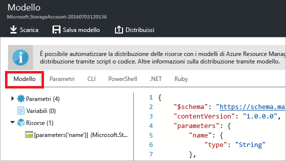
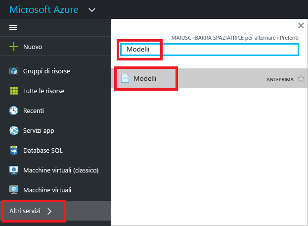
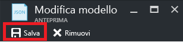

# <a name="export-an-azure-resource-manager-template-from-existing-resources"></a>Esportare un modello di Azure Resource Manager da risorse esistenti
Questo articolo illustra come esportare un modello di Resource Manager dalle risorse esistenti della sottoscrizione. Il modello generato può essere usato per comprendere meglio la sintassi del modello.

Per esportare un modello sono disponibili due modi:

* È possibile esportare il **modello effettivo usato per la distribuzione**. Il modello esportato include tutti i parametri e le variabili uguali a quelli visualizzati nel modello originale. Questo approccio è utile quando si sono distribuite risorse tramite il portale e si vuole visualizzare il modello con cui sono state create. Il modello è immediatamente utilizzabile. 
* È possibile esportare un **modello generato che rappresenta lo stato corrente del gruppo di risorse**. Il modello esportato non si basa su un modello qualsiasi usato per la distribuzione, ma crea un modello che è uno "snapshot" o un "backup" del gruppo di risorse. Il modello esportato ha diversi valori hardcoded e probabilmente meno parametri di quelli che si definiscono in genere. Usare questa opzione per ridistribuire le risorse nello stesso gruppo di risorse. Per usare questo modello per un altro gruppo di risorse, è necessario apportare alcune importanti modifiche.

Questo articolo illustra entrambi gli approcci tramite il portale.

## <a name="deploy-resources"></a>Distribuire le risorse
Per iniziare, distribuire in Azure risorse utilizzabili per l'esportazione come modello. Se la sottoscrizione include già un gruppo di risorse che si vuole esportare in un modello, è possibile ignorare questa sezione. La parte restante di questo articolo presuppone che sia stata distribuita la soluzione di app Web e database SQL illustrata in questa sezione. Se si usa un'altra soluzione, l'esperienza potrebbe essere leggermente diversa, ma i passaggi per esportare un modello saranno gli stessi. 

1. Nel [portale di Azure](https://portal.azure.com) selezionare **Crea una risorsa**.
   
      
2. Cercare **App Web e SQL** e selezionare tale voce nelle opzioni disponibili.
   
      

3. Selezionare **Create**.

      

4. Specificare i valori necessari per l'app Web e il database SQL. Selezionare **Create**.

      

La distribuzione può richiedere un minuto. Al termine della distribuzione, la sottoscrizione conterrà la soluzione.

## <a name="view-template-from-deployment-history"></a>Visualizzare il modello dalla cronologia delle distribuzioni
1. Passare al gruppo di risorse del nuovo gruppo di risorse. Si noti che il portale visualizza il risultato dell'ultima distribuzione. Selezionare questo collegamento.
   
      
2. Viene visualizzata la cronologia delle distribuzioni per il gruppo. In questo caso, è probabile che sia elencata una sola distribuzione. Selezionare questa distribuzione.
   
     
3. Il portale visualizza un riepilogo della distribuzione. Il riepilogo include lo stato della distribuzione e le relative operazioni e i valori specificati per i parametri. Per visualizzare il modello usato per la distribuzione, selezionare **Visualizza modello**.
   
     
4. Resource Manager recupera i sette file seguenti.
   
   1. **Modello** : modello che definisce l'infrastruttura per la soluzione. Quando è stato creato l'account di archiviazione tramite il portale, Resource Manager ha usato un modello per distribuirlo e ha salvato tale modello come riferimento futuro.
   2. **Parametri** : file dei parametri che può essere usato per passare i valori durante la distribuzione. Contiene i valori specificati durante la prima distribuzione. Quando si ridistribuisce il modello è possibile modificare qualsiasi valore.
   3. **Interfaccia della riga di comando** : file di script dell'interfaccia della riga di comando di Azure che può essere usato per distribuire il modello.
   3. **Interfaccia della riga di comando 2.0**: file di script dell'interfaccia della riga di comando di Azure che può essere usato per distribuire il modello.
   4. **PowerShell** : file di script di Azure PowerShell che può essere usato per distribuire il modello.
   5. **.NET** : classe .NET che può essere usata per distribuire il modello.
   6. **Ruby** : classe Ruby che può essere usata per distribuire il modello.
      
      Per impostazione predefinita, il portale visualizza il modello.
      
       
      
Questo è il modello effettivo usato per creare l'app Web e il database SQL. Si noti che contiene parametri che consentono di specificare diversi valori durante la distribuzione. Per altre informazioni sulla struttura del modello, vedere [Creazione di modelli di Azure Resource Manager](resource-group-authoring-templates.md).

## <a name="export-the-template-from-resource-group"></a>Esportare il modello da un gruppo di risorse
Se le risorse sono state modificate manualmente o sono state aggiunte risorse in più distribuzioni, il modello recuperato dalla cronologia delle distribuzioni non riflette lo stato corrente del gruppo di risorse. Questa sezione illustra come esportare un modello che rispecchia tale stato. Si tratta di uno snapshot del gruppo di risorse, che è possibile usare per la ridistribuzione nello stesso gruppo di risorse. Per usare il modello esportato per altre soluzioni, è necessario apportare alcune importanti modifiche.

> [!NOTE]
> Non è possibile esportare un modello per un gruppo contenente più di 200 risorse.
> 
> 

1. Per visualizzare il modello per un gruppo di risorse, selezionare **Script di automazione**.
   
      
   
     Resource Manager valuta le risorse nel gruppo di risorse e genera un modello per tali risorse. Non tutti i tipi di risorse supportano la funzione di esportazione del modello. Potrebbe essere visualizzato un errore che informa di un problema con l'esportazione. Per informazioni su come gestire tali problemi, vedere la sezione [Risolvere i problemi di esportazione](#fix-export-issues) .
2. Vengono visualizzati di nuovo i sei file che è possibile usare per ridistribuire la soluzione. Questa volta, tuttavia, il modello è leggermente diverso. Si noti che il modello generato contiene un numero inferiore di parametri rispetto al modello della sezione precedente. Inoltre, molti di questi valori (come i valori relativi a località e SKU) sono hardcoded nel modello e non accettano un valore di parametro. Prima di riusare il modello, può essere opportuno modificarlo per usare meglio i parametri. 
   
3. Per continuare a usare questo modello, sono disponibili due opzioni. È possibile scaricare il modello e usare un editor JSON per lavorare in locale. In alternativa, è possibile salvare il modello nella libreria e lavorare tramite il portale.
   
     Se si ha familiarità con un editor di JSON come [Visual Studio Code](https://code.visualstudio.com/) o [Visual Studio](vs-azure-tools-resource-groups-deployment-projects-create-deploy.md), è preferibile scaricare il modello in locale e usare l'editor. Per lavorare in locale, selezionare **Scarica**.
   
      
   
     Se non si ha a disposizione un editor JSON, è possibile modificare il modello tramite il portale. La parte restante di questo articolo presuppone che il modello sia stato salvato nella libreria del portale. Tuttavia, si apportano le stesse modifiche di sintassi al modello lavorando tramite il portale o in locale con un editor di JSON. Per usare il portale, selezionare **Aggiungi a raccolta**.
   
      
   
     Quando si aggiunge un modello alla libreria, è necessario assegnare al modello un nome e una descrizione. Selezionare quindi **Salva**.
   
     
4. Per visualizzare un modello salvato nella libreria, selezionare **Altri servizi**, digitare **Modelli** per filtrare i risultati, quindi selezionare **Modelli**.
   
      
5. Selezionare il modello con il nome salvato.
   
      

## <a name="customize-the-template"></a>Personalizzare il modello
Il modello esportato funziona correttamente se si vuole creare la stessa app Web e lo stesso database SQL per ogni distribuzione. Le opzioni disponibili in Resource Manager consentono, tuttavia, di distribuire modelli con maggiore flessibilità. Questo articolo illustra come aggiungere parametri per il nome e la password di amministratore del database. Questo stesso approccio può essere usato per aggiungere maggiore flessibilità per altri valori del modello.

1. Per personalizzare il modello, selezionare **Modifica**.
   
     
2. Selezionare il modello.
   
     
3. Per poter passare i valori da specificare durante la distribuzione, aggiungere i due parametri seguenti nella sezione **parameters** del modello:

   ```json
   "administratorLogin": {
       "type": "String"
   },
   "administratorLoginPassword": {
       "type": "SecureString"
   },
   ```

4. Per usare i nuovi parametri, sostituire la definizione dell'istanza di SQL Server nella sezione **resources**. Si noti che in **administratorLogin** e **administratorLoginPassword** vengono ora usati valori di parametro.

   ```json
   {
       "comments": "Generalized from resource: '/subscriptions/{subscription-id}/resourceGroups/exportsite/providers/Microsoft.Sql/servers/tfserverexport'.",
       "type": "Microsoft.Sql/servers",
       "kind": "v12.0",
       "name": "[parameters('servers_tfserverexport_name')]",
       "apiVersion": "2014-04-01-preview",
       "location": "South Central US",
       "scale": null,
       "properties": {
           "administratorLogin": "[parameters('administratorLogin')]",
           "administratorLoginPassword": "[parameters('administratorLoginPassword')]",
           "version": "12.0"
       },
       "dependsOn": []
   },
   ```

6. Selezionare **OK** una volta terminata la modifica del modello.
7. Selezionare **Salva** per salvare le modifiche al modello.
   
     
8. Per ridistribuire il modello aggiornato, selezionare **Distribuisci**.
   
     
9. Specificare i valori dei parametri e selezionare un gruppo di risorse in cui distribuire le risorse.


## <a name="fix-export-issues"></a>Risolvere i problemi di esportazione
Non tutti i tipi di risorse supportano la funzione di esportazione del modello. Per risolvere il problema, aggiungere manualmente le risorse mancanti al modello. Il messaggio di errore include i tipi di risorsa che non possono essere esportati. Trovare il tipo di risorsa nelle [informazioni di riferimento sui modelli](/azure/templates/). Per aggiungere manualmente un gateway di rete virtuale, ad esempio, vedere le [informazioni di riferimento sul modello Microsoft.Network/virtualNetworkGateways](/azure/templates/microsoft.network/virtualnetworkgateways).

> [!NOTE]
> Si verificano problemi di esportazione solo quando si esporta da un gruppo di risorse invece che dalla cronologia della distribuzione. Se la distribuzione più recente rappresenta con precisione lo stato corrente del gruppo di risorse, è consigliabile esportare il modello dalla cronologia della distribuzione invece che dal gruppo di risorse. Eseguire l'esportazione da un gruppo di risorse solo quando sono state apportate al gruppo di risorse modifiche non definite in un singolo modello.
> 
> 

## <a name="next-steps"></a>Passaggi successivi

* È possibile distribuire un modello tramite [PowerShell](resource-group-template-deploy.md), l'[interfaccia della riga di comando di Azure](resource-group-template-deploy-cli.md) o l'[API REST](resource-group-template-deploy-rest.md).
* Per informazioni su come esportare un modello tramite PowerShell, vedere [Esportare modelli di Azure Resource Manager con PowerShell](resource-manager-export-template-powershell.md).
* Per informazioni su come esportare un modello tramite l'interfaccia della riga di comando di Azure, vedere [Esportare il modello di Azure Resource Manager con l'interfaccia della riga di comando di Azure](resource-manager-export-template-cli.md).

