# <a name="export-an-azure-resource-manager-template-from-existing-resources"></a>Esportare un modello di Azure Resource Manager da risorse esistenti
Resource Manager consente di esportare un modello di Resource Manager dalle risorse esistenti nella sottoscrizione. Il modello generato può essere usato per ottenere informazioni sulla sintassi del modello o per automatizzare la ridistribuzione della soluzione in base alle esigenze.

È importante notare che è possibile esportare un modello in due modi diversi:

* È possibile esportare il modello vero e proprio usato per una distribuzione. Il modello esportato include tutti i parametri e le variabili uguali a quelli visualizzati nel modello originale. Questo approccio è utile quando si distribuiscono risorse tramite il portale e in seguito si vuole costruire il modello per creare tali risorse.
* È possibile esportare un modello che rappresenta lo stato attuale del gruppo di risorse. Il modello esportato non si basa su un modello qualsiasi usato per la distribuzione, ma crea un modello che è uno snapshot del gruppo di risorse. Il modello esportato ha diversi valori hardcoded e probabilmente meno parametri di quelli che si definiscono in genere. Questo approccio è utile quando si modifica il gruppo di risorse nel portale o negli script e in seguito è necessario acquisire il gruppo di risorse come modello.

Questo argomento illustra entrambi gli approcci.

In questa esercitazione si esegue l'accesso al portale di Azure, si crea un account di archiviazione e si esporta il modello per tale account di archiviazione. Si aggiunge una rete virtuale per modificare il gruppo di risorse e infine si esporta un nuovo modello che ne rappresenta lo stato corrente. Anche se questo articolo è incentrato su un'infrastruttura semplificata, è possibile usare la stessa procedura per esportare un modello per una soluzione più complessa.

## <a name="create-a-storage-account"></a>Creare un account di archiviazione
1. Nel [portale di Azure](https://portal.azure.com) selezionare **Nuovo** > **Risorsa di archiviazione** > **Account di archiviazione**.
   
      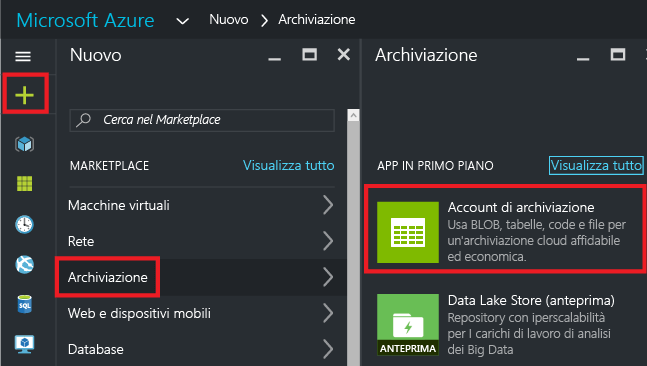
2. Creare un account di archiviazione usando il nome **storage**, le proprie iniziali e la data. Il nome dell'account di archiviazione deve essere univoco in Azure. Se il nome è già in uso, viene visualizzato un messaggio di errore che indica che il nome è in uso. Provare una variante. Per un gruppo di risorse, selezionare **Crea nuovo** e assegnare il nome **ExportGroup**. È possibile usare i valori predefiniti per le altre proprietà. Selezionare **Crea**.
   
      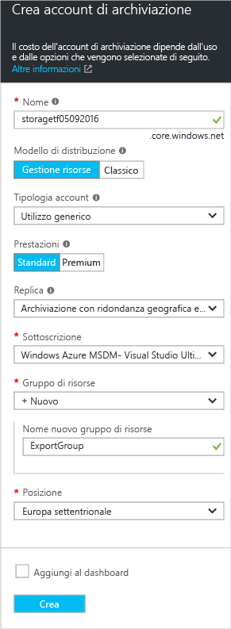

La distribuzione può richiedere un minuto. Al termine della distribuzione, la sottoscrizione contiene l'account di archiviazione.

## <a name="view-a-template-from-deployment-history"></a>Visualizzare un modello dalla cronologia di distribuzione
1. Passare al pannello Gruppo di risorse per il nuovo gruppo di risorse. Si noti che il pannello visualizza il risultato dell'ultima distribuzione. Selezionare questo collegamento.
   
      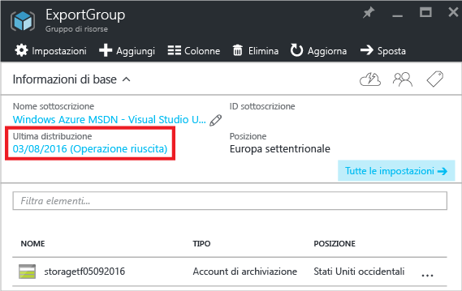
2. Viene visualizzata la cronologia delle distribuzioni per il gruppo. In questo caso il pannello probabilmente elenca solo una distribuzione. Selezionare questa distribuzione.
   
     
3. Il pannello visualizza un riepilogo della distribuzione. Il riepilogo include lo stato della distribuzione e le relative operazioni e i valori specificati per i parametri. Per visualizzare il modello usato per la distribuzione, selezionare **Visualizza modello**.
   
     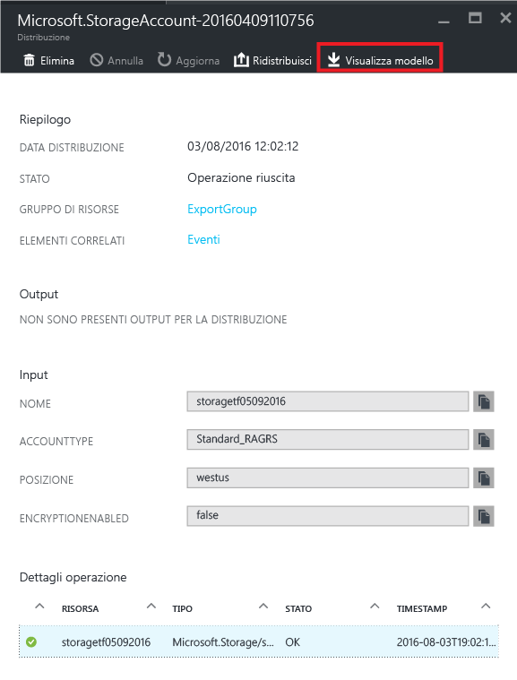
4. Resource Manager recupera i sei file seguenti:
   
   1. **Modello** : modello che definisce l'infrastruttura per la soluzione. Quando è stato creato l'account di archiviazione tramite il portale, Resource Manager ha usato un modello per distribuirlo e ha salvato tale modello come riferimento futuro.
   2. **Parametri** : file dei parametri che può essere usato per passare i valori durante la distribuzione. Contiene i valori specificati durante la prima distribuzione, ma è possibile modificare qualsiasi valore durante la ridistribuzione del modello.
   3. **Interfaccia della riga di comando** : file di script dell'interfaccia della riga di comando di Azure che può essere usato per distribuire il modello.
   3. **Interfaccia della riga di comando 2.0**: file di script dell'interfaccia della riga di comando di Azure che può essere usato per distribuire il modello.
   4. **PowerShell** : file di script di Azure PowerShell che può essere usato per distribuire il modello.
   5. **.NET** : classe .NET che può essere usata per distribuire il modello.
   6. **Ruby** : classe Ruby che può essere usata per distribuire il modello.
      
      I file sono disponibili mediante collegamenti nel pannello. Per impostazione predefinita, il pannello visualizza il modello.
      
       
      
      Occorre prestare particolare attenzione al modello. Il modello deve avere un aspetto analogo al seguente:
      
      ```json
      {
        "$schema": "https://schema.management.azure.com/schemas/2015-01-01/deploymentTemplate.json#",
        "contentVersion": "1.0.0.0",
        "parameters": {
          "name": {
            "type": "String"
          },
          "accountType": {
            "type": "String"
          },
          "location": {
            "type": "String"
          },
          "encryptionEnabled": {
            "defaultValue": false,
            "type": "Bool"
          }
        },
        "resources": [
          {
            "type": "Microsoft.Storage/storageAccounts",
            "sku": {
              "name": "[parameters('accountType')]"
            },
            "kind": "Storage",
            "name": "[parameters('name')]",
            "apiVersion": "2016-01-01",
            "location": "[parameters('location')]",
            "properties": {
              "encryption": {
                "services": {
                  "blob": {
                    "enabled": "[parameters('encryptionEnabled')]"
                  }
                },
                "keySource": "Microsoft.Storage"
              }
            }
          }
        ]
      }
      ```

Questo è il modello effettivo usato per creare l'account di archiviazione. Si noti che contiene parametri che consentono di distribuire tipi diversi di account di archiviazione. Per altre informazioni sulla struttura del modello, vedere [Creazione di modelli di Azure Resource Manager](resource-group-authoring-templates.md). Per l'elenco completo delle funzioni che è possibile usare in un modello, vedere [Funzioni del modello di Azure Resource Manager](resource-group-template-functions.md).

## <a name="add-a-virtual-network"></a>Aggiungere una rete virtuale
Il modello scaricato nella sezione precedente rappresentava l'infrastruttura per tale distribuzione originale, ma non tiene conto di eventuali modifiche apportate dopo la distribuzione.
Per illustrare questo problema, modificare il gruppo di risorse aggiungendo una rete virtuale tramite il portale.

1. Nel pannello del gruppo di risorse selezionare **Aggiungi**.
   
      
2. Selezionare **Rete virtuale** tra le risorse disponibili.
   
      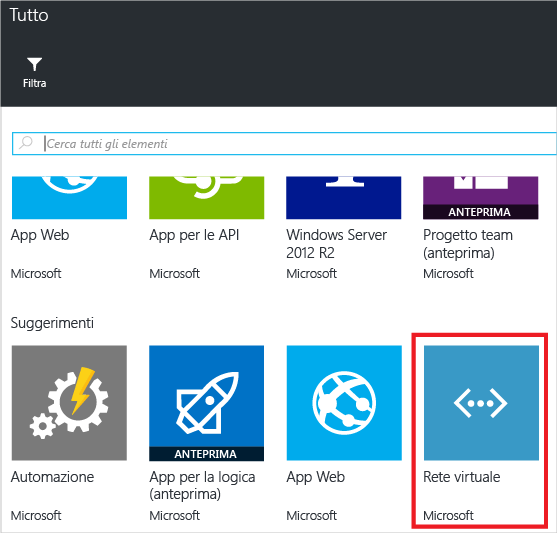
3. Specificare il nome **VNET**per la rete virtuale e usare i valori predefiniti per le altre proprietà. Selezionare **Crea**.
   
      
4. Al termine della distribuzione della rete virtuale nel gruppo di risorse, esaminare ancora la cronologia di distribuzione. Vengono visualizzate due distribuzioni. Se la seconda distribuzione non viene visualizzata, potrebbe essere necessario chiudere il pannello del gruppo di risorse e riaprirlo. Selezionare la distribuzione più recente.
   
      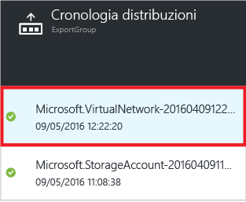
5. Visualizzare il modello per questa distribuzione. Si noti che definisce solo la rete virtuale. Non include l'account di archiviazione distribuito in precedenza. Non si dispone più di un modello che rappresenta tutte le risorse nel gruppo di risorse.

## <a name="export-the-template-from-resource-group"></a>Esportare il modello da un gruppo di risorse
Per ottenere lo stato corrente del gruppo di risorse, esportare un modello che visualizza un'istantanea del gruppo di risorse.  

> [!NOTE]
> Non è possibile esportare un modello per un gruppo di risorse con più di 200 risorse.
> 
> 

1. Per visualizzare il modello per un gruppo di risorse, selezionare **Script di automazione**.
   
      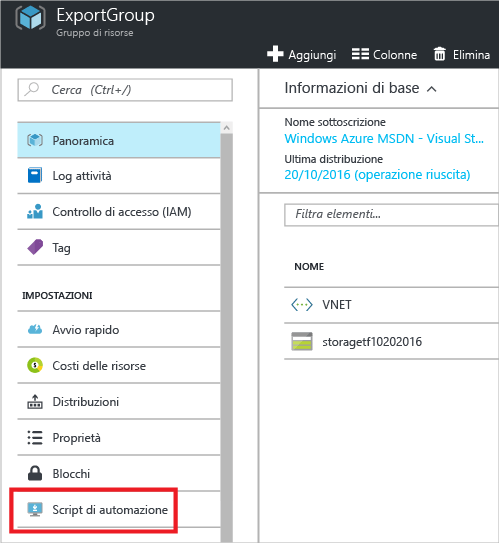
   
     Non tutti i tipi di risorse supportano la funzione di esportazione del modello. Se il gruppo di risorse contiene solo l'account di archiviazione e la rete virtuale illustrati in questo articolo, non verranno visualizzati errori. Se invece sono stati creati altri tipi di risorse, è possibile che venga visualizzato un errore che informa di un problema con l'esportazione. Per informazioni su come gestire tali problemi, vedere la sezione [Risolvere i problemi di esportazione](#fix-export-issues) .
2. Vengono visualizzati di nuovo i sei file che è possibile usare per ridistribuire la soluzione, ma questa volta il modello è leggermente diverso. Questo modello ha solo due parametri, uno per il nome dell'account di archiviazione e uno per il nome della rete virtuale.

  ```json
  "parameters": {
    "virtualNetworks_VNET_name": {
      "defaultValue": "VNET",
      "type": "String"
    },
    "storageAccounts_storagetf05092016_name": {
      "defaultValue": "storagetf05092016",
      "type": "String"
    }
  },
  ```
   
     Resource Manager non ha recuperato i modelli usati durante la distribuzione. Ha generato invece un nuovo modello basato sulla configurazione corrente delle risorse. Ad esempio, il modello imposta la posizione dell'account di archiviazione e il valore di replica su:

  ```json 
  "location": "northeurope",
  "tags": {},
  "properties": {
    "accountType": "Standard_RAGRS"
  },
  ```
3. Per continuare a usare questo modello, sono disponibili due opzioni. È possibile scaricare il modello e usare un editor JSON per lavorare in locale. In alternativa, è possibile salvare il modello nella libreria e lavorare tramite il portale.
   
     Se si ha familiarità con un editor di JSON come [Visual Studio Code](resource-manager-vs-code.md) o [Visual Studio](vs-azure-tools-resource-groups-deployment-projects-create-deploy.md), è preferibile scaricare il modello in locale e usare l'editor. Se non si ha familiarità con un editor JSON, è preferibile modificare il modello tramite il portale. Nelle sezioni successive di questo argomento si presuppone che il modello sia stato salvato nella libreria nel portale. Tuttavia, si apportano le stesse modifiche di sintassi al modello lavorando tramite il portale o in locale con un editor di JSON.
   
     Per lavorare in locale, selezionare **Scarica**.
   
      
   
     Per usare il portale, selezionare **Aggiungi a raccolta**.
   
      
   
     Quando si aggiunge un modello alla libreria, assegnare un nome e una descrizione al modello. Selezionare quindi **Salva**.
   
     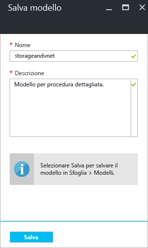
4. Per visualizzare un modello salvato nella libreria, selezionare **Altri servizi**, digitare **Modelli** per filtrare i risultati, quindi selezionare **Modelli**.
   
      
5. Selezionare il modello con il nome salvato.
   
      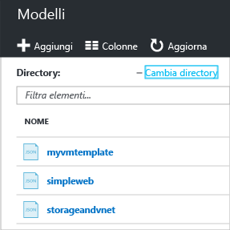

## <a name="customize-the-template"></a>Personalizzare il modello
Il modello esportato funziona correttamente se si vuole creare lo stesso account di archiviazione e rete virtuale per ogni distribuzione. Le opzioni disponibili in Resource Manager consentono, tuttavia, di distribuire modelli con maggiore flessibilità. Ad esempio, durante la distribuzione, si potrebbe voler specificare il tipo di account di archiviazione da creare o i valori da usare per il prefisso di indirizzo della rete virtuale e per il prefisso di subnet.

In questa sezione vengono aggiunti parametri al modello esportato, per poterlo usare di nuovo durante la distribuzione di queste risorse in altri ambienti. Vengono aggiunte anche alcune funzionalità al modello per ridurre la probabilità che si verifichi un errore durante la distribuzione del modello. Non è più necessario cercare di specificare un nome univoco per l'account di archiviazione. Il nome univoco viene invece creato dal modello. È possibile limitare i valori che possono essere specificati per il tipo di account di archiviazione, consentendo solo le opzioni valide.

1. Per personalizzare il modello, selezionare **Modifica**.
   
     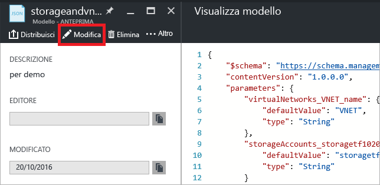
2. Selezionare il modello.
   
     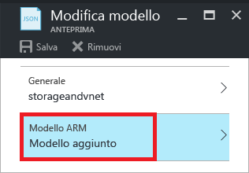
3. Per poter passare i valori da specificare durante la distribuzione, sostituire la sezione **parameters** con le nuove definizioni dei parametri. Si notino i valori di **allowedValues** per **storageAccount_accountType**. Se si specifica accidentalmente un valore non corretto, l'errore viene riconosciuto prima dell'avvio della distribuzione. Si noti anche che si sta specificando solo un prefisso per il nome dell'account di archiviazione e che il prefisso è limitato a 11 caratteri. La limitazione del prefisso a 11 caratteri fa in modo che il nome completo non superi il numero massimo di caratteri per un account di archiviazione. Il prefisso consente di applicare una convenzione di denominazione agli account di archiviazione. Nel passaggio successivo verrà illustrato come creare un nome univoco.

  ```json
  "parameters": {
    "storageAccount_prefix": {
      "type": "string",
      "maxLength": 11
    },
    "storageAccount_accountType": {
      "defaultValue": "Standard_RAGRS",
      "type": "string",
      "allowedValues": [
        "Standard_LRS",
        "Standard_ZRS",
        "Standard_GRS",
        "Standard_RAGRS",
        "Premium_LRS"
      ]
    },
    "virtualNetwork_name": {
      "type": "string"
    },
    "addressPrefix": {
      "defaultValue": "10.0.0.0/16",
      "type": "string"
    },
    "subnetName": {
      "defaultValue": "subnet-1",
      "type": "string"
    },
    "subnetAddressPrefix": {
      "defaultValue": "10.0.0.0/24",
      "type": "string"
    }
  },
  ```

4. La sezione **variables** del modello è attualmente vuota. La sezione **variables** consente di creare valori che semplificano la sintassi per il resto del modello. Sostituire questa sezione con una nuova definizione di variabile. La variabile **storageAccount_name** consente di concatenare il prefisso del parametro a una stringa univoca generata in base all'identificatore del gruppo di risorse. Non è necessario cercare di specificare un nome univoco quando si fornisce un valore di parametro.

  ```json
  "variables": {
    "storageAccount_name": "[concat(parameters('storageAccount_prefix'), uniqueString(resourceGroup().id))]"
  },
  ```

5. Per usare i parametri e la variabile nelle definizioni delle risorse, sostituire la sezione **resources** con le nuove definizioni seguenti. Si noti che sono state apportate poche modifiche alle definizioni delle risorse. Sono stati essenzialmente modificati i valori assegnati alle proprietà delle risorse. Le proprietà sono uguali alle proprietà del modello esportato. Si stanno semplicemente assegnando proprietà a valori di parametro, anziché a valori hardcoded. La posizione delle risorse viene impostata in modo da usare la stessa località del gruppo di risorse con l'espressione **resourceGroup().location**. L'espressione **variables** consente di fare riferimento alla variabile creata per il nome dell'account di archiviazione.

  ```json
  "resources": [
    {
      "type": "Microsoft.Network/virtualNetworks",
      "name": "[parameters('virtualNetwork_name')]",
      "apiVersion": "2015-06-15",
      "location": "[resourceGroup().location]",
      "properties": {
        "addressSpace": {
          "addressPrefixes": [
            "[parameters('addressPrefix')]"
          ]
        },
        "subnets": [
          {
            "name": "[parameters('subnetName')]",
            "properties": {
              "addressPrefix": "[parameters('subnetAddressPrefix')]"
            }
          }
        ]
      },
      "dependsOn": []
    },
    {
      "type": "Microsoft.Storage/storageAccounts",
      "name": "[variables('storageAccount_name')]",
      "apiVersion": "2015-06-15",
      "location": "[resourceGroup().location]",
      "tags": {},
      "properties": {
        "accountType": "[parameters('storageAccount_accountType')]"
      },
      "dependsOn": []
    }
  ]
  ```

6. Selezionare **OK** una volta terminata la modifica del modello.
7. Selezionare **Salva** per salvare le modifiche al modello.
   
     
8. Per distribuire il modello aggiornato, selezionare **Distribuisci**.
   
     
9. Fornire i valori dei parametri e selezionare un nuovo gruppo di risorse a cui distribuire le risorse.

## <a name="update-the-downloaded-parameters-file"></a>Aggiornare il file dei parametri scaricato
Se si lavora con i file scaricati, anziché con la libreria del portale, è necessario aggiornare il file dei parametri scaricato. Non corrisponde più ai parametri nel modello. L'uso di un file dei parametri non è necessario, ma può semplificare il processo di ridistribuzione di un ambiente. Per molti parametri vengono usati i valori predefiniti indicati nel modello, quindi il file dei parametri necessita solo di due valori.

Sostituire i contenuti del file parameters.json con:

```json
{
  "$schema": "https://schema.management.azure.com/schemas/2015-01-01/deploymentParameters.json#",
  "contentVersion": "1.0.0.0",
  "parameters": {
    "storageAccount_prefix": {
      "value": "storage"
    },
    "virtualNetwork_name": {
      "value": "VNET"
    }
  }
}
```

Il file dei parametri aggiornato fornisce solo valori per i parametri privi di un valore predefinito. È possibile specificare valori per gli altri parametri, se si vuole usare un valore diverso dal valore predefinito.

## <a name="fix-export-issues"></a>Risolvere i problemi di esportazione
Non tutti i tipi di risorse supportano la funzione di esportazione del modello. Resource Manager non esporta alcuni tipi specifici di risorse per evitare l'esposizione di dati sensibili. Ad esempio, se si ha una stringa di connessione nel file di configurazione del sito, probabilmente non si vuole che venga visualizzata in modo esplicito in un modello esportato. Per risolvere il problema, aggiungere manualmente le risorse mancanti al modello.

> [!NOTE]
> Si verificano problemi di esportazione solo quando si esporta da un gruppo di risorse invece che dalla cronologia della distribuzione. Se la distribuzione più recente rappresenta con precisione lo stato corrente del gruppo di risorse, è consigliabile esportare il modello dalla cronologia della distribuzione invece che dal gruppo di risorse. Eseguire l'esportazione da un gruppo di risorse solo quando sono state apportate al gruppo di risorse modifiche non definite in un singolo modello.
> 
> 

Ad esempio, se si esporta un modello per gruppo di risorse che contiene un'app Web, un database SQL e una stringa di connessione nella configurazione del sito, viene visualizzato il messaggio seguente:

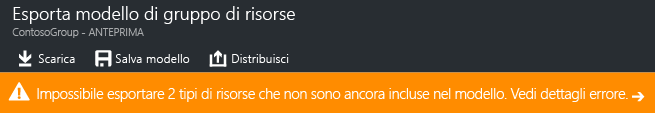

Selezionando il messaggio, vengono visualizzati esattamente i tipi di risorse non esportati. 

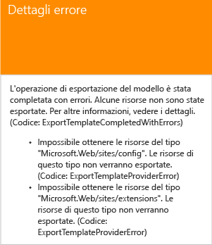

Questo argomento illustra le correzioni più comuni.

### <a name="connection-string"></a>Stringa di connessione
Nella risorsa dei siti Web aggiungere una definizione per la stringa di connessione al database:

```json
{
  "type": "Microsoft.Web/sites",
  ...
  "resources": [
    {
      "apiVersion": "2015-08-01",
      "type": "config",
      "name": "connectionstrings",
      "dependsOn": [
          "[concat('Microsoft.Web/Sites/', parameters('<site-name>'))]"
      ],
      "properties": {
          "DefaultConnection": {
            "value": "[concat('Data Source=tcp:', reference(concat('Microsoft.Sql/servers/', parameters('<database-server-name>'))).fullyQualifiedDomainName, ',1433;Initial Catalog=', parameters('<database-name>'), ';User Id=', parameters('<admin-login>'), '@', parameters('<database-server-name>'), ';Password=', parameters('<admin-password>'), ';')]",
              "type": "SQLServer"
          }
      }
    }
  ]
}
```    

### <a name="web-site-extension"></a>Estensione del sito Web
Nella risorsa del sito Web aggiungere una definizione per il codice da installare:

```json
{
  "type": "Microsoft.Web/sites",
  ...
  "resources": [
    {
      "name": "MSDeploy",
      "type": "extensions",
      "location": "[resourceGroup().location]",
      "apiVersion": "2015-08-01",
      "dependsOn": [
        "[concat('Microsoft.Web/sites/', parameters('<site-name>'))]"
      ],
      "properties": {
        "packageUri": "[concat(parameters('<artifacts-location>'), '/', parameters('<package-folder>'), '/', parameters('<package-file-name>'), parameters('<sas-token>'))]",
        "dbType": "None",
        "connectionString": "",
        "setParameters": {
          "IIS Web Application Name": "[parameters('<site-name>')]"
        }
      }
    }
  ]
}
```

### <a name="virtual-machine-extension"></a>Estensione macchina virtuale
Per esempi di estensioni macchina virtuale, vedere [Esempi di configurazione dell'estensione macchina virtuale Windows di Azure](../virtual-machines/virtual-machines-windows-extensions-configuration-samples.md?toc=%2fazure%2fvirtual-machines%2fwindows%2ftoc.json).

### <a name="virtual-network-gateway"></a>Gateway di rete virtuale
Aggiungere un tipo di risorsa gateway di rete virtuale.

```json
{
  "type": "Microsoft.Network/virtualNetworkGateways",
  "name": "[parameters('<gateway-name>')]",
  "apiVersion": "2015-06-15",
  "location": "[resourceGroup().location]",
  "properties": {
    "gatewayType": "[parameters('<gateway-type>')]",
    "ipConfigurations": [
      {
        "name": "default",
        "properties": {
          "privateIPAllocationMethod": "Dynamic",
          "subnet": {
            "id": "[resourceId('Microsoft.Network/virtualNetworks/subnets', parameters('<vnet-name>'), parameters('<new-subnet-name>'))]"
          },
          "publicIpAddress": {
            "id": "[resourceId('Microsoft.Network/publicIPAddresses', parameters('<new-public-ip-address-Name>'))]"
          }
        }
      }
    ],
    "enableBgp": false,
    "vpnType": "[parameters('<vpn-type>')]"
  },
  "dependsOn": [
    "Microsoft.Network/virtualNetworks/codegroup4/subnets/GatewaySubnet",
    "[concat('Microsoft.Network/publicIPAddresses/', parameters('<new-public-ip-address-Name>'))]"
  ]
},
```

### <a name="local-network-gateway"></a>Gateway di rete locale
Aggiungere un tipo di risorsa gateway di rete locale.

```json
{
    "type": "Microsoft.Network/localNetworkGateways",
    "name": "[parameters('<local-network-gateway-name>')]",
    "apiVersion": "2015-06-15",
    "location": "[resourceGroup().location]",
    "properties": {
      "localNetworkAddressSpace": {
        "addressPrefixes": "[parameters('<address-prefixes>')]"
      }
    }
}
```

### <a name="connection"></a>Connessione
Aggiungere un tipo di risorsa connessione.

```json
{
    "apiVersion": "2015-06-15",
    "name": "[parameters('<connection-name>')]",
    "type": "Microsoft.Network/connections",
    "location": "[resourceGroup().location]",
    "properties": {
        "virtualNetworkGateway1": {
        "id": "[resourceId('Microsoft.Network/virtualNetworkGateways', parameters('<gateway-name>'))]"
      },
      "localNetworkGateway2": {
        "id": "[resourceId('Microsoft.Network/localNetworkGateways', parameters('<local-gateway-name>'))]"
      },
      "connectionType": "IPsec",
      "routingWeight": 10,
      "sharedKey": "[parameters('<shared-key>')]"
    }
},
```


## <a name="next-steps"></a>Passaggi successivi
Congratulazioni. Si è appreso come esportare un modello da risorse create nel portale.

* È possibile distribuire un modello tramite [PowerShell](resource-group-template-deploy.md), l'[interfaccia della riga di comando di Azure](resource-group-template-deploy-cli.md) o l'[API REST](resource-group-template-deploy-rest.md).
* Per informazioni su come esportare un modello tramite PowerShell, vedere [Uso di Azure PowerShell con Azure Resource Manager](powershell-azure-resource-manager.md).
* Per informazioni su come esportare un modello tramite l'interfaccia della riga di comando di Azure, vedere [Usare l'interfaccia della riga di comando di Azure per Mac, Linux e Windows con Azure Resource Manager](xplat-cli-azure-resource-manager.md).


