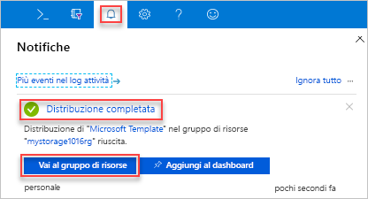

# <a name="quickstart-create-and-deploy-azure-resource-manager-templates-by-using-the-azure-portal"></a>Guida introduttiva: Creare e distribuire modelli di Azure Resource Manager con il portale di Azure

Questa guida introduttiva illustra come creare il primo modello di Azure Resource Manager generandone uno con il portale di Azure e il processo di modifica e distribuzione del modello dal portale di Azure. I modelli di Resource Manager sono file JSON che definiscono le risorse che è necessario distribuire per la soluzione. Con le istruzioni di questa esercitazione viene creato un account di archiviazione di Azure. Lo stesso processo può essere usato per creare altre risorse di Azure.

Se non si ha una sottoscrizione di Azure, [creare un account gratuito](https://azure.microsoft.com/free/) prima di iniziare.

## <a name="generate-a-template-using-the-portal"></a>Generare un modello con il portale

In questa sezione si crea un account di archiviazione usando il portale di Azure. Prima di distribuire l'account di archiviazione, è possibile esplorare il modello generato dal portale in base alle configurazioni specifiche. Si può salvare il modello e usarlo di nuovo in futuro.

1. Accedere al [portale di Azure](https://portal.azure.com).
2. Selezionare **Crea una risorsa** > **Archiviazione** > **Account di archiviazione: BLOB, File, Tabelle, Code**.

    
3. Immettere le seguenti informazioni. 

    - **Gruppo di risorse**: creare un nuovo gruppo di risorse di Azure con un nome di propria scelta. Nello screenshot il nome del gruppo di risorse è *mystorage1016rg*.
    - **Nome**: assegnare un nome univoco all'account di archiviazione. Nello screenshot il nome è *mystorage1016*.

    Per le restanti proprietà si possono usare i valori predefiniti.

    

    > [!NOTE]
    > Alcuni modelli esportati richiedono alcune modifiche prima di poter essere distribuiti.

4. Selezionare **Rivedi e crea** nella parte inferiore della schermata. 
5. Selezionare **Scaricare un modello per l'automazione** nella parte inferiore della schermata. Il portale mostra il modello generato:

    

    Nel riquadro principale viene visualizzato il modello, che è un file JSON con quattro elementi di primo livello: `schema`, `contentVersion`, `parameters` e `resources`. Per altre informazioni, vedere [Informazioni sulla struttura e sulla sintassi dei modelli di Azure Resource Manager](./resource-group-authoring-templates.md).

    Sono stati definiti sei parametri, uno dei quali è **storageAccountName**. La seconda parte evidenziata mostra come usare questo parametro nel modello. Nella sezione successiva si modifica il modello per usare un nome generato per l'account di archiviazione.

    Nel modello viene definita una risorsa di Azure. Il tipo è [Microsoft.Storage/storageAccounts]. Vedere come viene definita la risorsa e la struttura della definizione.
6. Selezionare **Download**. Salvare nel computer **template.json** incluso nel pacchetto scaricato. Nella sezione successiva si usa uno strumento di distribuzione dei modelli per modificare il modello.
7. Selezionare la scheda **Parametro** per visualizzare i valori specificati per i parametri. Prendere nota di questi valori che saranno necessari nella sezione successiva, quando si distribuirà il modello.

    

    Usando il modello e i file dei parametri è possibile creare un account di archiviazione di Azure.

## <a name="edit-and-deploy-the-template"></a>Modificare e distribuire il modello

Il portale di Azure può essere usato per eseguire qualche modifica al modello di base. In questa guida introduttiva si usa uno strumento del portale denominato *Distribuzione modelli*. Per modificare un modello più complesso, valutare la possibilità di usare [Visual Studio Code](./resource-manager-quickstart-create-templates-use-visual-studio-code.md), che offre funzionalità di modifica più avanzate.

Azure richiede che ogni servizio di Azure abbia un nome univoco. Se si immette un nome di account di archiviazione già esistente, la distribuzione ha esito negativo. Per evitare questo problema, è possibile usare una chiamata di funzione di modello `uniquestring()` per generare un nome di account di archiviazione univoco.

1. Nel portale di Azure fare clic su **Crea una risorsa**.
2. In **Cerca nel Marketplace** digitare **distribuzione modelli** e quindi premere **INVIO**.
3. Selezionare **Distribuzione modello**.

    
4. Selezionare **Create**.
5. Selezionare **Creare un modello personalizzato nell'editor**.
6. Selezionare **Carica file** e quindi seguire le istruzioni per caricare il file template.json scaricato nell'ultima sezione.
7. Aggiungere una variabile, come illustrato nello screenshot seguente:

    ```json
    "storageAccountName": "[concat(uniquestring(resourceGroup().id), 'standardsa')]"
    ```
    

    In questo caso sono usate due funzioni: `concat()` e `uniqueString()`.

8. Rimuovere il parametro **storageAccountName** evidenziato nello screenshot precedente.
9. Aggiornare l'elemento name della risorsa **Microsoft.Storage/storageAccounts** in modo da usare la variabile appena definita invece del parametro:

    ```json
    "name": "[variables('storageAccountName')]",
    ```

    Il modello finale si presenterà come segue:

    ```json
    {
        "$schema": "https://schema.management.azure.com/schemas/2015-01-01/deploymentTemplate.json#",
        "contentVersion": "1.0.0.0",
        "parameters": {
            "location": {
                "type": "string"
            },
            "accountType": {
                "type": "string"
            },
            "kind": {
                "type": "string"
            },
            "accessTier": {
                "type": "string"
            },
            "supportsHttpsTrafficOnly": {
                "type": "bool"
            }
        },
        "variables": {
            "storageAccountName": "[concat(uniquestring(resourceGroup().id), 'standardsa')]"
        },
        "resources": [
            {
                "name": "[variables('storageAccountName')]",
                "type": "Microsoft.Storage/storageAccounts",
                "apiVersion": "2018-07-01",
                "location": "[parameters('location')]",
                "properties": {
                    "accessTier": "[parameters('accessTier')]",
                    "supportsHttpsTrafficOnly": "[parameters('supportsHttpsTrafficOnly')]"
                },
                "dependsOn": [],
                "sku": {
                    "name": "[parameters('accountType')]"
                },
                "kind": "[parameters('kind')]"
            }
        ],
        "outputs": {}
    }
    ```
7. Selezionare **Salva**.
8. Immettere i valori seguenti:

    - **Gruppo di risorse**: assegnare un nome univoco al gruppo di risorse.
    - **Località**: selezionare una località per il gruppo di risorse.
    - **Località**: selezionare una località per l'account di archiviazione.  È possibile usare la stessa località del gruppo di risorse.
    - **Tipo di account**: per questa guida introduttiva immettere **Archiviazione con ridondanza locale Standard**.
    - **Tipologia**: per questa guida introduttiva immettere **StorageV2**.
    - **Livello di accesso**: per questa guida introduttiva immettere **Frequente**.
    - **Https Traffic Only Enabled** (Abilitato solo traffico HTTPS):  per questa guida introduttiva selezionare **true**.
    - **Accetto le condizioni riportate sopra**: selezionare.

    Di seguito è riportato uno screenshot di una distribuzione di esempio:

    

10. Selezionare **Acquisto**.
11. Selezionare l'icona a forma di campana delle notifiche nella parte superiore della schermata per visualizzare lo stato della distribuzione. Attendere il completamento della distribuzione.

    

12. Selezionare **Vai al gruppo di risorse** nel riquadro di notifica. Verrà visualizzata una schermata simile alla seguente:

    

    Si vede che la distribuzione ha avuto esito positivo ed esiste un solo account di archiviazione nel gruppo di risorse. Il nome dell'account di archiviazione è una stringa univoca generata dal modello. Per altre informazioni sull'uso degli account di archiviazione di Azure, vedere [Guida introduttiva: Caricare, scaricare ed elencare BLOB con il portale di Azure](../storage/blobs/storage-quickstart-blobs-portal.md).

## <a name="clean-up-resources"></a>Pulire le risorse

Quando non sono più necessarie, eseguire la pulizia delle risorse di Azure distribuite eliminando il gruppo di risorse.

1. Nel portale di Azure selezionare **Gruppo di risorse** nel menu a sinistra.
2. Immettere il nome del gruppo di risorse nel campo **Filtra per nome**.
3. Selezionare il nome del gruppo di risorse.  Nel gruppo di risorse verrà visualizzato l'account di archiviazione.
4. Selezionare **Elimina gruppo di risorse** nel menu in alto.

## <a name="next-steps"></a>Passaggi successivi

Questa esercitazione ha illustrato come generare un modello dal portale di Azure e come distribuire tale modello usando il portale. In questa guida introduttiva è stato usato un modello semplice con una sola risorsa di Azure. In caso di modello complesso, lo sviluppo risulta più facile usando Visual Studio Code o Visual Studio. La guida introduttiva successiva mostra come distribuire i modelli usando Azure PowerShell e l'interfaccia della riga di comando di Azure.

> [!div class="nextstepaction"]
> [Creare modelli con Visual Studio Code](./resource-manager-quickstart-create-templates-use-visual-studio-code.md)
