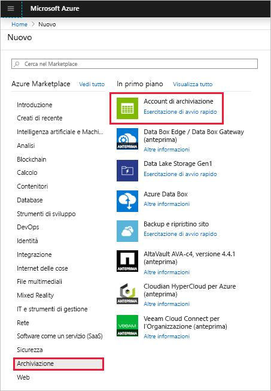
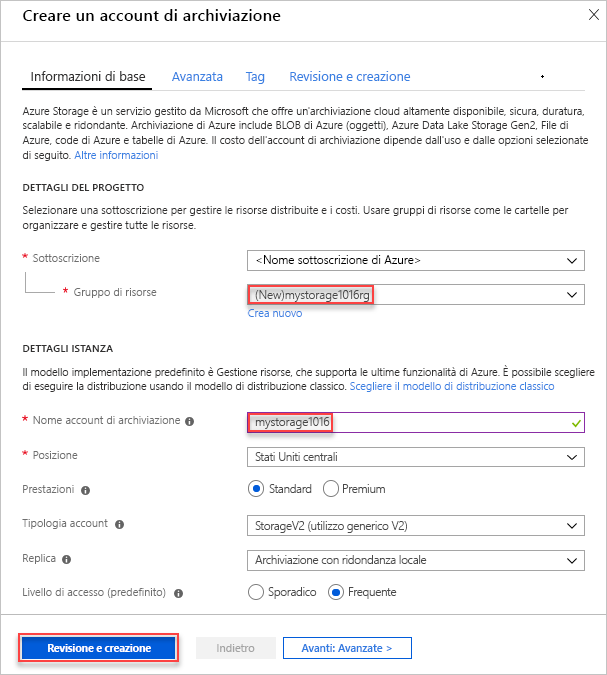
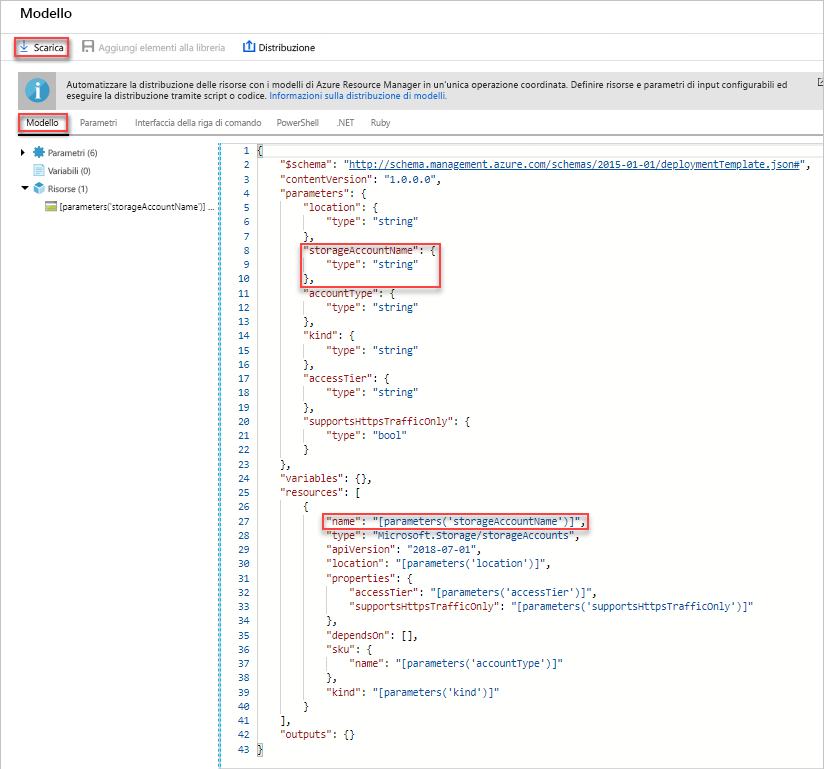
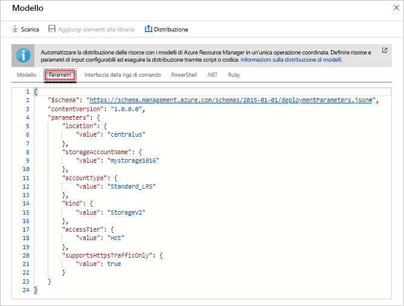
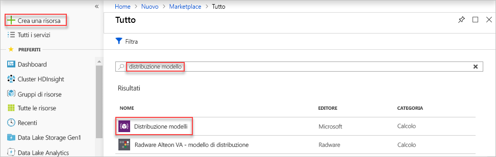
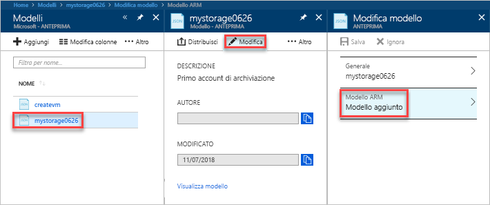
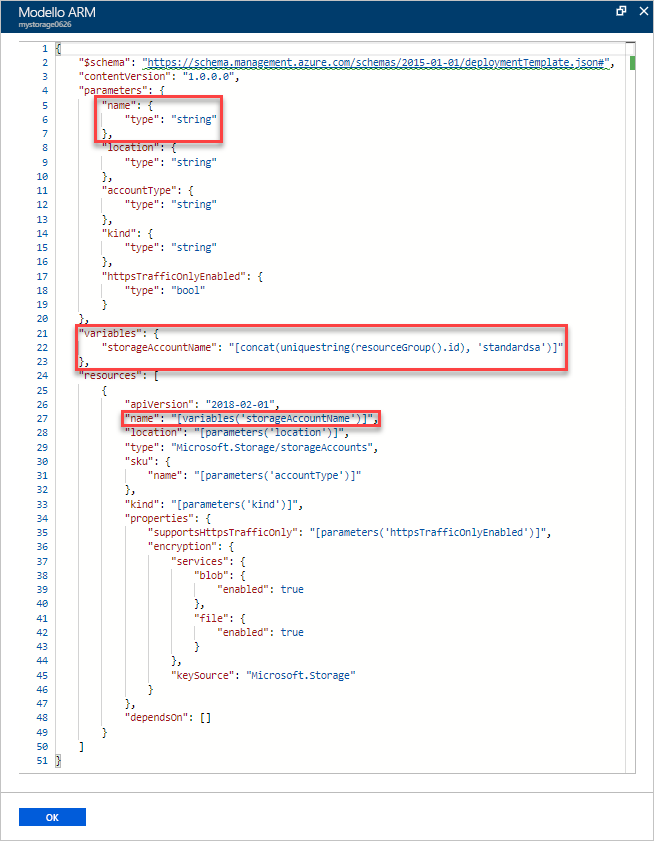
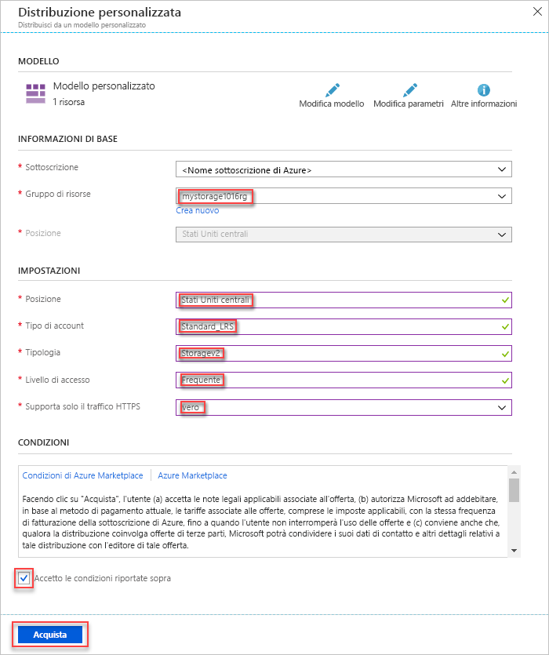

# <a name="quickstart-create-and-deploy-azure-resource-manager-templates-by-using-the-azure-portal"></a>Guida introduttiva: Creare e distribuire modelli di Azure Resource Manager con il portale di Azure

Questa guida introduttiva illustra come creare il primo modello di Azure Resource Manager generandone uno con il portale di Azure e come modificare e distribuire il modello dal portale.

I modelli di Resource Manager sono file JSON che definiscono le risorse che è necessario distribuire per la soluzione. Per creare un modello, non sempre è necessario iniziare da zero. Questa esercitazione illustra come generare un modello dal portale di Azure. È quindi possibile personalizzare il modello e distribuirlo.

Con le istruzioni di questa esercitazione viene creato un account di archiviazione di Azure. Lo stesso processo può essere usato per creare altre risorse di Azure.

Se non si ha una sottoscrizione di Azure, [creare un account gratuito](https://azure.microsoft.com/free/) prima di iniziare.

## <a name="generate-a-template-using-the-portal"></a>Generare un modello con il portale

In questa sezione si crea un account di archiviazione usando il portale di Azure. Prima di distribuire l'account di archiviazione, è possibile esplorare il modello generato dal portale in base alle configurazioni specifiche. Si può salvare il modello e usarlo di nuovo in futuro.

1. Accedere al [portale di Azure](https://portal.azure.com).
2. Selezionare **Crea una risorsa** > **Archiviazione** > **Account di archiviazione: BLOB, File, Tabelle, Code**.

    
3. Immettere le seguenti informazioni. Assicurarsi di selezionare **Opzioni di Automazione** anziché **Crea** nel passaggio successivo per poter visualizzare il modello prima della distribuzione.

    - **Nome**: assegnare un nome univoco all'account di archiviazione. Nello screenshot, il nome è *mystorage0626*.
    - **Gruppo di risorse**: creare un nuovo gruppo di risorse di Azure con un nome di propria scelta. Nello screenshot, il nome del gruppo di risorse è *mystorage0626rg*.

    Per le restanti proprietà si possono usare i valori predefiniti.

    

    > [!NOTE]
    > Alcuni modelli esportati richiedono alcune modifiche prima di poter essere distribuiti.

4. Selezionare **Opzioni di Automazione** nella parte inferiore della schermata. Nella scheda **Modello** del portale viene visualizzato il modello:

    

    Nel riquadro principale viene visualizzato il modello, che è un file JSON con quattro elementi di primo livello. Per altre informazioni, vedere [Informazioni sulla struttura e sulla sintassi dei modelli di Azure Resource Manager](./resource-group-authoring-templates.md).

    Nell'elemento **parameters** sono definiti cinque parametri. Per visualizzare i valori specificati durante la distribuzione, selezionare la scheda **Parametri**.

    

    Questi valori corrispondono alle impostazioni configurate nella sezione precedente. Usando il modello e i file dei parametri è possibile creare un account di archiviazione di Azure.

5. Nella parte superiore delle schede sono disponibili tre voci di menu.

    - **Scarica**: scaricare il modello e il file dei parametri sul computer locale.
    - **Aggiungi elementi al Catalogo multimediale**: aggiungere il modello alla raccolta per usarlo di nuovo in futuro.
    - **Distribuisci**: distribuire l'account di archiviazione di Azure in Azure.

    In questa esercitazione si usa l'opzione **Aggiungi elementi al Catalogo multimediale**.

6. Selezionare **Aggiungi elementi al Catalogo multimediale**.
7. Immettere **Nome** e **Descrizione** e quindi selezionare **Salva**.

> [!NOTE]
> La funzionalità della raccolta modelli è in anteprima. La maggior parte degli utenti sceglie di salvare i propri modelli sul computer locale o in un archivio pubblico come Github.  

## <a name="edit-and-deploy-the-template"></a>Modificare e distribuire il modello

In questa sezione si apre il modello salvato dalla raccolta modelli, si modifica tale modello nel portale e si distribuisce il modello modificato. Per modificare un modello più complesso, valutare la possibilità di usare Visual Studio Code, che offre funzionalità di modifica più avanzate.

1. Nel portale di Azure selezionare **Tutti i servizi** nel menu a sinistra, immettere **modelli** nella casella del filtro e quindi selezionare **Modelli (ANTEPRIMA)**.

    
2. Selezionare il modello salvato nella sezione precedente. Il nome nello screenshot è *mystorage0626*.
3. Selezionare **Modifica** e quindi **Modello aggiunto**.

    

4. Aggiungere un elemento **variables** e quindi una variabile come illustrato nello screenshot seguente:

    ```json
    "variables": {
        "storageAccountName": "[concat(uniquestring(resourceGroup().id), 'standardsa')]"
    },
    ```
    

    In questa variabile vengono usate due funzioni: *concat()* e *uniqueString()*. La funzione uniqueString() è utile per creare un nome univoco per una risorsa.

5. Rimuovere il parametro **name** evidenziato nello screenshot precedente.
6. Aggiornare l'elemento name della risorsa **Microsoft.Storage/storageAccounts** in modo da usare la variabile appena definita invece del parametro:

    ```json
    "name": "[variables('storageAccountName')]",
    ```

    Il modello finale si presenterà come segue:

    ```json
    {
        "$schema": "https://schema.management.azure.com/schemas/2015-01-01/deploymentTemplate.json#",
        "contentVersion": "1.0.0.0",
        "parameters": {
            "location": {
                "type": "string"
            },
            "accountType": {
                "type": "string"
            },
            "kind": {
                "type": "string"
            },
            "httpsTrafficOnlyEnabled": {
                "type": "bool"
            }
        },
        "variables": {
            "storageAccountName": "[concat(uniquestring(resourceGroup().id), 'standardsa')]"
        },
        "resources": [
            {
                "apiVersion": "2018-02-01",
                "name": "[variables('storageAccountName')]",
                "location": "[parameters('location')]",
                "type": "Microsoft.Storage/storageAccounts",
                "sku": {
                    "name": "[parameters('accountType')]"
                },
                "kind": "[parameters('kind')]",
                "properties": {
                    "supportsHttpsTrafficOnly": "[parameters('httpsTrafficOnlyEnabled')]",
                    "encryption": {
                        "services": {
                            "blob": {
                                "enabled": true
                            },
                            "file": {
                                "enabled": true
                            }
                        },
                        "keySource": "Microsoft.Storage"
                    }
                },
                "dependsOn": []
            }
        ]
    }
    ```
7. Selezionare **OK** e quindi **Salva** per salvare le modifiche.
8. Selezionare **Distribuisci**.
9. Immettere i valori seguenti:

    - **Sottoscrizione**: selezionare la sottoscrizione di Azure.
    - **Gruppo di risorse**: assegnare un nome univoco al gruppo di risorse.
    - **Località**: selezionare una località per il gruppo di risorse.
    - **Località**: selezionare una località per l'account di archiviazione.  È possibile usare la stessa località del gruppo di risorse.
    - **Tipo di account**: per questa guida introduttiva immettere **Archiviazione con ridondanza locale Standard**.
    - **Tipologia**: per questa guida introduttiva immettere **Archiviazione**.
    - **Https Traffic Only Enabled** (Abilitato solo traffico HTTPS):  per questa guida introduttiva selezionare **false**.
    - **Accetto le condizioni riportate sopra**: selezionare.

    Di seguito è riportato uno screenshot di una distribuzione di esempio:

    

10. Selezionare **Acquisto**.
11. Selezionare l'icona a forma di campana delle notifiche nella parte superiore della schermata per visualizzare lo stato della distribuzione.

## <a name="clean-up-resources"></a>Pulire le risorse

Quando non sono più necessarie, eseguire la pulizia delle risorse di Azure distribuite eliminando il gruppo di risorse.

1. Nel portale di Azure selezionare **Gruppo di risorse** nel menu a sinistra.
2. Immettere il nome del gruppo di risorse nel campo **Filtra per nome**.
3. Selezionare il nome del gruppo di risorse.  Nel gruppo di risorse verrà visualizzato l'account di archiviazione.
4. Selezionare **Elimina gruppo di risorse** nel menu in alto.

## <a name="next-steps"></a>Passaggi successivi

Questa esercitazione ha illustrato come generare un modello dal portale di Azure e come distribuire tale modello usando il portale. In questa guida introduttiva è stato usato un modello semplice con una sola risorsa di Azure. In caso di modello complesso, lo sviluppo risulta più facile usando Visual Studio Code o Visual Studio.

> [!div class="nextstepaction"]
> [Creare modelli con Visual Studio Code](./resource-manager-quickstart-create-templates-use-visual-studio-code.md)
