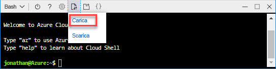

# <a name="quickstart-create-azure-resource-manager-templates-by-using-visual-studio-code"></a>Guida introduttiva: Creare modelli di Azure Resource Manager con Visual Studio Code

Questa guida introduttiva illustra come creare modelli di Azure Resource Manager con Visual Studio Code e l'estensione Strumenti di Azure Resource Manager. È possibile creare modelli di Resource Manager in Visual Studio Code senza l'estensione, ma questa offre opzioni di completamento automatico che semplificano lo sviluppo di modelli. Per comprendere i concetti associati alla distribuzione e alla gestione delle soluzioni di Azure, vedere [Panoramica di Azure Resource Manager](resource-group-overview.md).

Se non si ha una sottoscrizione di Azure, [creare un account gratuito](https://azure.microsoft.com/free/) prima di iniziare.

## <a name="prerequisites"></a>Prerequisiti

Per completare l'esercitazione di questo articolo, sono necessari gli elementi seguenti:

- [Visual Studio Code](https://code.visualstudio.com/).
- Estensione Strumenti di Azure Resource Manager. Per eseguirne l'installazione, seguire questa procedura:

    1. Aprire Visual Studio Code.
    2. Premere **CTRL+MAIUSC+X** per aprire il riquadro Estensioni.
    3. Cercare **Strumenti di Azure Resource Manager** e quindi selezionare **Installa**.
    4. Selezionare **Ricarica** per completare l'installazione dell'estensione.

## <a name="open-a-quickstart-template"></a>Aprire un modello di avvio rapido

Invece di creare un modello da zero, aprire un modello da [Modelli di avvio rapido di Azure](https://azure.microsoft.com/resources/templates/). Modelli di avvio rapido di Azure è un repository di modelli di Resource Manager.

Il modello usato in questa guida introduttiva è denominato [Create a standard storage account](https://azure.microsoft.com/resources/templates/101-storage-account-create/) (Creare un account di archiviazione Standard). Il modello definisce una risorsa account di archiviazione di Azure.

1. In Visual Studio Code selezionare **File**>**Apri file**.
2. In **Nome file** incollare l'URL seguente:

    ```url
    https://raw.githubusercontent.com/Azure/azure-quickstart-templates/master/101-storage-account-create/azuredeploy.json
    ```
3. Selezionare **Apri** per aprire il file.
4. Selezionare **File**>**Salva con nome** per salvare il file con il nome **azuredeploy.json** nel computer locale.

## <a name="edit-the-template"></a>Modificare il modello

Per imparare a modificare un modello con Visual Studio Code, aggiungere un altro elemento nella sezione outputs.

1. In Visual Studio Code aggiungere un altro output al modello esportato:

    ```json
    "storageUri": {
      "type": "string",
      "value": "[reference(variables('storageAccountName')).primaryEndpoints.blob]"
    }
    ```

    Al termine, la sezione outputs si presenta come segue:

    ```json
    "outputs": {
      "storageAccountName": {
        "type": "string",
        "value": "[variables('storageAccountName')]"
      },
      "storageUri": {
        "type": "string",
        "value": "[reference(variables('storageAccountName')).primaryEndpoints.blob]"
      }
    }
    ```

    Se il codice è stato copiato e incollato in Visual Studio Code, provare a ridigitare l'elemento **value** per sperimentare la funzionalità IntelliSense dell'estensione Strumenti di Azure Resource Manager.

    

2. Selezionare **File**>**Salva** per salvare il file.

## <a name="deploy-the-template"></a>Distribuire il modello

Per distribuire i modelli sono disponibili molti metodi.  In questa guida introduttiva si usa Cloud Shell dal portale di Azure. Cloud Shell supporta sia l'interfaccia della riga di comando di Azure che Azure PowerShell. Le istruzioni riportate di seguito riguardano l'interfaccia della riga di comando.

1. Accedere al [portale di Azure](https://portal.azure.com)
2. Selezionare **Cloud Shell** nell'angolo superiore destro come illustrato nell'immagine seguente:

    

3. Selezionare la freccia a discesa e quindi **Bash** per passare da PowerShell all'interfaccia della riga di comando.

    
4. Selezionare **Riavvia** per riavviare la shell.
5. Selezionare **Carica/Scarica file** e quindi **Carica**.

    
4. Selezionare il file salvato in precedenza in questa guida introduttiva. Il nome predefinito è **azuredeploy.json**.
5. In Cloud Shell eseguire il comando **ls** per verificare che il file sia stato caricato. È anche possibile usare il comando **cat** per verificare il contenuto del modello.

    
6. In Cloud Shell eseguire questi comandi:

    ```cli
    az group create --name <ResourceGroupName> --location <AzureLocation>

    az group deployment create --name <DeploymentName> --resource-group <ResourceGroupName> --template-file <TemplateFileName>
    ```
    Di seguito è riportato lo screenshot di una distribuzione di esempio:

    

    Nello screenshot vengono usati i valori riportati di seguito.

    - **&lt;ResourceGroupName>**: myresourcegroup0709. Sono presenti due occorrenze del parametro.  Assicurarsi di usare lo stesso valore.
    - **&lt;AzureLocation>**: eastus2
    - **&lt;DeploymentName>**: mydeploy0709
    - **&lt;TemplateFile>**: azuredeploy.json

    Nell'output dello screenshot, il nome dell'account di archiviazione è *3tqebj3slyfyestandardsa*. 

7. Eseguire questo comando di PowerShell per visualizzare l'account di archiviazione appena creato:

    ```cli
    az storage account show --resource-group <ResourceGroupName> --name <StorageAccountName>
    ```

## <a name="clean-up-resources"></a>Pulire le risorse

Quando non sono più necessarie, eseguire la pulizia delle risorse di Azure distribuite eliminando il gruppo di risorse.

1. Nel portale di Azure selezionare **Gruppo di risorse** nel menu a sinistra.
2. Immettere il nome del gruppo di risorse nel campo **Filtra per nome**.
3. Selezionare il nome del gruppo di risorse.  Nel gruppo di risorse verranno visualizzate in totale sei risorse.
4. Selezionare **Elimina gruppo di risorse** nel menu in alto.

## <a name="next-steps"></a>Passaggi successivi

Questa esercitazione ha illustrato come creare un modello con Visual Studio Code e come distribuire tale modello usando Cloud Shell nel portale di Azure. Nella prossima esercitazione verranno forniti maggiori dettagli su come sviluppare un modello e usare le informazioni di riferimento sui modelli.

> [!div class="nextstepaction"]
> [Creare un account di archiviazione crittografato](./resource-manager-tutorial-create-encrypted-storage-accounts.md)
