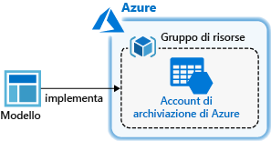
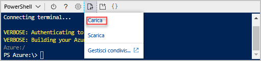

# <a name="quickstart-create-azure-resource-manager-templates-by-using-visual-studio-code"></a>Avvio rapido: Creare modelli di Azure Resource Manager con Visual Studio Code

Questa guida introduttiva illustra come usare Visual Studio Code e l'estensione Strumenti di Azure Resource Manager per creare e modificare i modelli di Azure Resource Manager. È possibile creare modelli di Resource Manager in Visual Studio Code senza l'estensione, ma questa offre opzioni di completamento automatico che semplificano lo sviluppo di modelli. Per comprendere i concetti associati alla distribuzione e alla gestione delle soluzioni di Azure, vedere [Panoramica di Azure Resource Manager](resource-group-overview.md).

In questa esercitazione viene distribuito un account di archiviazione:



Se non si ha una sottoscrizione di Azure, [creare un account gratuito](https://azure.microsoft.com/free/) prima di iniziare.

## <a name="prerequisites"></a>Prerequisiti

Per completare l'esercitazione di questo articolo, sono necessari gli elementi seguenti:

- [Visual Studio Code](https://code.visualstudio.com/).
- Estensione Strumenti di Azure Resource Manager. Per eseguirne l'installazione, seguire questa procedura:

    1. Aprire Visual Studio Code.
    2. Premere **CTRL+MAIUSC+X** per aprire il riquadro Estensioni.
    3. Cercare **Strumenti di Azure Resource Manager** e quindi selezionare **Installa**.
    4. Selezionare **Ricarica** per completare l'installazione dell'estensione.

## <a name="open-a-quickstart-template"></a>Aprire un modello di avvio rapido

Invece di creare un modello da zero, aprire un modello da [Modelli di avvio rapido di Azure](https://azure.microsoft.com/resources/templates/). Modelli di avvio rapido di Azure è un repository di modelli di Resource Manager.

Il modello usato in questa guida introduttiva è denominato [Create a standard storage account](https://azure.microsoft.com/resources/templates/101-storage-account-create/) (Creare un account di archiviazione Standard). Il modello definisce una risorsa account di archiviazione di Azure.

1. In Visual Studio Code selezionare **File**>**Apri file**.
2. In **Nome file** incollare l'URL seguente:

    ```url
    https://raw.githubusercontent.com/Azure/azure-quickstart-templates/master/101-storage-account-create/azuredeploy.json
    ```

3. Selezionare **Apri** per aprire il file.
4. Selezionare **File**>**Salva con nome** per salvare il file con il nome **azuredeploy.json** nel computer locale.

## <a name="edit-the-template"></a>Modificare il modello

Per sperimentare la modifica di un modello con Visual Studio Code, aggiungere un altro elemento nella sezione `outputs` per visualizzare l'URI di archiviazione.

1. Aggiungere un altro output al modello esportato:

    ```json
    "storageUri": {
      "type": "string",
      "value": "[reference(variables('storageAccountName')).primaryEndpoints.blob]"
    }
    ```

    Al termine, la sezione outputs si presenta come segue:

    ```json
    "outputs": {
      "storageAccountName": {
        "type": "string",
        "value": "[variables('storageAccountName')]"
      },
      "storageUri": {
        "type": "string",
        "value": "[reference(variables('storageAccountName')).primaryEndpoints.blob]"
      }
    }
    ```

    Se il codice è stato copiato e incollato in Visual Studio Code, provare a ridigitare l'elemento **value** per sperimentare la funzionalità IntelliSense dell'estensione Strumenti di Azure Resource Manager.

    

2. Selezionare **File**>**Salva** per salvare il file.

## <a name="deploy-the-template"></a>Distribuire il modello

Per distribuire i modelli sono disponibili molti metodi. In questa guida di avvio rapido si usa Azure Cloud Shell. Cloud Shell supporta sia l'interfaccia della riga di comando di Azure che Azure PowerShell. Usare il selettore di schede per scegliere tra l'interfaccia della riga di comando e PowerShell.

[!INCLUDE [updated-for-az](../../includes/updated-for-az.md)]

1. Accedere ad [Azure Cloud Shell](https://shell.azure.com)

2. Scegliere l'ambiente preferito selezionando **PowerShell** o **Bash** (interfaccia della riga di comando) nell'angolo superiore sinistro.  Quando si cambia interfaccia, è necessario riavviare la shell.

    # <a name="clitabcli"></a>[CLI](#tab/CLI)

    

    # <a name="powershelltabpowershell"></a>[PowerShell](#tab/PowerShell)

    

    ---

3. Selezionare **Carica/Scarica file** e quindi **Carica**.

    # <a name="clitabcli"></a>[CLI](#tab/CLI)

    
   
    # <a name="powershelltabpowershell"></a>[PowerShell](#tab/PowerShell)
    
    
    
    ---

    Selezionare il file salvato nella sezione precedente. Il nome predefinito è **azuredeploy.json**. Il file del modello deve essere accessibile dalla shell.

    Facoltativamente, è possibile usare i comandi **ls** e **cat** per verificare che il file sia stato caricato. 

    # <a name="clitabcli"></a>[CLI](#tab/CLI)

    
   
    # <a name="powershelltabpowershell"></a>[PowerShell](#tab/PowerShell)
    
    
    
    ---
4. In Cloud Shell eseguire i comandi riportati sotto. Selezionare la scheda per visualizzare il codice di PowerShell o il codice dell'interfaccia della riga di comando.

    # <a name="clitabcli"></a>[CLI](#tab/CLI)
    ```azurecli
    echo "Enter the Resource Group name:" &&
    read resourceGroupName &&
    echo "Enter the location (i.e. centralus):" &&
    read location &&
    az group create --name $resourceGroupName --location "$location" &&
    az group deployment create --resource-group $resourceGroupName --template-file "$HOME/azuredeploy.json"
    ```
   
    # <a name="powershelltabpowershell"></a>[PowerShell](#tab/PowerShell)
    
    ```azurepowershell
    $resourceGroupName = Read-Host -Prompt "Enter the Resource Group name"
    $location = Read-Host -Prompt "Enter the location (i.e. centralus)"
    
    New-AzResourceGroup -Name $resourceGroupName -Location "$location"
    New-AzResourceGroupDeployment -ResourceGroupName $resourceGroupName -TemplateFile "$HOME/azuredeploy.json"
    ```
    
    ---

    Aggiornare il nome file del modello se si salva il file con un nome diverso da **azuredeploy.json**. 

    La schermata seguente mostra una distribuzione di esempio:

    # <a name="clitabcli"></a>[CLI](#tab/CLI)

    
   
    # <a name="powershelltabpowershell"></a>[PowerShell](#tab/PowerShell)
    
    
    
    ---

    Il nome dell'account di archiviazione e l'URL di archiviazione nella sezione outputs sono evidenziati nello screenshot. Il nome dell'account di archiviazione sarà necessario nel passaggio successivo.

5. Eseguire questo comando dall'interfaccia della riga di comando o da PowerShell per visualizzare l'account di archiviazione appena creato:

    # <a name="clitabcli"></a>[CLI](#tab/CLI)
    ```azurecli
    echo "Enter the Resource Group name:" &&
    read resourceGroupName &&
    echo "Enter the Storage Account name:" &&
    read storageAccountName &&
    az storage account show --resource-group $resourceGroupName --name $storageAccountName
    ```
   
    # <a name="powershelltabpowershell"></a>[PowerShell](#tab/PowerShell)
    
    ```azurepowershell
    $resourceGroupName = Read-Host -Prompt "Enter the Resource Group name"
    $storageAccountName = Read-Host -Prompt "Enter the Storage Account name"
    Get-AzStorageAccount -ResourceGroupName $resourceGroupName -Name $storageAccountName
    ```
    
    ---

Per altre informazioni sull'uso degli account di archiviazione di Azure, vedere [Guida introduttiva: Caricare, scaricare ed elencare BLOB con il portale di Azure](../storage/blobs/storage-quickstart-blobs-portal.md).

## <a name="clean-up-resources"></a>Pulire le risorse

Quando non sono più necessarie, eseguire la pulizia delle risorse di Azure distribuite eliminando il gruppo di risorse.

1. Nel portale di Azure selezionare **Gruppo di risorse** nel menu a sinistra.
2. Immettere il nome del gruppo di risorse nel campo **Filtra per nome**.
3. Selezionare il nome del gruppo di risorse.  Nel gruppo di risorse verranno visualizzate in totale sei risorse.
4. Selezionare **Elimina gruppo di risorse** nel menu in alto.

## <a name="next-steps"></a>Passaggi successivi

L'obiettivo principale di questo avvio rapido consiste nell'uso di Visual Studio Code per modificare un modello esistente da modelli di avvio rapido di Azure. È stato anche illustrato come distribuire il modello con l'interfaccia della riga di comando o PowerShell da Azure Cloud Shell. I modelli di avvio rapido di Azure potrebbero non fornire tutto il necessario. L'esercitazione successiva illustra come trovare le informazioni di riferimento sul modello per poter creare un account di archiviazione di Azure crittografato.

> [!div class="nextstepaction"]
> [Creare un account di archiviazione crittografato](./resource-manager-tutorial-create-encrypted-storage-accounts.md)
