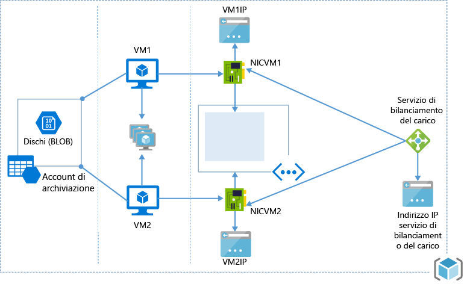

# <a name="resource-manager-template-walkthrough"></a>Procedura dettagliata per un modello di Resource Manager
Quando si crea un modello ci si chiede prima di tutto come iniziare. È possibile partire da un modello vuoto, seguendo la struttura di base illustrata nell'articolo sulla [creazione di un modello](resource-group-authoring-templates.md#template-format), e quindi aggiungere le risorse e le variabili e i parametri appropriati. In alternativa, è possibile esaminare prima di tutto la [raccolta di avvio rapido](https://github.com/Azure/azure-quickstart-templates) e cercare scenari simili a quello che si vuole creare. È possibile unire più modelli o modificarne uno esistente per adattarlo allo scenario specifico. 

Ecco un'infrastruttura comune:

* Due macchine virtuali che utilizzano lo stesso account di archiviazione, sono nello stesso set di disponibilità e nella stessa subnet di una rete virtuale.
* Una singola NIC e un indirizzo IP di macchina virtuale per ogni macchina virtuale.
* Un servizio di bilanciamento del carico con una regola di bilanciamento del carico sulla porta 80.



Questo argomento descrive la procedura per la creazione di un modello di Resource Manager per tale infrastruttura. Il modello finale creato è basato su un modello di avvio rapido denominato [2 VM in un servizio di bilanciamento del carico e regole per il bilanciamento del carico](https://azure.microsoft.com/documentation/templates/201-2-vms-loadbalancer-lbrules/).

Per semplificare, creare prima di tutto un account di archiviazione e distribuirlo. Al termine della creazione dell'account di archiviazione, sarà possibile aggiungere altre risorse e ridistribuire il modello per completare l'infrastruttura.

> [!NOTE]
> Durante la creazione del modello è possibile usare un editor di qualsiasi tipo. Visual Studio offre strumenti che semplificano lo sviluppo di modelli, ma non è necessario Visual Studio per completare questa esercitazione. Per un'esercitazione sull'uso di Visual Studio per creare una distribuzione di app Web e database SQL, vedere [Creazione e distribuzione di gruppi di risorse di Azure tramite Visual Studio](vs-azure-tools-resource-groups-deployment-projects-create-deploy.md). 
> 
> 

## <a name="create-the-resource-manager-template"></a>Creare il modello di Azure Resource Manager
Il modello è un file JSON che definisce tutte le risorse che verranno distribuite. Permette anche di definire i parametri specificati durante la distribuzione, le variabili costruite da altri valori ed espressioni e gli output della distribuzione. 

Di seguito è riportato il modello più semplice:

```json
    {
      "$schema": "http://schema.management.azure.com/schemas/2015-01-01/deploymentTemplate.json#",
      "contentVersion": "1.0.0.0",
      "parameters": {  },
      "variables": {  },
      "resources": [  ],
      "outputs": {  }
    }
 ```

Salvare questo file come **azuredeploy.json**. Si noti che il modello può avere un nome qualsiasi, ma deve essere un file JSON.

## <a name="create-a-storage-account"></a>Creare un account di archiviazione
Nella sezione **resources** aggiungere un oggetto che definisce l'account di archiviazione, come illustrato di seguito. 

```json
"resources": [
  {
    "type": "Microsoft.Storage/storageAccounts",
    "name": "[parameters('storageAccountName')]",
    "apiVersion": "2015-06-15",
    "location": "[resourceGroup().location]",
    "properties": {
      "accountType": "Standard_LRS"
    }
  }
]
```

Per quanto riguarda la provenienza dei valori e delle proprietà, Le proprietà **type**, **name**, **apiVersion** e **location** sono elementi standard disponibili per tutti i tipi di risorse. Per informazioni sugli elementi comuni, vedere [Risorse](resource-group-authoring-templates.md#resources). Per **name** viene impostato un valore di parametro passato durante la distribuzione e per **location** viene impostata la posizione usata dal gruppo di risorse. Nelle sezioni seguenti si vedrà come determinare **type** e **apiVersion**.

La sezione **properties** contiene tutte le proprietà univoche per un determinato tipo di risorsa. I valori specificati in questa sezione corrispondono esattamente all'operazione PUT nell'API REST per la creazione di quel tipo di risorsa. Quando si crea un account di archiviazione, è necessario specificare un valore per **accountType**. Si noti che nell' [API REST per la creazione di un account di archiviazione](https://msdn.microsoft.com/library/azure/mt163564.aspx) la sezione properties dell'operazione REST contiene anche una proprietà **accountType** e i valori consentiti sono documentati. In questo esempio il tipo di account è impostato su **Standard_LRS**, ma è possibile specificare un altro valore o consentire agli utenti di passare il tipo di account come un parametro.

Tornare ora alla sezione **parameters** per verificare come viene definito il nome dell'account di archiviazione. Per altre informazioni sull'uso dei parametri, vedere [Parametri](resource-group-authoring-templates.md#parameters). 

```json
"parameters" : {
    "storageAccountName": {
      "type": "string",
      "metadata": {
        "description": "Storage Account Name"
      }
    }
}
```
In questa sezione è stato definito un parametro di tipo string che includerà il nome dell'account di archiviazione. Il valore per questo parametro verrà fornito durante la distribuzione del modello.

## <a name="deploying-the-template"></a>Distribuzione del modello
È disponibile un modello completo per la creazione di un nuovo account di archiviazione. Come si ricorderà, il modello è stato salvato nel file **azuredeploy.json**:

```json
{
  "$schema": "https://schema.management.azure.com/schemas/2015-01-01/deploymentTemplate.json#",
  "contentVersion": "1.0.0.0",
  "parameters" : {
    "storageAccountName": {
      "type": "string",
      "metadata": {
        "description": "Storage Account Name"
      }
    }
  },  
  "resources": [
    {
      "type": "Microsoft.Storage/storageAccounts",
      "name": "[parameters('storageAccountName')]",
      "apiVersion": "2015-06-15",
      "location": "[resourceGroup().location]",
      "properties": {
        "accountType": "Standard_LRS"
      }
    }
  ]
}
```

È possibile distribuire un modello in diversi modi, come illustrato nell'articolo sulla [distribuzione delle risorse](resource-group-template-deploy.md). Per distribuire il modello mediante Azure PowerShell usare:

```powershell
# create a new resource group
New-AzureRmResourceGroup -Name ExampleResourceGroup -Location "West Europe"

# deploy the template to the resource group
New-AzureRmResourceGroupDeployment -Name ExampleDeployment -ResourceGroupName ExampleResourceGroup `
  -TemplateFile azuredeploy.json
```

In alternativa, per distribuire il modello mediante l'interfaccia della riga di comando usare:

```azurecli
azure group create -n ExampleResourceGroup -l "West Europe"

azure group deployment create -f azuredeploy.json -g ExampleResourceGroup -n ExampleDeployment
```

Si è ora proprietari di un account di archiviazione.

Sarà quindi necessario aggiungere tutte le risorse necessarie per distribuire l'architettura illustrata all'inizio dell'esercitazione. Queste risorse verranno aggiunte nello stesso modello usato fino ad ora.

## <a name="availability-set"></a>Set di disponibilità
Dopo la definizione dell'account di archiviazione, aggiungere un set di disponibilità per le macchine virtuali. In questo caso non sono richieste proprietà aggiuntive, quindi la relativa definizione è abbastanza semplice. Per la sezione properties completa, vedere l' [API REST per la creazione di un set di disponibilità](https://msdn.microsoft.com/library/azure/mt163607.aspx) , se si vogliono definire i valori relativi ai conteggi del dominio di aggiornamento e del dominio di errore.

```json
{
   "type": "Microsoft.Compute/availabilitySets",
   "name": "[variables('availabilitySetName')]",
   "apiVersion": "2015-06-15",
   "location": "[resourceGroup().location]",
   "properties": {}
}
```

Si noti che la proprietà **name** è impostata sul valore di una variabile. Per questo modello è necessario specificare il nome del set di disponibilità in diversi punti. La gestione del modello risulta più semplice se tale valore viene definito una volta e poi usato in diversi punti.

Il valore specificato per **type** contiene sia il provider di risorse che il tipo di risorsa. Per i set di disponibilità, il provider di risorse è **Microsoft.Compute** e il tipo di risorsa è **availabilitySets**. Per ottenere l'elenco dei provider di risorse disponibili è possibile eseguire il comando PowerShell seguente:

```powershell
    Get-AzureRmResourceProvider -ListAvailable
```

In alternativa, se si usa l'interfaccia della riga di comando di Azure, è possibile eseguire il comando seguente:

```azurecli
    azure provider list
```
Dato che in questo argomento si fa uso di account di archiviazione, macchine virtuali e reti virtuali per la creazione, si userà:

* Microsoft.Storage
* Microsoft.Compute
* Microsoft.Network

Per visualizzare i tipi di risorsa per un determinato provider, eseguire il comando PowerShell seguente:

```powershell
    (Get-AzureRmResourceProvider -ProviderNamespace Microsoft.Compute).ResourceTypes
```

In alternativa, per l'interfaccia della riga di comando di Azure, il comando seguente restituisce i tipi disponibili in formato JSON e li salva in un file.

```azurecli
    azure provider show Microsoft.Compute --json > c:\temp.json
```

L'oggetto **availabilitySets** verrà visualizzato come uno dei tipi all'interno di **Microsoft.Compute**. Il nome completo del tipo è **Microsoft.Compute/availabilitySets**. È possibile determinare il nome del tipo di risorsa per qualsiasi risorsa nel modello.

## <a name="public-ip"></a>IP pubblico
Definire un indirizzo IP pubblico. Anche in questo caso, vedere l' [API REST per indirizzi IP pubblici](https://msdn.microsoft.com/library/azure/mt163590.aspx) per informazioni sulle proprietà da impostare.

```json
{
  "apiVersion": "2015-06-15",
  "type": "Microsoft.Network/publicIPAddresses",
  "name": "[parameters('publicIPAddressName')]",
  "location": "[resourceGroup().location]",
  "properties": {
    "publicIPAllocationMethod": "Dynamic",
    "dnsSettings": {
      "domainNameLabel": "[parameters('dnsNameforLBIP')]"
    }
  }
}
```

Il metodo di allocazione è impostato su **Dynamic** , ma è possibile impostarlo sul valore necessario o in modo che accetti un valore di parametro. Gli utenti del modello sono stati abilitati a passare un valore per l'etichetta del nome di dominio.

Per determinare **apiVersion**, il valore specificato corrisponde semplicemente alla versione dell'API REST da usare durante la creazione della risorsa. È quindi possibile esaminare la documentazione dell'API REST per quel tipo di risorsa. In alternativa, è possibile eseguire il comando PowerShell seguente per un determinato tipo.

```powershell
    ((Get-AzureRmResourceProvider -ProviderNamespace Microsoft.Network).ResourceTypes | Where-Object ResourceTypeName -eq publicIPAddresses).ApiVersions
```
Che restituisce i valori seguenti:

    2015-06-15
    2015-05-01-preview
    2014-12-01-preview

Per visualizzare le versioni API con l'interfaccia della riga di comando di Azure, eseguire lo stesso comando **azure provider show** illustrato in precedenza.

Quando si crea un nuovo modello, selezionare la versione API più recente.

## <a name="virtual-network-and-subnet"></a>Rete virtuale e subnet
Creare una rete virtuale con una subnet. Per tutte le proprietà da impostare, vedere l' [API REST per le reti virtuali](https://msdn.microsoft.com/library/azure/mt163661.aspx) .

```json
{
   "apiVersion": "2015-06-15",
   "type": "Microsoft.Network/virtualNetworks",
   "name": "[parameters('vnetName')]",
   "location": "[resourceGroup().location]",
   "properties": {
     "addressSpace": {
       "addressPrefixes": [
         "10.0.0.0/16"
       ]
     },
     "subnets": [
       {
         "name": "[variables('subnetName')]",
         "properties": {
           "addressPrefix": "10.0.0.0/24"
         }
       }
     ]
   }
}
```

## <a name="load-balancer"></a>Servizio di bilanciamento del carico
A questo punto è possibile creare un servizio di bilanciamento del carico esterno. Dato che il servizio di bilanciamento del carico usa indirizzi IP pubblici, è necessario dichiarare una dipendenza dall'indirizzo IP pubblico nella sezione **dependsOn** . Ciò significa che il servizio di bilanciamento del carico non viene distribuito fino al termine della distribuzione dell'indirizzo IP pubblico. Se non si definisce questa dipendenza, si riceve un messaggio di errore perché Azure Resource Manager prova a distribuire le risorse in parallelo e a impostare il servizio di bilanciamento del carico su un indirizzo IP pubblico che ancora non esiste. 

In questa definizione risorse viene creato anche un pool di indirizzi back-end, due regole NAT in ingresso per RDP nelle macchine virtuali e una regola di bilanciamento del carico con un probe TCP sulla porta 80. Per tutte le proprietà, vedere l' [API REST per il servizio di bilanciamento del carico](https://msdn.microsoft.com/library/azure/mt163574.aspx) .

```json
{
   "apiVersion": "2015-06-15",
   "name": "[parameters('lbName')]",
   "type": "Microsoft.Network/loadBalancers",
   "location": "[resourceGroup().location]",
   "dependsOn": [
     "[concat('Microsoft.Network/publicIPAddresses/', parameters('publicIPAddressName'))]"
   ],
   "properties": {
     "frontendIPConfigurations": [
       {
         "name": "LoadBalancerFrontEnd",
         "properties": {
           "publicIPAddress": {
             "id": "[variables('publicIPAddressID')]"
           }
         }
       }
     ],
     "backendAddressPools": [
       {
         "name": "BackendPool1"
       }
     ],
     "inboundNatRules": [
       {
         "name": "RDP-VM0",
         "properties": {
           "frontendIPConfiguration": {
             "id": "[variables('frontEndIPConfigID')]"
           },
           "protocol": "tcp",
           "frontendPort": 50001,
           "backendPort": 3389,
           "enableFloatingIP": false
         }
       },
       {
         "name": "RDP-VM1",
         "properties": {
           "frontendIPConfiguration": {
             "id": "[variables('frontEndIPConfigID')]"
           },
           "protocol": "tcp",
           "frontendPort": 50002,
           "backendPort": 3389,
           "enableFloatingIP": false
         }
       }
     ],
     "loadBalancingRules": [
       {
         "name": "LBRule",
         "properties": {
           "frontendIPConfiguration": {
             "id": "[variables('frontEndIPConfigID')]"
           },
           "backendAddressPool": {
             "id": "[variables('lbPoolID')]"
           },
           "protocol": "tcp",
           "frontendPort": 80,
           "backendPort": 80,
           "enableFloatingIP": false,
           "idleTimeoutInMinutes": 5,
           "probe": {
             "id": "[variables('lbProbeID')]"
           }
         }
       }
     ],
     "probes": [
       {
         "name": "tcpProbe",
         "properties": {
           "protocol": "tcp",
           "port": 80,
           "intervalInSeconds": 5,
           "numberOfProbes": 2
         }
       }
     ]
   }
}
```

## <a name="network-interface"></a>Interfaccia di rete
Creare due interfacce di rete, una per ogni macchina virtuale. Anziché dover includere voci duplicate per le interfacce di rete, è possibile usare la [funzione copyIndex()](resource-group-create-multiple.md) per eseguire l'iterazione del ciclo di copia, detto nicLoop, e creare il numero di interfacce di rete definito nelle variabili `numberOfInstances`. L'interfaccia di rete dipende dalla creazione della rete virtuale e del servizio di bilanciamento del carico. Usa la subnet definita per la creazione della rete virtuale e l'ID del servizio di bilanciamento del carico per configurare il pool di indirizzi per il bilanciamento del carico e le regole NAT in ingresso.
Per tutte le proprietà, vedere l' [API REST per le interfacce di rete](https://msdn.microsoft.com/library/azure/mt163668.aspx) .

```json
{
   "apiVersion": "2015-06-15",
   "type": "Microsoft.Network/networkInterfaces",
   "name": "[concat(parameters('nicNamePrefix'), copyindex())]",
   "location": "[resourceGroup().location]",
   "copy": {
     "name": "nicLoop",
     "count": "[variables('numberOfInstances')]"
   },
   "dependsOn": [
     "[concat('Microsoft.Network/virtualNetworks/', parameters('vnetName'))]",
     "[concat('Microsoft.Network/loadBalancers/', parameters('lbName'))]"
   ],
   "properties": {
     "ipConfigurations": [
       {
         "name": "ipconfig1",
         "properties": {
           "privateIPAllocationMethod": "Dynamic",
           "subnet": {
             "id": "[variables('subnetRef')]"
           },
           "loadBalancerBackendAddressPools": [
             {
               "id": "[concat(variables('lbID'), '/backendAddressPools/BackendPool1')]"
             }
           ],
           "loadBalancerInboundNatRules": [
             {
               "id": "[concat(variables('lbID'),'/inboundNatRules/RDP-VM', copyindex())]"
             }
           ]
         }
       }
     ]
   }
}
```

## <a name="virtual-machine"></a>Macchine virtuali
Creare due macchine virtuali usando la funzione copyIndex(), come per la creazione delle [interfacce di rete](#network-interface).
La creazione della macchina virtuale dipende dall'account di archiviazione, dall'interfaccia di rete e dal set di disponibilità. Questa macchina virtuale verrà creata da un'immagine del Marketplace, come definito nella proprietà `storageProfile`. L'oggetto `imageReference` viene usato per definire l'editore di immagini, l'offerta, lo SKU e la versione. Infine, è necessario configurare un profilo di diagnostica per abilitare la diagnostica della macchina virtuale. 

Per trovare le proprietà rilevanti per un'immagine del Marketplace, vedere l'articolo relativo alla [selezione di immagini di macchine virtuali Linux](../virtual-machines/virtual-machines-linux-cli-ps-findimage.md?toc=%2fazure%2fvirtual-machines%2flinux%2ftoc.json) o alla [selezione di immagini di macchine virtuali Windows](../virtual-machines/virtual-machines-windows-cli-ps-findimage.md?toc=%2fazure%2fvirtual-machines%2fwindows%2ftoc.json).

```json
{
   "apiVersion": "2015-06-15",
   "type": "Microsoft.Compute/virtualMachines",
   "name": "[concat(parameters('vmNamePrefix'), copyindex())]",
   "copy": {
     "name": "virtualMachineLoop",
     "count": "[variables('numberOfInstances')]"
   },
   "location": "[resourceGroup().location]",
   "dependsOn": [
     "[concat('Microsoft.Storage/storageAccounts/', parameters('storageAccountName'))]",
     "[concat('Microsoft.Network/networkInterfaces/', parameters('nicNamePrefix'), copyindex())]",
     "[concat('Microsoft.Compute/availabilitySets/', variables('availabilitySetName'))]"
   ],
   "properties": {
     "availabilitySet": {
       "id": "[resourceId('Microsoft.Compute/availabilitySets',variables('availabilitySetName'))]"
     },
     "hardwareProfile": {
       "vmSize": "[parameters('vmSize')]"
     },
     "osProfile": {
       "computerName": "[concat(parameters('vmNamePrefix'), copyIndex())]",
       "adminUsername": "[parameters('adminUsername')]",
       "adminPassword": "[parameters('adminPassword')]"
     },
     "storageProfile": {
       "imageReference": {
         "publisher": "[parameters('imagePublisher')]",
         "offer": "[parameters('imageOffer')]",
         "sku": "[parameters('imageSKU')]",
         "version": "latest"
       },
       "osDisk": {
         "name": "osdisk",
         "vhd": {
           "uri": "[concat('http://',parameters('storageAccountName'),'.blob.core.windows.net/vhds/','osdisk', copyindex(), '.vhd')]"
         },
         "caching": "ReadWrite",
         "createOption": "FromImage"
       }
     },
     "networkProfile": {
       "networkInterfaces": [
         {
           "id": "[resourceId('Microsoft.Network/networkInterfaces',concat(parameters('nicNamePrefix'),copyindex()))]"
         }
       ]
     },
     "diagnosticsProfile": {
       "bootDiagnostics": {
          "enabled": "true",
          "storageUri": "[concat('http://',parameters('storageAccountName'),'.blob.core.windows.net')]"
       }
     }
}
```

> [!NOTE]
> Per le immagini pubblicate da **fornitori di terze parti** è necessario specificare un'altra proprietà denominata `plan`. Un esempio è disponibile in [questo modello](https://github.com/Azure/azure-quickstart-templates/tree/master/checkpoint-single-nic) nella raccolta di avvio rapido. 
> 
> 

La definizione delle risorse per il modello è terminata.

## <a name="parameters"></a>parameters
Nella sezione parameters è necessario definire i valori che possono essere specificati durante la distribuzione del modello. Definire solo i parametri per i valori che dovrebbero essere modificati durante la distribuzione. È possibile fornire un valore predefinito per un parametro da usare se non ne viene specificato uno durante la distribuzione. È anche possibile definire i valori consentiti, come illustrato per il parametro **imageSKU** .

```json
"parameters": {
    "storageAccountName": {
      "type": "string",
      "metadata": {
        "description": "Name of storage account"
      }
    },
    "adminUsername": {
      "type": "string",
      "metadata": {
        "description": "Admin username"
      }
    },
    "adminPassword": {
      "type": "securestring",
      "metadata": {
        "description": "Admin password"
      }
    },
    "dnsNameforLBIP": {
      "type": "string",
      "metadata": {
        "description": "DNS for Load Balancer IP"
      }
    },
    "vmNamePrefix": {
      "type": "string",
      "defaultValue": "myVM",
      "metadata": {
        "description": "Prefix to use for VM names"
      }
    },
    "imagePublisher": {
      "type": "string",
      "defaultValue": "MicrosoftWindowsServer",
      "metadata": {
        "description": "Image Publisher"
      }
    },
    "imageOffer": {
      "type": "string",
      "defaultValue": "WindowsServer",
      "metadata": {
        "description": "Image Offer"
      }
    },
    "imageSKU": {
      "type": "string",
      "defaultValue": "2012-R2-Datacenter",
      "allowedValues": [
        "2008-R2-SP1",
        "2012-Datacenter",
        "2012-R2-Datacenter"
      ],
      "metadata": {
        "description": "Image SKU"
      }
    },
    "lbName": {
      "type": "string",
      "defaultValue": "myLB",
      "metadata": {
        "description": "Load Balancer name"
      }
    },
    "nicNamePrefix": {
      "type": "string",
      "defaultValue": "nic",
      "metadata": {
        "description": "Network Interface name prefix"
      }
    },
    "publicIPAddressName": {
      "type": "string",
      "defaultValue": "myPublicIP",
      "metadata": {
        "description": "Public IP Name"
      }
    },
    "vnetName": {
      "type": "string",
      "defaultValue": "myVNET",
      "metadata": {
        "description": "VNET name"
      }
    },
    "vmSize": {
      "type": "string",
      "defaultValue": "Standard_D1",
      "metadata": {
        "description": "Size of the VM"
      }
    }
  }
```

## <a name="variables"></a>Variabili
Nella sezione variables è possibile definire valori usati in più punti del modello o valori costruiti da altre espressioni o variabili. Le variabili vengono usate spesso per semplificare la sintassi del modello.

```json
"variables": {
    "availabilitySetName": "myAvSet",
    "subnetName": "Subnet-1",
    "vnetID": "[resourceId('Microsoft.Network/virtualNetworks',parameters('vnetName'))]",
    "subnetRef": "[concat(variables('vnetID'),'/subnets/',variables ('subnetName'))]",
    "publicIPAddressID": "[resourceId('Microsoft.Network/publicIPAddresses',parameters('publicIPAddressName'))]",
    "numberOfInstances": 2,
    "lbID": "[resourceId('Microsoft.Network/loadBalancers',parameters('lbName'))]",
    "frontEndIPConfigID": "[concat(variables('lbID'),'/frontendIPConfigurations/LoadBalancerFrontEnd')]",
    "lbPoolID": "[concat(variables('lbID'),'/backendAddressPools/BackendPool1')]",
    "lbProbeID": "[concat(variables('lbID'),'/probes/tcpProbe')]"
  }
```

Il modello è stato completato. È possibile confrontare il modello con il modello completo disponibile nella [raccolta di avvio rapido](https://github.com/Azure/azure-quickstart-templates) nel [modello con 2 VM in un servizio di bilanciamento del carico e regole per il bilanciamento del carico](https://github.com/Azure/azure-quickstart-templates/tree/master/201-2-vms-loadbalancer-lbrules). Il modello specifico potrebbe risultare leggermente diverso a causa dell'uso di numeri di versione diversi. 

È possibile ridistribuire il modello usando gli stessi comandi usati durante la distribuzione dell'account di archiviazione. Non è necessario eliminare l'account di archiviazione prima della ridistribuzione perché Resource Manager ignorerà la ricreazione di risorse già esistenti e non modificate.

## <a name="next-steps"></a>Passaggi successivi
* [Azure Resource Manager Template Visualizer](http://armviz.io/#/) è uno strumento ideale per visualizzare i modelli di Resource Manager, perché potrebbero risultare troppo grandi per essere comprensibili solo mediante la lettura del file JSON.
* Per altre informazioni sulla struttura del modello, vedere [Creazione di modelli di Azure Resource Manager](resource-group-authoring-templates.md).
* Per altre informazioni sulla distribuzione di modelli, vedere [Distribuire un gruppo di risorse con un modello di Azure Resource Manager](resource-group-template-deploy.md)
* Per una serie di quattro parti sull'automazione della distribuzione, vedere [Automazione della distribuzione di applicazioni nelle macchine virtuali di Azure](../virtual-machines/virtual-machines-windows-dotnet-core-1-landing.md?toc=%2fazure%2fvirtual-machines%2fwindows%2ftoc.json). Questa serie illustra argomenti come architettura, accesso e sicurezza, disponibilità, scalabilità e distribuzione delle applicazioni.


<!--HONumber=Nov16_HO3-->


