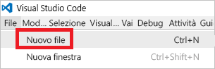

# <a name="use-visual-studio-code-extension-to-create-azure-resource-manager-template"></a>Usare l'estensione Visual Studio Code per creare modelli di Azure Resource Manager
Questo articolo illustra i vantaggi dell'installazione e dell'uso dell'estensione Strumenti di Azure Resource Manager in Visual Studio Code. È possibile creare modelli di Resource Manager in Visual Studio Code senza l'estensione, ma l'estensione fornisce opzioni di completamento automatico che semplificano lo sviluppo di modelli. Suggerisce funzioni, parametri e variabili disponibili nel modello.

Per completare l'esercitazione di questo articolo è necessario [Visual Studio Code](https://code.visualstudio.com/).

Per comprendere i concetti associati alla distribuzione e alla gestione delle soluzioni di Azure, vedere [Panoramica di Azure Resource Manager](resource-group-overview.md).

## <a name="create-the-template"></a>Creare il modello

Questo articolo si basa sul modello creato in [Creare e distribuire il primo modello di Azure Resource Manager](resource-manager-create-first-template.md). Se il modello è già disponibile, è possibile ignorare questa sezione.

1. Se è necessario creare il modello, avviare Visual Studio Code. Selezionare **File** > **Nuovo file**. 

   

2. Copiare e incollare nel file la sintassi JSON seguente:

   ```json
   {
     "$schema": "http://schema.management.azure.com/schemas/2015-01-01/deploymentTemplate.json#",
     "contentVersion": "1.0.0.0",
     "parameters": {
       "storageSKU": {
         "type": "string",
         "allowedValues": [
           "Standard_LRS",
           "Standard_ZRS",
           "Standard_GRS",
           "Standard_RAGRS",
           "Premium_LRS"
         ],
         "defaultValue": "Standard_LRS",
         "metadata": {
           "description": "The type of replication to use for the storage account."
         }
       },   
       "storageNamePrefix": {
         "type": "string",
         "maxLength": 11,
         "defaultValue": "storage",
         "metadata": {
           "description": "The value to use for starting the storage account name. Use only lowercase letters and numbers."
         }
       }
     },
     "variables": {
       "storageName": "[concat(toLower(parameters('storageNamePrefix')), uniqueString(resourceGroup().id))]"
     },
     "resources": [
       {
         "name": "[variables('storageName')]",
         "type": "Microsoft.Storage/storageAccounts",
         "apiVersion": "2016-01-01",
         "sku": {
           "name": "[parameters('storageSKU')]"
         },
         "kind": "Storage",
         "location": "[resourceGroup().location]",
         "tags": {},
         "properties": {
           "encryption":{
             "services":{
               "blob":{
                 "enabled":true
               }
             },
             "keySource":"Microsoft.Storage"
           }
         }
       }
     ],
     "outputs": {  }
   }
   ```

3. Salvare il file con il nome **azuredeploy.json** in una cartella locale.

   

## <a name="install-the-extension"></a>Installare l'estensione

1. In Visual Studio Code selezionare **Estensioni**.

   

2. Cercare **Strumenti di Azure Resource Manager** e selezionare **Installa**.

   

3. Per completare l'installazione dell'estensione, selezionare **Ricarica**.

## <a name="edit-the-template"></a>Modificare il modello

1. Aprire il file azuredeploy.json.

2. L'estensione recupera tutte le [funzioni del modello](resource-group-template-functions.md) disponibili. Legge anche i parametri e le variabili definiti nel modello. Per visualizzare questa funzionalità, aggiungere due valori alla sezione outputs. Nel modello, sostituire la sezione outputs con:

   ```json
   "outputs": { 
       "groupLocation": {
         "type": "string",
         "value": ""
       },
       "storageUri": {
         "type": "string",
         "value": ""
       }
   }
   ```

3. Posizionare il cursore all'interno delle virgolette accanto all'elemento value in **groupLocation**. Digitare la parentesi quadra aperta (`[`). Si noti che l'estensione suggerisce immediatamente le funzioni disponibili per il modello.

   

4. Iniziare a digitare **resourceGroup**. Quando viene visualizzata la funzione `resourceGroup()`, premere TAB o INVIO.

   

5. L'estensione inserisce la sintassi dell'estensione. La funzione [resourceGroup](resource-group-template-functions-resource.md#resourcegroup) non accetta parametri. Aggiungere un punto dopo la parentesi chiusa. L'estensione fornisce le proprietà disponibili per l'oggetto restituito dalla funzione `resourceGroup()`. Selezionare `location`.

   

6. Dopo **location** aggiungere la parentesi quadra chiusa.

   ```json
   "outputs": { 
       "groupLocation": {
         "type": "string",
         "value": "[resourceGroup().location]"
       },
       "storageUri": {
         "type": "string",
         "value": ""
       }
   }
   ```

7. Posizionare ora il cursore all'interno delle virgolette accanto all'elemento value in **storageUri**. Digitare di nuovo la parentesi quadra aperta. Iniziare a digitare **reference**. Quando viene selezionata la funzione, premere TAB o INVIO.

   

8. La funzione [reference](resource-group-template-functions-resource.md#reference) accetta l'ID risorsa o il nome risorsa come parametro. Il nome dell'account di archiviazione è già disponibile in una variabile. Digitare **var** e quindi premere CTRL + barra spaziatrice. L'estensione suggerisce la funzione variables.

   

   Premere TAB o INVIO.

9. La funzione [variables](resource-group-template-functions-deployment.md#variables) richiede il nome della variabile. All'interno delle parentesi, aggiungere una virgoletta singola. L'estensione fornisce i nomi delle variabili definite nel modello.

    

10. Selezionare la variabile **storageName**. Aggiungere la parentesi quadra chiusa. L'esempio seguente illustra la sezione outputs:

   ```json
   "outputs": { 
       "groupLocation": {
         "type": "string",
         "value": "[resourceGroup().location]"
       },
       "storageUri": {
         "type": "string",
         "value": "[reference(variables('storageName'))]"
       }
   }
   ```

Il modello finale sarà:

```json
{
  "$schema": "http://schema.management.azure.com/schemas/2015-01-01/deploymentTemplate.json#",
  "contentVersion": "1.0.0.0",
  "parameters": {
    "storageSKU": {
      "type": "string",
      "allowedValues": [
        "Standard_LRS",
        "Standard_ZRS",
        "Standard_GRS",
        "Standard_RAGRS",
        "Premium_LRS"
      ],
      "defaultValue": "Standard_LRS",
      "metadata": {
        "description": "The type of replication to use for the storage account."
      }
    },   
    "storageNamePrefix": {
      "type": "string",
      "maxLength": 11,
      "defaultValue": "storage",
      "metadata": {
        "description": "The value to use for starting the storage account name. Use only lowercase letters and numbers."
      }
    }
  },
  "variables": {
    "storageName": "[concat(toLower(parameters('storageNamePrefix')), uniqueString(resourceGroup().id))]"
  },
  "resources": [
    {
      "name": "[variables('storageName')]",
      "type": "Microsoft.Storage/storageAccounts",
      "apiVersion": "2016-01-01",
      "sku": {
        "name": "[parameters('storageSKU')]"
      },
      "kind": "Storage",
      "location": "[resourceGroup().location]",
      "tags": {},
      "properties": {
        "encryption":{
          "services":{
            "blob":{
              "enabled":true
            }
          },
          "keySource":"Microsoft.Storage"
        }
      }
    }
  ],
  "outputs": { 
    "groupLocation": {
      "type": "string",
      "value": "[resourceGroup().location]"
    },
    "storageUri": {
      "type": "string",
      "value": "[reference(variables('storageName'))]"
    }
  }
}
```

## <a name="deploy-template"></a>Distribuire il modello

A questo punto è possibile distribuire il modello. Usare PowerShell o l'interfaccia della riga di comando di Azure per creare un gruppo di risorse. Distribuire quindi un account di archiviazione nel nuovo gruppo di risorse.

* Per PowerShell, usare i comandi seguenti dalla cartella che contiene il modello:

   ```powershell
   Login-AzureRmAccount
   
   New-AzureRmResourceGroup -Name examplegroup -Location "South Central US"
   New-AzureRmResourceGroupDeployment -ResourceGroupName examplegroup -TemplateFile azuredeploy.json
   ```

* Per un'installazione locale dell'interfaccia della riga di comando di Azure, usare i comandi seguenti dalla cartella che contiene il modello:

   ```azurecli
   az login

   az group create --name examplegroup --location "South Central US"
   az group deployment create --resource-group examplegroup --template-file azuredeploy.json
   ```

Al termine della distribuzione vengono restituiti i valori di output.

## <a name="clean-up-resources"></a>Pulire le risorse

Quando non saranno più necessarie, eliminare le risorse distribuite eliminando il gruppo di risorse.

Per PowerShell, usare:

```powershell
Remove-AzureRmResourceGroup -Name examplegroup
```

Per l'interfaccia della riga di comando di Azure usare:

```azurecli
az group delete --name examplegroup
```

## <a name="next-steps"></a>Passaggi successivi
* Per altre informazioni sulla struttura del modello, vedere [Creazione di modelli di Azure Resource Manager](resource-group-authoring-templates.md).
* Per altre informazioni sulle proprietà di un account di archiviazione, vedere le [informazioni di riferimento sul modello degli account di archiviazione](/azure/templates/microsoft.storage/storageaccounts).
* Per visualizzare modelli completi per molti tipi diversi di soluzioni, vedere [Modelli di avvio rapido di Azure](https://azure.microsoft.com/documentation/templates/).

