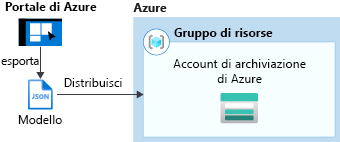

# Creare e distribuire modelli ARM con IntelliJ IDEA

Informazioni su come distribuire un modello di Azure Resource Manager (ARM) in Azure usando IntelliJ IDEA e il processo di modifica e aggiornamento del modello direttamente dall'IDE. I modelli ARM sono file JSON che definiscono le risorse che è necessario distribuire per la soluzione. Per comprendere i concetti associati alla distribuzione e alla gestione delle soluzioni di Azure, vedere la [panoramica della distribuzione di modelli](overview.md).

Al termine dell'esercitazione si distribuirà un account di archiviazione di Azure. Lo stesso processo può essere usato per distribuire altre risorse di Azure.

Se non si ha una sottoscrizione di Azure, [creare un account gratuito](https://azure.microsoft.com/free/) prima di iniziare.

## Prerequisiti

Per completare l'esercitazione di questo articolo, sono necessari gli elementi seguenti:

* [IntelliJ IDEA](https://www.jetbrains.com/idea/download/) Ultimate Edition o Community Edition installato
* [Azure Toolkit for IntelliJ](https://plugins.jetbrains.com/plugin/8053) installato, vedere la [guida alla gestione dei plug-in di IntelliJ](https://www.jetbrains.com/help/idea/managing-plugins.html) per altre informazioni
* [Accesso](/java/azure/intellij/azure-toolkit-for-intellij-sign-in-instructions) all'account Azure per Azure Toolkit for IntelliJ

## Distribuire un modello di avvio rapido

Invece di creare un modello da zero, aprire un modello da [Modelli di avvio rapido di Azure](https://azure.microsoft.com/resources/templates/). I modelli di avvio rapido di Azure costituiscono un repository di modelli di Azure Resource Manager. Il modello usato in questo articolo è denominato [creare un account di archiviazione standard](https://github.com/Azure/azure-quickstart-templates/tree/master/101-storage-account-create/). Questo modello definisce una risorsa account di archiviazione di Azure.

1. Fare clic con il pulsante destro del mouse e salvare nel [`azuredeploy.json`](https://raw.githubusercontent.com/Azure/azure-quickstart-templates/master/101-storage-account-create/azuredeploy.json) [`azuredeploy.parameters.json`](https://raw.githubusercontent.com/Azure/azure-quickstart-templates/master/101-storage-account-create/azuredeploy.parameters.json) computer locale.

1. Se Azure Toolkit è installato correttamente ed è stato eseguito l'accesso, nella barra laterale di IntelliJ IDEA verrà visualizzato Azure Explorer. Fare clic con il pulsante destro del mouse su **Resource Management** (Gestione risorse) e scegliere **Create Deployment** (Crea distribuzione).

    

1. Configurare **Deployment Name** (Nome distribuzione), **Subscription** (Sottoscrizione), **Resource Group** (Gruppo di risorse) e **Region** (Area). In questo esempio si distribuisce il modello in un nuovo gruppo di risorse `testRG`. Selezionare quindi `azuredeploy.json` come **Resource Template** (Modello risorsa) e il file `azuredeploy.parameters.json` scaricato come **Resource Parameters** (Parametri risorsa).

    

1. Facendo clic su OK verrà avviata la distribuzione. Fino al suo completamento, lo stato di avanzamento sarà riportato nella **barra di stato** di IntelliJ IDEA in basso.

    

## Esplorare una distribuzione esistente

1. Al termine della distribuzione, è possibile visualizzare il nuovo gruppo di risorse `testRG` e la nuova distribuzione che sono stati creati. Facendo clic con il pulsante destro del mouse sulla distribuzione si può visualizzare un elenco delle azioni possibili. Selezionare quindi **Show Properties** (Mostra proprietà).

    

1. Verrà aperta una visualizzazione scheda contenente alcune proprietà utili, come lo stato della distribuzione e la struttura del modello.

    

## Modificare e aggiornare una distribuzione esistente

1. Selezionare **Edit Deployment** (Modifica distribuzione) dal menu di scelta rapida o nella precedente visualizzazione di Show Properties (Mostra proprietà). Verrà aperta un'altra visualizzazione scheda contenente i file del modello e dei parametri per la distribuzione in Azure. Per salvare i file in locale, è possibile fare clic su **Export Template File** (Esporta file modello) o **Export Parameter Files** (Esporta file parametri).

    

1. È possibile modificare i due file in questa pagina e distribuire le modifiche in Azure. In questo esempio si modifica il valore di **storageAccountType** da `Standard_LRS` a `Standard_GRS` nel file dei parametri. Fare quindi clic su **Update Deployment** (Aggiorna distribuzione) in basso e confermare l'aggiornamento.

    

1. Al termine dell'aggiornamento della distribuzione, è possibile verificare nel portale che l'account di archiviazione creato sia stato modificato in `Standard_GRS`.

## Pulire le risorse

1. Quando non sono più necessarie, eseguire la pulizia delle risorse di Azure distribuite eliminando il gruppo di risorse. È possibile eseguire questa operazione dal portale di Azure o dall'interfaccia della riga di comando di Azure. In Azure Explorer in IntelliJ IDEA fare clic con il pulsante destro del mouse sul **gruppo di risorse** creato e scegliere Delete (Elimina).

    

> [!NOTE]
> Si noti che eliminando una distribuzione non verranno eliminate le risorse da essa create. Se non sono più necessarie, eliminare il gruppo di risorse o le risorse specifiche corrispondenti.

## Passaggi successivi

L'obiettivo principale di questo articolo è usare IntelliJ IDEA per distribuire un modello esistente da modelli di avvio rapido di Azure. È stato anche illustrato come visualizzare e aggiornare una distribuzione esistente in Azure. I modelli di avvio rapido di Azure potrebbero non fornire tutto il necessario. Per altre informazioni sullo sviluppo dei modelli, vedere la nuova serie di esercitazioni per principianti:

> [!div class="nextstepaction"]
> [Esercitazioni per principianti](./template-tutorial-create-first-template.md)

> [!div class="nextstepaction"]
> [Visitare il centro per sviluppatori Java in Azure](https://docs.microsoft.com/azure/java)
