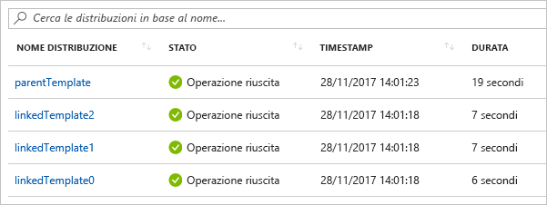

# <a name="using-linked-and-nested-templates-when-deploying-azure-resources"></a>Uso di modelli collegati e annidati nella distribuzione di risorse di Azure

Per distribuire soluzioni complesse, è possibile suddividere il modello in molti modelli correlati e quindi distribuirli insieme tramite un modello principale. I modelli correlati possono essere file separati o sintassi del modello incorporata nel modello principale. In questo articolo viene utilizzato il termine **modello collegato** per fare riferimento a un file di modello separato a cui viene fatto riferimento tramite un collegamento dal modello principale. Utilizza il termine **modello nidificato** per fare riferimento alla sintassi del modello incorporato all'interno del modello principale.

Per le piccole e medie soluzioni, un modello singolo è più facile da comprendere e gestire. È possibile vedere tutti i valori e le risorse in un unico file. Per gli scenari avanzati, i modelli collegati consentono di suddividere la soluzione in componenti di destinazione. È possibile riutilizzare facilmente questi modelli per altri scenari.

Per un'esercitazione, vedere [Esercitazione: Creare modelli collegati di Azure Resource Manager](template-tutorial-create-linked-templates.md).

> [!NOTE]
> Per modelli collegati o annidati, è possibile usare solo la modalità di distribuzione [Incrementale](deployment-modes.md).
>

## <a name="nested-template"></a>Modello annidato

Per nidificare un modello, aggiungere una [risorsa di distribuzione](/azure/templates/microsoft.resources/deployments) al modello principale. Nella proprietà del **modello,** specificare la sintassi del modello.

```json
{
  "$schema": "https://schema.management.azure.com/schemas/2019-04-01/deploymentTemplate.json#",
  "contentVersion": "1.0.0.0",
  "parameters": {},
  "variables": {},
  "resources": [
    {
      "name": "nestedTemplate1",
      "apiVersion": "2017-05-10",
      "type": "Microsoft.Resources/deployments",
      "properties": {
        "mode": "Incremental",
        "template": {
          <nested-template-syntax>
        }
      }
    }
  ],
  "outputs": {
  }
}
```

L'esempio seguente distribuisce un account di archiviazione tramite un modello annidato.

```json
{
  "$schema": "https://schema.management.azure.com/schemas/2019-04-01/deploymentTemplate.json#",
  "contentVersion": "1.0.0.0",
  "parameters": {
    "storageAccountName": {
      "type": "string"
    }
  },
  "resources": [
    {
      "name": "nestedTemplate1",
      "apiVersion": "2017-05-10",
      "type": "Microsoft.Resources/deployments",
      "properties": {
        "mode": "Incremental",
        "template": {
          "$schema": "https://schema.management.azure.com/schemas/2015-01-01/deploymentTemplate.json#",
          "contentVersion": "1.0.0.0",
          "resources": [
            {
              "type": "Microsoft.Storage/storageAccounts",
              "apiVersion": "2019-04-01",
              "name": "[parameters('storageAccountName')]",
              "location": "West US",
              "sku": {
                "name": "Standard_LRS"
              },
              "kind": "StorageV2"
            }
          ]
        }
      }
    }
  ],
  "outputs": {
  }
}
```

### <a name="expression-evaluation-scope-in-nested-templates"></a>Ambito di valutazione delle espressioni nei modelli annidati

Quando si utilizza un modello nidificato, è possibile specificare se le espressioni di modello vengono valutate all'interno dell'ambito del modello padre o del modello nidificato. L'ambito determina la modalità di risoluzione di parametri, variabili e funzioni come [resourceGroup](template-functions-resource.md#resourcegroup) e [subscription.](template-functions-resource.md#subscription)

Impostare l'ambito `expressionEvaluationOptions` tramite la proprietà. Per impostazione `expressionEvaluationOptions` predefinita, `outer`la proprietà è impostata su , il che significa che utilizza l'ambito del modello padre. Impostare il `inner` valore su per fare in modo che le espressioni vengano valutate nell'ambito del modello annidato.

```json
{
  "type": "Microsoft.Resources/deployments",
  "apiVersion": "2017-05-10",
  "name": "nestedTemplate1",
  "properties": {
  "expressionEvaluationOptions": {
    "scope": "inner"
  },
  ...
```

Nel modello seguente viene illustrato come le espressioni di modello vengono risolte in base all'ambito. Contiene una variabile `exampleVar` denominata definita sia nel modello padre che nel modello nidificato. Restituisce il valore della variabile.

```json
{
  "$schema": "https://schema.management.azure.com/schemas/2019-04-01/deploymentTemplate.json#",
  "contentVersion": "1.0.0.0",
  "parameters": {
  },
  "variables": {
    "exampleVar": "from parent template"
  },
  "resources": [
    {
      "type": "Microsoft.Resources/deployments",
      "apiVersion": "2017-05-10",
      "name": "nestedTemplate1",
      "properties": {
        "expressionEvaluationOptions": {
          "scope": "inner"
        },
        "mode": "Incremental",
        "template": {
          "$schema": "https://schema.management.azure.com/schemas/2015-01-01/deploymentTemplate.json#",
          "contentVersion": "1.0.0.0",
          "variables": {
            "exampleVar": "from nested template"
          },
          "resources": [
          ],
          "outputs": {
            "testVar": {
              "type": "string",
              "value": "[variables('exampleVar')]"
            }
          }
        }
      }
    }
  ],
  "outputs": {
    "messageFromLinkedTemplate": {
      "type": "string",
      "value": "[reference('nestedTemplate1').outputs.testVar.value]"
    }
  }
}
```

Il valore `exampleVar` delle modifiche a `scope` seconda `expressionEvaluationOptions`del valore della proprietà in . Nella tabella seguente vengono illustrati i risultati per entrambi gli ambiti.

| `expressionEvaluationOptions` `scope` | Output |
| ----- | ------ |
| interno | da modello nidificato |
| esterno (o predefinito) | dal modello padre |

Nell'esempio seguente viene distribuito un server SQL e viene recuperato un segreto dell'insieme di credenziali delle chiavi da utilizzare per la password. L'ambito è `inner` impostato perché crea dinamicamente `adminPassword.reference.keyVault` l'ID `parameters`dell'insieme di credenziali delle chiavi (vedere nei modelli esterni) e lo passa come parametro al modello nidificato.

```json
{
  "$schema": "https://schema.management.azure.com/schemas/2015-01-01/deploymentTemplate.json#",
  "contentVersion": "1.0.0.0",
  "parameters": {
    "location": {
      "type": "string",
      "defaultValue": "[resourceGroup().location]",
      "metadata": {
        "description": "The location where the resources will be deployed."
      }
    },
    "vaultName": {
      "type": "string",
      "metadata": {
        "description": "The name of the keyvault that contains the secret."
      }
    },
    "secretName": {
      "type": "string",
      "metadata": {
        "description": "The name of the secret."
      }
    },
    "vaultResourceGroupName": {
      "type": "string",
      "metadata": {
        "description": "The name of the resource group that contains the keyvault."
      }
    },
    "vaultSubscription": {
      "type": "string",
      "defaultValue": "[subscription().subscriptionId]",
      "metadata": {
        "description": "The name of the subscription that contains the keyvault."
      }
    }
  },
  "resources": [
    {
      "type": "Microsoft.Resources/deployments",
      "apiVersion": "2018-05-01",
      "name": "dynamicSecret",
      "properties": {
        "mode": "Incremental",
        "expressionEvaluationOptions": {
          "scope": "inner"
        },
        "parameters": {
          "location": {
            "value": "[parameters('location')]"
          },
          "adminLogin": {
            "value": "ghuser"
          },
          "adminPassword": {
            "reference": {
              "keyVault": {
                "id": "[resourceId(parameters('vaultSubscription'), parameters('vaultResourceGroupName'), 'Microsoft.KeyVault/vaults', parameters('vaultName'))]"
              },
              "secretName": "[parameters('secretName')]"
            }
          }
        },
        "template": {
          "$schema": "https://schema.management.azure.com/schemas/2015-01-01/deploymentTemplate.json#",
          "contentVersion": "1.0.0.0",
          "parameters": {
            "adminLogin": {
              "type": "string"
            },
            "adminPassword": {
              "type": "securestring"
            },
            "location": {
              "type": "string"
            }
          },
          "variables": {
            "sqlServerName": "[concat('sql-', uniqueString(resourceGroup().id, 'sql'))]"
          },
          "resources": [
            {
              "type": "Microsoft.Sql/servers",
              "apiVersion": "2018-06-01-preview",
              "name": "[variables('sqlServerName')]",
              "location": "[parameters('location')]",
              "properties": {
                "administratorLogin": "[parameters('adminLogin')]",
                "administratorLoginPassword": "[parameters('adminPassword')]"
              }
            }
          ],
          "outputs": {
            "sqlFQDN": {
              "type": "string",
              "value": "[reference(variables('sqlServerName')).fullyQualifiedDomainName]"
            }
          }
        }
      }
    }
  ],
  "outputs": {
  }
}
```

> [!NOTE]
>
> Quando l'ambito `outer`è impostato su `reference` , non è possibile utilizzare la funzione nella sezione outputs di un modello annidato per una risorsa distribuita nel modello annidato. Per restituire i valori per una risorsa distribuita `inner` in un modello annidato, usare l'ambito o convertire il modello annidato in un modello collegato.

## <a name="linked-template"></a>Modello collegato

Per collegare un modello, aggiungere una [risorsa di distribuzione](/azure/templates/microsoft.resources/deployments) al modello principale. Nella proprietà **templateLink** specificare l'URI del modello da includere. L'esempio seguente è collegato a un modello che distribuisce un nuovo account di archiviazione.

```json
{
  "$schema": "https://schema.management.azure.com/schemas/2019-04-01/deploymentTemplate.json#",
  "contentVersion": "1.0.0.0",
  "parameters": {},
  "variables": {},
  "resources": [
    {
      "type": "Microsoft.Resources/deployments",
      "apiVersion": "2017-05-10",
      "name": "linkedTemplate",
      "properties": {
        "mode": "Incremental",
        "templateLink": {
          "uri":"https://mystorageaccount.blob.core.windows.net/AzureTemplates/newStorageAccount.json",
          "contentVersion":"1.0.0.0"
        }
      }
    }
  ],
  "outputs": {
  }
}
```

Quando si fa riferimento a un `uri` modello collegato, il valore di non deve essere un file locale o un file disponibile solo nella rete locale. È necessario fornire un valore URI scaricabile come **http** o **https**. 

> [!NOTE]
>
> È possibile fare riferimento ai modelli utilizzando parametri che in definitiva `_artifactsLocation` si risolvono in un valore che utilizza **http** o **https,** ad esempio utilizzando il parametro in questo modo:`"uri": "[concat(parameters('_artifactsLocation'), '/shared/os-disk-parts-md.json', parameters('_artifactsLocationSasToken'))]",`


Gestione risorse deve essere in grado di accedere al modello. È possibile inserire il modello collegato in un account di archiviazione e usare l'URI per tale elemento.

### <a name="parameters-for-linked-template"></a>Parametri per il modello collegato

È possibile specificare i parametri per il modello collegato in un file esterno o in line. Quando si fornisce un file di parametri esterno, utilizzare la proprietà **parametersLink:**

```json
"resources": [
  {
  "type": "Microsoft.Resources/deployments",
  "apiVersion": "2018-05-01",
  "name": "linkedTemplate",
  "properties": {
    "mode": "Incremental",
    "templateLink": {
      "uri":"https://mystorageaccount.blob.core.windows.net/AzureTemplates/newStorageAccount.json",
      "contentVersion":"1.0.0.0"
    },
    "parametersLink": {
      "uri":"https://mystorageaccount.blob.core.windows.net/AzureTemplates/newStorageAccount.parameters.json",
      "contentVersion":"1.0.0.0"
    }
  }
  }
]
```

Per passare i valori dei parametri inline, utilizzare la proprietà **parameters.**

```json
"resources": [
  {
   "type": "Microsoft.Resources/deployments",
   "apiVersion": "2018-05-01",
   "name": "linkedTemplate",
   "properties": {
     "mode": "Incremental",
     "templateLink": {
      "uri":"https://mystorageaccount.blob.core.windows.net/AzureTemplates/newStorageAccount.json",
      "contentVersion":"1.0.0.0"
     },
     "parameters": {
      "StorageAccountName":{"value": "[parameters('StorageAccountName')]"}
    }
   }
  }
]
```

Non è possibile usare i parametri inline e un collegamento a un file di parametri. La distribuzione ha esito negativo con un errore quando vengono specificati sia `parametersLink` che `parameters`.

## `contentVersion`

Non è necessario fornire `contentVersion` la proprietà `templateLink` `parametersLink` per la proprietà o . Se non si specifica `contentVersion`un , viene distribuita la versione corrente del modello. Se si specifica un valore per la versione del contenuto, questa deve corrispondere alla versione del modello collegato. In caso contrario, la distribuzione ha esito negativo con un errore.

## <a name="using-variables-to-link-templates"></a>Uso di variabili per collegare i modelli

Negli esempi precedenti sono illustrati i valori di URL hard-coded per i collegamenti del modello. Questo approccio potrebbe funzionare per un modello semplice, ma non funziona bene per un ampio set di modelli modulari. In alternativa, è possibile creare una variabile statica contenente un URL di base per il modello principale e quindi creare dinamicamente gli URL per i modelli collegati da tale URL di base. Il vantaggio di questo approccio è che è possibile spostare o fork facilmente il modello perché è necessario modificare solo la variabile statica nel modello principale. Il modello principale passa gli URI corretti a tutto il modello scomposto.

Nell'esempio seguente viene illustrato come usare un URL di base per creare due URL per i modelli collegati (**sharedTemplateUrl** e **vmTemplate**).

```json
"variables": {
  "templateBaseUrl": "https://raw.githubusercontent.com/Azure/azure-quickstart-templates/master/postgresql-on-ubuntu/",
  "sharedTemplateUrl": "[uri(variables('templateBaseUrl'), 'shared-resources.json')]",
  "vmTemplateUrl": "[uri(variables('templateBaseUrl'), 'database-2disk-resources.json')]"
}
```

È inoltre possibile usare [deployment ()](template-functions-deployment.md#deployment) per ottenere l'URL di base per il modello corrente e usarlo per ottenere l'URL per altri modelli nello stesso percorso. Questo approccio è utile se la posizione del modello cambia o si vuole evitare la codifica di URL nel file del modello. La proprietà templateLink viene restituita solo durante il collegamento a un modello remoto con un URL. Se si usa un modello locale, tale proprietà non è disponibile.

```json
"variables": {
  "sharedTemplateUrl": "[uri(deployment().properties.templateLink.uri, 'shared-resources.json')]"
}
```

In definitiva, si utilizzerebbe `uri` la variabile `templateLink` nella proprietà di una proprietà.

```json
"templateLink": {
 "uri": "[variables('sharedTemplateUrl')]",
 "contentVersion":"1.0.0.0"
}
```

## <a name="using-copy"></a>Utilizzo della copia

Per creare più istanze di una risorsa con un modello annidato, aggiungere l'elemento copy a livello di **Microsoft.Resources/deployments** risorsa. In alternativa, se l'ambito è interno, è possibile aggiungere la copia all'interno del modello annidato.

Nel modello di esempio seguente viene illustrato come utilizzare la copia con un modello annidato.

```json
"resources": [
  {
  "type": "Microsoft.Resources/deployments",
  "apiVersion": "2018-05-01",
  "name": "[concat('nestedTemplate', copyIndex())]",
  // yes, copy works here
  "copy":{
    "name": "storagecopy",
    "count": 2
  },
  "properties": {
    "mode": "Incremental",
    "expressionEvaluationOptions": {
    "scope": "inner"
    },
    "template": {
    "$schema": "https://schema.management.azure.com/schemas/2015-01-01/deploymentTemplate.json#",
    "contentVersion": "1.0.0.0",
    "resources": [
      {
      "type": "Microsoft.Storage/storageAccounts",
      "apiVersion": "2019-04-01",
      "name": "[concat(variables('storageName'), copyIndex())]",
      "location": "West US",
      "sku": {
        "name": "Standard_LRS"
      },
      "kind": "StorageV2"
      // Copy works here when scope is inner
      // But, when scope is default or outer, you get an error
      //"copy":{
      //  "name": "storagecopy",
      //  "count": 2
      //}
      }
    ]
    }
  }
  }
]
```

## <a name="get-values-from-linked-template"></a>Ottenere valori dal modello collegato

Per ottenere un valore di output da un modello collegato, recuperare il valore della proprietà con una sintassi analoga a: `"[reference('deploymentName').outputs.propertyName.value]"`.

Quando si ottiene una proprietà di output da un modello collegato, il nome della proprietà non deve includere un trattino.

Gli esempi seguenti illustrano come fare riferimento a un modello collegato e recuperare un valore di output. Il modello collegato restituisce un messaggio semplice.  In primo luogo, il modello collegato:

```json
{
  "$schema": "https://schema.management.azure.com/schemas/2015-01-01/deploymentTemplate.json#",
  "contentVersion": "1.0.0.0",
  "parameters": {},
  "variables": {},
  "resources": [],
  "outputs": {
    "greetingMessage": {
      "value": "Hello World",
      "type" : "string"
    }
  }
}
```

Il modello principale distribuisce il modello collegato e ottiene il valore restituito. Si noti che fa riferimento alla risorsa di distribuzione in base al nome e usa il nome della proprietà restituito dal modello collegato.

```json
{
  "$schema": "https://schema.management.azure.com/schemas/2015-01-01/deploymentTemplate.json#",
  "contentVersion": "1.0.0.0",
  "parameters": {},
  "variables": {},
  "resources": [
    {
      "type": "Microsoft.Resources/deployments",
      "apiVersion": "2018-05-01",
      "name": "linkedTemplate",
      "properties": {
        "mode": "Incremental",
        "templateLink": {
          "uri": "[uri(deployment().properties.templateLink.uri, 'helloworld.json')]",
          "contentVersion": "1.0.0.0"
        }
      }
    }
  ],
  "outputs": {
    "messageFromLinkedTemplate": {
      "type": "string",
      "value": "[reference('linkedTemplate').outputs.greetingMessage.value]"
    }
  }
}
```

Come con altri tipi di risorse, è possibile impostare dipendenze tra il modello collegato e altre risorse. Quando altre risorse richiedono un valore di output dal modello collegato, assicurarsi che il modello collegato venga distribuito prima di esse. Viceversa, quando il modello collegato dipende da altre risorse, accertarsi di distribuire le altre risorse prima di questo modello.

The following example shows a template that deploys a public IP address and returns the resource ID of the Azure resource for that public IP:

```json
{
  "$schema": "https://schema.management.azure.com/schemas/2015-01-01/deploymentTemplate.json#",
  "contentVersion": "1.0.0.0",
  "parameters": {
    "publicIPAddresses_name": {
      "type": "string"
    }
  },
  "variables": {},
  "resources": [
    {
      "type": "Microsoft.Network/publicIPAddresses",
      "apiVersion": "2018-11-01",
      "name": "[parameters('publicIPAddresses_name')]",
      "location": "eastus",
      "properties": {
        "publicIPAddressVersion": "IPv4",
        "publicIPAllocationMethod": "Dynamic",
        "idleTimeoutInMinutes": 4
      },
      "dependsOn": []
    }
  ],
  "outputs": {
    "resourceID": {
      "type": "string",
      "value": "[resourceId('Microsoft.Network/publicIPAddresses', parameters('publicIPAddresses_name'))]"
    }
  }
}
```

Per usare l'indirizzo IP pubblico del modello precedente quando si distribuisce un servizio `Microsoft.Resources/deployments` di bilanciamento del carico, creare un collegamento al modello e dichiarare una dipendenza dalla risorsa. L'indirizzo IP pubblico nel servizio di bilanciamento del carico è impostato sul valore di output del modello collegato.

```json
{
  "$schema": "https://schema.management.azure.com/schemas/2015-01-01/deploymentTemplate.json#",
  "contentVersion": "1.0.0.0",
  "parameters": {
    "loadBalancers_name": {
      "defaultValue": "mylb",
      "type": "string"
    },
    "publicIPAddresses_name": {
      "defaultValue": "myip",
      "type": "string"
    }
  },
  "variables": {},
  "resources": [
    {
      "type": "Microsoft.Network/loadBalancers",
      "apiVersion": "2018-11-01",
      "name": "[parameters('loadBalancers_name')]",
      "location": "eastus",
      "properties": {
        "frontendIPConfigurations": [
          {
            "name": "LoadBalancerFrontEnd",
            "properties": {
              "privateIPAllocationMethod": "Dynamic",
              "publicIPAddress": {
                // this is where the output value from linkedTemplate is used
                "id": "[reference('linkedTemplate').outputs.resourceID.value]"
              }
            }
          }
        ],
        "backendAddressPools": [],
        "loadBalancingRules": [],
        "probes": [],
        "inboundNatRules": [],
        "outboundNatRules": [],
        "inboundNatPools": []
      },
      // This is where the dependency is declared
      "dependsOn": [
        "linkedTemplate"
      ]
    },
    {
      "type": "Microsoft.Resources/deployments",
      "apiVersion": "2018-05-01",
      "name": "linkedTemplate",
      "properties": {
        "mode": "Incremental",
        "templateLink": {
          "uri": "[uri(deployment().properties.templateLink.uri, 'publicip.json')]",
          "contentVersion": "1.0.0.0"
        },
        "parameters":{
          "publicIPAddresses_name":{"value": "[parameters('publicIPAddresses_name')]"}
        }
      }
    }
  ]
}
```

## <a name="deployment-history"></a>Cronologia di distribuzione

Resource Manager elabora ogni modello come distribuzione distinta nella cronologia di distribuzione. Nella cronologia di distribuzione viene visualizzato un modello principale con tre modelli collegati o nidificati come:A main template with three linked or nested templates appears in the deployment history as:



È possibile usare queste voci distinte nella cronologia per recuperare i valori di output dopo la distribuzione. Il modello seguente crea un indirizzo IP pubblico e restituisce l'indirizzo IP:

```json
{
  "$schema": "https://schema.management.azure.com/schemas/2015-01-01/deploymentTemplate.json#",
  "contentVersion": "1.0.0.0",
  "parameters": {
    "publicIPAddresses_name": {
      "type": "string"
    }
  },
  "variables": {},
  "resources": [
    {
      "type": "Microsoft.Network/publicIPAddresses",
      "apiVersion": "2018-11-01",
      "name": "[parameters('publicIPAddresses_name')]",
      "location": "southcentralus",
      "properties": {
        "publicIPAddressVersion": "IPv4",
        "publicIPAllocationMethod": "Static",
        "idleTimeoutInMinutes": 4,
        "dnsSettings": {
          "domainNameLabel": "[concat(parameters('publicIPAddresses_name'), uniqueString(resourceGroup().id))]"
        }
      },
      "dependsOn": []
    }
  ],
  "outputs": {
    "returnedIPAddress": {
      "type": "string",
      "value": "[reference(parameters('publicIPAddresses_name')).ipAddress]"
    }
  }
}
```

Il modello seguente stabilisce un collegamento al modello precedente. Crea tre indirizzi IP pubblici.

```json
{
  "$schema": "https://schema.management.azure.com/schemas/2015-01-01/deploymentTemplate.json#",
  "contentVersion": "1.0.0.0",
  "parameters": {
  },
  "variables": {},
  "resources": [
    {
      "type": "Microsoft.Resources/deployments",
      "apiVersion": "2018-05-01",
      "name": "[concat('linkedTemplate', copyIndex())]",
      "copy": {
        "count": 3,
        "name": "ip-loop"
      },
      "properties": {
        "mode": "Incremental",
        "templateLink": {
        "uri": "[uri(deployment().properties.templateLink.uri, 'static-public-ip.json')]",
        "contentVersion": "1.0.0.0"
        },
        "parameters":{
          "publicIPAddresses_name":{"value": "[concat('myip-', copyIndex())]"}
        }
      }
    }
  ]
}
```

Dopo la distribuzione, è possibile recuperare i valori di output con lo script di PowerShell seguente:

```azurepowershell-interactive
$loopCount = 3
for ($i = 0; $i -lt $loopCount; $i++)
{
  $name = 'linkedTemplate' + $i;
  $deployment = Get-AzResourceGroupDeployment -ResourceGroupName examplegroup -Name $name
  Write-Output "deployment $($deployment.DeploymentName) returned $($deployment.Outputs.returnedIPAddress.value)"
}
```

In alternativa, lo script dell'interfaccia della riga di comando di Azure in una shell Bash:

```azurecli-interactive
#!/bin/bash

for i in 0 1 2;
do
  name="linkedTemplate$i";
  deployment=$(az deployment group show -g examplegroup -n $name);
  ip=$(echo $deployment | jq .properties.outputs.returnedIPAddress.value);
  echo "deployment $name returned $ip";
done
```

## <a name="securing-an-external-template"></a>Protezione di un modello esterno

Anche se il modello collegato deve essere disponibile esternamente, non è necessario che sia pubblicamente disponibile. È possibile aggiungere il modello a un account di archiviazione privato accessibile solo al proprietario dell'account di archiviazione. Creare quindi un token di firma di accesso condiviso per consentire l'accesso durante la distribuzione. Aggiungere il token con firma di accesso condiviso all'URI del modello collegato. Anche se il token viene passato come stringa sicura, l'URI del modello collegato, incluso il token di firma di accesso condiviso, è registrato nelle operazioni di distribuzione. Per limitare l'esposizione, impostare una scadenza per il token.

È anche possibile limitare l'accesso al file dei parametri solo tramite un token di firma di accesso condiviso.

Attualmente non è possibile creare un collegamento a un modello in un account di archiviazione protetto da un firewall di Archiviazione di [Azure.](../../storage/common/storage-network-security.md)

L'esempio seguente mostra come passare un token di firma di accesso condiviso quando si stabilisce un collegamento a un modello:

```json
{
  "$schema": "https://schema.management.azure.com/schemas/2015-01-01/deploymentTemplate.json#",
  "contentVersion": "1.0.0.0",
  "parameters": {
  "containerSasToken": { "type": "securestring" }
  },
  "resources": [
  {
    "type": "Microsoft.Resources/deployments",
    "apiVersion": "2018-05-01",
    "name": "linkedTemplate",
    "properties": {
    "mode": "Incremental",
    "templateLink": {
      "uri": "[concat(uri(deployment().properties.templateLink.uri, 'helloworld.json'), parameters('containerSasToken'))]",
      "contentVersion": "1.0.0.0"
    }
    }
  }
  ],
  "outputs": {
  }
}
```

In PowerShell ottenere un token per il contenitore e distribuire i modelli con i comandi seguenti. Si noti che il parametro **containerSasToken** è definito nel modello. Non è un parametro del comando **New-AzResourceGroupDeployment**.

```azurepowershell-interactive
Set-AzCurrentStorageAccount -ResourceGroupName ManageGroup -Name storagecontosotemplates
$token = New-AzStorageContainerSASToken -Name templates -Permission r -ExpiryTime (Get-Date).AddMinutes(30.0)
$url = (Get-AzStorageBlob -Container templates -Blob parent.json).ICloudBlob.uri.AbsoluteUri
New-AzResourceGroupDeployment -ResourceGroupName ExampleGroup -TemplateUri ($url + $token) -containerSasToken $token
```

Per l'interfaccia della riga di comando di Azure in una shell Bash, ottenere un token per il contenitore e distribuire i modelli con il codice seguente:

```azurecli-interactive
#!/bin/bash

expiretime=$(date -u -d '30 minutes' +%Y-%m-%dT%H:%MZ)
connection=$(az storage account show-connection-string \
  --resource-group ManageGroup \
  --name storagecontosotemplates \
  --query connectionString)
token=$(az storage container generate-sas \
  --name templates \
  --expiry $expiretime \
  --permissions r \
  --output tsv \
  --connection-string $connection)
url=$(az storage blob url \
  --container-name templates \
  --name parent.json \
  --output tsv \
  --connection-string $connection)
parameter='{"containerSasToken":{"value":"?'$token'"}}'
az deployment group create --resource-group ExampleGroup --template-uri $url?$token --parameters $parameter
```

## <a name="example-templates"></a>Modelli di esempio

Gli esempi seguenti mostrano gli usi più frequenti dei modelli collegati.

|Modello principale  |Modello collegato |Descrizione  |
|---------|---------| ---------|
|[Salve, mondo](https://github.com/Azure/azure-docs-json-samples/blob/master/azure-resource-manager/linkedtemplates/helloworldparent.json) |[modello collegato](https://github.com/Azure/azure-docs-json-samples/blob/master/azure-resource-manager/linkedtemplates/helloworld.json) | Restituisce una stringa dal modello collegato. |
|[Load Balancer con indirizzo IP pubblico](https://github.com/Azure/azure-docs-json-samples/blob/master/azure-resource-manager/linkedtemplates/public-ip-parentloadbalancer.json) |[modello collegato](https://github.com/Azure/azure-docs-json-samples/blob/master/azure-resource-manager/linkedtemplates/public-ip.json) |Restituisce l'indirizzo IP pubblico dal modello collegato e imposta tale valore nel servizio di bilanciamento del carico. |
|[Indirizzi IP multipli](https://github.com/Azure/azure-docs-json-samples/blob/master/azure-resource-manager/linkedtemplates/static-public-ip-parent.json) | [modello collegato](https://github.com/Azure/azure-docs-json-samples/blob/master/azure-resource-manager/linkedtemplates/static-public-ip.json) |Crea diversi indirizzi IP pubblici nel modello collegato.  |

## <a name="next-steps"></a>Passaggi successivi

* Per eseguire un'esercitazione, vedere [Esercitazione: Creare modelli collegati di Azure Resource Manager](template-tutorial-create-linked-templates.md).
* Per informazioni sulla definizione dell'ordine di distribuzione per le risorse, vedere [Definire l'ordine per la distribuzione delle risorse nei modelli di Azure Resource Manager](define-resource-dependency.md).
* Per informazioni su come definire una sola risorsa e crearne molte istanze, vedere [Distribuire più istanze di una risorsa o di una proprietà nei modelli di Azure Resource Manager](copy-resources.md).
* Per conoscere la procedura per la configurazione di un modello in un account di archiviazione e per la generazione di un token con firma di accesso condiviso, consultare [Deploy resources with Resource Manager templates and Azure PowerShell](deploy-powershell.md) (Distribuire le risorse con i modelli di Resource Manager e Azure PowerShell) o [Deploy resources with Resource Manager templates and Azure CLI](deploy-cli.md) (Distribuire le risorse con i modelli di Azure Resource Manager e l'interfaccia della riga di comando di Azure).
