# <a name="quickstart-create-azure-resource-manager-templates-with-visual-studio-code"></a>Guida introduttiva: Creare modelli di Azure Resource Manager con Visual Studio Code

Gli strumenti di Azure Resource Manager per Visual Studio Code forniscono supporto per i linguaggi, frammenti di risorse e completamento automatico delle risorse. Questi strumenti consentono di creare e convalidare i modelli di Azure Resource Manager. In questa guida di avvio rapido si userà l'estensione per creare un modello di Azure Resource Manager da zero. In questo modo è possibile sperimentare le funzionalità delle estensioni, come i frammenti di modelli di Resource Manager, la convalida, i completamenti e il supporto per i file di parametri.

Per completare questo argomento di avvio rapido, è necessario avere [Visual Studio Code](https://code.visualstudio.com/) con l'[estensione degli strumenti di Azure Resource Manager](https://marketplace.visualstudio.com/items?itemName=msazurermtools.azurerm-vscode-tools) installata. È inoltre necessario aver installato e autenticato l'[interfaccia della riga di comando di Azure](/cli/azure/?view=azure-cli-latest) o il [modulo di Azure PowerShell](/powershell/azure/new-azureps-module-az?view=azps-3.7.0).

Se non si ha una sottoscrizione di Azure, [creare un account gratuito](https://azure.microsoft.com/free/) prima di iniziare.

## <a name="create-an-arm-template"></a>Creare un modello di Azure Resource Manager

Creare e aprire con Visual Studio Code un nuovo file denominato *azuredeploy.json*. Immettere `arm` nell'editor di codice, che avvia i frammenti di Azure Resource Manager per lo scaffolding di un modello di Resource Manager.

Selezionare `arm!` per creare un modello con ambito per la distribuzione di un gruppo di risorse di Azure.

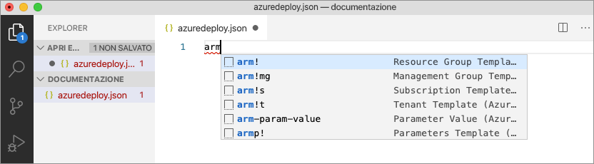

Questo frammento di codice crea i blocchi predefiniti di base per un modello di Resource Manager.

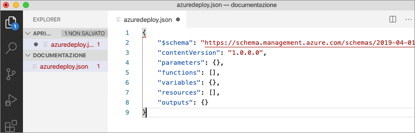

Si noti che la modalità di linguaggio di Visual Studio Code è cambiata da *JSON* a *Modello di Azure Resource Manager*. L'estensione include un server di linguaggio specifico per i modelli di Resource Manager che fornisce appositi servizi di convalida, completamento e altri servizi di linguaggio.

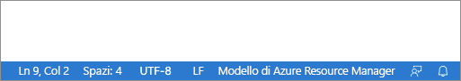

## <a name="add-an-azure-resource"></a>Aggiungere una risorsa di Azure

L'estensione include frammenti per molte risorse di Azure. Questi frammenti possono essere usati per aggiungere facilmente risorse alla distribuzione del modello.

Posizionare il cursore nel blocco **resources** del modello, digitare `storage` e selezionare il frammento *arm-storage*.

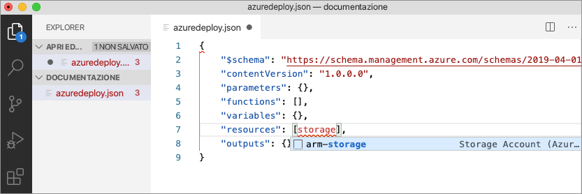

Questa azione aggiunge una risorsa di archiviazione al modello.

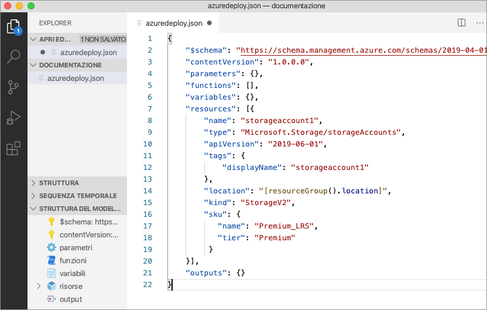

La chiave **tab** può essere usata per spostarsi tramite TAB tra le proprietà configurabili dell'account di archiviazione.


## <a name="completion-and-validation"></a>Completamento e convalida

Una delle funzionalità più avanzate dell'estensione è l'integrazione con gli schemi di Azure. Gli schemi di Azure forniscono all'estensione funzionalità di convalida e completamento con riconoscimento della risorsa. Modificare l'account di archiviazione per vedere il funzionamento di convalida e completamento. 

Aggiornare prima di tutto il tipo di account di archiviazione impostandolo su un valore non valido, ad esempio `megaStorage`. Si noti che questa azione genera un avviso che indica che `megaStorage` non è un valore valido.

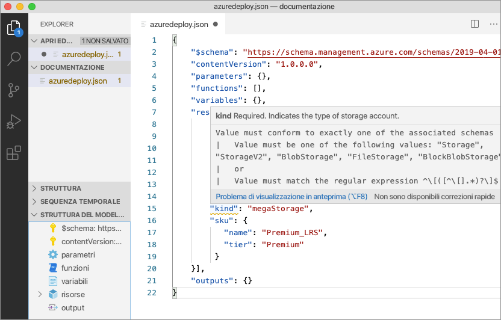

Per usare le funzionalità di completamento, rimuovere `megaStorage`, posizionare il cursore all'interno delle virgolette doppie e premere `ctrl` + `space`. Questa azione presenta un elenco di completamento di valori validi.

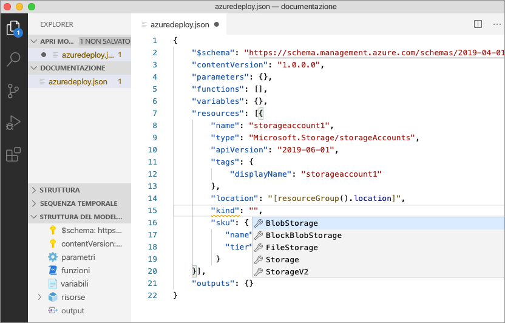

## <a name="add-template-parameters"></a>Aggiungere i parametri del modello

A questo punto, creare e usare un parametro per specificare il nome dell'account di archiviazione.

Posizionare il cursore nel blocco parameters, aggiungere un ritorno a capo, digitare `"`e quindi selezionare il frammento `new-parameter`. Questa azione aggiunge un parametro generico al modello.


Aggiornare il nome del parametro in `storageAccountName` e la descrizione in `Storage Account Name`.

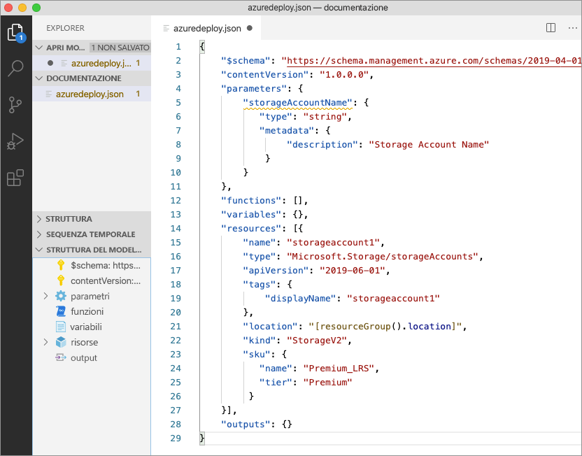

I nomi degli account di archiviazione di Azure possono essere composti da un minimo di 3 e un massimo di 24 caratteri. Aggiungere sia `minLength` che `maxLength` al parametro e specificare i valori appropriati.

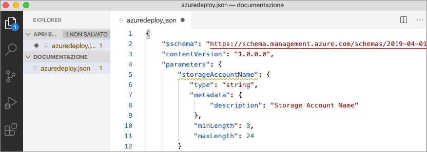

A questo punto, nella risorsa di archiviazione aggiornare la proprietà name in modo da usare il parametro. A questo scopo, rimuovere il nome corrente. Immettere una virgoletta doppia e una parentesi quadra aperta `[`, che produce un elenco di funzioni del modello di Resource Manager. Selezionare *parameters* nell'elenco. 


L'immissione di una virgoletta singola `'` all'interno delle parentesi tonde produce un elenco di tutti i parametri definiti nel modello, in questo caso *storageAccountName*. Selezionare il parametro.

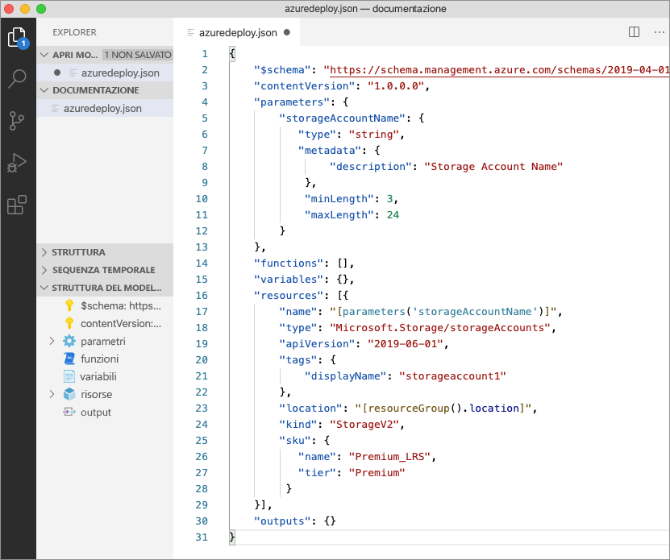

## <a name="create-a-parameter-file"></a>Creare un file di parametri

Un file di parametri del modello di Resource Manager consente di archiviare valori di parametri specifici dell'ambiente e di passarli come gruppo in fase di distribuzione. Ad esempio, è possibile avere un file di parametri con valori specifici di un ambiente di test e un altro per un ambiente di produzione.

L'estensione semplifica la creazione di un file di parametri dai modelli esistenti. A questo scopo, fare clic con il pulsante destro del mouse sul modello nell'editor di codice e scegliere `Select/Create Parameter File`.

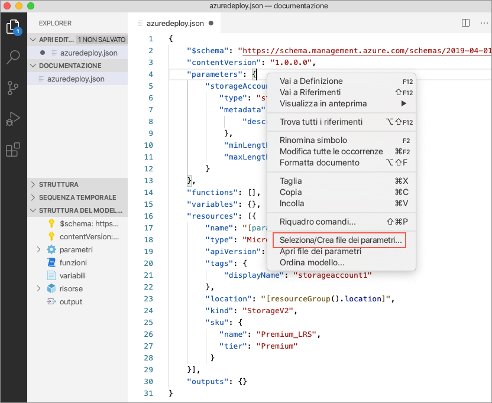

Selezionare `New` > `All Parameters` e quindi un nome e un percorso per il file dei parametri.

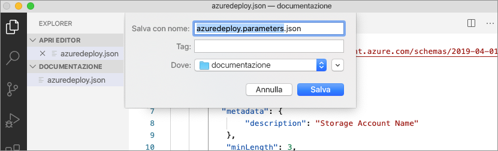

Questa azione crea un nuovo file di parametri e lo mappa al modello da cui è stato creato. È possibile visualizzare e modificare il mapping corrente tra modello e file di parametri sulla barra di stato di Visual Studio Code durante la sezione del modello.

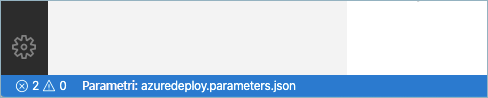

Ora che il file di parametri è stato mappato al modello, l'estensione convalida questi due elementi contemporaneamente. Per vedere la procedura di convalida, aggiungere un valore di due caratteri al parametro `storageAccountName` nel file di parametri e salvare il file.

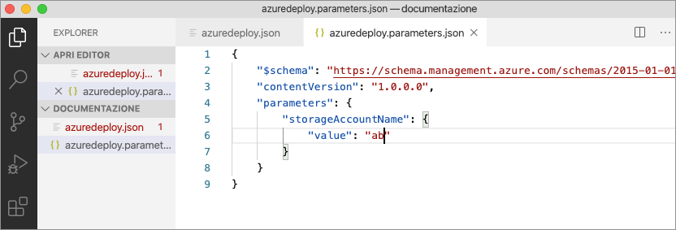

Tornare nel modello di Resource Manager. Come si può notare, è stato generato un errore indicante che il valore non soddisfa i criteri dei parametri.

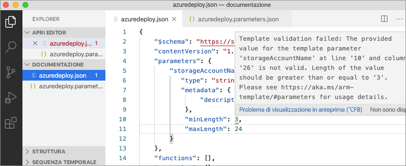

Specificare un valore appropriato, salvare il file e tornare nel modello. Come si può notare, l'errore del parametro è stato risolto.

## <a name="deploy-the-template"></a>Distribuire il modello

Aprire il terminale integrato di Visual Studio Code con la combinazione di tasti `ctrl` + ```` ` ```` e usare l'interfaccia della riga di comando di Azure o il modulo di Azure PowerShell per distribuire il modello.

# <a name="cli"></a>[Interfaccia della riga di comando](#tab/CLI)

```azurecli
az group create --name arm-vscode --location eastus

az deployment group create --resource-group arm-vscode --template-file azuredeploy.json --parameters azuredeploy.parameters.json
```

# <a name="powershell"></a>[PowerShell](#tab/PowerShell)

```azurepowershell
New-AzResourceGroup -Name arm-vscode -Location eastus

New-AzResourceGroupDeployment -ResourceGroupName arm-vscode -TemplateFile ./azuredeploy.json -TemplateParameterFile ./azuredeploy.parameters.json
```
---

## <a name="clean-up-resources"></a>Pulire le risorse

Quando le risorse non sono più necessarie, usare l'interfaccia della riga di comando di Azure o il modulo di Azure PowerShell per eliminare il gruppo di risorse dell'argomento di avvio rapido.

# <a name="cli"></a>[CLI](#tab/CLI)

```azurecli
az group delete --name arm-vscode
```

# <a name="powershell"></a>[PowerShell](#tab/PowerShell)

```azurepowershell
Remove-AzResourceGroup -Name arm-vscode
```
---

## <a name="next-steps"></a>Passaggi successivi

> [!div class="nextstepaction"]
> [Esercitazioni per principianti](./template-tutorial-create-first-template.md)
