# <a name="creating-and-deploying-azure-resource-groups-through-visual-studio"></a>Creazione e distribuzione di gruppi di risorse di Azure tramite Visual Studio

Con Visual Studio è possibile creare un progetto che distribuisce l'infrastruttura e il codice in Azure. Ad esempio, è possibile distribuire l'host Web, il sito Web e il codice per il sito Web. Visual Studio offre molti modelli di partenza per la distribuzione di scenari comuni. In questo articolo verrà distribuita un'app Web.  

Questo articolo illustra come usare [Visual Studio 2019 o versione successiva con i carichi di lavoro Sviluppo di Azure e ASP.NET installati](/visualstudio/install/install-visual-studio?view=vs-2019). Se si usa Visual Studio 2017, l'esperienza sarà molto simile.

## <a name="create-azure-resource-group-project"></a>Creare un progetto Gruppo di risorse di Azure

In questa sezione verrà creato un progetto Gruppo di risorse di Azure con un modello **App Web**.

1. In Visual Studio scegliere **File**, **Nuovo** e **Progetto**. Selezionare il modello di progetto **Gruppo di risorse di Azure** e **Avanti**.

    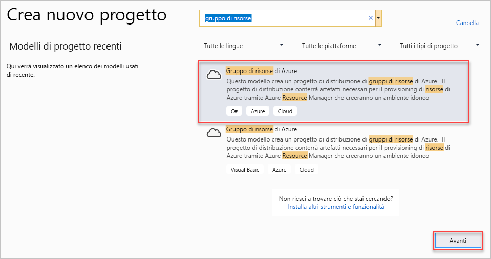

1. Assegnare un nome al progetto. Le altre impostazioni predefinite sono probabilmente corrette, ma controllarle per assicurarsi che siano appropriate per l'ambiente specifico. Al termine, scegliere **Crea**.

    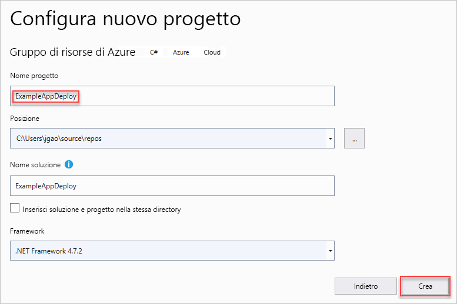

1. Scegliere il modello da distribuire in Gestione risorse di Azure. Si noti che sono disponibili molte opzioni diverse in base al tipo di progetto da distribuire. Per questo articolo scegliere il modello **App Web** e quindi **OK**.

    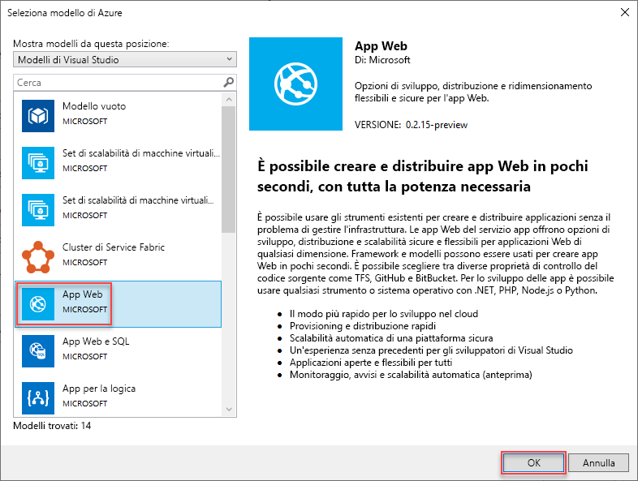

    Il modello scelto è solo un punto di partenza. È possibile aggiungere e rimuovere risorse per ottenere lo scenario desiderato.

1. Visual Studio crea un progetto di distribuzione di tipo Gruppo di risorse per l'app Web. Per visualizzare i file per il progetto, esaminare il nodo nel progetto di distribuzione.

    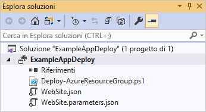

    Poiché è stato scelto il modello di app Web, vengono visualizzati i file seguenti:

   | Nome file | DESCRIZIONE |
   | --- | --- |
   | Deploy-AzureResourceGroup.ps1 |Script di PowerShell che esegue i comandi di PowerShell per la distribuzione in Azure Resource Manager. Visual Studio usa questo script di PowerShell per distribuire il modello. |
   | WebSite.json |Modello di Resource Manager che definisce l'infrastruttura da distribuire in Azure e parametri che si possono specificare durante la distribuzione. Definisce anche le dipendenze tra le risorse, per consentire a Resource Manager di distribuire le risorse nell'ordine corretto. |
   | WebSite.parameters.json |File di parametri contenente i valori necessari per il modello, che vengono passati per personalizzare ogni distribuzione. |

    Tutti i progetti di distribuzione di tipo Gruppo di risorse contengono questi file di base. Altri progetti potrebbero includere file aggiuntivi per supportare altre funzionalità.

## <a name="customize-resource-manager-template"></a>Personalizzare il modello di Resource Manager

È possibile personalizzare un progetto di distribuzione modificando il modello di Resource Manager che descrive le risorse da distribuire. Per informazioni sugli elementi del modello di Gestione risorse, vedere [Creazione di modelli di Gestione risorse di Azure](resource-group-authoring-templates.md).

1. Per lavorare al modello, aprire **WebSite.json**.

1. L'editor di Visual Studio offre strumenti utili per la modifica del modello di Resource Manager. La finestra **Struttura JSON** semplifica la visualizzazione degli elementi definiti nel modello.

   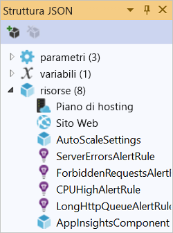

1. Selezionare un elemento nella struttura per passare a tale parte del modello.

   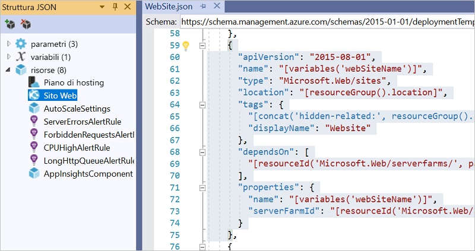

1. È possibile aggiungere una risorsa facendo clic sul pulsante **Aggiungi risorsa** nella parte superiore della finestra Struttura JSON oppure facendo clic con il pulsante destro del mouse su **risorse** e scegliendo **Aggiungi nuova risorsa**.

   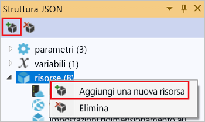

1. Selezionare **Account di archiviazione** e specificare un nome. Specificare un nome contenente non più di 11 caratteri costituiti solo da numeri e lettere minuscole.

   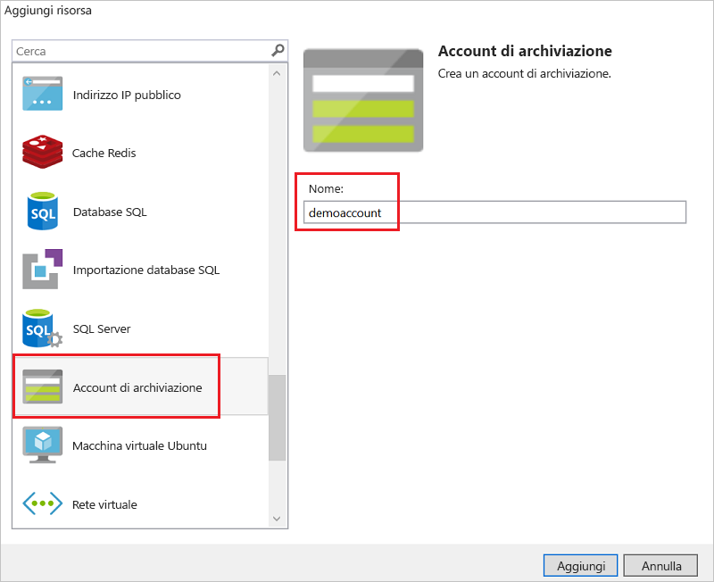

1. Si noti che non è stata aggiunta solo la risorsa, ma anche un parametro per il tipo di account di archiviazione e una variabile per il nome dell'account di archiviazione.

   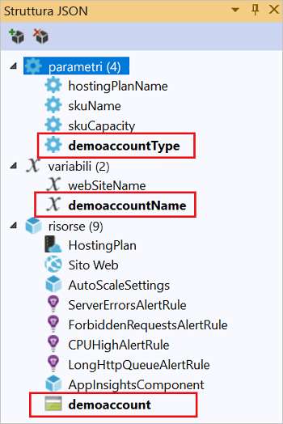

1. Il parametro per il tipo di account di archiviazione è preimpostato con i tipi consentiti e un tipo predefinito. È possibile usare questi valori o modificarli per il proprio scenario. Per impedire agli utenti di distribuire un account di archiviazione di tipo **Premium_LRS** tramite questo modello, rimuoverlo dai tipi consentiti.

   ```json
   "demoaccountType": {
     "type": "string",
     "defaultValue": "Standard_LRS",
     "allowedValues": [
       "Standard_LRS",
       "Standard_ZRS",
       "Standard_GRS",
       "Standard_RAGRS"
     ]
   }
   ```

1. Visual Studio fornisce anche il supporto per IntelliSense, per semplificare l'individuazione delle proprietà disponibili durante la modifica del modello. Ad esempio, per modificare le proprietà del piano di servizio app, passare alla risorsa **HostingPlan** e aggiungere un nuovo valore per **properties**. Si noti che IntelliSense mostra i valori disponibili e fornisce una descrizione di ogni valore.

   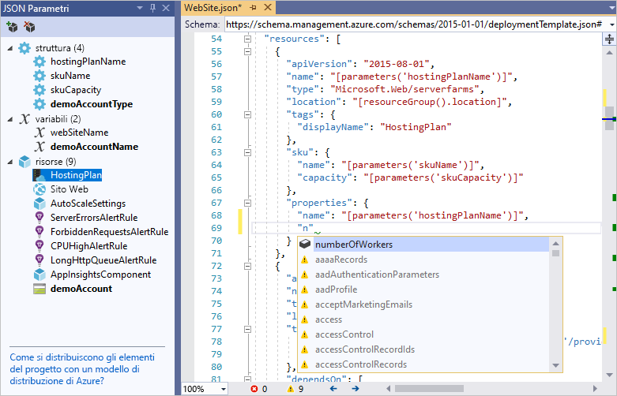

   È possibile impostare **numberOfWorkers** su 1 e quindi salvare il file.

   ```json
   "properties": {
     "name": "[parameters('hostingPlanName')]",
     "numberOfWorkers": 1
   }
   ```

1. Aprire il file **WebSite.parameters.json**. Si usa il file di parametri per passare valori durante la distribuzione, che consentono di personalizzare la risorsa da distribuire. Assegnare un nome al piano di hosting e salvare il file.

   ```json
   {
     "$schema": "https://schema.management.azure.com/schemas/2015-01-01/deploymentParameters.json#",
     "contentVersion": "1.0.0.0",
     "parameters": {
       "hostingPlanName": {
         "value": "demoHostPlan"
       }
     }
   }
   ```

## <a name="deploy-project-to-azure"></a>Distribuire il progetto in Azure

A questo punto si è pronti a distribuire il progetto in un gruppo di risorse.

Per impostazione predefinita, lo script di PowerShell (Deploy-AzureResourceGroup.ps1) nel progetto usa il modulo AzureRM. Se il modulo AzureRM è ancora installato e si vuole continuare a usarlo, è possibile usare questo script predefinito. Con questo script è possibile usare l'interfaccia di Visual Studio per distribuire la soluzione.

Tuttavia, se è stata eseguita la migrazione al nuovo [modulo Az](/powershell/azure/new-azureps-module-az), è necessario aggiungere un nuovo script al progetto. Per aggiungere uno script che usa il modulo Az, copiare lo script [Deploy-AzTemplate.ps1](https://github.com/Azure/azure-quickstart-templates/blob/master/Deploy-AzTemplate.ps1) e aggiungerlo al progetto. Per usare questo script per la distribuzione, è necessario eseguirlo dalla console di PowerShell, anziché tramite l'interfaccia di distribuzione di Visual Studio.

Entrambi gli approcci sono illustrati in questo argomento. In questo articolo lo script predefinito viene indicato come script del modulo AzureRM e il nuovo script come script del modulo Az.

### <a name="az-module-script"></a>Script del modulo Az

Per lo script del modulo Az aprire una console di PowerShell ed eseguire:

```powershell
.\Deploy-AzTemplate.ps1 -ArtifactStagingDirectory . -Location centralus -TemplateFile WebSite.json -TemplateParametersFile WebSite.parameters.json
```

### <a name="azurerm-module-script"></a>Script del modulo AzureRM

Per lo script del modulo AzureRM usare Visual Studio:

1. Dal menu di scelta rapida del nodo del progetto di distribuzione scegliere **Distribuisci** > **Nuovo**.

    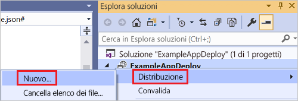

1. Verrà visualizzata la finestra di dialogo **Distribuisci in gruppo di risorse** . Nella casella di riepilogo a discesa **Gruppo di risorse** scegliere un gruppo di risorse esistente o crearne uno nuovo. Selezionare **Distribuisci**.

    

1. Nelle finestre **Output** viene visualizzato lo stato della distribuzione. Al termine della distribuzione, l'ultimo messaggio indica una distribuzione riuscita con un testo simile al seguente:

   ```output
   18:00:58 - Successfully deployed template 'website.json' to resource group 'ExampleAppDeploy'.
   ```

## <a name="view-deployed-resources"></a>Visualizzare le risorse distribuite

A questo punto è possibile esaminare i risultati.

1. In un browser aprire il [portale di Azure](https://portal.azure.com/) e accedere con il proprio account. Per visualizzare il gruppo di risorse, selezionare **Gruppi di risorse** e il gruppo di risorse in cui è stata effettuata la distribuzione.

1. Vengono visualizzate tutte le risorse distribuite. Si noti che il nome dell'account di archiviazione non è esattamente quello specificato quando si è aggiunta la risorsa. L'account di archiviazione deve essere univoco. Il modello aggiunge automaticamente una stringa di caratteri al nome specificato per creare un nome univoco.

    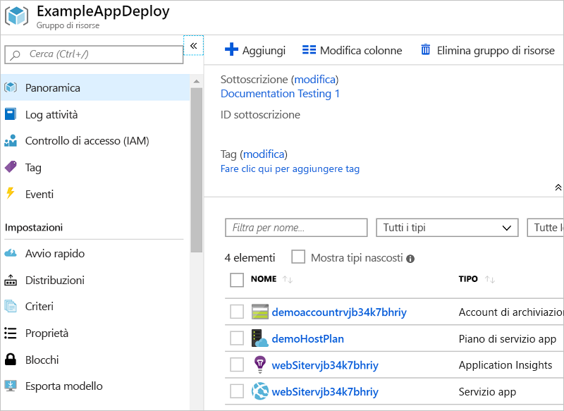

## <a name="add-code-to-project"></a>Aggiungere codice al progetto

A questo punto è stata distribuita l'infrastruttura per l'app, ma non è stato ancora distribuito il codice effettivo con il progetto.

1. Aggiungere un progetto alla soluzione Visual Studio. Fare clic con il pulsante destro del mouse sulla soluzione e scegliere **Aggiungi** > **Nuovo progetto**.

    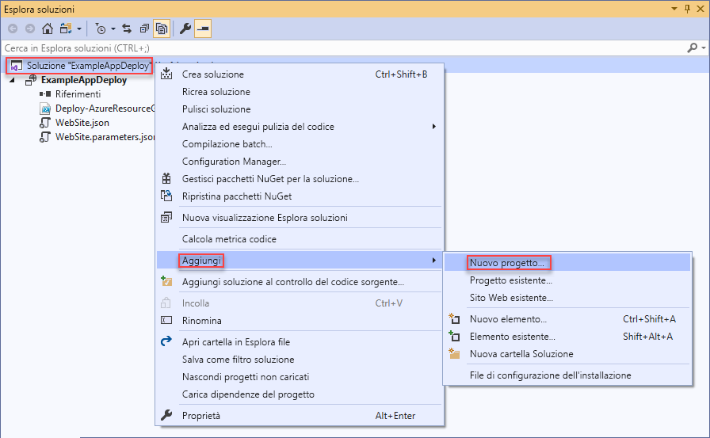

1. Aggiungere un'**Applicazione Web ASP.NET Core**.

    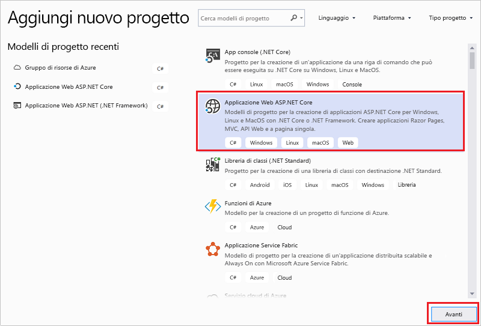

1. Assegnare un nome all'app Web e selezionare **Crea**.

    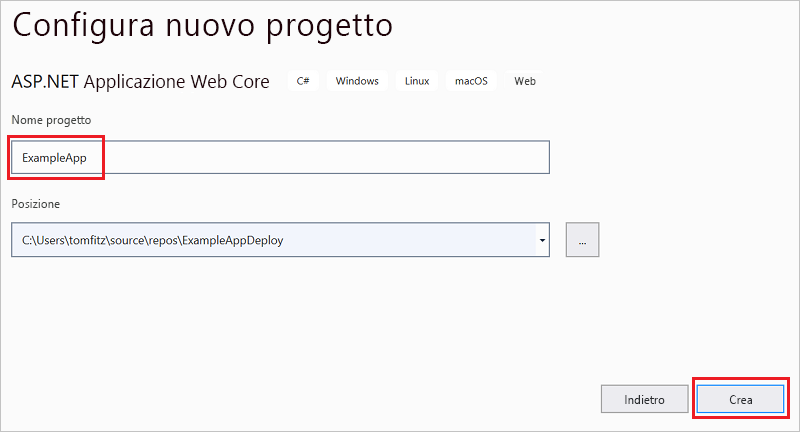

1. Selezionare **Applicazione Web** e **Crea**.

    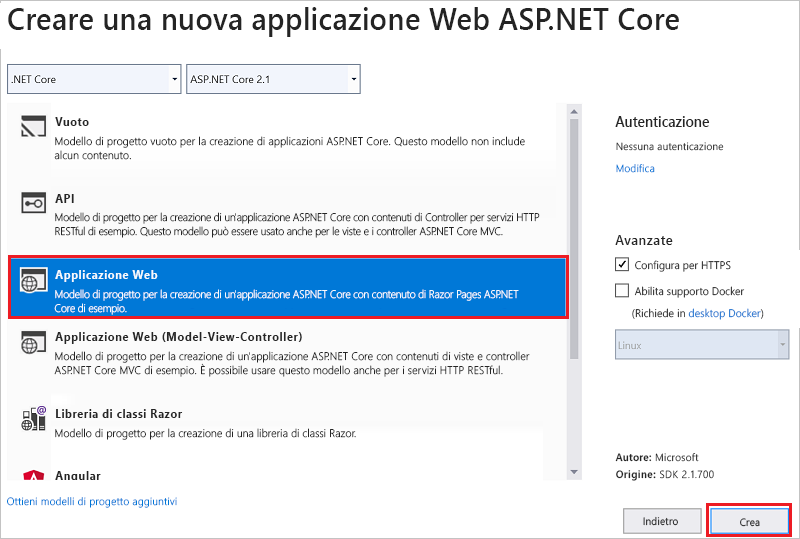

1. Dopo che Visual Studio ha creato l'app Web, vengono visualizzati entrambi i progetti nella soluzione.

    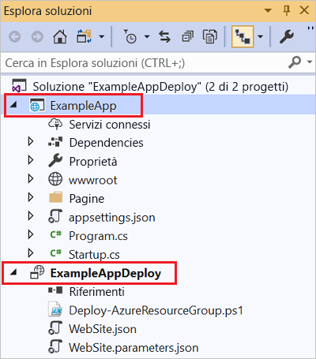

1. Ora è necessario verificare che il progetto del gruppo di risorse sia a conoscenza del nuovo progetto. Tornare al progetto del gruppo di risorse (ExampleAppDeploy). Fare clic con il pulsante destro del mouse su **Riferimenti** e scegliere **Aggiungi riferimento**.

    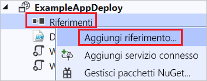

1. Selezionare il progetto dell'app Web creato.

   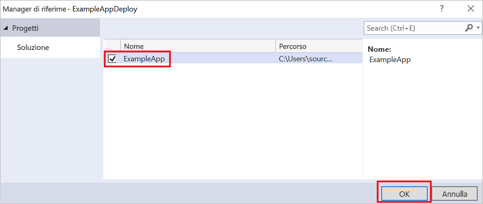

   Aggiungendo un riferimento si collega il progetto di app Web al progetto del gruppo di risorse e si impostano automaticamente alcune proprietà. Queste proprietà vengono visualizzate nella finestra **Proprietà** del riferimento. In **Include File Path** è disponibile il percorso in cui viene creato il pacchetto. Prendere nota della cartella (ExampleApp) e del file (package.zip). È necessario conoscere questi valori perché vengono specificati come parametri durante la distribuzioni dell'app.

   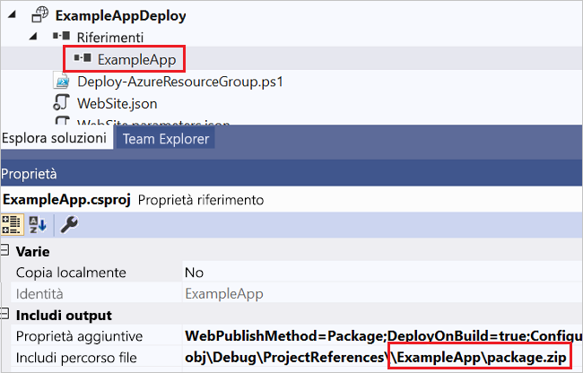

1. Tornare al modello (WebSite.json) e aggiungere una risorsa al modello.

    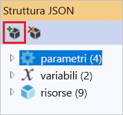

1. Questa volta selezionare **Distribuzione Web per app Web**. 

    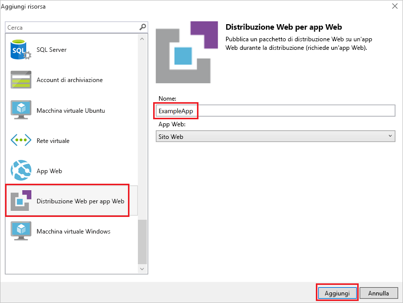

   Salvare il modello.

1. Esistono alcuni nuovi parametri nel modello, aggiunti nel passaggio precedente. Non è necessario specificare valori per **_artifactsLocation** o **_artifactsLocationSasToken**, perché vengono generati automaticamente. Tuttavia, è necessario impostare la cartella e il nome di file sul percorso che contiene il pacchetto di distribuzione. I nomi di questi parametri terminano con **PackageFolder** e **PackageFileName**. La prima parte del nome è il nome della risorsa di distribuzione Web aggiunta. In questo articolo i nomi sono **ExampleAppPackageFolder** ed **ExampleAppPackageFileName**. 

   Aprire **Website.parameters.json** e impostare questi parametri sui valori indicati nelle proprietà di riferimento. Impostare **ExampleAppPackageFolder** sul nome della cartella. Impostare **ExampleAppPackageFileName** sul nome del file ZIP.

   ```json
   {
     "$schema": "https://schema.management.azure.com/schemas/2015-01-01/deploymentParameters.json#",
     "contentVersion": "1.0.0.0",
     "parameters": {
       "hostingPlanName": {
         "value": "demoHostPlan"
       },
       "ExampleAppPackageFolder": {
         "value": "ExampleApp"
       },
       "ExampleAppPackageFileName": {
         "value": "package.zip"
       }
     }
   }
   ```

## <a name="deploy-code-with-infrastructure"></a>Distribuire il codice con l'infrastruttura

Dato che è stato aggiunto codice al progetto, la distribuzione è leggermente diversa in questo caso. Durante la distribuzione, gli artefatti per il progetto vengono posizionati in un'area di gestione temporanea accessibile per Resource Manager. Gli artefatti vengono posizionati in un account di archiviazione per la gestione temporanea.

### <a name="az-module-script"></a>Script del modulo Az

È necessario apportare una piccola modifica al modello se si usa lo script del modulo Az. Questo script aggiunge una barra al percorso degli artefatti, ma il modello non si aspetta tale barra. Aprire WebSite.json e individuare le proprietà per l'estensione MSDeploy. È presente una proprietà denominata **packageUri**. Rimuovere la barra tra il percorso degli artefatti e la cartella del pacchetto.

Il risultato dovrebbe essere simile al seguente:

```json
"packageUri": "[concat(parameters('_artifactsLocation'), parameters('ExampleAppPackageFolder'), '/', parameters('ExampleAppPackageFileName'), parameters('_artifactsLocationSasToken'))]",
```

Si noti che nell'esempio precedente non è presente alcuna `'/',` fra **parameters('_artifactsLocation')** e **parameters('ExampleAppPackageFolder')** .

Ricompilare il progetto. Con la compilazione del progetto ci si assicura che i file che è necessario distribuire vengano aggiunti alla cartella di gestione temporanea.

A questo punto, aprire una console di PowerShell ed eseguire:

```powershell
.\Deploy-AzTemplate.ps1 -ArtifactStagingDirectory .\bin\Debug\staging\ExampleAppDeploy -Location centralus -TemplateFile WebSite.json -TemplateParametersFile WebSite.parameters.json -UploadArtifacts -StorageAccountName <storage-account-name>
```

### <a name="azurerm-module-script"></a>Script del modulo AzureRM

Per lo script del modulo AzureRM usare Visual Studio:

1. Per la ridistribuzione, scegliere **Distribuisci** e il gruppo di risorse distribuito in precedenza.

    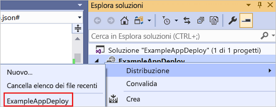

1. Selezionare l'account di archiviazione distribuito con questo gruppo di risorse per **Account di archiviazione elementi**.

   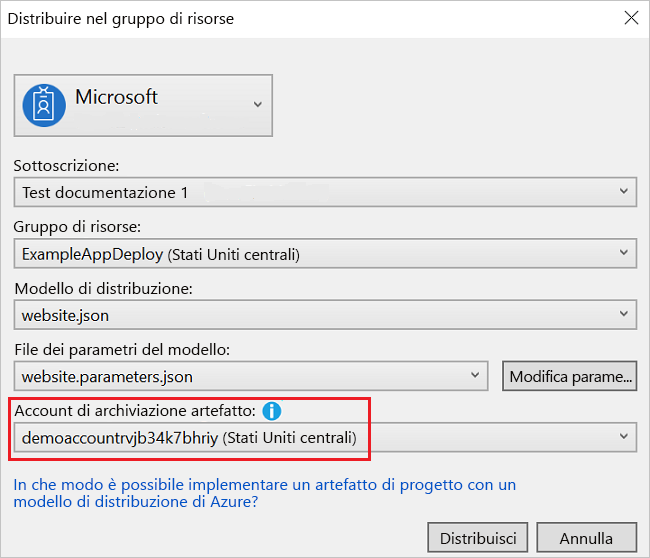

## <a name="view-web-app"></a>Visualizzare l'app Web

1. Al termine della distribuzione, selezionare l'app Web nel portale. Selezionare l'URL per passare al sito.

   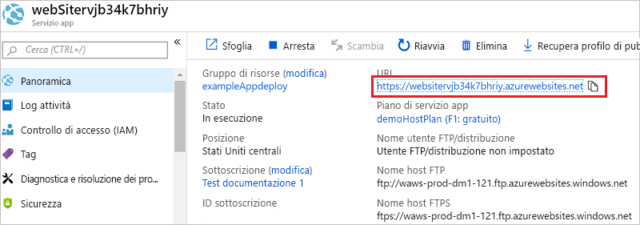

1. Si noti che l'app ASP.NET predefinita è stata distribuita correttamente.

   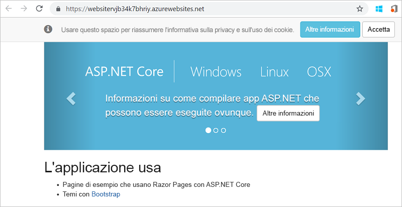

## <a name="add-operations-dashboard"></a>Aggiungere un dashboard operativo

Non si è limitati solo alle risorse disponibili tramite l'interfaccia di Visual Studio. È possibile personalizzare la distribuzione mediante l'aggiunta di una risorsa personalizzata al modello. Per visualizzare l'aggiunta di una risorsa, aggiungere un dashboard operativo per gestire la risorsa che è stata distribuita.

1. Aprire il file WebSite.json e aggiungere il codice JSON seguente dopo la risorsa dell'account di archiviazione ma prima della parentesi `]` di chiusura della sezione relativa alle risorse.

   ```json
    ,{
      "properties": {
        "lenses": {
          "0": {
            "order": 0,
            "parts": {
              "0": {
                "position": {
                  "x": 0,
                  "y": 0,
                  "colSpan": 4,
                  "rowSpan": 6
                },
                "metadata": {
                  "inputs": [
                    {
                      "name": "resourceGroup",
                      "isOptional": true
                    },
                    {
                      "name": "id",
                      "value": "[resourceGroup().id]",
                      "isOptional": true
                    }
                  ],
                  "type": "Extension/HubsExtension/PartType/ResourceGroupMapPinnedPart"
                }
              },
              "1": {
                "position": {
                  "x": 4,
                  "y": 0,
                  "rowSpan": 3,
                  "colSpan": 4
                },
                "metadata": {
                  "inputs": [],
                  "type": "Extension[azure]/HubsExtension/PartType/MarkdownPart",
                  "settings": {
                    "content": {
                      "settings": {
                        "content": "__Customizations__\n\nUse this dashboard to create and share the operational views of services critical to the application performing. To customize simply pin components to the dashboard and then publish when you're done. Others will see your changes when you publish and share the dashboard.\n\nYou can customize this text too. It supports plain text, __Markdown__, and even limited HTML like images  and <a href='https://azure.microsoft.com' target='_blank'>links</a> that open in a new tab.\n",
                        "title": "Operations",
                        "subtitle": "[resourceGroup().name]"
                      }
                    }
                  }
                }
              }
            }
          }
        },
        "metadata": {
          "model": {
            "timeRange": {
              "value": {
                "relative": {
                  "duration": 24,
                  "timeUnit": 1
                }
              },
              "type": "MsPortalFx.Composition.Configuration.ValueTypes.TimeRange"
            }
          }
        }
      },
      "apiVersion": "2015-08-01-preview",
      "name": "[concat('ARM-',resourceGroup().name)]",
      "type": "Microsoft.Portal/dashboards",
      "location": "[resourceGroup().location]",
      "tags": {
        "hidden-title": "[concat('OPS-',resourceGroup().name)]"
      }
    }
   ```

1. Ridistribuire il progetto.

1. Al termine della distribuzione, visualizzare il dashboard nel portale. Selezionare **Dashboard** e scegliere quello che è stato distribuito.

   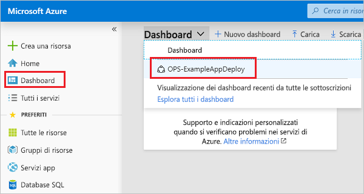

1. Viene visualizzato il dashboard personalizzato.

   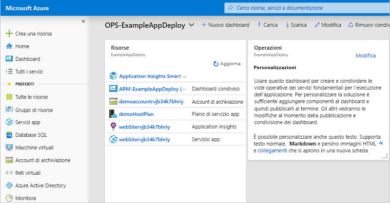

È possibile gestire l'accesso al dashboard usando i gruppi RBAC. È anche possibile personalizzare l'aspetto del dashboard dopo la distribuzione. Tuttavia, se si ridistribuisce il gruppo di risorse, il dashboard viene ripristinato allo stato predefinito nel modello. Per altre informazioni sulla creazione di dashboard, vedere [Creazione di dashboard di Azure a livello di codice](../azure-portal/azure-portal-dashboards-create-programmatically.md).

## <a name="clean-up-resources"></a>Pulire le risorse

Quando non sono più necessarie, eseguire la pulizia delle risorse di Azure distribuite eliminando il gruppo di risorse.

1. Nel portale di Azure selezionare **Gruppi di risorse** nel menu a sinistra.

1. Selezionare il nome del gruppo di risorse.

1. Selezionare **Elimina gruppo di risorse** nel menu in alto.

## <a name="next-steps"></a>Passaggi successivi

In questa guida introduttiva si è appreso come creare e distribuire modelli con Visual Studio. L'esercitazione successiva illustra come trovare le informazioni di riferimento sul modello per poter creare un account di archiviazione di Azure crittografato.

> [!div class="nextstepaction"]
> [Creare un account di archiviazione crittografato](./resource-manager-tutorial-create-encrypted-storage-accounts.md)
