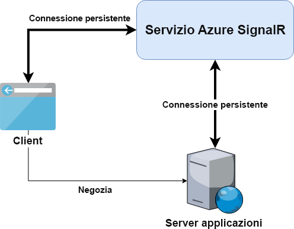

# <a name="azure-signalr-service-internals"></a>Elementi interni del Servizio Azure SignalR

Il servizio Azure SignalR è basato sul framework ASP.NET Core SignalR. Supporta anche ASP.NET SignalR come funzionalità di anteprima.

> Per supportare ASP.NET SignalR, il servizio Azure SignalR reimplementa il protocollo dati di ASP.NET SignalR sulla base del framework ASP.NET Core

È possibile eseguire facilmente la migrazione di un'applicazione ASP.NET Core SignalR locale per lavorare con il servizio SignalR, modificando poche righe di codice.

Il diagramma seguente descrive l'architettura tipica quando si usa il servizio SignalR con il server applicazioni.

Vengono illustrate anche le differenze rispetto all'applicazione ASP.NET Core SignalR self-hosted.



## <a name="server-connections"></a>Connessioni server

Il server applicazioni ASP.NET Core SignalR self-hosted è in ascolto e si connette direttamente ai client.

Con il servizio SignalR, il server applicazioni non accetterà più le connessioni client persistenti, ma:

1. Un endpoint `negotiate` viene esposto da Azure SignalR Service SDK per ogni hub.
1. Questo endpoint risponderà alle richieste di negoziazione del client e reindirizzerà i client al servizio SignalR.
1. I client verranno infine connessi al servizio SignalR.

Per altre informazioni, vedere [Connessioni client](#client-connections).

Dopo aver avviato il server applicazioni, 
- Per ASP.NET Core SignalR, Azure SignalR Service SDK apre 5 connessioni WebSocket al servizio SignalR per ogni hub. 
- Per ASP.NET SignalR, Azure SignalR Service SDK apre 5 connessioni WebSocket al servizio SignalR per ogni hub e una connessione WebSocket per ogni applicazione.

5 connessioni WebSocket è il valore predefinito che può essere modificato nella [configurazione](https://github.com/Azure/azure-signalr/blob/dev/docs/use-signalr-service.md#connectioncount).

I messaggi da e verso i client verranno inseriti tramite multiplexing in queste connessioni.

Queste connessioni al servizio SignalR non subiranno interruzioni. Se una connessione server viene interrotta per un problema di rete,
- Tutti i client gestiti da questa connessione server vengono disconnessi. Per altre informazioni, vedere [Trasmissione di dati tra client e server](#data-transmit-between-client-and-server).
- La connessione server viene automaticamente riavviata.

## <a name="client-connections"></a>Connessioni client

Quando si usa il servizio SignalR, i client si connettono al servizio SignalR invece che al server applicazioni.
Sono necessari due passaggi per stabilire connessioni permanenti tra il client e il servizio SignalR.

1. Il client invia una richiesta di negoziazione al server applicazioni. Con Azure SignalR Service SDK, il server applicazioni restituisce una risposta di reindirizzamento con l'URL e il token di accesso del servizio SignalR.

- Per ASP.NET Core SignalR, una risposta di reindirizzamento tipica è simile a:
    ```
    {
        "url":"https://test.service.signalr.net/client/?hub=chat&...",
        "accessToken":"<a typical JWT token>"
    }
    ```
- Per ASP.NET SignalR, una risposta di reindirizzamento tipica è simile a:
    ```
    {
        "ProtocolVersion":"2.0",
        "RedirectUrl":"https://test.service.signalr.net/aspnetclient",
        "AccessToken":"<a typical JWT token>"
    }
    ```

1. Dopo aver ricevuto la risposta di reindirizzamento, il client usa il nuovo URL e il nuovo token di accesso per avviare il normale processo di connessione al servizio SignalR.

Sono disponibili altre informazioni sui [protocolli di trasporto](https://github.com/aspnet/SignalR/blob/release/2.2/specs/TransportProtocols.md) di ASP.NET Core SignalR.

## <a name="data-transmit-between-client-and-server"></a>Trasmissione di dati tra client e server

Quando un client è connesso al servizio SignalR, il runtime del servizio troverà una connessione server per gestire questo client
- Questo passaggio viene eseguito solo una volta e consiste in un mapping uno-a-uno tra le connessioni client e server.
- Il mapping viene mantenuto nel servizio SignalR finché il client o il server si disconnette.

A questo punto, il server applicazioni riceve un evento con informazioni dal nuovo client. Una connessione logica al client viene creata nel server applicazioni. Viene stabilito il canale dati dal client al server applicazioni, tramite il servizio SignalR.

Il servizio SignalR trasmette i dati dal client al server applicazioni associato. I dati verranno inviati dal server applicazioni ai client mappati.

Come si può notare, il servizio Azure SignalR è essenzialmente un livello trasporto logico tra il server applicazioni e i client. Tutte le connessioni persistenti vengono scaricate sul servizio SignalR.
Il server applicazioni deve gestire solo la logica di business nella classe hub, non le connessioni client.