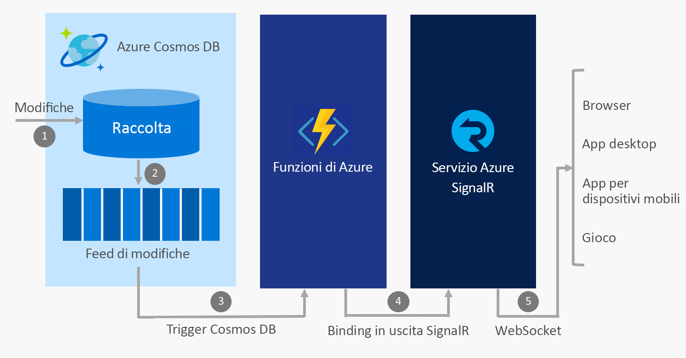

# Compilare app in tempo reale con Funzioni di Azure e il servizio Azure SignalR

Poiché il servizio Azure SignalR e Funzioni di Azure sono entrambi servizi completamente gestiti, a scalabilità elevata che consentono di concentrarsi sulla compilazione delle applicazioni anziché dover gestire l'infrastruttura, accade spesso di usare i due servizi insieme per fornire in tempo reale comunicazioni in un ambiente serverless.

## Integrare le comunicazioni in tempo reale con i servizi di Azure

Funzioni di Azure consente di scrivere codice in [diversi linguaggi](../azure-functions/supported-languages.md), tra cui JavaScript, C# e Java, che si attiva ogni volta che si verificano eventi nel cloud. Esempi di questi eventi:

* Richieste dei webhook e HTTP
* Timer periodici
* Eventi dei servizi di Azure, ad esempio:
    - Griglia di eventi
    - Hub eventi
    - Bus di servizio
    - Feed di modifiche di Cosmos DB
    - Archiviazione: BLOB e code
    - Connettori di App per la logica, ad esempio Salesforce e SQL Server

Usando Funzioni di Azure per integrare questi eventi con il servizio Azure SignalR, si ha la possibilità di inviare una notifica a migliaia di client ogni volta che si verificano eventi.

Alcuni scenari comuni per la messaggistica serverless in tempo reale implementabili con Funzioni di Azure e il servizio SignalR includono:

* Visualizzare i dati di telemetria dei dispositivi IoT su una mappa o un dashboard in tempo reale
* Aggiornare i dati in un'applicazione quando i documenti vengono aggiornati in Cosmos DB
* Inviare notifiche in-app quando nuovi ordini vengono creati in Salesforce

## Associazioni del servizio SignalR per Funzioni di Azure

Le associazioni del servizio SignalR per Funzioni di Azure consentono a un'app di Funzioni di Azure di pubblicare i messaggi ai client connessi al servizio SignalR. I client possono connettersi al servizio usando un client SDK di SignalR che è disponibile in .NET, JavaScript e Java e in altri linguaggi presto disponibili.

### Uno scenario di esempio

Un esempio di come usare le associazioni del servizio SignalR è usare Funzioni di Azure per integrarlo con Azure Cosmos DB e il servizio SignalR per inviare i messaggi in tempo reale quando i nuovi eventi vengono visualizzati in un feed di modifiche di Cosmos DB.

1. Viene apportata una modifica in una raccolta di Cosmos DB
2. L'evento di modifica viene propagato al feed di modifiche di Cosmos DB
3. Funzioni di Azure viene attivato dall'evento di modifica tramite il trigger di Cosmos DB
4. L'associazione di output per il servizio SignalR pubblica un messaggio per il servizio SignalR
5. Il servizio SignalR pubblica il messaggio per tutti i client connessi

### Autenticazione e utenti

Il servizio SignalR consente di trasmettere messaggi a tutti i client o solo a un sottoinsieme di client, ad esempio quelli che appartengono a un singolo utente. Le associazioni del servizio SignalR per Funzioni di Azure possono essere combinate con l'autenticazione del servizio app per autenticare gli utenti con i provider, ad esempio Azure Active Directory, Facebook e Twitter. È quindi possibile inviare messaggi direttamente a questi utenti autenticati.

## Passaggi successivi

In questo articolo viene fornita una panoramica su come usare Funzioni di Azure con il servizio SignalR per abilitare una vasta gamma di scenari di messaggistica serverless in tempo reale. Per altre informazioni, seguire una di queste guide introduttive.

* [Guida introduttiva al servizio Azure SignalR serverless - C#](signalr-quickstart-azure-functions-csharp.md)
* [Guida introduttiva al servizio Azure SignalR serverless - JavaScript](signalr-quickstart-azure-functions-javascript.md)

