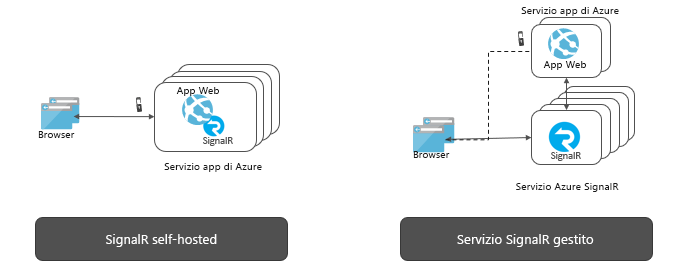

# Informazioni sul servizio Azure SignalR

Il servizio Azure SignalR semplifica il processo di aggiunta di funzionalità Web in tempo reale alle applicazioni tramite HTTP. Questa funzionalità in tempo reale consente al servizio di eseguire il push degli aggiornamenti di contenuto ai client connessi, ad esempio un'applicazione Web o per dispositivi mobili a pagina singola. Di conseguenza, i client vengono aggiornati senza che sia necessario eseguire il polling del server o inviare nuove richieste HTTP per gli aggiornamenti.

Questo articolo offre una panoramica del servizio Azure SignalR.

## Tipi di utilizzo del servizio Azure SignalR

Per gli scenari che richiedono il push dei dati dal server al client in tempo reale è possibile usare il servizio Azure SignalR.

Anche per le funzionalità in tempo reale tradizionali che spesso richiedono il polling dal server si può usare il servizio Azure SignalR.

Il servizio Azure SignalR è stato usato in un'ampia gamma di settori per qualsiasi tipo di applicazione che richiede aggiornamenti del contenuto in tempo reale. Di seguito sono elencati alcuni esempi per i quali è utile usare il servizio Azure SignalR:

* **Aggiornamenti dei dati ad alta frequenza:** giochi, voti, polling, aste.
* **Dashboard e monitoraggio:** dashboard aziendale, dati del mercato finanziario, aggiornamento immediato delle vendite, classifica di giochi multiplayer e monitoraggio IoT.
* **Chat:** live chat room, chatbot, supporto tecnico online, assistente per acquisti in tempo reale, messenger, chat nel gioco e così via.
* **Posizione in tempo reale sulla mappa:** rilevamento logistico, verifica dello stato di spedizione, aggiornamenti dello stato di consegna, app GPS.
* **Annunci personalizzati in tempo reale:** push di annunci e offerte personalizzate in tempo reale, annunci pubblicitari interattivi.
* **App per la collaborazione:** app per la creazione condivisa, app per lavagne e software per riunioni in team.
* **Notifiche push:** social network, posta elettronica, giochi, avvisi di viaggio.
* **Trasmissione in tempo reale:** trasmissioni audio/video in diretta, sottotitolatura in diretta, traduzione, trasmissione di eventi/notizie.
* **IoT e i dispositivi connessi:** metriche IoT in tempo reale, controllo remoto, stato in tempo reale e rilevamento della posizione.
* **Automazione:** trigger in tempo reale da eventi upstream.

## Quali sono i vantaggi dell'uso del servizio Azure SignalR?

**Basato su standard:**

SignalR offre un'astrazione su diverse tecniche usate per la compilazione di applicazioni Web in tempo reale. I [WebSocket](https://wikipedia.org/wiki/WebSocket) costituiscono il trasporto ottimale, ma quando non sono disponibili altre opzioni vengono usate altre tecniche come [Server-Sent Events (SSE)](https://wikipedia.org/wiki/Server-sent_events) e il polling prolungato. SignalR rileva e inizializza automaticamente il trasporto appropriato in base alle funzionalità supportate nel server e nel client.

**Supporto nativo di ASP.NET Core:**

Il servizio SignalR offre un'esperienza di programmazione nativa con ASP.NET Core e ASP.NET. Lo sviluppo di nuove applicazioni SignalR con il servizio SignalR o la migrazione da applicazioni basate su SignalR esistenti al servizio SignalR richiede un impegno minimo.
Il servizio SignalR supporta anche la nuova funzionalità di ASP.NET Core, ovvero Blazor lato server.

**Ampio supporto di client:**

Il servizio SignalR supporta un'ampia gamma di client, ad esempio Web browser e browser per dispositivi mobili, app desktop, app per dispositivi mobili, processi del server, dispositivi IoT e console di gioco. Il servizio SignalR offre SDK in diverse lingue. Oltre agli SDK nativi per ASP.NET Core o ASP.NET C#, il servizio SignalR offre anche JavaScript Client SDK per abilitare i client Web e molti framework JavaScript. Java Client SDK è supportato anche per le applicazioni Java, incluse le app native per Android. Il servizio SignalR supporta l'API REST e la modalità serverless tramite le integrazioni con Funzioni di Azure e Griglia di eventi.

**Gestire le connessioni client su larga scala:**

Il servizio SignalR è progettato per applicazioni in tempo reale su larga scala. Il servizio SignalR consente l'interazione di più istanze per poter gestire fino a milioni di connessioni client. Il servizio supporta anche più aree globali per il partizionamento orizzontale, la disponibilità elevata o il ripristino di emergenza.

**Rimuovere il carico di lavoro per il self-hosting di SignalR:**

Rispetto alle applicazioni self-hosted di SignalR, il passaggio al servizio SignalR rimuoverà la necessità di gestire piani di backup per tenere conto di scalabilità e connessioni client. Il servizio completamente gestito, inoltre, semplifica le applicazioni Web e consente di risparmiare sui costi di hosting. Il servizio SignalR offre una portata globale e data center e rete di altissimo livello, può essere esteso fino a supportare milioni di connessioni, garantisce il contratto di servizio e soddisfa allo stesso tempo i requisiti standard di conformità e sicurezza di Azure.

**API avanzate per modelli di messaggistica diversi:**

Il servizio SignalR consente al server di inviare messaggi a una determinata connessione, a tutte le connessioni o a un subset di connessioni che appartengono a un utente specifico o sono state inserite in un gruppo arbitrario.

## Modalità di utilizzo del servizio Azure SignalR

Esistono molti modi diversi per programmare con il servizio Azure SignalR, come alcuni degli esempi elencati di seguito:

- **[Ridimensionare un'app ASP.NET Core SignalR](signalr-concept-scale-aspnet-core.md)** : integrare il servizio Azure SignalR in un'applicazione ASP.NET Core SignalR per la scalabilità orizzontale fino a centinaia di migliaia di connessioni.
- **[Creare app in tempo reale senza server ](signalr-concept-azure-functions.md)** : usare l'integrazione delle Funzioni di Azure con il servizio Azure SignalR per creare applicazioni in tempo reale senza server in linguaggi come JavaScript, C# e Java.
- **[Inviare messaggi dal server ai client tramite l'API REST](https://github.com/Azure/azure-signalr/blob/dev/docs/rest-api.md)** : il servizio Azure SignalR offre l'API REST per consentire alle applicazioni di inviare messaggi ai client connessi con il servizio SignalR, in qualsiasi linguaggio di programmazione che supporta REST.
