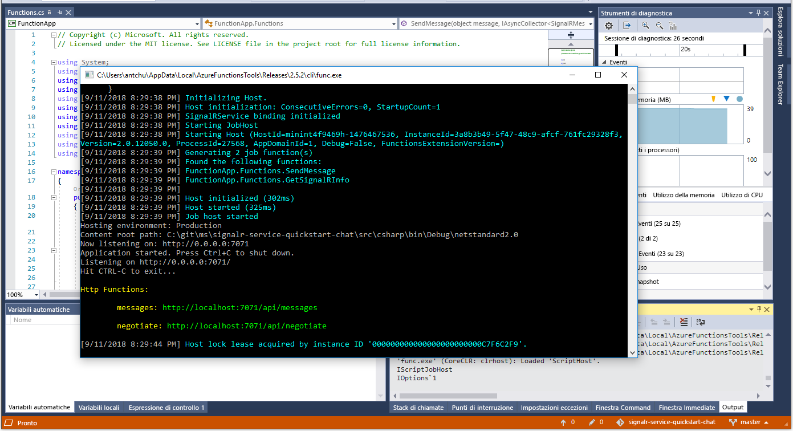

# <a name="quickstart-create-a-chat-room-with-azure-functions-and-signalr-service-using-c"></a>Guida introduttiva: Creare una chat room con Funzioni di Azure e il servizio SignalR usando C\#

Il servizio Azure SignalR consente di aggiungere facilmente funzionalità in tempo reale all'applicazione. Funzioni di Azure è una piattaforma serverless che consente di eseguire il codice senza gestire alcuna infrastruttura. Questa guida introduttiva fornisce informazioni su come usare il servizio SignalR e le funzioni per creare un'applicazione serverless di chat in tempo reale.

## <a name="prerequisites"></a>Prerequisiti

Se Visual Studio 2017 non è ancora installato, è possibile scaricare e usare la versione **gratuita** [Visual Studio 2017 Community Edition](https://www.visualstudio.com/downloads/). Durante l'installazione di Visual Studio abilitare **Sviluppo di Azure**.

Si può anche eseguire questa esercitazione dalla riga di comando (macOS, Windows o Linux) usando [Azure Functions Core Tools (v2)](https://github.com/Azure/azure-functions-core-tools#installing), [.NET Core SDK](https://dotnet.microsoft.com/download) e l'editor di codice preferito.

[!INCLUDE [quickstarts-free-trial-note](../../includes/quickstarts-free-trial-note.md)]

## <a name="log-in-to-azure"></a>Accedere ad Azure

Accedere al portale di Azure all'indirizzo <https://portal.azure.com/> con il proprio account Azure.

[!INCLUDE [Create instance](includes/signalr-quickstart-create-instance.md)]

[!INCLUDE [Clone application](includes/signalr-quickstart-clone-application.md)]

## <a name="configure-and-run-the-azure-function-app"></a>Configurare ed eseguire l'app per le funzioni di Azure

1. Avviare Visual Studio o un altro editor di codice e aprire la soluzione nella cartella *chat\src\csharp* del repository clonato.

1. Nel browser in cui è aperto il portale di Azure, verificare che l'istanza del servizio SignalR distribuita in precedenza sia stata creata correttamente eseguendo una ricerca del nome nella casella di ricerca nella parte superiore del portale. Selezionare l'istanza per aprirla.

    

1. Selezionare **Chiavi** per visualizzare le stringhe di connessione per l'istanza del servizio SignalR.

1. Selezionare e copiare la stringa di connessione primaria.

1. In Visual Studio, in Esplora soluzioni rinominare *local.settings.sample.json* in *local.settings.json*.

1. In **local.settings.json**, incollare la stringa di connessione nel valore dell'impostazione **AzureSignalRConnectionString**. Salvare il file.

1. Aprire **Functions.cs**. In questa app per le funzioni sono presenti due funzioni attivate tramite HTTP:

    - **GetSignalRInfo**: usa l'associazione di input *SignalRConnectionInfo* per generare e restituire informazioni di connessione valide.
    - **SendMessage**: riceve un messaggio di chat nel corpo della richiesta e usa l'associazione di output *SignalR* per trasmettere il messaggio a tutte le applicazioni client connesse.

1. Usare una delle opzioni seguenti per avviare l'app Funzioni di Azure in locale.

    - **Visual Studio**: Nel menu *Debug* selezionare *Avvia debug* per eseguire l'applicazione.

        

    - **Riga di comando**: eseguire il comando seguente per avviare l'host di funzioni.

        ```bash
        func start
        ```

[!INCLUDE [Run web application](includes/signalr-quickstart-run-web-application.md)]

[!INCLUDE [Cleanup](includes/signalr-quickstart-cleanup.md)]

## <a name="next-steps"></a>Passaggi successivi

In questa guida di avvio rapido è stata creata ed eseguita un'applicazione serverless in tempo reale in Visual Studio. Seguono altre informazioni su come sviluppare e distribuire le Funzioni di Azure con Visual Studio.

> [!div class="nextstepaction"]
> [Sviluppare Funzioni di Azure con Visual Studio](../azure-functions/functions-develop-vs.md)