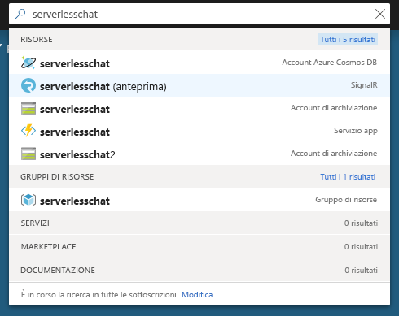
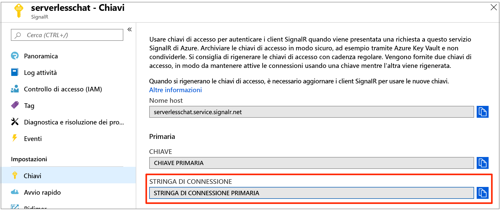

# <a name="quickstart-create-a-chat-room-with-azure-functions-and-signalr-service-using-python"></a>Guida introduttiva: Creare una chat room con Funzioni di Azure e il servizio SignalR usando Python

Il servizio Azure SignalR consente di aggiungere facilmente funzionalità in tempo reale all'applicazione. Funzioni di Azure è una piattaforma serverless che consente di eseguire il codice senza gestire alcuna infrastruttura. Questa guida introduttiva fornisce informazioni su come usare il servizio SignalR e le funzioni per creare un'applicazione serverless di chat in tempo reale.

## <a name="prerequisites"></a>Prerequisiti

Questa guida introduttiva può essere eseguita su macOS, Windows o Linux.

Assicurarsi di disporre di un editor di codice installato, ad esempio [Visual Studio Code](https://code.visualstudio.com/).

Installare [Azure Functions Core Tools (v2)](https://github.com/Azure/azure-functions-core-tools#installing) (versione 2.7.1505 o successiva) per eseguire le app per le funzioni di Azure Python in locale.

Funzioni di Azure richiede [Python 3.6](https://www.python.org/downloads/).

Per installare le estensioni, gli strumenti di base di Funzioni di Azure richiedono attualmente che sia installato [.NET Core SDK](https://www.microsoft.com/net/download). Non è tuttavia necessaria alcuna conoscenza di .NET per creare app per le funzioni di Azure Python.

[!INCLUDE [quickstarts-free-trial-note](../../includes/quickstarts-free-trial-note.md)]

## <a name="log-in-to-azure"></a>Accedere ad Azure

Accedere al portale di Azure all'indirizzo <https://portal.azure.com/> con il proprio account Azure.

[!INCLUDE [Create instance](includes/signalr-quickstart-create-instance.md)]

[!INCLUDE [Clone application](includes/signalr-quickstart-clone-application.md)]

## <a name="configure-and-run-the-azure-function-app"></a>Configurare ed eseguire l'app per le funzioni di Azure

1. Nel browser in cui è aperto il portale di Azure, verificare che l'istanza del servizio SignalR distribuita in precedenza sia stata creata correttamente eseguendo una ricerca del nome nella casella di ricerca nella parte superiore del portale. Selezionare l'istanza per aprirla.

    

1. Selezionare **Chiavi** per visualizzare le stringhe di connessione per l'istanza del servizio SignalR.

1. Selezionare e copiare la stringa di connessione primaria.

    

1. Nell'editor di codice aprire la cartella *src/chat/python* nel repository clonato.

1. Per sviluppare e testare localmente le funzioni di Python, è necessario lavorare in un ambiente Python 3.6. Eseguire i comandi seguenti per creare e attivare un ambiente virtuale denominato `.venv`.

    **Linux o macOS:**

    ```bash
    python3.6 -m venv .venv
    source .venv/bin/activate
    ```

    **Windows:**

    ```powershell
    py -3.6 -m venv .venv
    .venv\scripts\activate
    ```

1. Rinominare *local.settings.sample.json* in *local.settings.json*.

1. In **local.settings.json**, incollare la stringa di connessione nel valore dell'impostazione **AzureSignalRConnectionString**. Salvare il file.

1. Le funzioni Python sono organizzate in cartelle. In ogni cartella ci sono due file: *function.json* definisce le associazioni usate nella funzione e *\_\_init\_\_.py* è il corpo della funzione. In questa app per le funzioni sono presenti due funzioni attivate tramite HTTP:

    - **negotiate**: usa l'associazione di input *SignalRConnectionInfo* per generare e restituire informazioni di connessione valide.
    - **messages**: riceve un messaggio di chat nel corpo della richiesta e usa l'associazione di output *SignalR* per trasmettere il messaggio a tutte le applicazioni client connesse.

1. Nel terminale assicurarsi di aver selezionato la cartella *src/chat/python*. Usare gli strumenti di base di Funzioni di Azure per installare le estensioni necessarie per eseguire l'app.

    ```bash
    func extensions install
    ```

1. Eseguire l'app per le funzioni.

    ```bash
    func start
    ```

    

[!INCLUDE [Run web application](includes/signalr-quickstart-run-web-application.md)]

[!INCLUDE [Cleanup](includes/signalr-quickstart-cleanup.md)]

## <a name="next-steps"></a>Passaggi successivi

In questo avvio reale è stata creata ed eseguita un'applicazione serverless in tempo reale in VS Code. Successivamente, si riceveranno altre informazioni su come distribuire le funzioni di Azure da VS Code.

> [!div class="nextstepaction"]
> [Distribuire le funzioni di Azure con VS Code](https://code.visualstudio.com/tutorials/functions-extension/getting-started)