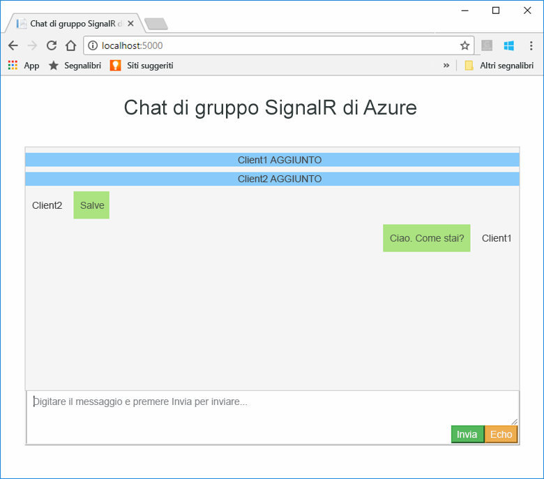
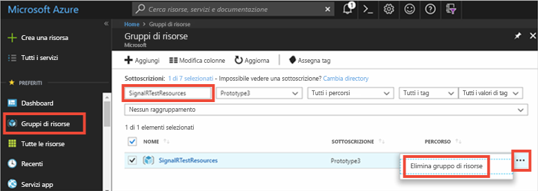

# <a name="quickstart-create-a-chat-room-with-signalr-service"></a>Guida introduttiva: Creare una chat room con il servizio SignalR


Il servizio Azure SignalR è un servizio di Azure che consente agli sviluppatori di compilare facilmente applicazioni Web con funzionalità in tempo reale. Questo servizio è basato su [SignalR per ASP.NET Core 2.0](https://docs.microsoft.com/aspnet/core/signalr/introduction).

Questo articolo illustra come iniziare a usare il servizio Azure SignalR. In questa guida introduttiva verrà creata un'applicazione di chat tramite un'app Web ASP.NET Core MVC. Questa app stabilirà una connessione alla risorsa del servizio Azure SignalR per abilitare gli aggiornamenti dei contenuti in tempo reale. L'applicazione Web sarà ospitata in locale e verrà stabilita la connessione con più browser client. Ogni client sarà in grado di eseguire il push degli aggiornamenti dei contenuti a tutti gli altri client. 


Per completare i passaggi descritti in questa guida introduttiva è possibile usare qualsiasi editor di codice. Tuttavia, [Visual Studio Code](https://code.visualstudio.com/) è un'ottima scelta per le piattaforme Windows, macOS e Linux.

Il codice per questa esercitazione è disponibile per il download nel [repository GitHub AzureSignalR-samples](https://github.com/aspnet/AzureSignalR-samples/tree/master/samples/ChatRoom).  Le risorse di Azure usate in questa guida introduttiva possono essere create anche con lo [script per la creazione di un servizio SignalR](scripts/signalr-cli-create-service.md).



[!INCLUDE [quickstarts-free-trial-note](../../includes/quickstarts-free-trial-note.md)]


## <a name="prerequisites"></a>Prerequisiti

* Installare [.NET Core SDK](https://www.microsoft.com/net/download/windows).
* Scaricare o clonare il repository GitHub [AzureSignalR-sample](https://github.com/aspnet/AzureSignalR-samples). 

## <a name="create-an-azure-signalr-resource"></a>Creare una risorsa di Azure SignalR

[!INCLUDE [azure-signalr-create](../../includes/signalr-create.md)]

## <a name="create-an-aspnet-core-web-app"></a>Creare un'app Web ASP.NET Core

In questa sezione verrà usata l'[interfaccia della riga di comando di .NET Core](https://docs.microsoft.com/dotnet/core/tools/) per creare un nuovo progetto di app Web ASP.NET Core MVC. Il vantaggio di usare l'interfaccia della riga di comando di .NET Core rispetto a Visual Studio è che è disponibile tra le piattaforme Windows, macOS e Linux. 

1. Creare una nuova cartella per il progetto. In questa guida introduttiva viene usata la cartella *E:\Testing\chattest*.

2. Nella nuova cartella eseguire il comando seguente per creare un nuovo progetto di app Web ASP.NET Core MVC:

        dotnet new mvc


## <a name="add-secret-manager-to-the-project"></a>Aggiungere Secret Manager al progetto

In questa sezione verrà aggiunto lo [strumento Secret Manager](https://docs.microsoft.com/aspnet/core/security/app-secrets) al progetto. Lo strumento Secret Manager archivia i dati sensibili per operazioni di sviluppo al di fuori dell'albero del progetto. Questo approccio contribuisce a impedire la condivisione accidentale dei segreti dell'app all'interno del codice sorgente.

1. Aprire il file con estensione *csproj*. Aggiungere un elemento `DotNetCliToolReference` per includere *Microsoft.Extensions.SecretManager.Tools*. Aggiungere anche un elemento `UserSecretsId` come illustrato di seguito e salvare il file.

    *chattest.csproj:*

    ```xml
    <Project Sdk="Microsoft.NET.Sdk.Web">
    <PropertyGroup>
        <TargetFramework>netcoreapp2.0</TargetFramework>
        <UserSecretsId>SignalRChatRoomEx</UserSecretsId>
    </PropertyGroup>
    <ItemGroup>
        <PackageReference Include="Microsoft.AspNetCore.All" Version="2.0.0" />
    </ItemGroup>
    <ItemGroup>
        <DotNetCliToolReference Include="Microsoft.VisualStudio.Web.CodeGeneration.Tools" Version="2.0.0" />
        <DotNetCliToolReference Include="Microsoft.Extensions.SecretManager.Tools" Version="2.0.0" />
    </ItemGroup>
    </Project>    
    ```

## <a name="add-azure-signalr-to-the-web-app"></a>Aggiungere Azure SignalR all'app Web

1. Aggiungere un riferimento al pacchetto NuGet `Microsoft.Azure.SignalR` eseguendo il comando seguente:

        dotnet add package Microsoft.Azure.SignalR -v 1.0.0-*

2. Eseguire il comando seguente per ripristinare i pacchetti per il progetto.

        dotnet restore

3. Aggiungere un segreto denominato *Azure:SignalR:ConnectionString* a Secret Manager. 

    Questo segreto conterrà la stringa di connessione per accedere alla risorsa del servizio SignalR. *Azure:SignalR:ConnectionString* è la chiave di configurazione predefinita che SignalR cerca per stabilire una connessione. Sostituire il valore nel comando seguente con la stringa di connessione per la risorsa del servizio SignalR.

    Questo comando deve essere eseguito nella stessa directory del file con estensione *csproj*.

    ```
    dotnet user-secrets set Azure:SignalR:ConnectionString "Endpoint=<Your endpoint>;AccessKey=<Your access key>;"    
    ```

    Secret Manager verrà usato solo per il test dell'app Web mentre è ospitato in locale. In un'esercitazione successiva si distribuirà l'app Web di chat in Azure. Dopo la distribuzione dell'app Web in Azure, sarà possibile usare un'impostazione dell'applicazione invece di archiviare la stringa di connessione con Secret Manager.

    È possibile accedere al segreto con l'API di configurazione. Con l'API di configurazione è possibile usare i due punti (:) nel nome di configurazione in tutte le piattaforme supportate. Vedere [configurazione dall'ambiente](https://docs.microsoft.com/aspnet/core/fundamentals/configuration/index?tabs=basicconfiguration&view=aspnetcore-2.0). 


4. Aprire *Startup.cs* e aggiornare il metodo `ConfigureServices` per usare il servizio Azure SignalR chiamando il metodo `services.AddSignalR().AddAzureSignalR()`:

    ```csharp
    public void ConfigureServices(IServiceCollection services)
    {
        services.AddMvc();
        services.AddSignalR().AddAzureSignalR();
    }
    ```

    Non passando un parametro a `AddAzureSignalR()`, questo codice usa la chiave di configurazione predefinita, *Azure:SignalR:ConnectionString*, per la stringa di connessione della risorsa del servizio SignalR.

5. Sempre in *Startup.cs*, aggiornare il metodo `Configure` sostituendo la chiamata a `app.UseStaticFiles()` con il codice seguente e salvare il file.

    ```csharp
    app.UseFileServer();
    app.UseAzureSignalR(routes =>
    {
        routes.MapHub<Chat>("/chat");
    });
    ```            

### <a name="add-a-hub-class"></a>Aggiungere una classe hub

In SignalR un hub è un componente di base che espone un set di metodi che possono essere chiamati dal client. In questa sezione si definisce una classe hub con due metodi: 

* `Broadcast`: Questo metodo trasmette un messaggio a tutti i client.
* `Echo`: Questo metodo invia un messaggio al chiamante.

Entrambi i metodi usano l'interfaccia `Clients` fornita da ASP.NET Core SignalR SDK. Questa interfaccia consente di accedere a tutti i client connessi abilitando il push dei contenuti ai client.

1. Nella directory del progetto aggiungere una nuova cartella denominata *Hub*. Aggiungere un nuovo file di codice hub denominato *Chat.cs* nella nuova cartella.

2. Aggiungere il codice seguente a *Chat.cs* per definire la classe hub e salvare il file. 

    Aggiornare lo spazio dei nomi per questa classe se è stato usato un nome di progetto diverso da *chattest*.

    ```csharp
    using Microsoft.AspNetCore.SignalR;

    namespace chattest
    {

        public class Chat : Hub
        {
            public void BroadcastMessage(string name, string message)
            {
                Clients.All.SendAsync("broadcastMessage", name, message);
            }

            public void Echo(string name, string message)
            {
                Clients.Client(Context.ConnectionId).SendAsync("echo", name, message + " (echo from server)");
            }
        }
    }
    ```

### <a name="add-the-web-app-client-interface"></a>Aggiungere l'interfaccia del client dell'app Web

L'interfaccia utente del client per questa app di chat room sarà costituita da HTML e JavaScript in un file denominato *index.html* nella directory *wwwroot*.

Copiare il file *index.html* e le cartelle *css* e *scripts* dalla cartella *wwwroot* del [repository samples](https://github.com/aspnet/AzureSignalR-samples/tree/master/samples/ChatRoom/wwwroot) nella cartella *wwwroot* del progetto.

Codice principale di *index.html*: 

```javascript
var connection = new signalR.HubConnectionBuilder()
                            .withUrl('/chat')
                            .build();
bindConnectionMessage(connection);
connection.start()
    .then(function () {
        onConnected(connection);
    })
    .catch(function (error) {
        console.error(error.message);
    });
```    

Il codice in *index.html* chiama `HubConnectionBuilder.build()` per stabilire una connessione HTTP alla risorsa di Azure SignalR.

Se la connessione ha esito positivo, viene passata a `bindConnectionMessage`, che consente di aggiungere i gestori di eventi per i push dei contenuti in ingresso al client. 

`HubConnection.start()` avvia la comunicazione con l'hub. Dopo che la comunicazione è stata avviata, `onConnected()` aggiunge i gestori di eventi del pulsante. Questi gestori usano la connessione per consentire a questo client di eseguire il push degli aggiornamenti dei contenuti a tutti i client connessi.

## <a name="add-a-development-runtime-profile"></a>Aggiungere un profilo di runtime di sviluppo

In questa sezione si aggiungerà un ambiente di runtime di sviluppo per ASP.NET Core. Per altre informazioni sull'ambiente di runtime per ASP.NET Core, vedere [Uso di più ambienti in ASP.NET Core](https://docs.microsoft.com/aspnet/core/fundamentals/environments).

1. Creare una nuova cartella nel progetto denominata *Proprietà*.

2. Aggiungere un nuovo file denominato *launchSettings.json* alla cartella con il contenuto seguente e salvare il file.

    ```json
    {
        "profiles" : 
        {
            "ChatRoom": 
            {
                "commandName": "Project",
                "launchBrowser": true,
                "environmentVariables": 
                {
                    "ASPNETCORE_ENVIRONMENT": "Development"
                },
                "applicationUrl": "http://localhost:5000/"
            }
        }
    }
    ```


## <a name="build-and-run-the-app-locally"></a>Compilare ed eseguire l'app in locale

1. Per compilare l'app usando l'interfaccia della riga di comando di .NET Core, eseguire il comando seguente nella shell dei comandi:

        dotnet build

2. Dopo che la compilazione è stata completata correttamente, eseguire il comando seguente per avviare l'app Web in locale:

        dotnet run

    L'app verrà ospitata in locale sulla porta 5000 come configurato nel profilo di runtime di sviluppo:

        E:\Testing\chattest>dotnet run
        Hosting environment: Development
        Content root path: E:\Testing\chattest
        Now listening on: http://localhost:5000
        Application started. Press Ctrl+C to shut down.    

3. Avviare due finestre del browser e in ognuna di esse andare a `http://localhost:5000`. Verrà richiesto di immettere il proprio nome. Immettere il nome del client per entrambi i client e verificare il push del contenuto del messaggio tra entrambi i client usando il pulsante **Invia**.

    


## <a name="clean-up-resources"></a>Pulire le risorse

Se si proseguirà con l'esercitazione successiva, sarà possibile conservare le risorse create in questa guida introduttiva e riutilizzarle.

In caso contrario, se si è terminato il lavoro con l'applicazione di esempio della guida di avvio rapido, è possibile eliminare le risorse di Azure create in questa guida di avvio rapido per evitare i costi correlati. 

> [!IMPORTANT]
> L'eliminazione di un gruppo di risorse è irreversibile e comporta l'eliminazione definitiva del gruppo di risorse e di tutte le risorse incluse nel gruppo. Assicurarsi di non eliminare accidentalmente il gruppo di risorse sbagliato o le risorse errate. Se le risorse per questo esempio sono state create all'interno di un gruppo di risorse esistente che contiene anche elementi da mantenere, è possibile eliminare ogni elemento singolarmente dai rispettivi pannelli anziché eliminare il gruppo di risorse.
> 
> 

Accedere al [portale di Azure](https://portal.azure.com) e fare clic su **Gruppi di risorse**.

Nella casella di testo **Filtra per nome...** immettere il nome del gruppo di risorse. Per le istruzioni di questa guida introduttiva è stato usato un gruppo di risorse denominato *SignalRTestResources*. Nel gruppo di risorse nell'elenco dei risultati fare clic su **...** quindi su **Elimina gruppo di risorse**.

   



Verrà chiesto di confermare l'eliminazione del gruppo di risorse. Immettere il nome del gruppo di risorse per confermare e fare clic su **Elimina**.
   
Dopo qualche istante il gruppo di risorse e tutte le risorse che contiene vengono eliminati.


## <a name="next-steps"></a>Passaggi successivi

In questa guida introduttiva è stata creata una nuova risorsa del servizio Azure SignalR che è stata usata insieme a un'app Web ASP.NET Core per eseguire il push degli aggiornamenti dei contenuti in tempo reale a più client connessi. Per altre informazioni sull'uso del servizio Azure SignalR, continuare con l'esercitazione successiva sull'autenticazione.

> [!div class="nextstepaction"]
> [Autenticazione del servizio Azure SignalR](./signalr-authenticate-oauth.md)


