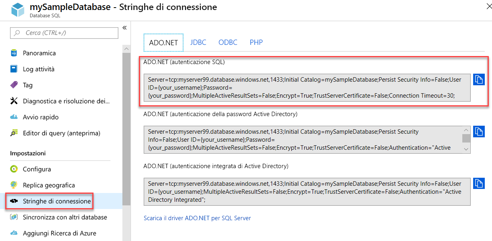

# <a name="quickstart-use-net-core-c-to-query-a-database-in-azure-sql-database-or-azure-sql-managed-instance"></a>Avvio rapido: Usare .NET Core (C#) per eseguire query su un database nel database SQL di Azure o nell'istanza gestita di SQL di Azure
[!INCLUDE[appliesto-sqldb-sqlmi](../includes/appliesto-sqldb-sqlmi.md)]

In questa guida di avvio rapido si userà [.NET Core](https://www.microsoft.com/net/) e il codice C# per la connessione a un database. Si eseguirà quindi un'istruzione Transact-SQL per eseguire query sui dati.

> [!TIP]
> Il modulo di Microsoft Learn gratuito seguente contiene informazioni su come [sviluppare e configurare un'applicazione ASP.NET che esegue query su un database nel database SQL di Azure](/learn/modules/develop-app-that-queries-azure-sql/)

## <a name="prerequisites"></a>Prerequisiti

Per completare l'esercitazione introduttiva, sono necessari gli elementi seguenti:

- Un account Azure con una sottoscrizione attiva. [Creare un account gratuitamente](https://azure.microsoft.com/free/?ref=microsoft.com&utm_source=microsoft.com&utm_medium=docs&utm_campaign=visualstudio).
- Database. Per creare e quindi configurare un database è possibile usare una di queste guide di avvio rapido:

  | Azione | Database SQL | Istanza gestita di SQL | SQL Server in una macchina virtuale Azure |
  |:--- |:--- |:---|:---|
  | Create| [Portale](single-database-create-quickstart.md) | [Portale](../managed-instance/instance-create-quickstart.md) | [Portale](../virtual-machines/windows/sql-vm-create-portal-quickstart.md)
  || [CLI](scripts/create-and-configure-database-cli.md) | [CLI](https://medium.com/azure-sqldb-managed-instance/working-with-sql-managed-instance-using-azure-cli-611795fe0b44) |
  || [PowerShell](scripts/create-and-configure-database-powershell.md) | [PowerShell](../managed-instance/scripts/create-configure-managed-instance-powershell.md) | [PowerShell](../virtual-machines/windows/sql-vm-create-powershell-quickstart.md)
  | Configurare | [Regola del firewall IP a livello di server](firewall-create-server-level-portal-quickstart.md)| [Connettività da una VM](../managed-instance/connect-vm-instance-configure.md)|
  |||[Connettività dall'ambiente locale](../managed-instance/point-to-site-p2s-configure.md) | [Connettersi a un'istanza di SQL Server](../virtual-machines/windows/sql-vm-create-portal-quickstart.md)
  |Caricare dati|Adventure Works caricato in base alla guida introduttiva|[Ripristinare Wide World Importers](../managed-instance/restore-sample-database-quickstart.md) | [Ripristinare Wide World Importers](../managed-instance/restore-sample-database-quickstart.md) |
  |||Ripristinare o importare i dati di Adventure Works dal file [BACPAC](database-import.md) ottenuto da [GitHub](https://github.com/Microsoft/sql-server-samples/tree/master/samples/databases/adventure-works)| Ripristinare o importare i dati di Adventure Works dal file [BACPAC](database-import.md) ottenuto da [GitHub](https://github.com/Microsoft/sql-server-samples/tree/master/samples/databases/adventure-works)|
  |||

  > [!IMPORTANT]
  > Gli script in questo articolo sono scritti in modo da usare il database Adventure Works. Con un'istanza gestita di SQL, è necessario importare il database Adventure Works in un database dell'istanza oppure modificare gli script di questo articolo per usare il database Wide World Importers.

- Aver installato [.NET Core per il sistema operativo](https://www.microsoft.com/net/core).

> [!NOTE]
> Questa guida introduttiva usa il database *mySampleDatabase* . Se si desidera utilizzare un database diverso, è necessario cambiare i riferimenti al database e modificare la query `SELECT` nel codice C#.

## <a name="get-server-connection-information"></a>Recuperare le informazioni di connessione del server

Recuperare le informazioni di connessione necessarie per connettersi al database nel database SQL di Azure. Nelle procedure successive saranno necessari il nome completo del server o il nome host, il nome del database e le informazioni di accesso.

1. Accedere al [portale di Azure](https://portal.azure.com/).

2. Passare alla pagina **Database SQL** o **Istanze gestite di SQL** .

3. Nella pagina **Panoramica** verificare il nome completo del server accanto a **Nome server** per il database nel database SQL di Azure o il nome del server completo (o l'indirizzo IP) accanto a **Host** per un'istanza gestita di SQL di Azure o di SQL Server in una macchina virtuale di Azure. Per copiare il nome del server o il nome host, passare il puntatore su di esso e selezionare l'icona **Copia** .

> [!NOTE]
> Per le informazioni di connessione per SQL Server in una macchina virtuale di Azure, vedere [Connettersi a un'istanza di SQL Server](../virtual-machines/windows/sql-vm-create-portal-quickstart.md#connect-to-sql-server).

## <a name="get-adonet-connection-information-optional---sql-database-only"></a>Ottenere le informazioni di connessione ADO.NET (facoltativo - solo database SQL)

1. Passare alla pagina **mySampleDatabase** e, in **Impostazioni** , selezionare **Stringhe di connessione** .

2. Esaminare l'intera stringa di connessione **ADO.NET** .

    

3. Copiare la stringa di connessione **ADO.NET** se si prevede di usarla.
  
## <a name="create-a-new-net-core-project"></a>Creare un nuovo progetto .NET Core

1. Aprire un prompt dei comandi e creare una cartella denominata **sqltest** . Passare a questa cartella ed eseguire questo comando.

    ```cmd
    dotnet new console
    ```

    Vengono creati nuovi file di progetto dell'app, inclusi un iniziale file di codice C# ( **Program.cs** ), un file di configurazione XML ( **sqltest. csproj** ) e i file binari necessari.

2. In un editor di testo, aprire **sqltest. csproj** e incollare il codice XML seguente tra i tag `<Project>`. In questo modo viene aggiunto `System.Data.SqlClient` come dipendenza.

    ```xml
    <ItemGroup>
        <PackageReference Include="System.Data.SqlClient" Version="4.6.0" />
    </ItemGroup>
    ```

## <a name="insert-code-to-query-the-database-in-azure-sql-database"></a>Inserire il codice per eseguire query sul database nel database SQL di Azure

1. Aprire **Program.cs** in un editor di testo.

2. Sostituire il contenuto con il codice seguente e aggiungere i valori appropriati per il server, il database, il nome utente e la password.

> [!NOTE]
> Per usare una stringa di connessione ADO.NET, sostituire le 4 righe di codice impostando server, database, nome utente e password con la riga seguente. Immettere il proprio nome utente e la password.
>
>    `builder.ConnectionString="<your_ado_net_connection_string>";`

```csharp
using System;
using System.Data.SqlClient;
using System.Text;

namespace sqltest
{
    class Program
    {
        static void Main(string[] args)
        {
            try 
            { 
                SqlConnectionStringBuilder builder = new SqlConnectionStringBuilder();

                builder.DataSource = "<your_server.database.windows.net>"; 
                builder.UserID = "<your_username>";            
                builder.Password = "<your_password>";     
                builder.InitialCatalog = "<your_database>";
         
                using (SqlConnection connection = new SqlConnection(builder.ConnectionString))
                {
                    Console.WriteLine("\nQuery data example:");
                    Console.WriteLine("=========================================\n");
                    
                    connection.Open();       
                    StringBuilder sb = new StringBuilder();
                    sb.Append("SELECT TOP 20 pc.Name as CategoryName, p.name as ProductName ");
                    sb.Append("FROM [SalesLT].[ProductCategory] pc ");
                    sb.Append("JOIN [SalesLT].[Product] p ");
                    sb.Append("ON pc.productcategoryid = p.productcategoryid;");
                    String sql = sb.ToString();

                    using (SqlCommand command = new SqlCommand(sql, connection))
                    {
                        using (SqlDataReader reader = command.ExecuteReader())
                        {
                            while (reader.Read())
                            {
                                Console.WriteLine("{0} {1}", reader.GetString(0), reader.GetString(1));
                            }
                        }
                    }                    
                }
            }
            catch (SqlException e)
            {
                Console.WriteLine(e.ToString());
            }
            Console.WriteLine("\nDone. Press enter.");
            Console.ReadLine(); 
        }
    }
}
```

## <a name="run-the-code"></a>Eseguire il codice

1. Al prompt eseguire i seguenti comandi.

   ```cmd
   dotnet restore
   dotnet run
   ```

2. Verificare che vengano restituite le prime 20 righe.

   ```text
   Query data example:
   =========================================

   Road Frames HL Road Frame - Black, 58
   Road Frames HL Road Frame - Red, 58
   Helmets Sport-100 Helmet, Red
   Helmets Sport-100 Helmet, Black
   Socks Mountain Bike Socks, M
   Socks Mountain Bike Socks, L
   Helmets Sport-100 Helmet, Blue
   Caps AWC Logo Cap
   Jerseys Long-Sleeve Logo Jersey, S
   Jerseys Long-Sleeve Logo Jersey, M
   Jerseys Long-Sleeve Logo Jersey, L
   Jerseys Long-Sleeve Logo Jersey, XL
   Road Frames HL Road Frame - Red, 62
   Road Frames HL Road Frame - Red, 44
   Road Frames HL Road Frame - Red, 48
   Road Frames HL Road Frame - Red, 52
   Road Frames HL Road Frame - Red, 56
   Road Frames LL Road Frame - Black, 58
   Road Frames LL Road Frame - Black, 60
   Road Frames LL Road Frame - Black, 62

   Done. Press enter.
   ```

3. Scegliere **INVIO** per chiudere la finestra dell'applicazione.

## <a name="next-steps"></a>Passaggi successivi

- [Introduzione all'uso di .NET Core su Windows/Linux/macOS dalla riga di comando](/dotnet/core/tutorials/using-with-xplat-cli).
- Informazioni su come [connettersi ed eseguire query su un database SQL di Azure o un'istanza gestita di SQL di Azure usando .NET Framework e Visual Studio](connect-query-dotnet-visual-studio.md).  
- Informazioni su come [Progettare il primo database con SSMS](design-first-database-tutorial.md) o su come [Progettare un database e connettersi con C# e ADO.NET](design-first-database-csharp-tutorial.md).
- Per altre informazioni su .NET, vedere la [documentazione di .NET](/dotnet/).