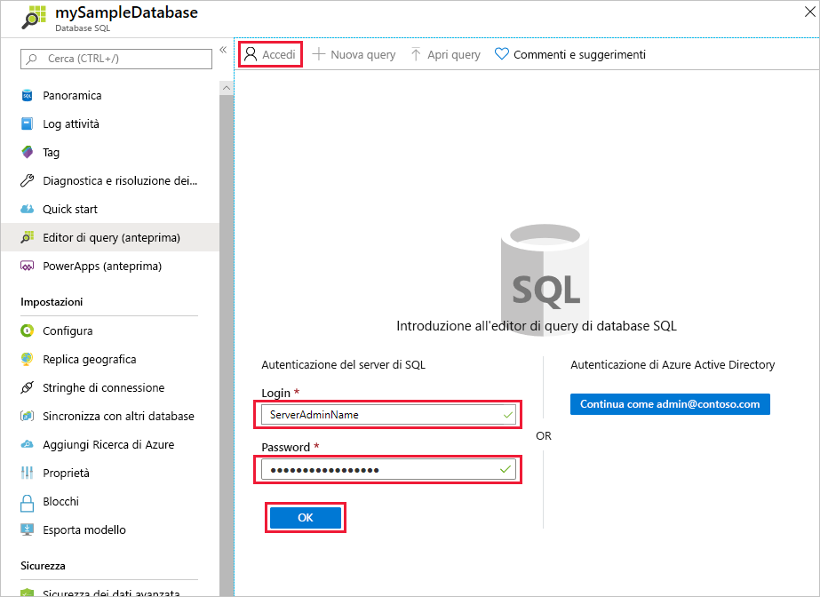
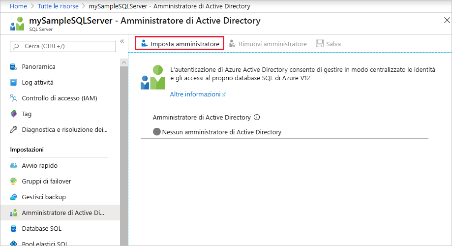
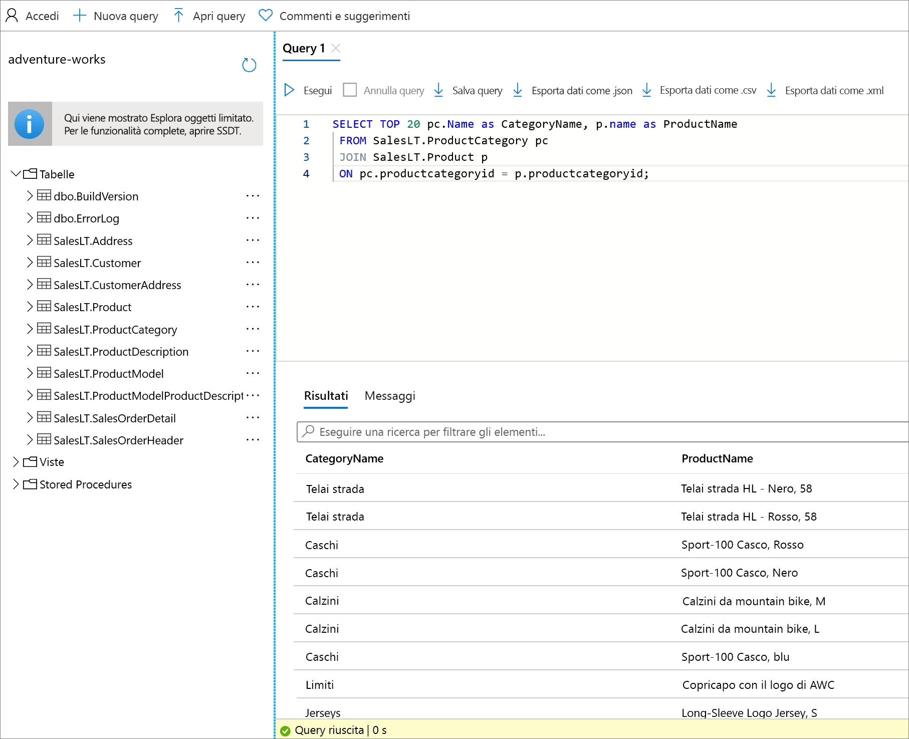

# <a name="quickstart-use-the-azure-portals-query-editor-to-query-an-azure-sql-database"></a>Avvio rapido: Usare l'editor di query del portale di Azure per eseguire query su un database SQL di Azure
[!INCLUDE[appliesto-sqldb](../includes/appliesto-sqldb.md)]

L'editor di query è uno strumento del portale di Azure per l'esecuzione di query SQL sul database in Database SQL di Azure o sul data warehouse in Azure Synapse Analytics. 

In questa guida di avvio rapido si userà l'editor di query per eseguire query T-SQL (Transact-SQL) su un database.

## <a name="prerequisites"></a>Prerequisiti

Per completare questo argomento di avvio rapido, è necessario il database di esempio AdventureWorksLT. Se non si ha una copia di lavoro del database di esempio AdventureWorksLT nel database SQL, seguire questa guida di avvio rapido per crearne velocemente una:

- [Avvio rapido: Creare un database nel database SQL di Azure usando il portale di Azure, PowerShell o l'interfaccia della riga di comando di Azure](single-database-create-quickstart.md) 

### <a name="configure-network-settings"></a>Configurare le impostazioni di rete

Se si verifica uno degli errori seguenti nell'editor di query: *Le impostazioni di rete locali potrebbero impedire all'editor di query di inviare query. Fare clic qui per le istruzioni su come configurare le impostazioni di rete* oppure *Non è stato possibile stabilire una connessione al server. Questo potrebbe indicare un problema con la configurazione locale del firewall o le impostazioni del proxy di rete*, le informazioni importanti seguenti dovrebbero consentire di risolverlo:

> [!IMPORTANT]
> L'editor di query usa le porte 443 e 1443 per comunicare. Assicurarsi di aver abilitato il traffico HTTPS in uscita su queste porte. È anche necessario [aggiungere l'indirizzo IP in uscita per le regole del firewall consentite del server](firewall-create-server-level-portal-quickstart.md) per accedere ai database e ai data warehouse.


## <a name="open-the-sql-database-query-editor"></a>Aprire l'editor di query del database SQL

1. Accedere al [portale di Azure](https://portal.azure.com/) e selezionare il database su cui eseguire query.

2. Dal menu **Database SQL** scegliere **Editor di query (anteprima)** .

    


## <a name="establish-a-connection-to-the-database"></a>Stabilire una connessione con il database

Anche se è stato eseguito l'accesso al portale, è comunque necessario fornire le credenziali per accedere al database. Per connettersi al database, è possibile usare l'autenticazione SQL o Azure Active Directory.

### <a name="connect-using-sql-authentication"></a>Connettersi con l'autenticazione SQL

1. Nella pagina **Accesso**, in **Autenticazione di SQL Server**, immettere l'**account di accesso** e la **password** di un utente che ha accesso al database. In caso di dubbi, usare l'account di accesso e la password dell'amministratore del server di database.

    

2. Selezionare **OK**.


### <a name="connect-using-azure-active-directory"></a>Connettersi con Azure Active Directory

La configurazione di un amministratore di Azure Active Directory (Azure AD) consente di usare una singola identità per accedere al portale di Azure e al database. Per connettersi al database con Azure AD, seguire questa procedura per configurare un amministratore di Azure AD per l'istanza di SQL Server.

> [!NOTE]
> * Gli account di posta elettronica (ad esempio outlook.com, gmail.com, yahoo.com e così via) non sono ancora supportati come amministratori di Azure AD. Assicurarsi di scegliere un utente creato in modo nativo o federato in Azure AD.
> * L'accesso come amministratore di Azure AD non funziona con account per cui è abilitata l'autenticazione a due fattori.

#### <a name="set-an-active-directory-admin-for-the-server"></a>Impostare un amministratore di Active Directory per il server

1. Nel portale di Azure selezionare l'istanza di SQL Server.

2. Scegliere **Amministratore di Active Directory** dal menu **SQL Server**.

3. Sulla barra degli strumenti della pagina **Amministratore di Active Directory** di SQL Server selezionare **Imposta amministratore** e scegliere l'utente o il gruppo da usare come amministratore di Azure AD.

    

4. Nella casella di ricerca della pagina **Aggiungi amministratore** immettere un utente o un gruppo da trovare, selezionarlo come amministratore e quindi scegliere il pulsante **Seleziona**.

5. Di nuovo sulla barra degli strumenti della pagina **Amministratore di Active Directory** di SQL Server selezionare **Salva**.

### <a name="connect-to-the-database"></a>Stabilire la connessione al database

6. Dal menu **SQL Server** scegliere **Database SQL** e quindi selezionare il database desiderato.

7. Dal menu **Database SQL** scegliere **Editor di query (anteprima)** . Nella pagina **Accesso**, sotto l'etichetta **Autenticazione di Active Directory**, viene visualizzato un messaggio che indica che si è avuto accesso se si è amministratori di Azure AD. Fare clic sul pulsante **Continua come** *\<your user or group ID>* . Se la pagina indica che l'accesso non è riuscito, potrebbe essere necessario aggiornarla.

## <a name="query-a-database-in-sql-database"></a>Eseguire query su un database nel database SQL

Le query di esempio seguenti dovrebbero essere eseguite correttamente sul database di esempio AdventureWorksLT.

### <a name="run-a-select-query"></a>Eseguire una query SELECT

1. Incollare la query seguente nell'editor di query:

   ```sql
    SELECT TOP 20 pc.Name as CategoryName, p.name as ProductName
    FROM SalesLT.ProductCategory pc
    JOIN SalesLT.Product p
    ON pc.productcategoryid = p.productcategoryid;
   ```

2. Selezionare **Esegui** e quindi esaminare l'output nel riquadro **Risultati**.

   

3. Facoltativamente, è possibile salvare la query come file con estensione sql oppure esportare i dati restituiti come file JSON, CSV o XML.

### <a name="run-an-insert-query"></a>Eseguire una query INSERT

Eseguire l'istruzione T-SQL [INSERT](/sql/t-sql/statements/insert-transact-sql/) seguente per aggiungere un nuovo prodotto nella tabella `SalesLT.Product`.

1. Sostituire la query precedente con questa.

    ```sql
    INSERT INTO [SalesLT].[Product]
           ( [Name]
           , [ProductNumber]
           , [Color]
           , [ProductCategoryID]
           , [StandardCost]
           , [ListPrice]
           , [SellStartDate]
           )
    VALUES
           ('myNewProduct'
           ,123456789
           ,'NewColor'
           ,1
           ,100
           ,100
           ,GETDATE() );
   ```


2. Selezionare **Esegui** per inserire una nuova riga nella tabella `Product`. Nel riquadro **Messaggi** verrà visualizzato **Query succeeded: Affected rows: 1** (Query riuscita. Righe interessate: 1).


### <a name="run-an-update-query"></a>Eseguire una query UPDATE

Eseguire l'istruzione T-SQL [UPDATE](/sql/t-sql/queries/update-transact-sql/) seguente per modificare il nuovo prodotto.

1. Sostituire la query precedente con questa.

   ```sql
   UPDATE [SalesLT].[Product]
   SET [ListPrice] = 125
   WHERE Name = 'myNewProduct';
   ```

2. Selezionare **Esegui** per aggiornare la riga specificata nella tabella `Product`. Nel riquadro **Messaggi** verrà visualizzato **Query succeeded: Affected rows: 1** (Query riuscita. Righe interessate: 1).

### <a name="run-a-delete-query"></a>Eseguire una query DELETE

Eseguire l'istruzione T-SQL [DELETE](/sql/t-sql/statements/delete-transact-sql/) seguente per rimuovere il nuovo prodotto.

1. Sostituire la query precedente con questa:

   ```sql
   DELETE FROM [SalesLT].[Product]
   WHERE Name = 'myNewProduct';
   ```

2. Selezionare **Esegui** per eliminare la riga specificata nella tabella `Product`. Nel riquadro **Messaggi** verrà visualizzato **Query succeeded: Affected rows: 1** (Query riuscita. Righe interessate: 1).


## <a name="query-editor-considerations"></a>Considerazioni sull'editor di query

Quando si usa l'editor di query è necessario tenere presente quanto segue.

* L'editor di query usa le porte 443 e 1443 per comunicare. Assicurarsi di aver abilitato il traffico HTTPS in uscita su queste porte. È anche necessario aggiungere l'indirizzo IP in uscita per le regole del firewall consentite del server per accedere ai database e ai data warehouse.

* Se si usa la connessione collegamento privato, l'editor di query funziona senza dover aggiungere l'indirizzo IP del client nel firewall del database SQL.

* Premendo **F5**, la pagina dell'editor di query verrà aggiornata e qualsiasi query in uso andrà persa.

* L'editor di query non supporta la connessione al database `master`.

* Esiste un timeout di 5 minuti per l'esecuzione delle query.

* L'editor di query supporta solo la proiezione cilindrica per i tipi di dati Geography.

* Per tabelle e viste di database non è previsto il supporto di IntelliSense, ma l'editor supporta il completamento automatico dei nomi già digitati.


## <a name="next-steps"></a>Passaggi successivi

Per altre informazioni sul supporto per T-SQL (Transact-SQL) disponibile nei database SQL di Azure, vedere [Risoluzione delle differenze di Transact-SQL durante la migrazione al database SQL](transact-sql-tsql-differences-sql-server.md).
