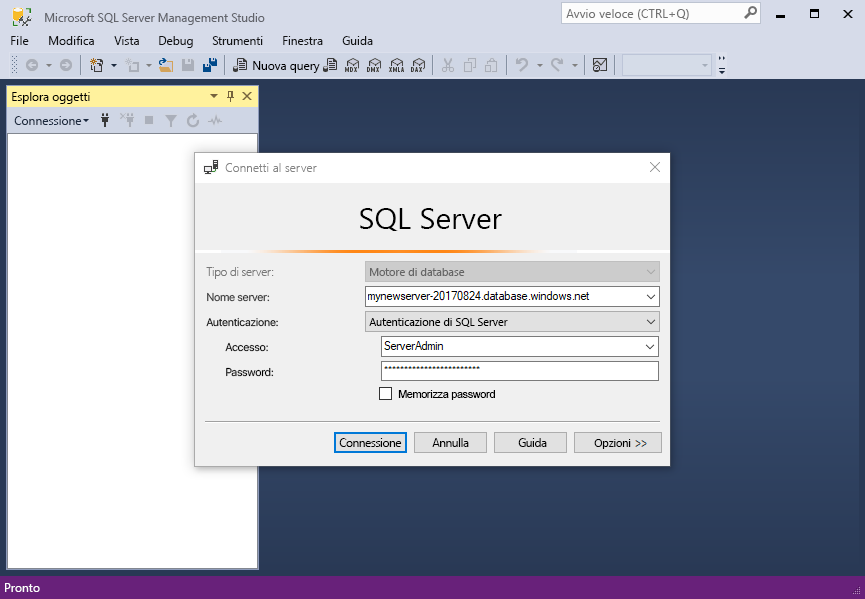
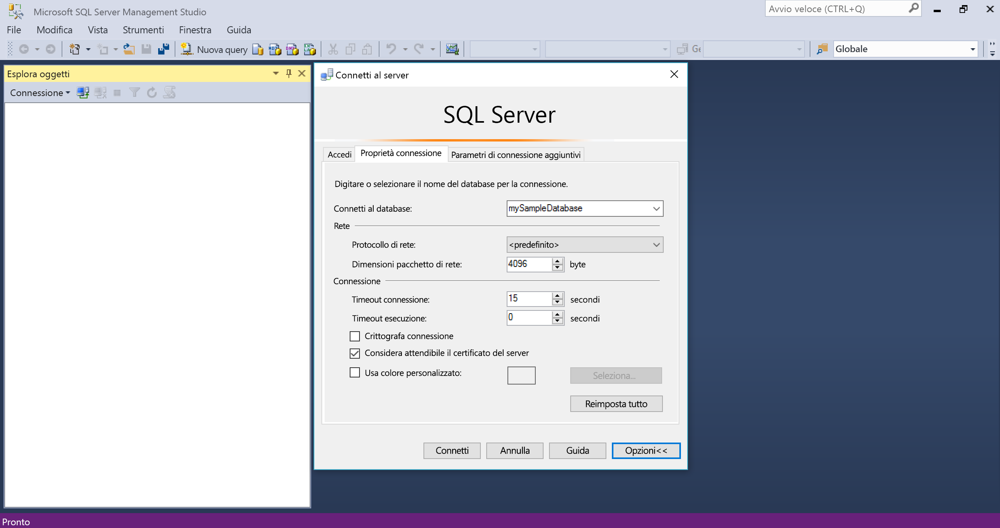
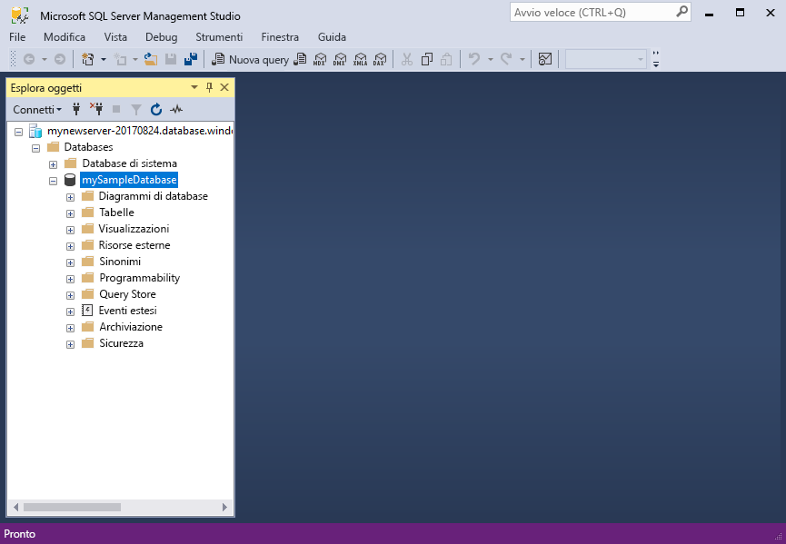
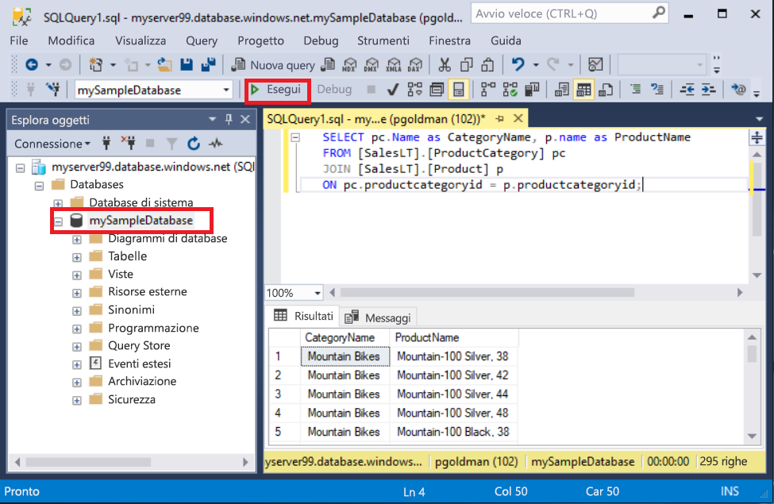
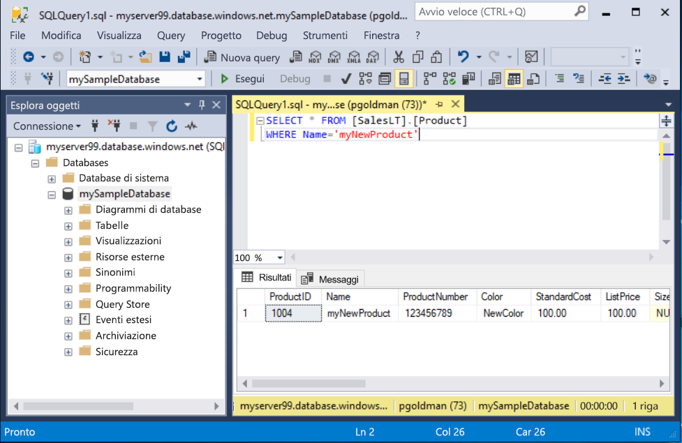

# <a name="quickstart-use-ssms-to-connect-to-and-query-azure-sql-database-or-azure-sql-managed-instance"></a>Avvio rapido: Usare SSMS per connettersi a un database SQL di Azure o a un'istanza gestita di database SQL di Azure ed eseguire query
[!INCLUDE[appliesto-sqldb-sqlmi](../includes/appliesto-sqldb-sqlmi.md)]

In questa guida di avvio rapido si userà SQL Server Management Studio (SSMS) per connettersi a un database SQL di Azure o a un'istanza gestita di SQL di Azure ed eseguire alcune query.

## <a name="prerequisites"></a>Prerequisiti

Per completare questo argomento di avvio rapido, è necessario avere gli elementi seguenti:

- [SQL Server Management Studio (SSMS)](/sql/ssms/download-sql-server-management-studio-ssms/).

- Database nel database SQL di Azure. Per creare e quindi configurare un database in Database SQL di Azure è possibile usare una di queste guide introduttive:

  || Database SQL | Istanza gestita di SQL | SQL Server in una macchina virtuale Azure |
  |:--- |:--- |:---|:---|
  | Create| [Portale](single-database-create-quickstart.md) | [Portale](../managed-instance/instance-create-quickstart.md) | [Portale](../virtual-machines/windows/sql-vm-create-portal-quickstart.md)
  || [CLI](scripts/create-and-configure-database-cli.md) | [CLI](https://medium.com/azure-sqldb-managed-instance/working-with-sql-managed-instance-using-azure-cli-611795fe0b44) |
  || [PowerShell](scripts/create-and-configure-database-powershell.md) | [PowerShell](../managed-instance/scripts/create-configure-managed-instance-powershell.md) | [PowerShell](../virtual-machines/windows/sql-vm-create-powershell-quickstart.md)
  | Configurare | [Regola del firewall IP a livello di server](firewall-create-server-level-portal-quickstart.md)| [Connettività da una VM](../managed-instance/connect-vm-instance-configure.md)|
  |||[Connettività da locale](../managed-instance/point-to-site-p2s-configure.md) | [Connettersi a SQL Server](../virtual-machines/windows/sql-vm-create-portal-quickstart.md)
  |Caricare dati|Adventure Works caricato in base alla guida introduttiva|[Ripristinare Wide World Importers](../managed-instance/restore-sample-database-quickstart.md) | [Ripristinare Wide World Importers](../managed-instance/restore-sample-database-quickstart.md) |
  |||Ripristinare o importare Adventure Works dal file [BACPAC](database-import.md) ottenuto da [GitHub](https://github.com/Microsoft/sql-server-samples/tree/master/samples/databases/adventure-works)| Ripristinare o importare Adventure Works dal file [BACPAC](database-import.md) ottenuto da [GitHub](https://github.com/Microsoft/sql-server-samples/tree/master/samples/databases/adventure-works)|
  |||

  > [!IMPORTANT]
  > Gli script in questo articolo sono scritti in modo da usare il database Adventure Works. Con un'istanza gestita, è necessario importare il database Adventure Works in un database dell'istanza oppure modificare gli script di questo articolo in modo da usare il database Wide World Importers.

Per eseguire semplicemente alcune query ad hoc senza installare SSMS, vedere [Avvio rapido: Usare l'editor di query del portale di Azure per eseguire query su un database SQL](connect-query-portal.md).

## <a name="get-server-connection-information"></a>Recuperare le informazioni di connessione del server

Ottenere le informazioni necessarie per connettersi al database. Per completare questa guida di avvio rapido, è necessario avere il nome completo del [server](logical-servers.md) o il nome host, il nome del database e le credenziali di accesso.

1. Accedere al [portale di Azure](https://portal.azure.com/).

2. Passare al **database** o all'**istanza gestita** su cui eseguire query.

3. Nella pagina **Panoramica** verificare il nome completo del server accanto a **Nome server** per il database nel database SQL o il nome del server completo (o l'indirizzo IP) accanto a **Host** per l'istanza gestita in Istanza gestita di SQL o l'istanza di SQL Server nella macchina virtuale. Per copiare il nome del server o il nome host, passare il puntatore su di esso e selezionare l'icona **Copia**.

> [!NOTE]
> Per le informazioni di connessione per SQL Server in una macchina virtuale di Azure, vedere [Connettersi a SQL Server](../virtual-machines/windows/sql-vm-create-portal-quickstart.md#connect-to-sql-server)

## <a name="connect-to-your-database"></a>Connettersi al database

In SSMS connettersi al server.

> [!IMPORTANT]
> Il server è in ascolto sulla porta 1433. Per connettersi a un server tramite un firewall aziendale, è necessario che nel firewall sia aperta tale porta.

1. Aprire SSMS.

2. Viene visualizzata la finestra di dialogo **Connetti al server** . Immettere le seguenti informazioni:

   | Impostazione      | Valore consigliato    | Descrizione |
   | ------------ | ------------------ | ----------- |
   | **Tipo di server** | Motore di database | Valore obbligatorio. |
   | **Nome server** | Nome completo del server | Ad esempio: **servername.database.windows.net**. |
   | **autenticazione** | Autenticazione di SQL Server | In questa esercitazione viene usata l'autenticazione SQL. |
   | **Accesso** | ID utente dell'account amministratore del server | ID utente dell'account amministratore del server usato per creare il server. |
   | **Password** | Password dell'account amministratore del server | Password dell'account amministratore del server usato per creare il server. |
   ||||

     

3. Selezionare **Opzioni** nella finestra di dialogo **Connetti al server**. Nel menu a discesa **Connetti al database** selezionare **mySampleDatabase**. Completando l'argomento di avvio rapido nella sezione [Prerequisiti](#prerequisites), viene creato un database AdventureWorksLT denominato mySampleDatabase. Se la copia di lavoro del database AdventureWorks ha un nome diverso da mySampleDatabase, selezionare invece tale nome.

     

4. Selezionare **Connetti**. Viene visualizzata la finestra Esplora oggetti.

5. Per visualizzare gli oggetti del database, espandere **Database** e quindi il nodo del database.

     

## <a name="query-data"></a>Eseguire query sui dati

Eseguire questo codice Transact-SQL [SELECT](/sql/t-sql/queries/select-transact-sql/) per eseguire una query e individuare i primi 20 prodotti per categoria.

1. In Esplora oggetti fare clic con il pulsante destro del mouse su **mySampleDatabase** e scegliere **Nuova query**. Viene visualizzata una nuova finestra di query connessa al database.

2. Nella finestra della query incollare la query SQL seguente:

   ```sql
   SELECT pc.Name as CategoryName, p.name as ProductName
   FROM [SalesLT].[ProductCategory] pc
   JOIN [SalesLT].[Product] p
   ON pc.productcategoryid = p.productcategoryid;
   ```

3. Sulla barra degli strumenti selezionare **Esegui** per eseguire la query e recuperare i dati dalle tabelle `Product` e `ProductCategory`.

    

### <a name="insert-data"></a>Inserire i dati

Eseguire questo codice Transact-SQL [INSERT](/sql/t-sql/statements/insert-transact-sql/) per creare un nuovo prodotto nella tabella `SalesLT.Product`.

1. Sostituire la query precedente con questa.

   ```sql
   INSERT INTO [SalesLT].[Product]
           ( [Name]
           , [ProductNumber]
           , [Color]
           , [ProductCategoryID]
           , [StandardCost]
           , [ListPrice]
           , [SellStartDate] )
     VALUES
           ('myNewProduct'
           ,123456789
           ,'NewColor'
           ,1
           ,100
           ,100
           ,GETDATE() );
   ```

2. Selezionare **Esegui** per inserire una nuova riga nella tabella `Product`. Nel riquadro **Messaggi** verrà visualizzato **(1 riga interessata)** .

#### <a name="view-the-result"></a>Visualizzare il risultato

1. Sostituire la query precedente con questa.

   ```sql
   SELECT * FROM [SalesLT].[Product]
   WHERE Name='myNewProduct'
   ```

2. Scegliere **Execute**(Esegui). Si ottiene il risultato seguente.

   

### <a name="update-data"></a>Aggiornare i dati

Eseguire questo codice Transact-SQL [UPDATE](/sql/t-sql/statements/update-transact-sql) per modificare il nuovo prodotto.

1. Sostituire la query precedente con quella seguente, che restituisce il nuovo record creato in precedenza:

   ```sql
   UPDATE [SalesLT].[Product]
   SET [ListPrice] = 125
   WHERE Name = 'myNewProduct';
   ```

2. Selezionare **Esegui** per aggiornare la riga specificata nella tabella `Product`. Nel riquadro **Messaggi** verrà visualizzato **(1 riga interessata)** .

### <a name="delete-data"></a>Eliminare i dati

Eseguire questo codice Transact-SQL [DELETE](/sql/t-sql/statements/delete-transact-sql/) per rimuovere il nuovo prodotto.

1. Sostituire la query precedente con questa.

   ```sql
   DELETE FROM [SalesLT].[Product]
   WHERE Name = 'myNewProduct';
   ```

2. Selezionare **Esegui** per eliminare la riga specificata nella tabella `Product`. Nel riquadro **Messaggi** verrà visualizzato **(1 riga interessata)** .

## <a name="next-steps"></a>Passaggi successivi

- Per informazioni su SSMS, vedere [SQL Server Management Studio](/sql/ssms/sql-server-management-studio-ssms/).
- Per connettersi ed eseguire query tramite il portale di Azure, vedere [Connettersi ed eseguire query con l'editor di query SQL del portale di Azure](connect-query-portal.md).
- Per connettersi ed eseguire query usando Visual Studio Code, vedere [Connettersi ed eseguire query con Visual Studio Code](connect-query-vscode.md).
- Per connettersi ed eseguire una query usando .NET, vedere [Connettersi ed eseguire una query con .NET](connect-query-dotnet-visual-studio.md).
- Per connettersi ed eseguire query usando PHP, vedere [Connettersi ed eseguire query con PHP](connect-query-php.md).
- Per connettersi ed eseguire query usando Node.js, vedere [Connettersi ed eseguire query con Node.js](connect-query-nodejs.md).
- Per connettersi ed eseguire query usando Java, vedere [Connettersi ed eseguire query con Java](connect-query-java.md).
- Per connettersi ed eseguire query usando Python, vedere [Connettersi ed eseguire query con Python](connect-query-python.md).
- Per connettersi ed eseguire query usando Ruby, vedere [Connettersi ed eseguire query con Ruby](connect-query-ruby.md).
