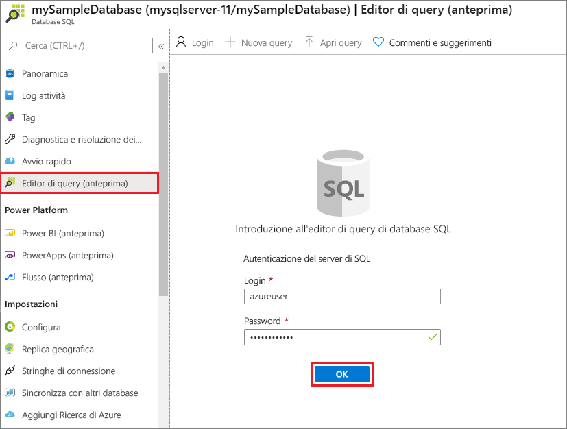
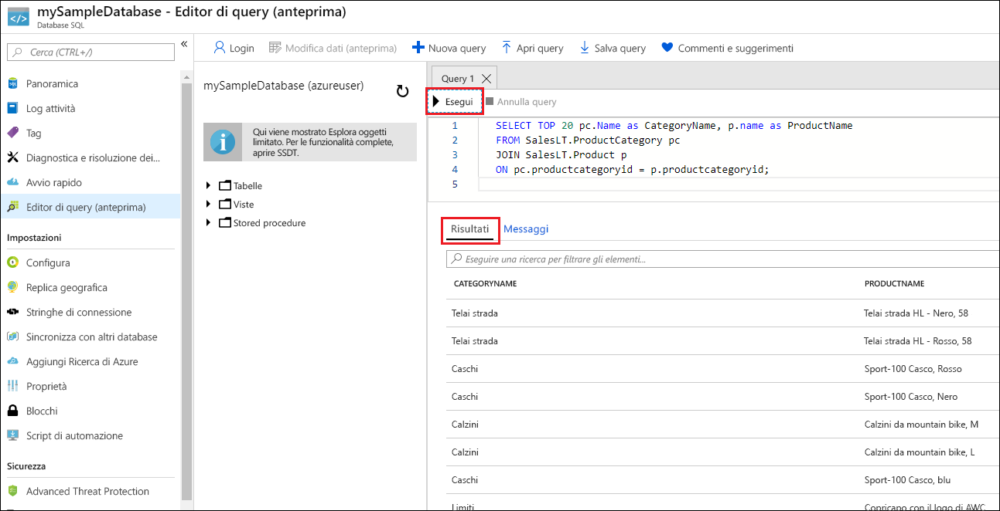

# <a name="quickstart-create-an-azure-sql-database-single-database"></a>Avvio rapido: Crea un database SQL di Azure singolo

In questo argomento di avvio rapido si userà il portale di Azure, uno script di Azure PowerShell o uno script dell'interfaccia della riga di comando di Azure per creare un [database singolo](single-database-overview.md) in Database SQL di Azure. È quindi possibile eseguire query sul database con l'**editor di query** nel portale di Azure.


## <a name="prerequisite"></a>Prerequisito

- Una sottoscrizione di Azure attiva. Se non se ne ha una, [creare un account gratuito](https://azure.microsoft.com/free/).

## <a name="create-a-single-database"></a>Creare un database singolo

Questo argomento di avvio rapido crea un database singolo nel [livello di calcolo serverless](serverless-tier-overview.md).

# <a name="portal"></a>[Portale](#tab/azure-portal)

Per creare un database singolo nel portale di Azure, questo argomento di avvio rapido inizia dalla pagina SQL di Azure.

1. Passare alla pagina [Selezionare l'opzione di distribuzione SQL](https://portal.azure.com/#create/Microsoft.AzureSQL).
1. In **Database SQL** lasciare l'opzione **Tipo di risorsa** impostata su **Database singolo** e selezionare **Crea**.

   

1. Nella scheda **Informazioni di base** del modulo **Crea database SQL** selezionare la **Sottoscrizione** di Azure corretta in **Dettagli del progetto**.
1. In **Gruppo di risorse** selezionare **Crea nuovo**, immettere *myResourceGroup* e quindi fare clic su **OK**.
1. In **Nome database** immettere *mySampleDatabase*.
1. In **server** selezionare **Crea nuovo** e compilare il modulo **Nuovo server** con i valori seguenti:
   - **Nome server**: immettere *mysqlserver* e aggiungere alcuni caratteri per l'univocità. Non è possibile specificare un nome di server esatto da usare perché i nomi di tutti i server di Azure devono essere univoci a livello globale, non solo univoci all'interno di una sottoscrizione. Immettere quindi un valore come mysqlserver12345 e il portale segnala se è disponibile o meno.
   - **Account di accesso amministratore server**: digitare *azureuser*.
   - **Password**: immettere una password che soddisfi i requisiti e immetterla di nuovo nel campo **Conferma password**.
   - **Località**: selezionare una località dall'elenco a discesa.

   Selezionare **OK**.

1. Lasciare l'opzione **Usare il pool elastico SQL?** impostata su **No**.
1. In **Calcolo e archiviazione** selezionare **Configura database**.
1. Questo argomento di avvio rapido usa un database serverless, quindi selezionare **Serverless** e quindi **Applica**. 

      

1. Selezionare **Avanti: Rete**  nella parte inferiore della pagina.

   

1. Nella scheda **Rete** selezionare **Endpoint pubblico** in **Metodo di connettività**.
1. In **Regole del firewall** impostare **Aggiungi indirizzo IP client corrente** su **Sì**. Lasciare l'opzione **Consenti alle risorse e ai servizi di Azure di accedere a questo server** impostata su **No**.
1. Selezionare **Avanti: Impostazioni aggiuntive** nella parte inferiore della pagina.

   
  

1. Nella scheda **Impostazioni aggiuntive**, nella sezione **Origine dati** selezionare **Esempio** per **Usa dati esistenti**. Viene creato un database di esempio AdventureWorksLT che contiene alcune tabelle a alcuni dati su cui eseguire query e con cui sperimentare, diversamente da un database vuoto.
1. Selezionare **Rivedi e crea** nella parte inferiore della pagina:

   

1. Nella pagina **Rivedi e crea**, dopo aver rivisto le impostazioni, selezionare **Crea**.

# <a name="azure-cli"></a>[Interfaccia della riga di comando di Azure](#tab/azure-cli)

## <a name="launch-azure-cloud-shell"></a>Avviare Azure Cloud Shell

Azure Cloud Shell è una shell interattiva gratuita che può essere usata per eseguire la procedura di questo articolo. Include strumenti comuni di Azure preinstallati e configurati per l'uso con l'account. 

Per aprire Cloud Shell, basta selezionare **Prova** nell'angolo superiore destro di un blocco di codice. È anche possibile avviare Cloud Shell in una scheda separata del browser visitando [https://shell.azure.com](https://shell.azure.com). Selezionare **Copia** per copiare i blocchi di codice, incollarli in Cloud Shell e premere **Invio** per eseguirli.

## <a name="set-parameter-values"></a>Impostare i valori di parametro

I valori seguenti vengono usati nei comandi successivi per creare il database e le risorse necessarie. I nomi dei server devono essere univoci a livello globale in tutto Azure, quindi per creare il nome del server viene usata la funzione $RANDOM. Sostituire i valori 0.0.0.0 nell'intervallo di indirizzi IP in modo che corrispondano all'ambiente specifico.

```azurecli-interactive
# Set the resource group name and location for your server
resourceGroupName=myResourceGroup
location=eastus

# Set an admin login and password for your database
adminlogin=azureuser
password=Azure1234567!

# Set a server name that is unique to Azure DNS (<server_name>.database.windows.net)
serverName=server-$RANDOM

# Set the ip address range that can access your database
startip=0.0.0.0
endip=0.0.0.0
```

## <a name="create-a-resource-group"></a>Creare un gruppo di risorse

Creare un gruppo di risorse con il comando [az group create](/cli/azure/group). Un gruppo di risorse di Azure è un contenitore logico in cui le risorse di Azure vengono distribuite e gestite. L'esempio seguente crea un gruppo di risorse denominato *myResourceGroup* nella posizione *eastus*:

```azurecli-interactive
az group create --name $resourceGroupName --location $location
```

## <a name="create-a-server"></a>Creare un server

Creare un server con il comando [az sql server create](/cli/azure/sql/server).

```azurecli-interactive
az sql server create \
    --name $serverName \
    --resource-group $resourceGroupName \
    --location $location  \
    --admin-user $adminlogin \
    --admin-password $password
```


## <a name="configure-a-firewall-rule-for-the-server"></a>Configurare una regola del firewall per il server

Creare una regola del firewall con il comando [az sql server firewall-rule create](/cli/azure/sql/server/firewall-rule).

```azurecli-interactive
az sql server firewall-rule create \
    --resource-group $resourceGroupName \
    --server $serverName \
    -n AllowYourIp \
    --start-ip-address $startip \
    --end-ip-address $endip
```


## <a name="create-a-single-database"></a>Creare un database singolo

Creare un database con il comando [az sql db create](/cli/azure/sql/db). Il codice seguente crea


```azurecli-interactive
az sql db create \
    --resource-group $resourceGroupName \
    --server $serverName \
    --name mySampleDatabase \
    --sample-name AdventureWorksLT \
    --edition GeneralPurpose \
    --compute-model Serverless \
    --family Gen5 \
    --capacity 2
```


# <a name="powershell"></a>[PowerShell](#tab/azure-powershell)

È possibile creare un gruppo di risorse di Azure, un server e un database singolo usando Windows PowerShell.

## <a name="launch-azure-cloud-shell"></a>Avviare Azure Cloud Shell

Azure Cloud Shell è una shell interattiva gratuita che può essere usata per eseguire la procedura di questo articolo. Include strumenti comuni di Azure preinstallati e configurati per l'uso con l'account. 

Per aprire Cloud Shell, basta selezionare **Prova** nell'angolo superiore destro di un blocco di codice. È anche possibile avviare Cloud Shell in una scheda separata del browser visitando [https://shell.azure.com](https://shell.azure.com). Selezionare **Copia** per copiare i blocchi di codice, incollarli in Cloud Shell e premere **Invio** per eseguirli.

## <a name="set-parameter-values"></a>Impostare i valori di parametro

I valori seguenti vengono usati nei comandi successivi per creare il database e le risorse necessarie. I nomi dei server devono essere univoci a livello globale in tutto Azure, quindi per creare il nome del server viene usato il cmdlet Get-Random. Sostituire i valori 0.0.0.0 nell'intervallo di indirizzi IP in modo che corrispondano all'ambiente specifico.

```azurepowershell-interactive
   # Set variables for your server and database
   $resourceGroupName = "myResourceGroup"
   $location = "eastus"
   $adminLogin = "azureuser"
   $password = "Azure1234567!"
   $serverName = "mysqlserver-$(Get-Random)"
   $databaseName = "mySampleDatabase"

   # The ip address range that you want to allow to access your server
   $startIp = "0.0.0.0"
   $endIp = "0.0.0.0"

   # Show randomized variables
   Write-host "Resource group name is" $resourceGroupName
   Write-host "Server name is" $serverName
```


## <a name="create-resource-group"></a>Creare un gruppo di risorse

Creare un gruppo di risorse di Azure con [New-AzResourceGroup](/powershell/module/az.resources/new-azresourcegroup). Un gruppo di risorse è un contenitore logico in cui le risorse di Azure vengono distribuite e gestite.

```azurepowershell-interactive
   Write-host "Creating resource group..."
   $resourceGroup = New-AzResourceGroup -Name $resourceGroupName -Location $location -Tag @{Owner="SQLDB-Samples"}
   $resourceGroup
```


## <a name="create-a-server"></a>Creare un server

Creare un server con il cmdlet [New-AzSqlServer](/powershell/module/az.sql/new-azsqlserver).

```azurepowershell-interactive
  Write-host "Creating primary server..."
   $server = New-AzSqlServer -ResourceGroupName $resourceGroupName `
      -ServerName $serverName `
      -Location $location `
      -SqlAdministratorCredentials $(New-Object -TypeName System.Management.Automation.PSCredential `
      -ArgumentList $adminLogin, $(ConvertTo-SecureString -String $password -AsPlainText -Force))
   $server
```

## <a name="create-a-firewall-rule"></a>Creare una regola del firewall

Creare una regola del firewall per il server con il cmdlet [New-AzSqlServerFirewallRule](/powershell/module/az.sql/new-azsqlserverfirewallrule).

```azurepowershell-interactive
   Write-host "Configuring server firewall rule..."
   $serverFirewallRule = New-AzSqlServerFirewallRule -ResourceGroupName $resourceGroupName `
      -ServerName $serverName `
      -FirewallRuleName "AllowedIPs" -StartIpAddress $startIp -EndIpAddress $endIp
   $serverFirewallRule
```


## <a name="create-a-single-database"></a>Creare un database singolo

Creare un database singolo con il cmdlet [New-AzSqlDatabase](/powershell/module/az.sql/new-azsqldatabase).

```azurepowershell-interactive
   Write-host "Creating a gen5 2 vCore serverless database..."
   $database = New-AzSqlDatabase  -ResourceGroupName $resourceGroupName `
      -ServerName $serverName `
      -DatabaseName $databaseName `
      -Edition GeneralPurpose `
      -ComputeModel Serverless `
      -ComputeGeneration Gen5 `
      -VCore 2 `
      -MinimumCapacity 2 `
      -SampleName "AdventureWorksLT"
   $database
```

---


## <a name="query-the-database"></a>Eseguire query sul database

Dopo aver creato il database, è possibile usare l'**editor di query (anteprima)** nel portale di Azure per connettersi al database ed eseguire query sui dati.

1. Nel portale cercare e selezionare **Database SQL**, quindi selezionare il database nell'elenco.
1. Nella pagina relativa al database scegliere **Editor di query (anteprima)** dal menu sinistro.
1. Immettere le credenziali di accesso di amministratore server e selezionare **OK**.

   

1. Immettere la query seguente nel riquadro **Editor di query**.

   ```sql
   SELECT TOP 20 pc.Name as CategoryName, p.name as ProductName
   FROM SalesLT.ProductCategory pc
   JOIN SalesLT.Product p
   ON pc.productcategoryid = p.productcategoryid;
   ```

1. Selezionare **Esegui** e quindi esaminare i risultati della query nel riquadro **Risultati**.

   

1. Chiudere la pagina **Editor di query** e selezionare **OK** quando richiesto per rimuovere le modifiche non salvate.

## <a name="clean-up-resources"></a>Pulire le risorse

Mantenere il gruppo di risorse, il server e il database singolo per procedere con i passaggi successivi e acquisire informazioni su come connettersi al database ed eseguire query con metodi diversi.

Dopo aver finito di usare queste risorse, è possibile eliminare il gruppo di risorse creato, eliminando in questo modo anche il server e il database singolo al suo interno.

### <a name="portal"></a>[Portale](#tab/azure-portal)

Per eliminare **myResourceGroup** e tutte le relative risorse con il portale di Azure:

1. Nel portale cercare e selezionare **Gruppi di risorse** e quindi selezionare **myResourceGroup** nell'elenco.
1. Nella pagina del gruppo di risorse selezionare **Elimina gruppo di risorse**.
1. In **Digitare il nome del gruppo di risorse** immettere *myResourceGroup* e quindi selezionare **Elimina**.

### <a name="azure-cli"></a>[Interfaccia della riga di comando di Azure](#tab/azure-cli)

Per eliminare il gruppo di risorse e tutte le relative risorse, eseguire il comando dell'interfaccia della riga di comando di Azure seguente usando il nome del gruppo di risorse:

```azurecli-interactive
az group delete --name $resourceGroupName
```

### <a name="powershell"></a>[PowerShell](#tab/azure-powershell)

Per eliminare il gruppo di risorse e tutte le relative risorse, eseguire il cmdlet di PowerShell seguente, usando il nome del gruppo di risorse:

```azurepowershell-interactive
Remove-AzResourceGroup -Name $resourceGroupName
```

---

## <a name="next-steps"></a>Passaggi successivi

[Connettersi ed eseguire query](connect-query-content-reference-guide.md) sul database con strumenti e linguaggi diversi:
> [!div class="nextstepaction"]
> [Connettersi ed eseguire query usando SQL Server Management Studio](connect-query-ssms.md)
>
> [Connettersi ed eseguire query usando Azure Data Studio](/sql/azure-data-studio/quickstart-sql-database?toc=/azure/sql-database/toc.json)

Si vuole ottimizzare e risparmiare sulla spesa per il cloud?

> [!div class="nextstepaction"]
> [Per iniziare, analizzare i costi con Gestione costi](https://docs.microsoft.com/azure/cost-management-billing/costs/quick-acm-cost-analysis?WT.mc_id=costmanagementcontent_docsacmhorizontal_-inproduct-learn)
