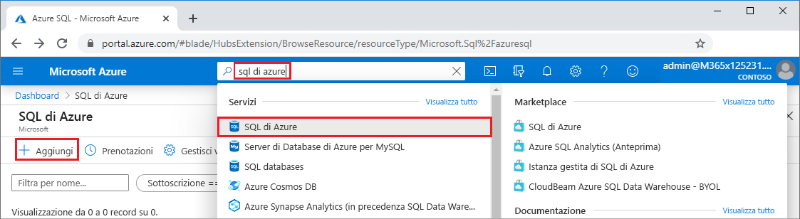
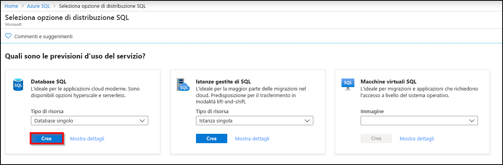
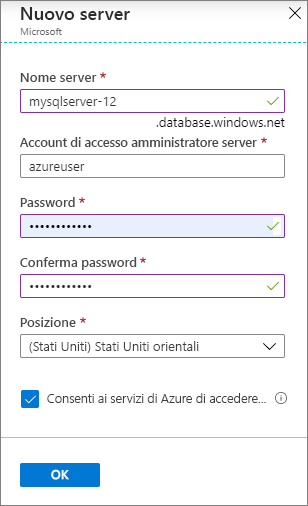
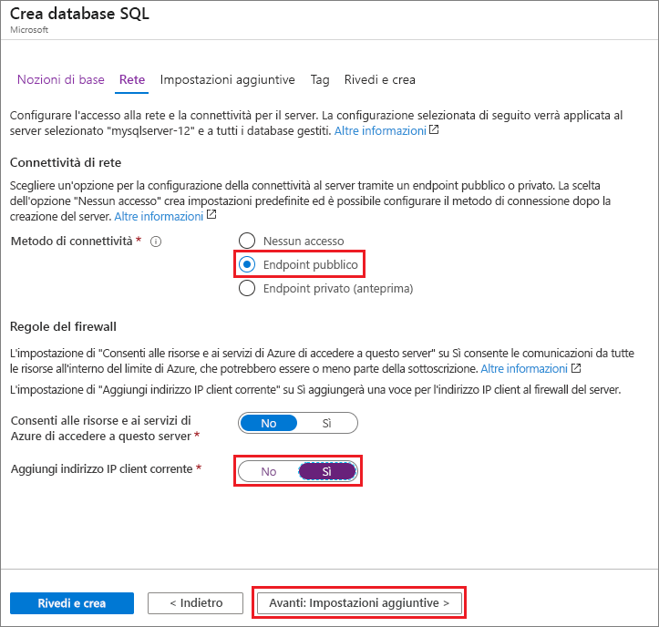
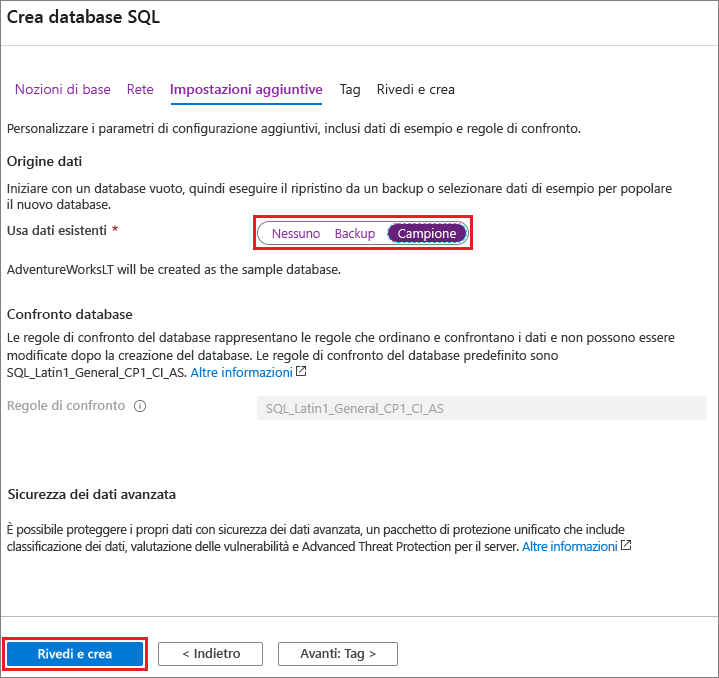

In questo passaggio verranno creati un [server logico SQL](../database/logical-servers.md) e un [database singolo](../database/single-database-overview.md) che usa i dati di esempio AdventureWorksLT. È possibile creare il database usando i menu e le schermate del portale di Azure, con l'interfaccia della riga di comando di Azure o uno script di PowerShell in Azure Cloud Shell.

Tutti i metodi includono la configurazione di una regola del firewall a livello di server per consentire l'indirizzo IP pubblico del computer in uso per accedere al server. Per altre informazioni sulla creazione di regole del firewall a livello di server, vedere [Creare un firewall a livello di server](../database/firewall-create-server-level-portal-quickstart.md). È anche possibile configurare le regole del firewall a livello di database. Vedere [Creare una regola del firewall a livello di database](/sql/relational-databases/system-stored-procedures/sp-set-database-firewall-rule-azure-sql-database).

# <a name="portal"></a>[Portale](#tab/azure-portal)

Per creare un gruppo di risorse, un server e un database singolo nel portale di Azure:

1. Accedere al [portale](https://portal.azure.com).
1. Nella barra di ricerca cercare e selezionare **Azure SQL**.
1. Nella pagina **Azure SQL** selezionare **Aggiungi**.

   

1. Nella pagina **Selezionare l'opzione di distribuzione SQL** selezionare il riquadro **Database SQL** con **Database singolo** in **Tipo di risorsa**. Per visualizzare informazioni aggiuntive sui diversi database, selezionare **Mostra dettagli**.
1. Selezionare **Crea**.

   

1. Nella scheda **Informazioni di base** del modulo **Crea database SQL** selezionare la **Sottoscrizione** di Azure corretta in **Dettagli del progetto** se non è già selezionata.
1. In **Gruppo di risorse** selezionare **Crea nuovo**, immettere *myResourceGroup* e quindi fare clic su **OK**.
1. In **Dettagli database** immettere **mySampleDatabase** per *Nome del database*.
1. Per **server**, selezionare **Crea nuovo** e compilare il modulo **Nuovo server** come indicato di seguito:
   - **Nome server**: immettere *mysqlserver* e alcuni caratteri per l'univocità.
   - **Account di accesso amministratore server**: digitare *azureuser*.
   - **Password**: immettere una password che soddisfi i requisiti e immetterla di nuovo nel campo **Conferma password**.
   - **Località**: fare clic sull'elenco a discesa e scegliere una località, ad esempio **(Stati Uniti) Stati Uniti orientali**.

   Selezionare **OK**.

   

   Prendere nota dell'account di accesso amministratore del server e della password per poter accedere al server e ai database. Se si dimentica l'account di accesso o la password, è possibile recuperare il nome di accesso o reimpostare la password nella pagina **SQL Server** dopo la creazione del database. Per aprire la pagina **SQL Server**, selezionare il nome del server nella pagina **Panoramica** del database.

1. In **Calcolo e archiviazione** selezionare **Configura database** per ripristinare le impostazioni predefinite.

   Nella pagina **Configura** è facoltativamente possibile:
   - Modificare il **Livello di calcolo** da **Con provisioning** a **Serverless**.
   - Esaminare le impostazioni di **vCore** e **Dimensioni massime dati**.
   - Se si vuole, è anche possibile selezionare **Cambia configurazione** per cambiare la generazione dell'hardware.

   Dopo aver apportato le modifiche, fare clic su **Applica**.

1. Selezionare **Avanti: Rete**  nella parte inferiore della pagina.

   

1. Nella scheda **Rete** selezionare **Endpoint pubblico** in **Metodo di connettività**.
1. In **Regole del firewall** impostare **Aggiungi indirizzo IP client corrente** su **Sì**.
1. Selezionare **Avanti: Impostazioni aggiuntive** nella parte inferiore della pagina.

   
  
   Per altre informazioni sulle impostazioni del firewall, vedere [Consentire ai servizi e alle risorse di Azure di accedere a questo server](../database/network-access-controls-overview.md) e [Aggiungere un endpoint privato](../database/private-endpoint-overview.md).

1. Nella scheda **Impostazioni aggiuntive**, nella sezione **Origine dati** selezionare **Esempio** per **Usa dati esistenti**.
1. Selezionare **Rivedi e crea** nella parte inferiore della pagina.

   

1. Dopo aver esaminato le impostazioni, selezionare **Crea**.

# <a name="azure-cli"></a>[Interfaccia della riga di comando di Azure](#tab/azure-cli)

È possibile creare un gruppo di risorse di Azure, un server e un database singolo usando l'interfaccia della riga di comando di Azure. Se non si vuole usare Azure Cloud Shell, [installare l'interfaccia della riga di comando di Azure](/cli/azure/install-azure-cli) nel computer.

Per eseguire l'esempio di codice seguente in Azure Cloud Shell, selezionare **Prova** nella barra del titolo dell'esempio di codice. All'apertura di Cloud Shell, selezionare **Copia** nella barra del titolo dell'esempio di codice e incollare l'esempio di codice nella finestra di Cloud Shell. Nel codice sostituire `<Subscription ID>` con l'ID sottoscrizione di Azure e, per `$startip` e `$endip`, sostituire `0.0.0.0` con l'indirizzo IP pubblico del computer in uso.

Seguire le istruzioni visualizzate per accedere ad Azure ed eseguire il codice.

È anche possibile usare Azure Cloud Shell dal portale di Azure, selezionando l'icona Cloud Shell nella barra superiore.

   

La prima volta che si usa Cloud Shell nel portale, selezionare **Bash** nella finestra di dialogo **Benvenuto**. Le sessioni successive useranno l'interfaccia della riga di comando di Azure in un ambiente Bash. In alternativa, è possibile selezionare **Bash** dalla barra di controllo di Cloud Shell.

Il codice dell'interfaccia della riga di comando di Azure seguente crea un gruppo di risorse di Azure, un server, un database singolo e una regola del firewall IP a livello di server per l'accesso al server. Assicurarsi di prendere nota dei nomi generati per il gruppo di risorse e il server, per gestire queste risorse in un secondo momento.

```azurecli-interactive
#!/bin/bash

# Sign in to Azure and set execution context (if necessary)
az login
az account set --subscription <Subscription ID>

# Set the resource group name and location for your server
resourceGroupName=myResourceGroup-$RANDOM
location=westus2

# Set an admin login and password for your database
adminlogin=azureuser
password=Azure1234567

# Set a server name that is unique to Azure DNS (<server_name>.database.windows.net)
servername=server-$RANDOM

# Set the ip address range that can access your database
startip=0.0.0.0
endip=0.0.0.0

# Create a resource group
az group create \
    --name $resourceGroupName \
    --location $location

# Create a server in the resource group
az sql server create \
    --name $servername \
    --resource-group $resourceGroupName \
    --location $location  \
    --admin-user $adminlogin \
    --admin-password $password

# Configure a server-level firewall rule for the server
az sql server firewall-rule create \
    --resource-group $resourceGroupName \
    --server $servername \
    -n AllowYourIp \
    --start-ip-address $startip \
    --end-ip-address $endip

# Create a gen5 2 vCore database in the server
az sql db create \
    --resource-group $resourceGroupName \
    --server $servername \
    --name mySampleDatabase \
    --sample-name AdventureWorksLT \
    --edition GeneralPurpose \
    --family Gen5 \
    --capacity 2 \
```

Il codice precedente usa i comandi dell'interfaccia della riga di comando di Azure seguenti:

| Comando | Descrizione |
|---|---|
| [az account set](/cli/azure/account?view=azure-cli-latest#az-account-set) | Imposta una sottoscrizione come sottoscrizione attiva corrente. |
| [az group create](/cli/azure/group#az-group-create) | Consente di creare un gruppo di risorse in cui sono archiviate tutte le risorse. |
| [az sql server create](/cli/azure/sql/server#az-sql-server-create) | Crea un server che ospita database e pool elastici. |
| [az sql server firewall-rule create](/cli/azure/sql/server/firewall-rule##az-sql-server-firewall-rule-create) | Consente di creare una regola del firewall a livello di server. |
| [az sql db create](/cli/azure/sql/db#az-sql-db-create?view=azure-cli-latest) | Crea un database. |

Per altri esempi dell'interfaccia della riga di comando di Azure per il database SQL di Azure, vedere [Esempi dell'interfaccia della riga di comando di Azure](../database/az-cli-script-samples-content-guide.md).

# <a name="powershell"></a>[PowerShell](#tab/azure-powershell)

È possibile creare un gruppo di risorse di Azure, un server e un database singolo usando Windows PowerShell. Se non si vuole usare Azure Cloud Shell, [installare il modulo Azure PowerShell](/powershell/azure/install-az-ps).

[!INCLUDE [updated-for-az](../../../includes/updated-for-az.md)]

Per eseguire l'esempio di codice seguente in Azure Cloud Shell, selezionare **Prova** nella barra del titolo dell'esempio di codice. All'apertura di Cloud Shell, selezionare **Copia** nella barra del titolo dell'esempio di codice e incollare l'esempio di codice nella finestra di Cloud Shell. Nel codice sostituire `<Subscription ID>` con l'ID sottoscrizione di Azure e, per `$startIp` e `$endIp`, sostituire `0.0.0.0` con l'indirizzo IP pubblico del computer in uso.

Seguire le istruzioni visualizzate per accedere ad Azure ed eseguire il codice.

È anche possibile usare Azure Cloud Shell dal portale di Azure, selezionando l'icona Cloud Shell nella barra superiore.

   

La prima volta che si usa Cloud Shell dal portale, selezionare **PowerShell** nella finestra di dialogo **Benvenuto**. Le sessioni successive useranno PowerShell. In alternativa, è possibile selezionarlo dalla barra di controllo di Cloud Shell.

Il codice di PowerShell seguente crea un gruppo di risorse di Azure, un server, un database singolo e una regola del firewall per l'accesso al server. Assicurarsi di prendere nota dei nomi generati per il gruppo di risorse e il server, per gestire queste risorse in un secondo momento.

   ```powershell-interactive
   # Set variables for your server and database
   $subscriptionId = '<SubscriptionID>'
   $resourceGroupName = "myResourceGroup-$(Get-Random)"
   $location = "West US"
   $adminLogin = "azureuser"
   $password = "Azure1234567"
   $serverName = "mysqlserver-$(Get-Random)"
   $databaseName = "mySampleDatabase"

   # The ip address range that you want to allow to access your server
   $startIp = "0.0.0.0"
   $endIp = "0.0.0.0"

   # Show randomized variables
   Write-host "Resource group name is" $resourceGroupName
   Write-host "Server name is" $serverName

   # Connect to Azure
   Connect-AzAccount

   # Set subscription ID
   Set-AzContext -SubscriptionId $subscriptionId

   # Create a resource group
   Write-host "Creating resource group..."
   $resourceGroup = New-AzResourceGroup -Name $resourceGroupName -Location $location -Tag @{Owner="SQLDB-Samples"}
   $resourceGroup

   # Create a server with a system wide unique server name
   Write-host "Creating primary server..."
   $server = New-AzSqlServer -ResourceGroupName $resourceGroupName `
      -ServerName $serverName `
      -Location $location `
      -SqlAdministratorCredentials $(New-Object -TypeName System.Management.Automation.PSCredential `
      -ArgumentList $adminLogin, $(ConvertTo-SecureString -String $password -AsPlainText -Force))
   $server

   # Create a server firewall rule that allows access from the specified IP range
   Write-host "Configuring firewall for primary server..."
   $serverFirewallRule = New-AzSqlServerFirewallRule -ResourceGroupName $resourceGroupName `
      -ServerName $serverName `
      -FirewallRuleName "AllowedIPs" -StartIpAddress $startIp -EndIpAddress $endIp
   $serverFirewallRule

   # Create General Purpose Gen4 database with 1 vCore
   Write-host "Creating a gen5 2 vCore database..."
   $database = New-AzSqlDatabase  -ResourceGroupName $resourceGroupName `
      -ServerName $serverName `
      -DatabaseName $databaseName `
      -Edition GeneralPurpose `
      -VCore 2 `
      -ComputeGeneration Gen5 `
      -MinimumCapacity 2 `
      -SampleName "AdventureWorksLT"
   $database
   ```

Il codice precedente usa i cmdlet di PowerShell seguenti:

| Comando | Note |
|---|---|
| [New-AzResourceGroup](/powershell/module/az.resources/new-azresourcegroup) | Consente di creare un gruppo di risorse in cui sono archiviate tutte le risorse. |
| [New-AzSqlServer](/powershell/module/az.sql/new-azsqlserver) | Crea un server che ospita database e pool elastici. |
| [New-AzSqlServerFirewallRule](/powershell/module/az.sql/new-azsqlserverfirewallrule) | Crea una regola del firewall a livello di server per un server. |
| [New-AzSqlDatabase](/powershell/module/az.sql/new-azsqldatabase) | Crea un database. |

Per altri esempi di PowerShell per il database SQL di Azure, vedere [Esempi di Azure PowerShell](../database/powershell-script-content-guide.md).

---
