# Avvio rapido: Creare un'istanza gestita di Istanza gestita di SQL
[!INCLUDE[appliesto-sqlmi](../includes/appliesto-sqlmi.md)]

Questa guida di avvio rapido illustra come creare un'istanza gestita di [Istanza gestita di SQL di Azure](sql-managed-instance-paas-overview.md) nel portale di Azure.

> [!IMPORTANT]
> Per le limitazioni, vedere [Aree supportate](resource-limits.md#supported-regions) e [Tipi di sottoscrizione supportati](resource-limits.md#supported-subscription-types).

## Creare un'istanza gestita

Per creare un'istanza gestita, seguire questa procedura: 

### Accedere al portale di Azure

Se non si ha una sottoscrizione di Azure, [creare un account gratuito](https://azure.microsoft.com/free/).

1. Accedere al [portale di Azure](https://portal.azure.com/).
1. Selezionare **Azure SQL** nel menu a sinistra del portale di Azure. Se **Azure SQL** non è presente nell'elenco, selezionare **Tutti i servizi** e quindi immettere **Azure SQL** nella casella di ricerca.
1. Selezionare **+Aggiungi** per aprire la pagina **Selezionare l'opzione di distribuzione SQL**. È possibile visualizzare informazioni aggiuntive su un'istanza gestita di SQL di Azure selezionando **Mostra dettagli** nel riquadro **Istanze gestite di SQL**.
1. Selezionare **Crea**.

   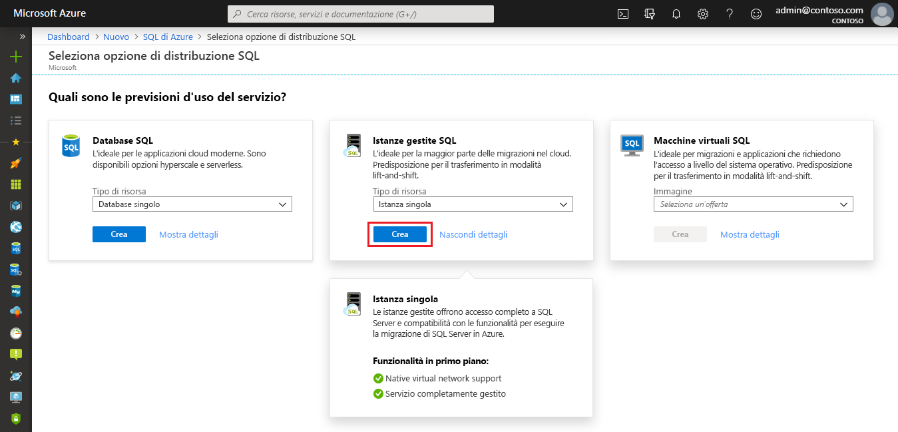

4. Usare le schede nel modulo di provisioning **Crea Istanza gestita di SQL di Azure** per aggiungere le informazioni obbligatorie e quelle facoltative. Le sezioni seguenti descrivono queste schede.

### Scheda Informazioni di base

- Compilare le informazioni nella scheda **Informazioni di base**. Contiene un set minimo di informazioni necessarie per effettuare il provisioning di un'istanza gestita.

   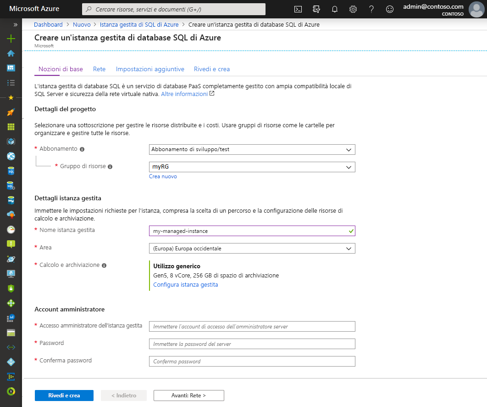

   Usare la tabella seguente come riferimento per le informazioni necessarie in questa scheda.

   | Impostazione| Valore consigliato | Descrizione |
   | ------ | --------------- | ----------- |
   | **Sottoscrizione** | Sottoscrizione in uso. | Una sottoscrizione che fornisce l'autorizzazione per creare nuove risorse. |
   | **Gruppo di risorse** | Gruppo di risorse nuovo o esistente.|Per i nomi di gruppi di risorse validi, vedere [Regole di denominazione e restrizioni](/azure/architecture/best-practices/resource-naming).|
   | **Nome istanza gestita** | Qualsiasi nome valido.|Per informazioni sui nomi validi, vedere [Regole di denominazione e restrizioni](/azure/architecture/best-practices/resource-naming).|
   | **Area** |Area in cui si vuole creare l'istanza gestita.|Per informazioni sulle aree, vedere [Aree di Azure](https://azure.microsoft.com/regions/).|
   | **Account di accesso amministratore istanza gestita** | Qualsiasi nome utente valido. | Per informazioni sui nomi validi, vedere [Regole di denominazione e restrizioni](/azure/architecture/best-practices/resource-naming). Non usare "serveradmin" perché è un ruolo a livello di server riservato.|
   | **Password** | Qualsiasi password valida.| La password deve contenere almeno 16 caratteri e soddisfare i [requisiti di complessità definiti](../../virtual-machines/windows/faq.md#what-are-the-password-requirements-when-creating-a-vm).|

- Selezionare **Configura istanza gestita** per definire le dimensioni delle risorse di calcolo e di archiviazione ed esaminare i piani tariffari. Usare i dispositivi di scorrimento o le caselle di testo per specificare la quantità di spazio di archiviazione e il numero di core virtuali. Al termine, selezionare **Applica** per salvare la selezione. 

   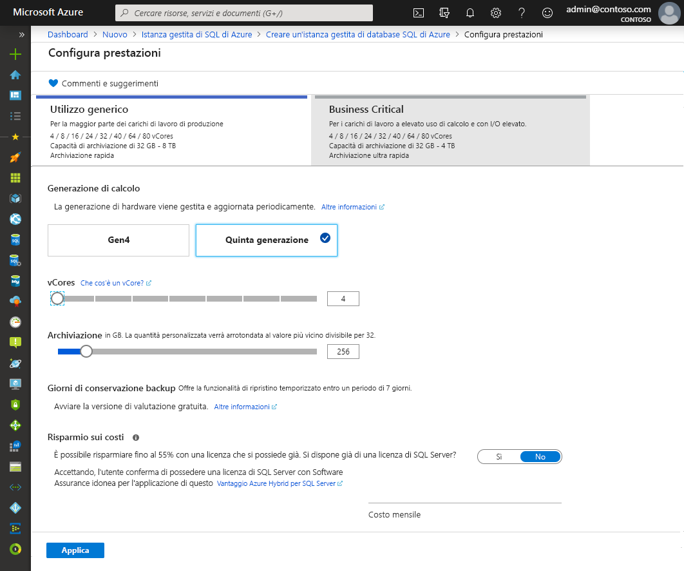

- Per rivedere le scelte effettuate prima di creare un'istanza gestita di SQL, è possibile selezionare **Rivedi e crea**. In alternativa, configurare le opzioni di rete selezionando **Avanti: Rete**.

### Scheda Rete

- Compilare le informazioni facoltative nella scheda **Rete**. Se si omettono queste informazioni, il portale applicherà le impostazioni predefinite.

   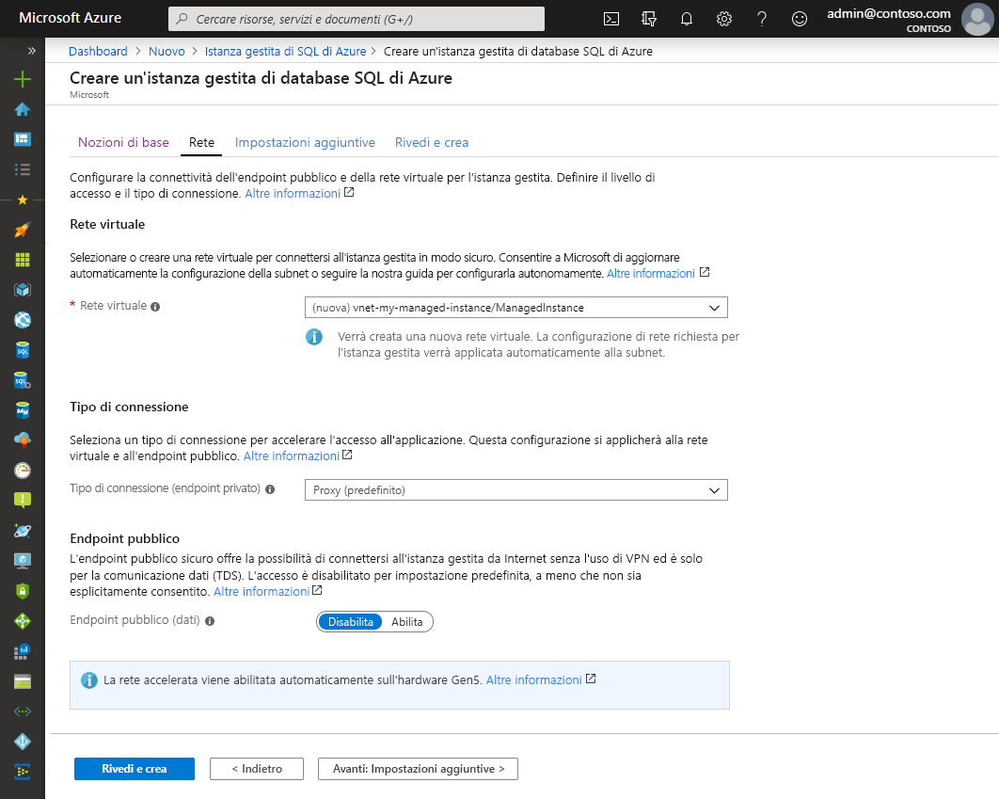

   Usare la tabella seguente come riferimento per le informazioni necessarie in questa scheda.

   | Impostazione| Valore consigliato | Descrizione |
   | ------ | --------------- | ----------- |
   | **Rete virtuale** | Selezionare **Crea nuova rete virtuale** o una rete virtuale valida e una subnet.| Se una rete o una subnet non è disponibile, prima di selezionarla come destinazione per la nuova istanza gestita, è necessario [modificarla per soddisfare i requisiti di rete](vnet-existing-add-subnet.md). Per informazioni sui requisiti per la configurazione dell'ambiente di rete per Istanza gestita di SQL, vedere [Configurare una rete virtuale per Istanza gestita di SQL](connectivity-architecture-overview.md). |
   | **Tipo di connessione** | Scegliere tra un tipo di connessione proxy e uno con reindirizzamento.|Per altre informazioni sui tipi di connessione, vedere [Tipo di connessione dell'istanza gestita di SQL di Azure](../database/connectivity-architecture.md#connection-policy).|
   | **Endpoint pubblico**  | Selezionare **Abilita**. | Affinché l'istanza gestita sia accessibile tramite l'endpoint dati pubblico, è necessario abilitare questa opzione. | 
   | **Consenti l'accesso da** (se è abilitata l'opzione **Endpoint pubblico**) | Selezionare una delle opzioni disponibili.   |L'esperienza del portale consente di configurare un gruppo di sicurezza con un endpoint pubblico.     A seconda dello scenario, selezionare una delle opzioni seguenti:   <ul> <li>**Servizi di Azure**: questa opzione è consigliabile in caso di connessione da Power BI o un altro servizio multi-tenant. </li> <li> **Internet**: usare questa opzione a scopo di test quando si vuole creare rapidamente un'istanza gestita. Non è consigliabile per ambienti di produzione. </li> <li> **Nessun accesso**: questa opzione crea una regola di sicurezza **Nega**. Modificare questa regola per rendere un'istanza gestita accessibile tramite un endpoint pubblico. </li> </ul>   Per altre informazioni sulla sicurezza dell'endpoint pubblico, vedere [Uso sicuro dell'istanza gestita di SQL di Azure con un endpoint pubblico](public-endpoint-overview.md).|

- Selezionare **Rivedi e crea** per rivedere le scelte effettuate prima di creare un'istanza gestita. In alternativa, configurare altre impostazioni personalizzate selezionando **Avanti: Impostazioni aggiuntive**.

### Impostazioni aggiuntive

- Compilare le informazioni facoltative nella scheda **Impostazioni aggiuntive**. Se si omettono queste informazioni, il portale applicherà le impostazioni predefinite.

   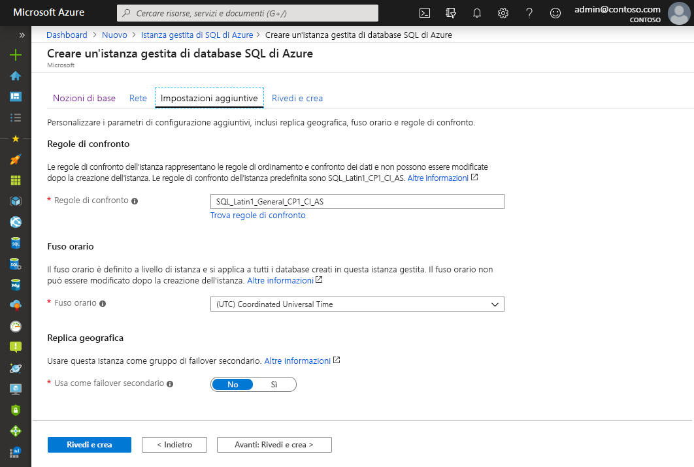

   Usare la tabella seguente come riferimento per le informazioni necessarie in questa scheda.

   | Impostazione| Valore consigliato | Descrizione |
   | ------ | --------------- | ----------- |
   | **Regole di confronto** | Scegliere le regole di confronto da usare per l'istanza gestita. In caso di migrazione di database da SQL Server, controllare le regole di confronto di origine con `SELECT SERVERPROPERTY(N'Collation')` e usare tale valore.| Per informazioni sulle regole di confronto, vedere [Impostare o modificare le regole di confronto del server](https://docs.microsoft.com/sql/relational-databases/collations/set-or-change-the-server-collation).|   
   | **Fuso orario** | Selezionare il fuso orario che verrà osservato dall'istanza gestita.|Per altre informazioni, vedere [Fusi orari](timezones-overview.md).|
   | **Usa come failover secondario** | Selezionare **Sì**. | Abilitare questa opzione per usare l'istanza gestita come istanza secondaria del gruppo di failover.|
   | **Istanza gestita di SQL primaria** (se l'opzione **Usa come failover secondario** è impostata su **Sì**) | Scegliere un'istanza gestita primaria esistente che verrà aggiunta alla stessa zona DNS dell'istanza gestita che si sta creando. | Questo passaggio consentirà la configurazione del gruppo di failover dopo la creazione. Per altre informazioni, vedere [Esercitazione: Aggiungere l'istanza gestita a un gruppo di failover](failover-group-add-instance-tutorial.md).|

## Rivedi e crea

1. Selezionare la scheda **Rivedi e crea** per rivedere le scelte effettuate prima di creare un'istanza gestita.

   

1. Selezionare **Crea** per avviare il provisioning dell'istanza gestita.

> [!IMPORTANT]
> La distribuzione di un'istanza gestita è un'operazione di lunga durata. La distribuzione della prima istanza nella subnet richiede in genere molto più tempo rispetto alla distribuzione in una subnet contenente istanze gestite esistenti. Per informazioni sui tempi medi di provisioning, vedere [Operazioni di gestione di istanze gestite di SQL](sql-managed-instance-paas-overview.md#management-operations).

## Monitorare lo stato di avanzamento della distribuzione

1. Selezionare l'icona **Notifiche** per visualizzare lo stato della distribuzione.

   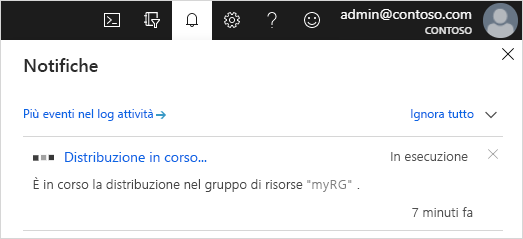

1. Selezionare **Distribuzione in corso** nella notifica per aprire la finestra dell'istanza gestita di SQL e monitorare ulteriormente lo stato di avanzamento della distribuzione. 

> [!TIP]
> Se si è chiuso il Web browser o si è passati a un'altra schermata, seguire questa procedura per tornare alla schermata dello stato di avanzamento della distribuzione:
> 1. Nel portale di Azure aprire il gruppo di risorse in cui si sta distribuendo un'istanza gestita di SQL nella scheda **Informazioni di base**.
> 2. Selezionare **Distribuzioni**.
> 3. Selezionare l'operazione di distribuzione di istanza gestita di SQL in corso.

> [!IMPORTANT]
> - La creazione di Istanza gestita di SQL è un'operazione a esecuzione prolungata che potrebbe richiedere diverse ore alla volta, a seconda delle specifiche circostanze. Per i tempi tipici di creazione, vedere [Durata delle operazioni di gestione](management-operations-overview.md#management-operations-duration).
> - L'avvio della creazione di Istanza gestita di SQL potrebbe essere ritardato a causa di altre operazioni a esecuzione prolungata già in corso, ad esempio operazioni di ripristino o dimensionamento di altre istanze gestite nella stessa subnet. Per altre informazioni, vedere [Effetti incrociati sulle operazioni di gestione](management-operations-overview.md#management-operations-cross-impact).
> - Per ottenere lo stato della creazione dell'istanza gestita, è necessario avere **autorizzazioni di lettura** per il gruppo di risorse. Se non si ha questa autorizzazione o la si revoca mentre è in corso la creazione dell'istanza gestita, è possibile che l'istanza gestita di SQL non sia visibile nell'elenco delle distribuzioni del gruppo di risorse.
>

## Visualizzare le risorse create

Al completamento della distribuzione dell'istanza gestita, per visualizzare le risorse create:

1. Aprire il gruppo di risorse per l'istanza gestita. 

   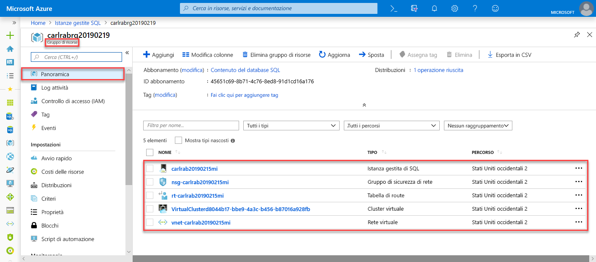

## Visualizzare e ottimizzare le impostazioni di rete

Per ottimizzare facoltativamente le impostazioni di rete, controllare quanto segue:

1. Selezionare la tabella di route per esaminare la route definita dall'utente creata automaticamente.

   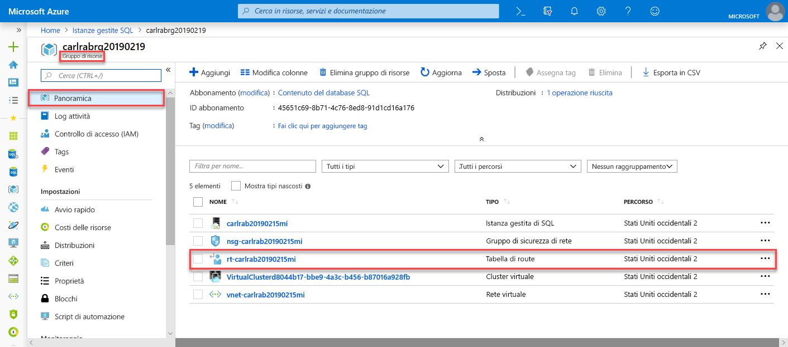

2. Nella tabella di route esaminare le voci per indirizzare il traffico dalla rete virtuale dell'istanza gestita di SQL e all'interno di tale rete. Se la tabella di route viene creata o configurata manualmente, assicurarsi di creare queste voci nella tabella di route dell'istanza gestita di SQL.

   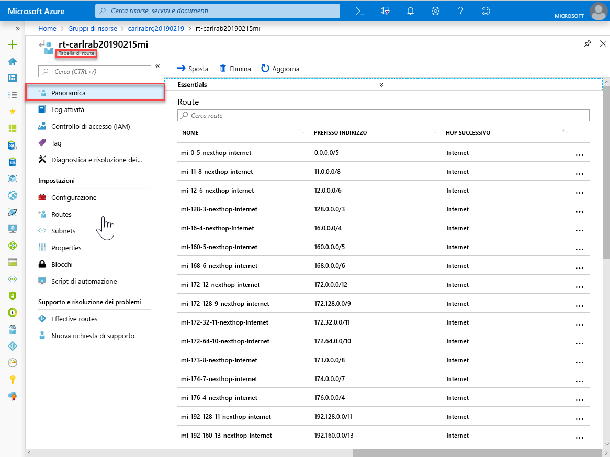

3. Tornare al gruppo di risorse e selezionare il gruppo di sicurezza di rete.

   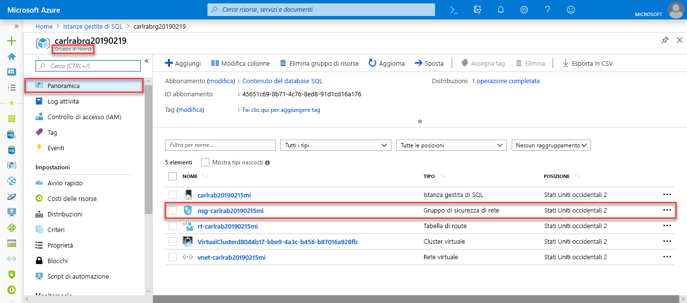

4. Esaminare le regole di sicurezza in ingresso e in uscita. 

   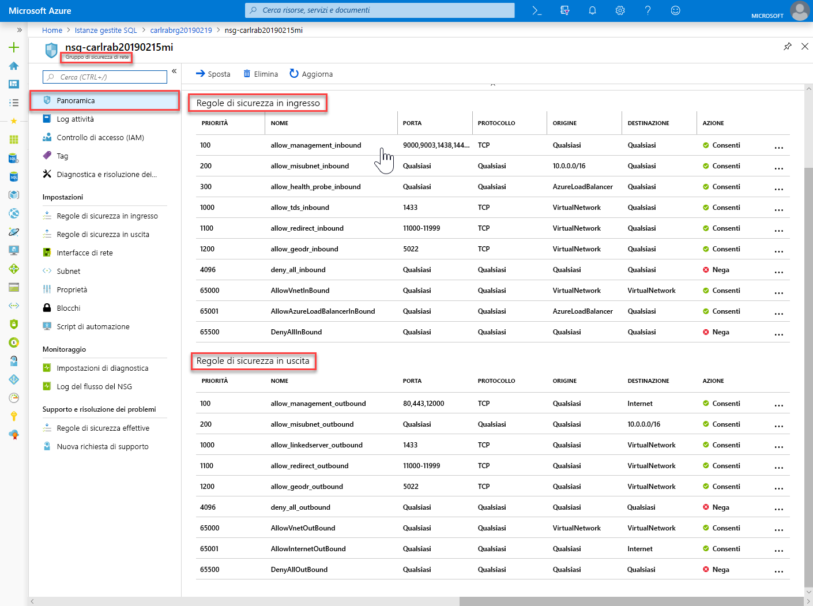

> [!IMPORTANT]
> Se è stato configurato un endpoint pubblico per Istanza gestita di SQL, è necessario aprire le porte per autorizzare il traffico di rete che consente le connessioni all'istanza gestita di SQL dalla rete Internet pubblica. Per altre informazioni, vedere [Configurare un endpoint pubblico per Istanza gestita di SQL](public-endpoint-configure.md#allow-public-endpoint-traffic-on-the-network-security-group).
>

## Recuperare i dettagli della connessione all'istanza gestita di SQL

Per connettersi all'istanza gestita di SQL, seguire questa procedura per recuperare il nome host e il nome di dominio completo (FQDN):

1. Tornare nel gruppo di risorse e selezionare l'istanza gestita.

   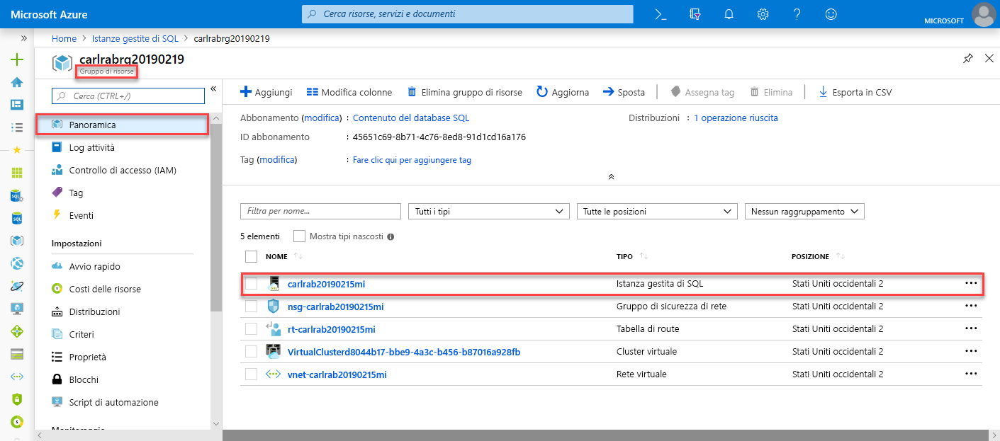

2. Nella scheda **Panoramica** individuare la proprietà **Host**. Copiare il nome host per l'istanza gestita da usare nel successivo argomento di avvio rapido.

   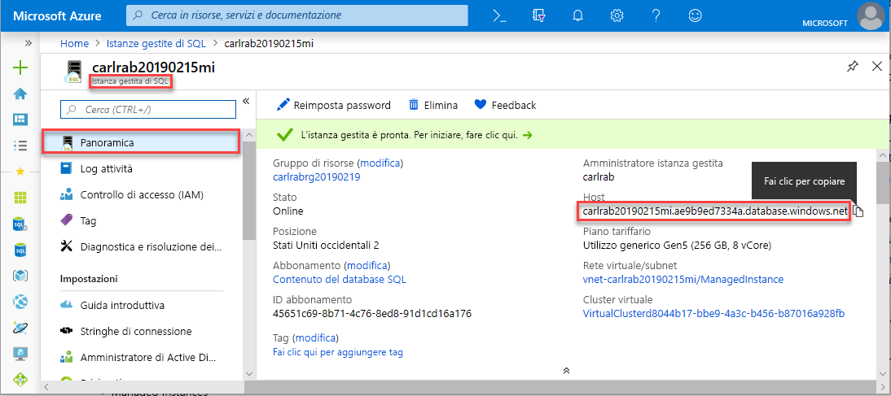

   Il valore copiato rappresenta un nome di dominio completo (FQDN) che può essere usato per connettersi all'istanza gestita di SQL. È simile all'esempio di indirizzo seguente: *your_host_name.a1b2c3d4e5f6.database.windows.net*.

## Passaggi successivi

Per informazioni su come connettersi a Istanza gestita di SQL:
- Per una panoramica delle opzioni di connessione per le applicazioni, vedere [Connettere le applicazioni a Istanza gestita di SQL](connect-application-instance.md).
- Per una guida di avvio rapido che illustra come connettersi a Istanza gestita di SQL tramite una macchina virtuale di Azure, vedere [Configurare una connessione tramite macchina virtuale di Azure](connect-vm-instance-configure.md).
- Per una guida di avvio rapido che illustra come connettersi a Istanza gestita di SQL tramite un computer client locale usando una connessione da punto a sito, vedere [Configurare una connessione da punto a sito](point-to-site-p2s-configure.md).

Per ripristinare un database di SQL Server esistente dall'ambiente locale a Istanza gestita di SQL: 
- Usare il [Servizio Migrazione del database di Azure per la migrazione](../../dms/tutorial-sql-server-to-managed-instance.md) per eseguire il ripristino da un file di backup del database. 
- Usare il [comando T-SQL RESTORE](restore-sample-database-quickstart.md) per eseguire il ripristino da un file di backup del database.

Per informazioni sul monitoraggio avanzato delle prestazioni del database dell'istanza gestita di SQL con intelligence predefinita per la risoluzione dei problemi, vedere [Monitorare l'istanza gestita di SQL di Azure usando Analisi SQL di Azure](../../azure-monitor/insights/azure-sql.md).
