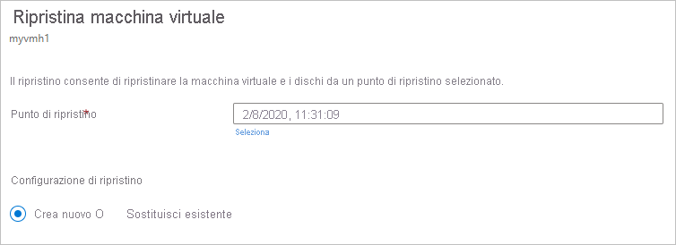
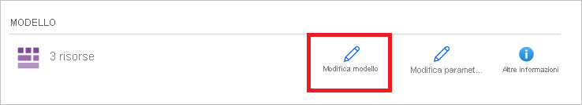
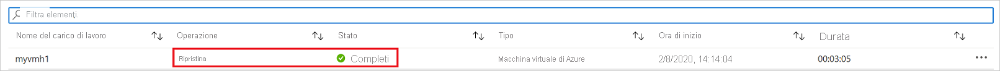

# Come ripristinare i dati delle macchine virtuali di Azure in portale di Azure

Questo articolo descrive come ripristinare i dati delle macchine virtuali di Azure dai punti di ripristino archiviati negli insiemi di credenziali di Servizi di ripristino di [Backup di Azure](backup-overview.md).

## Opzioni di ripristino

Backup di Azure offre diversi modi per ripristinare una macchina virtuale.

**Opzione di ripristino** | **Dettagli**
--- | ---
**Create a new VM** (Crea una nuova macchina virtuale) | Crea e rende operativa rapidamente una macchina virtuale di base a partire da un punto di ripristino.   È possibile specificare un nome per la VM, selezionare il gruppo di risorse e la rete virtuale (VNet) in cui verrà inserito e specificare un account di archiviazione per la macchina virtuale ripristinata. La nuova VM deve essere creata nella stessa area della VM di origine.
**Restore disk** (Ripristina disco) | Ripristina un disco della macchina virtuale, che può quindi essere usato per creare una nuova macchina virtuale.   Backup di Azure offre un modello che consente di personalizzare e creare una macchina virtuale.    Il processo di ripristino genera un modello che può essere scaricato e usato per specificare impostazioni della macchina virtuale personalizzate e creare una macchina virtuale.   I dischi vengono copiati nell'account di archiviazione specificato.   In alternativa, è possibile collegare il disco a una macchina virtuale esistente o creare una nuova macchina virtuale usando PowerShell.   Questa opzione è utile se si vuole personalizzare la macchina virtuale, aggiungere impostazioni di configurazione non presenti al momento del backup o aggiungere impostazioni che devono essere configurate usando il modello o PowerShell.
**Sostituisci esistente** | È possibile ripristinare un disco e usarlo per sostituire un disco nella macchina virtuale esistente.   Deve essere presente la macchina virtuale corrente. Se è stata eliminata, non è possibile usare questa opzione.   Backup di Azure esegue uno snapshot della macchina virtuale esistente prima di sostituire il disco e lo archivia nel percorso di gestione temporanea specificato. I dischi esistenti connessi alla macchina virtuale vengono sostituiti con il punto di ripristino selezionato.   Lo snapshot viene copiato nell'insieme di credenziali e mantenuto in base ai criteri di conservazione.    L'opzione Sostituisci esistente è supportata per le macchine virtuali gestite non crittografate. Non è supportata per i dischi non gestiti, le [macchine virtuali generalizzate](https://docs.microsoft.com/azure/virtual-machines/windows/capture-image-resource) o le macchine virtuali [create usando immagini personalizzate](https://azure.microsoft.com/resources/videos/create-a-custom-virtual-machine-image-in-azure-resource-manager-with-powershell/).   Se il punto di ripristino ha un numero maggiore o minore di dischi rispetto alla macchina virtuale corrente, il numero di dischi nel punto di ripristino rifletterà solo la configurazione della macchina virtuale.  

> [!NOTE]
> È anche possibile ripristinare file e cartelle specifici in una macchina virtuale di Azure. [Altre informazioni](backup-azure-restore-files-from-vm.md)
>
> Se si esegue la [versione più recente](backup-instant-restore-capability.md) di Backup di Azure per macchine virtuali di Azure (noto come Ripristino istantaneo), gli snapshot possono essere conservati fino a un massimo di sette giorni ed è possibile ripristinare una macchina virtuale dagli snapshot prima che i dati di backup vengano inviati all'insieme di credenziali. Se si vuole ripristinare una macchina virtuale da un backup degli ultimi sette giorni, è più rapido effettuare il ripristino dallo snapshot anziché dall'insieme di credenziali.

## Account di archiviazione

Alcuni dettagli sugli account di archiviazione:

- **Crea macchina virtuale**: Quando si crea una nuova VM, la macchina virtuale viene inserita nell'account di archiviazione specificato.
- **Ripristino del disco**: Quando si ripristina un disco, il disco viene copiato nell'account di archiviazione specificato. Il processo di ripristino genera un modello che è possibile scaricare e usare per specificare le impostazioni della macchina virtuale personalizzata. Questo modello viene inserito nell'account di archiviazione specificato.
- **Sostituisci disco**: Quando si sostituisce un disco in una macchina virtuale esistente, backup di Azure esegue uno snapshot della macchina virtuale esistente prima di sostituire il disco. Lo snapshot viene archiviato nel percorso di gestione temporanea (account di archiviazione) specificato. Questo account di archiviazione viene usato per archiviare temporaneamente lo snapshot durante il processo di ripristino ed è consigliabile creare un nuovo account a tale scopo, che può essere facilmente rimosso in seguito.
- **Percorso dell'account di archiviazione**: L'account di archiviazione deve trovarsi nella stessa area dell'insieme di credenziali. Vengono visualizzati solo questi account. Se non sono presenti account di archiviazione nella località, è necessario crearne uno.
- **Tipo di archiviazione**: L'archiviazione BLOB non è supportata.
- **Ridondanza di archiviazione**: L'archiviazione con ridondanza della zona non è supportata. Le informazioni di replica e ridondanza per l'account sono visualizzate tra parentesi dopo il nome dell'account. 
- **Archiviazione Premium**:
    - Quando si ripristinano macchine virtuali non Premium, gli account di archiviazione Premium non sono supportati.
    - Quando si ripristinano macchine virtuali gestite, gli account di archiviazione Premium configurati con regole di rete non sono supportati

## Prima di iniziare

Per ripristinare una macchina virtuale (creare una nuova macchina virtuale), assicurarsi di avere le [autorizzazioni](backup-rbac-rs-vault.md#mapping-backup-built-in-roles-to-backup-management-actions) corrette per il controllo degli accessi in base al ruolo per l'operazione di ripristino della macchina virtuale.

Se non si dispone delle autorizzazioni, è possibile [ripristinare un disco](#restore-disks)e quindi, dopo aver ripristinato il disco, è possibile [usare il modello](#use-templates-to-customize-a-restored-vm) che è stato generato durante l'operazione di ripristino per creare una nuova macchina virtuale.

## Selezionare un punto di ripristino

1. Nell'insieme di credenziali associato alla macchina virtuale da ripristinare, fare clic su **Elementi di backup** > **Macchina virtuale di Azure**.
2. Fare clic su una macchina virtuale. Per impostazione predefinita, nel dashboard della macchina virtuale verranno visualizzati i punti di ripristino degli ultimi 30 giorni. È possibile visualizzare punti di ripristino antecedenti a 30 giorni o applicare un filtro per trovare punti di ripristino in base a date, intervalli di tempo e tipi diversi di coerenza degli snapshot.
3. Per ripristinare la macchina virtuale, fare clic su **Ripristina macchina virtuale**.

    

4. Selezionare un punto di ripristino da usare per il ripristino.

## Scegliere una configurazione di ripristino per la macchina virtuale

1. In **Configurazione di ripristino** selezionare un'opzione di ripristino:
    - **Crea nuovo**: Usare questa opzione se si vuole creare una nuova macchina virtuale. È possibile creare una macchina virtuale con impostazioni semplici o ripristinare un disco e creare una macchina virtuale personalizzata.
    - **Sostituisci esistente**. Usare questa opzione se si vuole sostituire dischi in una macchina virtuale esistente.

        

2. Specificare le impostazioni per l'opzione di ripristino selezionata.

## Creare una macchina virtuale

Tra le [opzioni di ripristino](#restore-options) è possibile creare rapidamente una macchina virtuale con le impostazioni di base da un punto di ripristino.

1. In **Configurazione di ripristino** > **Crea nuovo** > **Tipo di ripristino** selezionare **Crea macchina virtuale**.
2. In **nome macchina virtuale**specificare una macchina virtuale che non esiste nella sottoscrizione.
3. In **Gruppo di risorse** selezionare un gruppo di risorse esistente per la nuova macchina virtuale o crearne uno nuovo con un nome univoco globale. Se si assegna un nome già esistente, Azure assegnerà al gruppo lo stesso nome della macchina virtuale.
4. In **Rete virtuale** selezionare la rete virtuale in cui verrà inserita la macchina virtuale. Vengono visualizzate tutte le reti virtuali associate alla sottoscrizione. Selezionare la subnet. La prima subnet è selezionata per impostazione predefinita.
5. In **percorso di archiviazione**specificare l'account di archiviazione per la macchina virtuale. [Altre informazioni](#storage-accounts)

    

6. In **Configurazione di ripristino** selezionare **OK**. In **Ripristino** fare clic su **Ripristina** per attivare l'operazione di ripristino.

## Ripristinare i dischi

Tra le [opzioni di ripristino](#restore-options) è possibile creare un disco da un punto di ripristino. Con il disco è quindi possibile eseguire una di queste operazioni:

- Usare il modello generato durante l'operazione di ripristino per personalizzare le impostazioni e attivare la distribuzione della macchina virtuale. Modificare le impostazioni predefinite del modello e inviare il modello per la distribuzione della macchina virtuale.
- [Collegare i dischi ripristinati](https://docs.microsoft.com/azure/virtual-machines/windows/attach-managed-disk-portal) a una macchina virtuale esistente.
- [Creare una nuova macchina virtuale](https://docs.microsoft.com/azure/backup/backup-azure-vms-automation#create-a-vm-from-restored-disks) dai dischi ripristinati usando PowerShell.

1. In **Configurazione di ripristino** > **Crea nuovo** > **Tipo di ripristino** selezionare **Dischi di ripristino**.
2. In **Gruppo di risorse** selezionare un gruppo di risorse per i dischi ripristinati o crearne uno nuovo con un nome univoco globale.
3. In **Account di archiviazione** specificare l'account in cui copiare i dischi rigidi virtuali. [Altre informazioni](#storage-accounts)

    

4. In **Configurazione di ripristino** selezionare **OK**. In **Ripristino** fare clic su **Ripristina** per attivare l'operazione di ripristino.

Quando la macchina virtuale usa dischi gestiti e si seleziona l'opzione **Crea macchina virtuale** , backup di Azure non usa l'account di archiviazione specificato. Nel caso di **ripristino dei dischi** e del **ripristino immediato**, l'account di archiviazione viene usato solo per l'archiviazione del modello. I dischi gestiti vengono creati nel gruppo di risorse specificato.
Quando la macchina virtuale usa dischi non gestiti, questi vengono ripristinati come BLOB nell'account di archiviazione.

### Usare i modelli per personalizzare una VM ripristinata

Dopo il ripristino del disco, usare il modello generato come parte dell'operazione di ripristino per personalizzare e creare una nuova macchina virtuale:

1. Aprire **Ripristina - Dettagli processo** per il processo pertinente.

2. In **Ripristino - Dettagli processo** selezionare **Deploy Template** (Distribuisci modello) per avviare la distribuzione del modello.

    

3. Per personalizzare l'impostazione della macchina virtuale inclusa nel modello, fare clic su **Modifica modello**. Se si vuole aggiungere altre personalizzazioni, fare clic su **Modifica parametri**.
    - [Vedere altre informazioni](../azure-resource-manager/resource-group-template-deploy-portal.md#deploy-resources-from-custom-template) sulla distribuzione delle risorse da un modello personalizzato.
    - [Vedere altre informazioni](../azure-resource-manager/resource-group-authoring-templates.md) sulla creazione di modelli.

   

4. Immettere i valori personalizzati per la macchina virtuale, accettare quanto dichiarato in **Condizioni** e fare clic su **Acquista**.

   

## Sostituire i dischi esistenti

Tra le [opzioni di ripristino](#restore-options) è possibile sostituire un disco di macchina virtuale esistente con il punto di ripristino selezionato. [Rivedere](#restore-options) tutte le opzioni di ripristino.

1. In **Configurazione di ripristino** fare clic su **Sostituisci esistente**.
2. In **Tipo ripristino** selezionare **Replace disk/s** (Sostituisci dischi). Questo è il punto di ripristino che verrà usato per sostituire i dischi delle macchine virtuali esistenti.
3. In **percorso di gestione temporanea**specificare dove salvare gli snapshot dei dischi gestiti correnti durante il processo di ripristino. [Altre informazioni](#storage-accounts)

   

## Ripristinare le macchine virtuali con configurazioni speciali

Esistono diversi scenari comuni in cui potrebbe essere necessario ripristinare le macchine virtuali.

**Scenario** | **Materiale sussidiario**
--- | ---
**Ripristino di macchine virtuali con vantaggio Hybrid Use** | Se una macchina virtuale Windows usa la [licenza per il vantaggio Hybrid Use (HUB)](../virtual-machines/windows/hybrid-use-benefit-licensing.md), ripristinare i dischi e creare una nuova macchina virtuale usando il modello fornito (con **Tipo di licenza** impostato su **Windows_Server**) o PowerShell.  È possibile applicare questa impostazione anche dopo aver creato la macchina virtuale.
**Ripristino di macchine virtuali durante un'emergenza nel data center di Azure** | Se l'insieme di credenziali usa l'archiviazione con ridondanza geografica e il data center principale per la macchina virtuale si arresta, Backup di Azure supporta il ripristino delle macchine virtuali sottoposte a backup nel data center associato. Selezionare un account di archiviazione nel data center associato e ripristinare come di consueto. Backup di Azure usa il servizio di calcolo nella posizione associata per creare la macchina virtuale ripristinata. [Vedere altre informazioni](../resiliency/resiliency-technical-guidance-recovery-loss-azure-region.md) sulla resilienza dei data center.
**Ripristino di una macchina virtuale con controller di dominio singolo in un dominio singolo** | Ripristinare la macchina virtuale come qualsiasi altra macchina virtuale. Si noti che:   Da un punto di vista Active Directory, la macchina virtuale di Azure è come qualsiasi altra macchina virtuale.   È anche disponibile Modalità ripristino servizi directory (Directory Services Restore Mode, DSRM), in modo che tutti gli scenari di ripristino di Active Directory siano attuabili. [Vedere altre informazioni](https://docs.microsoft.com/windows-server/identity/ad-ds/get-started/virtual-dc/virtualized-domain-controllers-hyper-v) sul backup e il ripristino dei controller di dominio virtualizzati.
**Ripristino di macchine virtuali con più controller di dominio in un dominio singolo** | Se è possibile raggiungere altri controller di dominio nello stesso dominio tramite la rete, è possibile ripristinare il controller di dominio come qualsiasi macchina virtuale. Se si tratta dell'ultimo controller di dominio restante nel dominio o viene eseguito un ripristino in una rete isolata, effettuare un [ripristino della foresta](https://docs.microsoft.com/windows-server/identity/ad-ds/manage/ad-forest-recovery-single-domain-in-multidomain-recovery).
**Ripristino di domini multipli in una foresta** | È consigliabile eseguire un [ripristino della foresta](https://docs.microsoft.com/windows-server/identity/ad-ds/manage/ad-forest-recovery-single-domain-in-multidomain-recovery).
**Ripristino bare metal** | La differenza principale tra le macchine virtuali di Azure e gli hypervisor locali consiste nel fatto che in Azure non è disponibile una console per macchine virtuali. La console è obbligatoria per alcuni scenari, ad esempio per il ripristino tramite un backup di tipo di ripristino bare metal (BMR). Tuttavia, il ripristino della macchina virtuale dall'insieme di credenziali è una sostituzione completa con il ripristino bare metal.
**Ripristino di macchine virtuali con configurazioni di rete speciali** | Configurazioni di rete speciali includono macchine virtuali con bilanciamento del carico interno o esterno, con più schede di interfaccia di rete o con più indirizzi IP riservati. Per ripristinare queste macchine virtuali, usare l'[opzione relativa al disco di ripristino](#restore-disks). Questa opzione Crea una copia dei dischi rigidi virtuali nell'account di archiviazione specificato ed è quindi possibile creare una macchina virtuale con un servizio di bilanciamento del carico [interno](https://azure.microsoft.com/documentation/articles/load-balancer-internal-getstarted/) o [esterno](https://azure.microsoft.com/documentation/articles/load-balancer-internet-getstarted/) , [più schede](../virtual-machines/windows/multiple-nics.md)di rete o [più indirizzi IP riservati](../virtual-network/virtual-network-multiple-ip-addresses-powershell.md), in conformità con il configurazione.
**Gruppo di sicurezza di rete (NSG) nella scheda NIC/subnet** | Il backup di macchine virtuali di Azure supporta il backup e il ripristino delle informazioni NSG a livello di VNET, subnet e NIC.
**VM bloccate della zona** | Backup di Azure supporta il backup e il ripristino di VM bloccate in zone. [Altre informazioni](https://azure.microsoft.com/global-infrastructure/availability-zones/)

## Tenere traccia dell'operazione di ripristino
Dopo l'attivazione dell'operazione di ripristino, il servizio di backup crea un processo per tenerne traccia. Backup di Azure consente di visualizzare le notifiche relative al processo nel portale. Se non sono visibili, selezionare il simbolo **notifiche** e quindi selezionare **Visualizza tutti i processi** per visualizzare lo stato del processo di ripristino.

 Tenere traccia del ripristino come segue:

1. Per visualizzare le operazioni relative al processo, fare clic sul collegamento ipertestuale relativo alle notifiche. In alternativa, nell'insieme di credenziali fare clic su **Processi di backup** e quindi sulla macchina virtuale pertinente.

    

2. Per monitorare lo stato di un ripristino, fare clic su un processo di ripristino con stato **In corso**. Viene visualizzato l'indicatore di stato, che visualizza informazioni sullo stato di avanzamento del ripristino:

    - **Estimated time of restore** (Tempo di ripristino stimato): indica inizialmente il tempo impiegato per il completamento dell'operazione di ripristino. Con il progressivo avanzamento dell'operazione, il tempo impiegato si riduce fino a raggiungere il valore 0 al termine dell'operazione di ripristino.
    - **Percentage of restore** (Percentuale di ripristino): mostra la percentuale di completamento dell'operazione di ripristino.
    - **Number of bytes transferred** (Numero di byte trasferiti): se si sta eseguendo il ripristino creando una nuova macchina virtuale, mostra i byte trasferiti a fronte del numero totale di byte da trasferire.

## Operazioni successive al ripristino

Esistono diversi aspetti di cui tenere conto dopo il ripristino di una macchina virtuale:

- Le estensioni presenti durante la configurazione del backup vengono installate, ma non abilitate. Se si verifica un problema, reinstallare le estensioni.
- Se la macchina virtuale sottoposta a backup era associata a un indirizzo IP statico, la macchina virtuale ripristinata avrà un indirizzo IP dinamico per evitare conflitti. È possibile [aggiungere un indirizzo IP statico alla macchina virtuale ripristinata](../virtual-network/virtual-networks-reserved-private-ip.md#how-to-add-a-static-internal-ip-to-an-existing-vm).
- Una macchina virtuale ripristinata non ha un set di disponibilità. Se si usa l'opzione Ripristina disco, è possibile [specificare un set di disponibilità](../virtual-machines/windows/tutorial-availability-sets.md) quando si crea una macchina virtuale dal disco usando il modello fornito o PowerShell.
- Se si usa una distribuzione Linux basata su cloud-init, ad esempio Ubuntu, per motivi di sicurezza la password verrà bloccata dopo il ripristino. Per [reimpostare la password](../virtual-machines/linux/reset-password.md) nella VM ripristinata, usare l'estensione VMAccess. È consigliabile usare chiavi SSH in queste distribuzioni in modo da non dover reimpostare la password dopo il ripristino.

## Backup di macchine virtuali ripristinate

- Se una macchina virtuale è stata ripristinata nello stesso gruppo di risorse con lo stesso nome della macchina virtuale di cui è stato originariamente eseguito il backup, l'operazione di backup continuerà nella macchina virtuale dopo il ripristino.
- Se la macchina virtuale è stata ripristinata in un gruppo di risorse diverso o si è specificato un nome diverso per la macchina virtuale ripristinata, sarà necessario configurare il backup per la macchina virtuale ripristinata.

## Passaggi successivi

- In caso di difficoltà durante il processo di ripristino, [esaminare](backup-azure-vms-troubleshoot.md#restore) i problemi e gli errori comuni.
- Dopo il ripristino della macchina virtuale, vedere altre informazioni sulla [gestione delle macchine virtuali](backup-azure-manage-vms.md).
