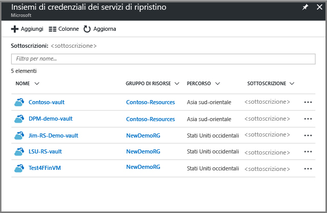
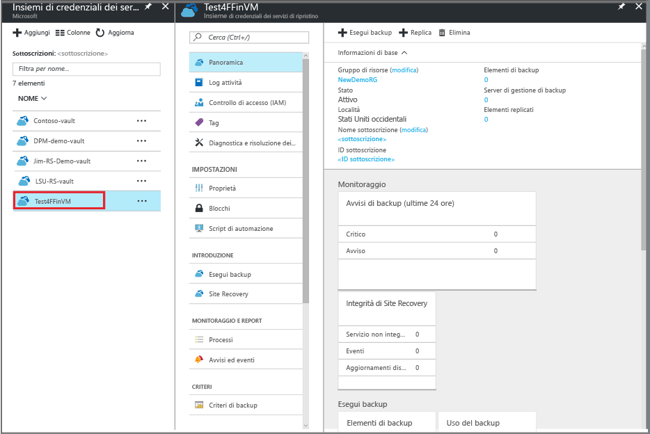
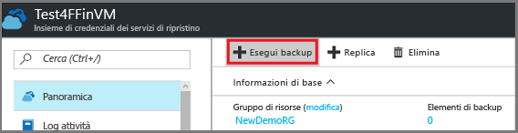
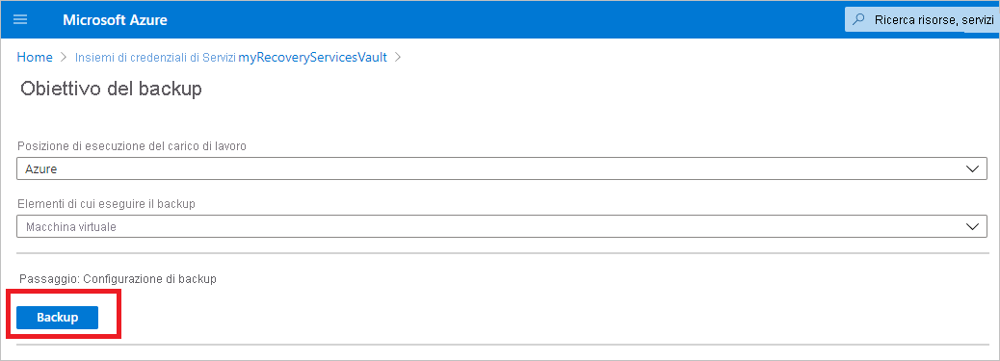
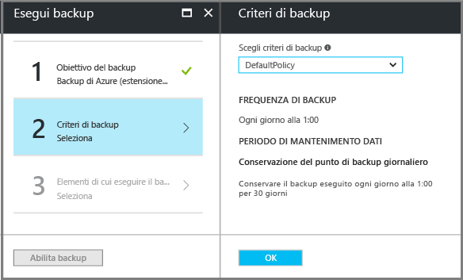
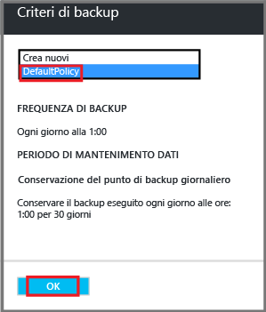
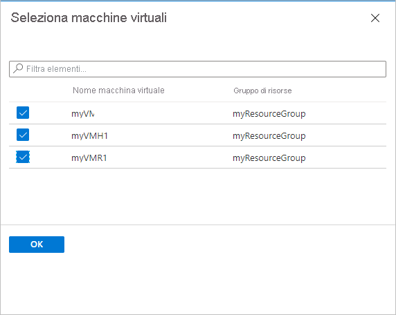
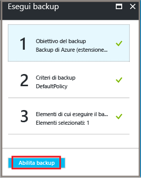

# <a name="prepare-your-environment-to-back-up-resource-manager-deployed-virtual-machines"></a>Preparare l’ambiente per il backup di macchine virtuali distribuite con Resource Manager
> [!div class="op_single_selector"]
> * [Modello di Resource Manager](backup-azure-arm-vms-prepare.md)
> * [Modello classico](backup-azure-vms-prepare.md)
>
>

Questo articolo illustra i passaggi per preparare un ambiente in cui eseguire il backup di una macchina virtuale (VM) distribuita con Resource Manager. I passaggi descritti nelle procedure usano il portale di Azure.  

Il servizio Backup di Azure offre due tipi di insiemi di credenziali (insieme di credenziali di backup e insiemi di credenziali dei servizi di ripristino) per proteggere le macchine virtuali. L'insieme di credenziali di backup protegge le macchine virtuali distribuite usando il modello di distribuzione classico. L'insieme di credenziali dei servizi di ripristino protegge ** le macchine virtuali distribuite sia con il modello di distribuzione classica sia con il modello di distribuzione Resource Manager**. È necessario usare un insieme di credenziali dei servizi di ripristino per proteggere una macchina virtuale distribuita con Resource Manager.

> [!NOTE]
> Azure offre due modelli di distribuzione per creare e usare le risorse: [Resource Manager e distribuzione classica](../azure-resource-manager/resource-manager-deployment-model.md). Per informazioni dettagliate sull'utilizzo delle macchine virtuali con il modello di distribuzione classica, vedere [Preparare l'ambiente per il backup di macchine virtuali di Azure](backup-azure-vms-prepare.md) .
>
>

Prima di proteggere o eseguire il backup di una macchina virtuale (VM) di Resource Manager, verificare che siano disponibili i prerequisiti seguenti:

* Creare un insieme di credenziali dei servizi di ripristino o identificarne uno esistente *nella stessa località della macchina virtuale*.
* Selezionare uno scenario, definire i criteri di backup e specificare gli elementi da proteggere.
* Verificare l'installazione dell'agente di macchine virtuali nella macchina virtuale.
* Verificare la connettività della rete

Se nell'ambiente esistono già queste condizioni, passare all'articolo [Eseguire il backup di macchine virtuali di Azure](backup-azure-vms.md). Se si vuole impostare o verificare qualsiasi prerequisito, questo articolo spiega la procedura di preparazione dei prerequisiti.

##<a name="supported-operating-system-for-backup"></a>Sistema operativo supportato per il backup
 * **Linux**: Backup di Azure supporta [un elenco di distribuzioni approvate da Azure](../virtual-machines/virtual-machines-linux-endorsed-distros.md?toc=%2fazure%2fvirtual-machines%2flinux%2ftoc.json) , ad eccezione di CoreOS Linux. _È possibile usare altre distribuzioni Bring Your Own Linux, a condizione che l'agente di macchine virtuali sia disponibile nella macchina virtuale e sia configurato il supporto per Python. Microsoft tuttavia non consiglia queste distribuzioni per il backup._
 * **Windows Server**: le versioni precedenti a Windows Server 2008 R2 non sono supportate.

## <a name="limitations-when-backing-up-and-restoring-a-vm"></a>Limitazioni durante il backup e il ripristino di una VM
Prima di preparare l'ambiente, è importante capire le limitazioni.

* Il backup di macchine virtuali con più di 16 dischi dati non è supportato.
* Il backup di macchine virtuali con un indirizzo IP riservato e nessun endpoint definito non è supportato.
* Il backup delle macchine virtuali Linux con estensione Docker non è supportato.
* I dati di backup non includono le unità di rete montate collegate alla macchina virtuale.
* La sostituzione di una macchina virtuale esistente durante il ripristino non è supportata. Se si tenta di ripristinare una macchina virtuale che esiste, l'operazione di ripristino non viene eseguita.
* L'operazione di backup e ripristino tra aree geografiche diverse non è supportata.
* È possibile eseguire il backup di macchine virtuali in tutte le aree pubbliche di Azure. Vedere l'[elenco di controllo](https://azure.microsoft.com/regions/#services) delle aree supportate. Se l'area che si sta cercando non è attualmente supportata, tale area non verrà visualizzata nell'elenco a discesa durante la creazione dell'insieme di credenziali.
* Il ripristino di un controller di dominio di VM che fa parte di una configurazione con controller di dominio è supportato solo tramite PowerShell. Altre informazioni sul [ripristino di un controller di dominio con più controller di dominio](backup-azure-restore-vms.md#restoring-domain-controller-vms).
* Il ripristino delle macchine virtuali che presentano le seguenti configurazioni di rete speciali è supportato solo tramite PowerShell. Le macchine virtuali create usando il flusso di lavoro di ripristino nell'interfaccia utente non avranno queste configurazioni di rete dopo l'operazione di ripristino. Per altre informazioni, vedere [Ripristino delle macchine virtuali con configurazioni di rete speciali](backup-azure-restore-vms.md#restoring-vms-with-special-network-configurations).
  * Macchine virtuali con configurazione del servizio di bilanciamento del carico (interno ed esterno)
  * Macchine virtuali con più indirizzi IP riservati
  * Macchine virtuali con più schede di rete

## <a name="create-a-recovery-services-vault-for-a-vm"></a>Creare l'insieme di credenziali dei servizi di ripristino per una macchina virtuale
Un insieme di credenziali dei servizi di ripristino è un'entità che archivia i backup e i punti di ripristino che sono stati creati nel corso del tempo. L'insieme di credenziali dei servizi di ripristino si di ripristino contiene anche i criteri di backup associati alle macchine virtuali protette.

Per creare un insieme di credenziali dei servizi di ripristino:

1. Accedere al [portale di Azure](https://portal.azure.com/).
2. Scegliere **Sfoglia** dal menu Hub e digitare **Servizi di ripristino** nell'elenco di risorse. Non appena si inizia a digitare, l'elenco viene filtrato in base all'input. Fare clic su **Insiemi di credenziali dei servizi di ripristino**.

     <br/>

    Viene visualizzato l'elenco degli insiemi di credenziali dei servizi di ripristino.
3. Scegliere **Aggiungi** dal menu **Insiemi di credenziali dei servizi di ripristino**.

    

    Verrà visualizzato il pannello degli insiemi di credenziali dei servizi di ripristino, in cui viene richiesto di specificare **Nome**, **Sottoscrizione**, **Gruppo di risorse** e **Località**.

    
4. Nel campo **Nome**digitare un nome descrittivo per identificare l'insieme di credenziali. Il nome deve essere univoco per la sottoscrizione di Azure. Digitare un nome che contenga tra i 2 e i 50 caratteri. Deve iniziare con una lettera e può contenere solo lettere, numeri e trattini.
5. Fare clic su **Sottoscrizione** per visualizzare l'elenco di sottoscrizioni disponibili. Se non si è certi di quale sottoscrizione usare, usare la sottoscrizione predefinita (o suggerita). Sono presenti scelte multiple solo se l'account dell'organizzazione è associato a più sottoscrizioni di Azure.
6. Fare clic su **Gruppo di risorse** per visualizzare l'elenco di gruppi di risorse disponibili oppure fare clic su **Nuovo** per crearne uno nuovo. Per informazioni complete sui gruppi di risorse, vedere [Panoramica di Azure Resource Manager](../azure-resource-manager/resource-group-overview.md)
7. Fare clic su **Località** per selezionare l'area geografica per l'insieme di credenziali. L'insieme di credenziali **deve** trovarsi nella stessa area geografica delle macchine virtuali che si vuole proteggere.

   > [!IMPORTANT]
   > Se si non è certi della località della macchina virtuale, chiudere la finestra di dialogo di creazione dell'insieme di credenziali e passare all'elenco di macchine virtuali nel portale. Se si hanno macchine virtuali in più aree, sarà necessario creare un insieme di credenziali dei servizi di ripristino backup in ogni area. Creare l'insieme di credenziali nella prima località prima di passare a quella successiva. Per archiviare i dati di backup, non è necessario specificare account di archiviazione perché l'insieme di credenziali dei servizi di ripristino e il servizio Backup di Azure gestiscono questa operazione in modo automatico.
   >
   >

8. Fare clic su **Crea**. La creazione dell'insieme di credenziali dei servizi di ripristino può richiedere alcuni minuti. Monitorare le notifiche di stato nell'area superiore destra del portale. L'insieme di credenziali, dopo essere stato creato, viene visualizzato negli insiemi di credenziali di Servizi di ripristino. Se l'insieme di credenziali non viene visualizzato, fare clic su **Aggiorna** per

    

    Ora che l'insieme di credenziali è stato creato, è possibile apprendere come impostare la replica di archiviazione.

## <a name="set-storage-replication"></a>Impostare la replica di archiviazione
L'opzione della replica di archiviazione consente di scegliere tra l'archiviazione con ridondanza geografica e l'archiviazione con ridondanza locale. Per impostazione predefinita, l'insieme di credenziali prevede l'archiviazione con ridondanza geografica. Se si tratta del backup primario, lasciare l'opzione impostata sull'archiviazione con ridondanza geografica. Se si vuole un'opzione più economica ma non altrettanto permanente, scegliere l'archiviazione con ridondanza locale.

Per modificare le impostazioni di replica di archiviazione:

1. Nel pannello **Insiemi di credenziali dei servizi di ripristino** selezionare l'insieme di credenziali.
    Quando si fa clic sull'insieme di credenziali, si aprono il pannello Impostazioni, *con il nome dell'insieme di credenziali nella parte superiore*, e il pannello dei dettagli dell'insieme di credenziali.

    

2. Nel pannello **Impostazioni**, usare il dispositivo di scorrimento verticale per raggiungere la sezione **Gestisci**. Fare clic su **Infrastruttura di backup** per aprire il relativo pannello. Nella sezione **Generale**, fare clic su **Configurazione backup** per aprire il relativo pannello. Nel pannello **Configurazione backup** scegliere l'opzione di replica di archiviazione per l'insieme di credenziali. Per impostazione predefinita, l'insieme di credenziali prevede l'archiviazione con ridondanza geografica. Se si modifica il tipo di replica di archiviazione, fare clic su **Salva**.

    

     Se si usa Azure come endpoint primario di archiviazione dei backup, continuare a usare l'archiviazione con ridondanza geografica. Se si usa Azure come endpoint non primario di archiviazione dei backup, è consigliabile scegliere l'opzione di archiviazione con ridondanza locale. Per altre informazioni sulle opzioni di archiviazione con [ridondanza geografica](../storage/storage-redundancy.md#geo-redundant-storage) e con [ridondanza locale](../storage/storage-redundancy.md#locally-redundant-storage), vedere la panoramica [Replica di Archiviazione di Azure](../storage/storage-redundancy.md).
    Dopo aver scelto l'opzione di archiviazione per l'insieme di credenziali, è possibile associare la macchina virtuale all'insieme di credenziali. Per iniziare l'associazione, è necessario trovare e registrare le macchine virtuali di Azure.

## <a name="select-a-backup-goal-set-policy-and-define-items-to-protect"></a>Selezionare un obiettivo di backup, impostare i criteri e definire gli elementi da proteggere
Prima di registrare una macchina virtuale in un insieme di credenziali, eseguire il processo di individuazione per verificare che vengano identificate le eventuali nuove macchine virtuali aggiunte alla sottoscrizione. Il processo esegue una query su Azure per ottenere l'elenco delle macchine virtuali disponibili nella sottoscrizione, insieme ad altre informazioni come il nome del servizio cloud e l'area. Nel portale di Azure lo scenario fa riferimento a ciò che si inserirà nell'insieme di credenziali dei servizi di ripristino. I criteri determinano la pianificazione relativa alla frequenza e al momento in cui acquisiti i punti di ripristino. I criteri includono anche il periodo di mantenimento dati per i punti di ripristino.

1. Se un insieme di credenziali dei servizi di ripristino è già aperto, procedere al passaggio 2. Se non è aperto alcun insieme di credenziali dei Servizi di ripristino, aprire il [portale di Azure](https://portal.azure.com/) e scegliere **Altri servizi** dal menu Hub.

   * Nell'elenco di risorse digitare **servizi di ripristino**.
   * Non appena si inizia a digitare, l'elenco viene filtrato in base all'input. Quando viene visualizzato, fare clic su **Insiemi di credenziali dei servizi di ripristino**.

      <br/>

     Viene visualizzato l'elenco di insiemi di credenziali dei servizi di ripristino. Se non esistono insiemi di credenziali nella sottoscrizione, questo elenco sarà vuoto.

    

   * Nell'elenco degli insiemi di credenziali dei Servizi di ripristino selezionare un insieme di credenziali per aprire il relativo dashboard.

     Si aprono il pannello Impostazioni e il dashboard dell'insieme di credenziali specificato.

     
2. Scegliere **Backup** dal menu del dashboard dell'insieme di credenziali per aprire il pannello Backup.

    

    Si aprono i pannelli Backup e Obiettivo del backup.

    

3. Nel pannello Obiettivo del backup impostare **Posizione di esecuzione del carico di lavoro** su Azure ed **Elementi di cui eseguire il backup** su Macchina virtuale e quindi fare clic su **OK**.

    L'estensione della macchina virtuale verrà così registrata nell'insieme di credenziali. Il pannello Obiettivo di backup si chiude e viene visualizzato il pannello **Criterio di backup**.

    
4. Nel pannello Criterio di backup selezionare il criterio di backup che si vuole applicare all'insieme di credenziali.

    

    I dettagli dei criteri predefiniti vengono elencati nel menu a discesa. Per creare un nuovo criterio, selezionare **Crea nuovo** dal menu a discesa. Per istruzioni sulla definizione di un criterio di backup, vedere [Definizione di un criterio di backup](backup-azure-vms-first-look-arm.md#defining-a-backup-policy).
    Fare clic su **OK** per associare il criterio di backup all'insieme di credenziali.

    Il pannello Criterio di backup si chiude e viene visualizzato il pannello **Seleziona macchine virtuali**.
5. Nel pannello **Seleziona macchine virtuali** scegliere le macchine virtuali da associare al criterio specificato e fare clic su **OK**.

    

    Viene convalidata la macchina virtuale selezionata. Se la macchina virtuale non è visibile, controllare che esista nello stesso percorso di Azure dell'insieme di credenziali dei Servizi di ripristino. La posizione dell'insieme dei credenziali dei Servizi di ripristino viene visualizzata nel dashboard dell'insieme.

6. Dopo aver definito tutte le impostazioni per l'insieme di credenziali, nel pannello Backup fare clic su **Abilita backup**. Il criterio verrà distribuito nell'insieme di credenziali e nelle VM. Ciò non crea il punto di ripristino iniziale per la macchina virtuale.

    

Dopo avere abilitato correttamente il backup, il criterio di backup verrà eseguito come pianificato. Se si desidera generare un processo di backup su richiesta per eseguire subito il backup delle macchine virtuali, vedere [Attivazione del processo di backup](./backup-azure-arm-vms.md#triggering-the-backup-job).

In caso di problemi con la registrazione della macchina virtuale, vedere le informazioni seguenti sull'installazione dell'agente di macchine virtuali e sulla connettività di rete. Probabilmente le informazioni seguenti non sono necessarie se si stanno proteggendo macchine virtuali create in Azure. Tuttavia, se è stata eseguita la migrazione delle macchine virtuali in Azure, assicurarsi di avere installato correttamente l'agente di macchine virtuali e che la macchina virtuale sia in grado di comunicare con la rete virtuale.

## <a name="install-the-vm-agent-on-the-virtual-machine"></a>Installare l'agente di macchine virtuali nella macchina virtuale
Per il funzionamento dell'estensione di backup, l'agente di macchine virtuali deve essere installato nella macchina virtuale di Azure. Se la macchina virtuale è stata creata dalla raccolta di Azure, l'agente di macchine virtuali è già installato. Queste informazioni riguardano le situazioni in cui *non* si usa una macchina virtuale creata dalla raccolta di Azure, ad esempio una macchina virtuale di cui è stata eseguita la migrazione da un data center locale. In tal caso, è necessario installare l'agente di macchine virtuali per proteggerla.

Per altre informazioni, leggere gli articoli relativi all'[agente di macchine virtuali](https://go.microsoft.com/fwLink/?LinkID=390493&clcid=0x409) e all'[installazione dell'agente di macchine virtuali](../virtual-machines/virtual-machines-windows-classic-manage-extensions.md?toc=%2fazure%2fvirtual-machines%2fwindows%2fclassic%2ftoc.json).

In caso di problemi con il backup della macchina virtuale di Azure, assicurarsi che l'agente di macchine virtuali di Azure sia installato correttamente nella macchina virtuale. Vedere in proposito la tabella seguente. Se si è creata una macchina virtuale personalizzata, [assicurarsi che la casella di controllo **Installa l'agente di macchine virtuali** sia selezionata](../virtual-machines/virtual-machines-windows-classic-agents-and-extensions.md?toc=%2fazure%2fvirtual-machines%2fwindows%2fclassic%2ftoc.json) prima che ne venga eseguito il provisioning.

La tabella seguente fornisce informazioni aggiuntive sull'agente di macchine virtuali per macchine virtuali Windows e Linux.

| **Operazione** | **Windows** | **Linux** |
| --- | --- | --- |
| Installazione dell'agente di macchine virtuali |<li>Scaricare e installare il file [MSI per l'agente](http://go.microsoft.com/fwlink/?LinkID=394789&clcid=0x409). Per completare l'installazione sono necessari privilegi di amministratore. <li>[Aggiornare le proprietà della VM](http://blogs.msdn.com/b/mast/archive/2014/04/08/install-the-vm-agent-on-an-existing-azure-vm.aspx) per indicare che l'agente è stato installato. |<li> Installare l' [agente Linux](https://github.com/Azure/WALinuxAgent) più recente da GitHub. Per completare l'installazione sono necessari privilegi di amministratore. <li> [Aggiornare le proprietà della VM](http://blogs.msdn.com/b/mast/archive/2014/04/08/install-the-vm-agent-on-an-existing-azure-vm.aspx) per indicare che l'agente è stato installato. |
| Aggiornamento dell'agente di VM |L'aggiornamento dell'agente di VM è semplice quanto la reinstallazione dei [file binari dell'agente di VM](http://go.microsoft.com/fwlink/?LinkID=394789&clcid=0x409). <br>Assicurarsi che non siano in esecuzione operazioni di backup durante l'aggiornamento dell'agente di VM. |Seguire le istruzioni sull' [aggiornamento dell'agente di VM Linux ](../virtual-machines/virtual-machines-linux-update-agent.md?toc=%2fazure%2fvirtual-machines%2flinux%2ftoc.json). <br>Assicurarsi che non siano in esecuzione operazioni di backup durante l'aggiornamento dell'agente di VM. |
| Convalida dell'installazione dell'agente di macchine virtuali |<li>Passare alla cartella *C:\WindowsAzure\Packages* nella VM di Azure, <li>che dovrebbe includere il file WaAppAgent.exe.<li> Fare clic con il pulsante destro del mouse sul file, scegliere **Proprietà** e quindi selezionare la scheda **Dettagli**. Il campo Versione prodotto deve essere 2.6.1198.718 o superiore. |N/D |

### <a name="backup-extension"></a>Estensione di backup
Dopo aver installato l'agente di macchine virtuali nella macchina virtuale, il servizio Backup di Azure installa l'estensione di backup nell'agente di macchine virtuali. Il servizio Backup di Azure si aggiorna automaticamente e applica patch all'estensione di backup.

L'estensione di backup viene installata dal servizio Backup indipendentemente dal fatto che la macchina virtuale sia in esecuzione o meno. Una macchina virtuale in esecuzione consente di ottenere un punto di ripristino coerente con l'applicazione. Il servizio Backup di Azure continua tuttavia a eseguire il backup della macchina virtuale, anche se questa è spenta e non è stato possibile installare l'estensione. Questa situazione è detta macchina virtuale offline. In questo caso, il punto di ripristino sarà *coerente con l'arresto anomalo*.

## <a name="network-connectivity"></a>Connettività di rete
Per gestire gli snapshot di una macchina virtuale, l'estensione di backup richiede la connettività agli indirizzi IP pubblici di Azure. Senza la connettività Internet appropriata, si verificherà il timeout delle richieste HTTP della macchina virtuale e l'operazione di backup non verrà eseguita. Se la distribuzione ha restrizioni di accesso, ad esempio, un gruppo di sicurezza di rete (NSG), scegliere una delle opzioni seguenti per specificare un percorso chiaro per il traffico di backup:

* [Microsoft Azure Datacenter IP Ranges](http://www.microsoft.com/en-us/download/details.aspx?id=41653) (Intervalli di indirizzi IP dei data center di Azure): leggere l'articolo per istruzioni su come includere gli indirizzi IP nell'elenco degli elementi consentiti.
* Distribuire un server proxy HTTP per eseguire il routing del traffico

Quando si decide quale opzione usare, i compromessi sono compresi tra facilità di gestione, controllo granulare e costo.

| Opzione | Vantaggi | Svantaggi: |
| --- | --- | --- |
| Aggiungere gli intervalli IP all'elenco elementi consentiti  |Senza costi aggiuntivi.<br><br>Per aprire l'accesso in un gruppo di sicurezza di rete, usare il cmdlet <i>Set-AzureNetworkSecurityRule</i>. |Complessità di gestione perché gli intervalli IP interessati variano nel tempo.<br><br>Offre l'accesso a tutto l'ambiente di Azure, non solo al servizio di Archiviazione. |
| Proxy HTTP |È consentito il controllo granulare nel proxy sugli URL di archiviazione.<br>Singolo punto di accesso Internet alle macchine virtuali.<br>Non è soggetto alle modifiche degli indirizzi IP di Azure. |Costi aggiuntivi per l'esecuzione di una VM con il software proxy. |

### <a name="whitelist-the-azure-datacenter-ip-ranges"></a>Microsoft Azure Datacenter IP Ranges 
Per aggiungere gli intervalli IP dei data center di Azure all'elenco degli elementi consentiti, vedere il [sito Web di Azure](http://www.microsoft.com/en-us/download/details.aspx?id=41653) per informazioni dettagliate sugli intervalli IP e per istruzioni.

### <a name="using-an-http-proxy-for-vm-backups"></a>Uso di un proxy HTTP per i backup delle VM
Quando si esegue il backup di una macchina virtuale, l'estensione di backup nella VM invia i comandi di gestione degli snapshot ad Archiviazione di Azure usando un'API HTTPS. Eseguire il routing del traffico di estensione del backup tramite il proxy HTTP perché è l'unico componente configurato per l'accesso a Internet pubblico.

> [!NOTE]
> Non esiste alcuna raccomandazione per il proxy da usare. Assicurarsi di scegliere un proxy compatibile con i passaggi di configurazione descritti di seguito.
>
>

L'immagine dell'esempio seguente visualizza i tre passaggi necessari per usare un proxy HTTP:

* La VM dell'app esegue il routing del traffico HTTP diretto alla rete Internet pubblica attraverso la VM del proxy.
* La VM del Proxy consente il traffico in entrata da macchine virtuali nella rete virtuale.
* Il gruppo di sicurezza di rete (NSG) denominato blocco NSF ha bisogno di una regola di sicurezza che consenta il traffico Internet in uscita dalla VM Proxy.


Per usare un proxy HTTP per la comunicazione con la rete Internet pubblica, attenersi alla procedura seguente:

#### <a name="step-1-configure-outgoing-network-connections"></a>Passaggio 1. Configurare le connessioni di rete in uscita
###### <a name="for-windows-machines"></a>Per macchine Windows
Questa procedura consente di impostare la configurazione del server proxy per l'account del sistema locale.

1. Scaricare [PsExec](https://technet.microsoft.com/sysinternals/bb897553)
2. Eseguire il comando seguente dal prompt dei comandi con privilegi elevati,

     ```
     psexec -i -s "c:\Program Files\Internet Explorer\iexplore.exe"
     ```
     Si apre la finestra di Explorer.
3. Scegliere Strumenti -> Opzioni Internet -> Connessioni -> Impostazioni LAN.
4. Verificare le impostazioni del proxy per l'account di sistema. Impostare l'IP del Proxy e la porta.
5. Chiudere Internet Explorer.

Questo comando esegue una configurazione proxy a livello di computer e verrà usato per tutto il traffico HTTP/HTTPS in uscita.

Se è stato installato un server proxy in un account utente corrente (non in un account di sistema locale), usare lo script seguente per applicare le impostazioni a SYSTEMACCOUNT:

```
   $obj = Get-ItemProperty -Path Registry::”HKEY_CURRENT_USER\Software\Microsoft\Windows\CurrentVersion\Internet Settings\Connections"
   Set-ItemProperty -Path Registry::”HKEY_USERS\S-1-5-18\Software\Microsoft\Windows\CurrentVersion\Internet Settings\Connections" -Name DefaultConnectionSettings -Value $obj.DefaultConnectionSettings
   Set-ItemProperty -Path Registry::”HKEY_USERS\S-1-5-18\Software\Microsoft\Windows\CurrentVersion\Internet Settings\Connections" -Name SavedLegacySettings -Value $obj.SavedLegacySettings
   $obj = Get-ItemProperty -Path Registry::”HKEY_CURRENT_USER\Software\Microsoft\Windows\CurrentVersion\Internet Settings"
   Set-ItemProperty -Path Registry::”HKEY_USERS\S-1-5-18\Software\Microsoft\Windows\CurrentVersion\Internet Settings" -Name ProxyEnable -Value $obj.ProxyEnable
   Set-ItemProperty -Path Registry::”HKEY_USERS\S-1-5-18\Software\Microsoft\Windows\CurrentVersion\Internet Settings" -Name Proxyserver -Value $obj.Proxyserver
```

> [!NOTE]
> Se si nota il messaggio "(407) Autenticazione proxy obbligatoria" nel log del server proxy, verificare che l'autenticazione sia impostata correttamente.
>
>

###### <a name="for-linux-machines"></a>Per macchine Linux
Aggiungere la riga seguente al file ```/etc/environment``` :

```
http_proxy=http://<proxy IP>:<proxy port>
```

Aggiungere le righe seguenti al file ```/etc/waagent.conf``` :

```
HttpProxy.Host=<proxy IP>
HttpProxy.Port=<proxy port>
```

#### <a name="step-2-allow-incoming-connections-on-the-proxy-server"></a>Passaggio 2. Consentire le connessioni in entrata nel server proxy:
1. Aprire Windows Firewall nel server proxy. Il modo più semplice per accedere al firewall consiste nel cercare Windows Firewall con Sicurezza avanzata.

    
2. Nella finestra di dialogo Windows Firewall fare clic con il pulsante destro del mouse su **Regole in ingresso** e scegliere **Nuova regola**.

    
3. In **Creazione guidata nuova regola connessioni in entrata** scegliere l'opzione **Personalizzata** per **Tipo di regola** e fare clic su **Avanti**.
4. Nella schermata di selezione del **Programma** scegliere **Tutti i programmi** e fare clic su **Avanti**.
5. Nella pagina **Protocollo e porte** specificare le informazioni seguenti e fare clic su **Avanti**:

    

   * Nel campo *Tipo di protocollo* scegliere *TCP*.
   * Nel campo *Porta locale* scegliere *Porte specifiche* e nel campo sottostante specificare la ```<Proxy Port>``` configurata.
   * Nel campo *Porta remota* selezionare *Tutte le porte*.

     Completare la procedura guidata facendo clic su Avanti fino al termine e assegnare un nome a questa regola.

#### <a name="step-3-add-an-exception-rule-to-the-nsg"></a>Passaggio 3. Aggiungere una regola di eccezione al gruppo di sicurezza di rete (NSG):
In un prompt dei comandi di Azure PowerShell digitare il comando seguente:

Il comando aggiunge un'eccezione per il gruppo di sicurezza di rete (NSG). Questa eccezione consente il traffico TCP da qualsiasi porta da 10.0.0.5 a qualsiasi indirizzo Internet sulla porta 80 (HTTP) o 443 (HTTPS). Se è necessario usare una porta specifica nell'area Internet pubblica, assicurarsi di aggiungerla anche a ```-DestinationPortRange```.

```
Get-AzureNetworkSecurityGroup -Name "NSG-lockdown" |
Set-AzureNetworkSecurityRule -Name "allow-proxy " -Action Allow -Protocol TCP -Type Outbound -Priority 200 -SourceAddressPrefix "10.0.0.5/32" -SourcePortRange "*" -DestinationAddressPrefix Internet -DestinationPortRange "80-443"
```


*Questi passaggi includono nomi e valori di esempio. Usare nomi e valori appropriati alla distribuzione specifica quando si aggiungono, tagliano e incollano i dettagli nel codice.*

Dopo aver stabilito la connettività di rete, è possibile eseguire il backup di una macchina virtuale. Vedere [Eseguire il backup di macchine virtuali distribuite con il modello di distribuzione Resource Manager](backup-azure-arm-vms.md).

## <a name="questions"></a>Domande?
In caso di domande o se si vuole che venga inclusa una funzionalità, è possibile [inviare commenti e suggerimenti](http://aka.ms/azurebackup_feedback).

## <a name="next-steps"></a>Passaggi successivi
Ora che è stato preparato l'ambiente per il backup della VM, il passaggio logico successivo consiste nel creare un backup. L'articolo sulla pianificazione offre informazioni più dettagliate sul backup delle VM.

* [Eseguire il backup di macchine virtuali](backup-azure-vms.md)
* [Pianificare l'infrastruttura di backup delle VM](backup-azure-vms-introduction.md)
* [Gestire backup di macchine virtuali](backup-azure-manage-vms.md)


<!--HONumber=Feb17_HO2-->


