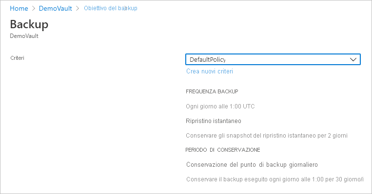

# <a name="back-up-azure-vms-in-a-recovery-services-vault"></a>Eseguire il backup di macchine virtuali di Azure in un insieme di credenziali di Servizi di ripristino

Questo articolo descrive come eseguire il backup di macchine virtuali di Azure in un insieme di credenziali di servizi di ripristino, usando il [Backup di Azure](backup-overview.md) servizio. 

In questo articolo viene spiegato come:

> [!div class="checklist"]
> * Preparare le macchine virtuali di Azure.
> * Creare un insieme di credenziali.
> * Individuare le macchine virtuali e configurare un criterio di backup.
> * Abilitare il backup per macchine virtuali di Azure.
> * Eseguire il backup iniziale.


> [!NOTE]
> Questo articolo descrive come configurare un insieme di credenziali e selezionare le macchine virtuali per eseguire il backup. È utile per eseguire il backup di più macchine virtuali. In alternativa, è possibile [eseguire il backup di una singola macchina virtuale Azure](backup-azure-vms-first-look-arm.md) direttamente dalle impostazioni della macchina virtuale.

## <a name="before-you-start"></a>Prima di iniziare


- [Revisione](backup-architecture.md#architecture-direct-backup-of-azure-vms) l'architettura del backup delle macchine Virtuali di Azure.
- [Informazioni su](backup-azure-vms-introduction.md) backup delle macchine virtuali di Azure ed estensione di backup.
- [Esaminare la matrice di supporto](backup-support-matrix-iaas.md) prima di configurare il backup.

Inoltre, esistono un paio di cose che potrebbe essere necessario eseguire operazioni in alcune circostanze:

- **Installare l'agente di macchine Virtuali nella VM**: Backup di Azure esegue il backup di macchine virtuali di Azure tramite l'installazione di un'estensione per l'agente di macchine virtuali di Azure in esecuzione nel computer. Se la VM è stata creata da un'immagine di Azure marketplace, l'agente è installato e in esecuzione. Se si crea una macchina virtuale personalizzata o si esegue la migrazione di una macchina locale, potrebbe essere necessario [installare manualmente l'agente](#install-the-vm-agent).
- **Consentire l'accesso in uscita in modo esplicito**: In genere, non è necessario consentire in modo esplicito l'accesso alla rete in uscita per una VM di Azure per poter comunicare con Backup di Azure. Tuttavia, alcune macchine virtuali potrebbero riscontrare problemi di connessione, che mostra le **ExtensionSnapshotFailedNoNetwork** errore quando provano a connettersi. In questo caso, dovrebbe [consentire in modo esplicito l'accesso in uscita](#explicitly-allow-outbound-access), in modo che l'estensione di Backup di Azure può comunicare con Azure indirizzi IP pubblici per il traffico di backup.


## <a name="create-a-vault"></a>Creare un insieme di credenziali

 Un insieme di credenziali consente di archiviare i backup e i punti di ripristino creati nel corso del tempo, oltre ai criteri di backup associati ai computer sottoposti a backup. Creare un insieme di credenziali nel modo seguente:    

1. Accedere al [portale di Azure](https://portal.azure.com/).    
2. Nella ricerca, digitare **servizi di ripristino**. Sotto **Services**, fare clic su **insiemi di credenziali dei servizi di ripristino**.   

      <br/> 

3. Nelle **insiemi di credenziali dei servizi di ripristino** menu, fare clic su **+ Aggiungi**.    

        

4. Nelle **insieme di credenziali dei servizi di ripristino**, digitare un nome descrittivo per identificare l'insieme di credenziali.   
    - Il nome deve essere univoco per la sottoscrizione di Azure.   
    - Può contenere da 2 a 50 caratteri.    
    - Deve iniziare con una lettera e può contenere solo lettere, numeri e trattini.   
5. Selezionare la sottoscrizione di Azure, gruppo di risorse e area geografica in cui deve essere creato l'insieme di credenziali. Fare quindi clic su **Crea**.    
    - La creazione dell'insieme di credenziali può richiedere alcuni minuti.  
    - Monitorare le notifiche di stato nell'area superiore destra del portale.   


 Dopo aver creato l'insieme di credenziali, viene visualizzato nell'elenco di insiemi di credenziali dei servizi di ripristino. Se non viene visualizzato, selezionare **Aggiorna**.
 
    

### <a name="modify-storage-replication"></a>Modificare la replica di archiviazione

Per impostazione predefinita, gli insiemi di credenziali usare [archiviazione con ridondanza geografica (GRS)](https://docs.microsoft.com/azure/storage/common/storage-redundancy-grs).

- Se l'insieme di credenziali è il meccanismo di backup primario, è consigliabile che usare archiviazione con ridondanza geografica.
- È possibile usare [archiviazione con ridondanza locale (LRS)](https://docs.microsoft.com/azure/storage/common/storage-redundancy-lrs?toc=%2fazure%2fstorage%2fblobs%2ftoc.json) per un'opzione più economica.

Modificare il tipo di replica di archiviazione come segue:

1. Nel nuovo insieme di credenziali, fare clic su **delle proprietà** nel **impostazioni** sezione.
2. Nelle **delle proprietà**, in **configurazione Backup**, fare clic su **Update**.
3. Selezionare il tipo di replica di archiviazione e fare clic su **salvare**.

      
> [!NOTE]
   > È possibile modificare il tipo di replica di archiviazione dopo che l'insieme di credenziali è configurato e contiene gli elementi di backup. Se si desidera eseguire questa operazione è necessario ricreare l'insieme di credenziali. 

## <a name="apply-a-backup-policy"></a>Applicare un criterio di backup

Configurare un criterio di backup per l'insieme di credenziali.

1. Nell'insieme di credenziali, fare clic su **+ Backup** nel **Panoramica** sezione.

   


2. Nelle **obiettivo del Backup** > **in cui viene eseguito il carico di lavoro?** selezionare **Azure**. Nelle **cosa si desidera eseguire il backup?** selezionate **macchina virtuale** >  **OK**. In questo modo viene registrata l'estensione delle macchine virtuali nell'insieme di credenziali.

   

3. In **Criteri di backup** selezionare i criteri da associare all'insieme di credenziali. 
    - Il criterio predefinito esegue il backup della macchina virtuale una volta al giorno. I backup giornalieri vengono conservati per 30 giorni. Gli snapshot per il ripristino rapido vengono conservati per due giorni.
    - Se non si desidera usare i criteri predefiniti, selezionare **Crea nuovo**e creare un criterio personalizzato come descritto nella procedura successiva.

      

4. Nelle **selezionare le macchine virtuali**, selezionare le VM che si desidera eseguire il backup usando il criterio. Fare quindi clic su **OK**.

   - Macchine virtuali selezionate vengono convalidate.
   - È possibile selezionare solo macchine virtuali presenti nella stessa area dell'insieme di credenziali.
   - Il backup delle macchine virtuali può essere eseguito in un solo insieme di credenziali.

     

5. Nelle **Backup**, fare clic su **Abilita backup**. Questa operazione consente di distribuire i criteri nell'insieme di credenziali e nelle macchine virtuali e installare l'estensione di backup nell'agente di macchine virtuali in esecuzione nella macchina virtuale di Azure.
     
     

Dopo l'abilitazione del backup:

- Il servizio Backup installa l'estensione di backup indipendentemente dal fatto che la VM sia in esecuzione o meno.
- In base alla pianificazione del backup verrà eseguito un backup iniziale.
- Quando eseguire i backup, si noti che:
    - Una macchina virtuale che esegue avere la massima probabilità per l'acquisizione di un punto di ripristino coerenti con l'applicazione.
    - Tuttavia, anche se la macchina virtuale è spenta viene eseguito il backup. Questa macchina virtuale è noto come una macchina virtuale offline. In questo caso, il punto di ripristino sarà coerente con l'arresto anomalo del sistema.
    

### <a name="create-a-custom-policy"></a>Creare criteri personalizzati

Se si seleziona per creare un nuovo criterio di backup, specificare le impostazioni dei criteri.

1. Nelle **nome del criterio**, specificare un nome significativo.
2. Nelle **pianificazione di Backup** specificare quando i backup devono essere eseguiti. È possibile eseguire i backup giornalieri o settimanali per macchine virtuali di Azure.
2. Nelle **ripristino istantaneo**, specificare quanto tempo si vogliono mantenere gli snapshot in locale per il ripristino immediato.
    - Quando si ripristina, eseguito il backup delle macchine Virtuali vengono copiati i dischi di archiviazione, attraverso la rete per la posizione di archiviazione di ripristino. Con il ripristino immediato, è possibile sfruttare gli snapshot archiviati localmente creati durante un processo di backup, senza tempi di attesa per i dati di backup devono essere trasferiti nell'insieme di credenziali.
    - È possibile mantenere gli snapshot per il ripristino immediato per tra un massimo di cinque giorni. L'impostazione predefinita è pari a due giorni.
3. Nelle **mantenimento**, specificare quanto tempo si vogliono mantenere i punti di backup giornalieri o settimanali.
4. Nelle **conservazione del punto di backup mensile**, specificare se si desidera mantenere il backup degli archivi di backup giornaliere o settimanale un frequenza mensile. 
5. Fare clic su **OK** per salvare il criterio.

    

> [!NOTE]
   > Backup di Azure non supporta la regolazione automatica dell'orologio in base all'ora legale per i backup delle macchine virtuali di Azure. Se si verificano cambiamenti di tempo, modificare i criteri di backup manuale in base alle esigenze.

## <a name="trigger-the-initial-backup"></a>Attivare il backup iniziale

Verrà eseguito il backup iniziale in base alla pianificazione, ma è possibile eseguirlo immediatamente come indicato di seguito:

1. Selezionare **Elementi di backup** dal menu dell'insieme di credenziali.
2. In **Elementi di backup** fare clic su **Macchine virtuali di Azure**.
3. Nel **elementi di Backup** fare clic sui puntini di sospensione (...).
4. Fare clic su **Esegui backup ora**.
5. Nelle **Esegui Backup ora**, usare il controllo calendario per selezionare l'ultimo giorno che deve essere mantenuto il punto di ripristino. Fare quindi clic su **OK**.
6. Monitorare le notifiche del portale. È possibile monitorare l'avanzamento del processo nel dashboard dell'insieme di credenziali > **Processi di Backup** > **In corso**. A seconda delle dimensioni della macchina virtuale, la creazione del backup iniziale potrebbe richiedere un po' di tempo.

## <a name="optional-steps-install-agentallow-outbound"></a>Passaggi facoltativi (installare l'agente/Consenti connessioni in uscita)
### <a name="install-the-vm-agent"></a>Installare l'agente di macchine virtuali

Backup di Azure esegue il backup di macchine virtuali di Azure tramite l'installazione di un'estensione per l'agente di macchine virtuali di Azure in esecuzione nel computer. Se la VM è stata creata da un'immagine di Azure Marketplace, l'agente è installato e in esecuzione. Se si crea una macchina virtuale personalizzata o si esegue la migrazione di una macchina locale, è necessario installare l'agente manualmente, come riepilogato nella tabella.

**VM** | **Dettagli**
--- | ---
**Windows** | 1. [Scaricare e installare](https://go.microsoft.com/fwlink/?LinkID=394789&clcid=0x409) il file MSI per l'agente.<br/><br/> 2. Eseguire l'installazione sul computer con autorizzazioni di amministratore.<br/><br/> 3. Verificare l'installazione. Nelle *C:\WindowsAzure\Packages* nella macchina virtuale, fare doppio clic su **WaAppAgent.exe** > **proprietà**. Nel **informazioni dettagliate** della scheda **versione prodotto** deve essere 2.6.1198.718 o versione successiva.<br/><br/> Se si sta aggiornando l'agente, assicurarsi che non siano in esecuzione operazioni di backup, e [reinstallare l'agente](https://go.microsoft.com/fwlink/?LinkID=394789&clcid=0x409).
**Linux** | Installare usando un RPM o un pacchetto DEB dal repository di pacchetti della distribuzione. Questo è il metodo preferito per l'installazione e l'aggiornamento dell'agente Linux di Azure. Tutti i [provider di distribuzione supportati](https://docs.microsoft.com/azure/virtual-machines/linux/endorsed-distros) integrano il pacchetto agente Linux di Azure nelle immagini e nei repository. L'agente è disponibile in [GitHub](https://github.com/Azure/WALinuxAgent), ma non è consigliabile installarlo direttamente da questa posizione.<br/><br/> Se si sta aggiornando l'agente, assicurarsi che nessuna operazione di backup sono in esecuzione e aggiornare i file binari.

### <a name="explicitly-allow-outbound-access"></a>Consentire l'accesso in uscita in modo esplicito

L'estensione di backup in esecuzione nella macchina virtuale richiede accesso in uscita agli indirizzi IP pubblici di Azure.

- In genere non è necessario consentire in modo esplicito l'accesso alla rete in uscita per una VM di Azure per poter comunicare con Backup di Azure.
- Se si verificano problemi con le macchine virtuali la connessione o se viene visualizzato l'errore **ExtensionSnapshotFailedNoNetwork** quando è stato effettuato un tentativo di connessione, è consigliabile consentire l'accesso in modo esplicito in modo che l'estensione di backup può comunicare con IP pubblico di Azure indirizzi per il traffico di backup. Nella tabella seguente sono riepilogati i metodi di accesso.


**Opzione** | **Azione** | **Dettagli** 
--- | --- | --- 
**Configurare le regole del gruppo di sicurezza di rete** | consentire gli [intervalli IP del data center di Azure](https://www.microsoft.com/download/details.aspx?id=41653).<br/><br/> Invece di consentire e la gestione di ogni intervallo di indirizzi, è possibile aggiungere una regola che consenta l'accesso al servizio Backup di Azure usando un [tag del servizio](backup-azure-arm-vms-prepare.md#set-up-an-nsg-rule-to-allow-outbound-access-to-azure). | [Altre informazioni](../virtual-network/security-overview.md#service-tags) sui tag di servizio.<br/><br/> Tag Services semplifica la gestione degli accessi e non incorrere in costi aggiuntivi.
**Distribuire un proxy** | Distribuire un server proxy HTTP per eseguire il routing del traffico | Possibilità di accesso a tutto l'ambiente Azure, non solo al servizio di archiviazione.<br/><br/> Possibilità di controllo granulare sugli URL di archiviazione.<br/><br/> Singolo punto di accesso Internet per le macchine virtuali.<br/><br/> Costi aggiuntivi per il proxy.
**Configurare il Firewall di Azure** | Consentire il traffico attraverso Firewall di Azure nella macchina virtuale usando un tag FQDN per il servizio Backup di Azure | Semplice da usare se si dispone di Firewall di Azure consente di impostare una subnet di rete virtuale.<br/><br/> È possibile creare il proprio tag del nome di dominio completo o modificare gli FQDN in un tag.<br/><br/> Se le macchine virtuali di Azure dispone di dischi gestiti, si potrebbe essere necessario aprire un ulteriore porting (8443) nei firewall.

#### <a name="establish-network-connectivity"></a>Stabilire la connettività di rete

Stabilire la connessione con sicurezza di rete, da proxy o attraverso il firewall

##### <a name="set-up-an-nsg-rule-to-allow-outbound-access-to-azure"></a>Configurare una regola del gruppo di sicurezza di rete per consentire l'accesso in uscita ad Azure

Se un gruppo di sicurezza consente di gestire l'accesso alle macchine Virtuali, consentire l'accesso in uscita per l'archiviazione dei backup per le porte e gli intervalli necessari.

1. Nelle proprietà della VM > **Networking**, selezionare **Aggiungi regola porta in uscita**.
2. Nelle **Aggiungi regola di sicurezza in uscita**, selezionare **avanzate**.
3. In **Origine** selezionare **Rete virtuale**.
4. Nelle **intervalli di porte di origine**, immettere un asterisco (*) per consentire l'accesso in uscita da qualsiasi porta.
5. In **Destinazione** selezionare **Service Tag** (Tag del servizio). Selezionare **Storage.region** dall'elenco. L'area è dove si trovano l'insieme di credenziali e le macchine virtuali che si desidera eseguire il backup.
6. In **Intervalli di porte di destinazione** selezionare la porta.
    - Macchina virtuale non gestita con account di archiviazione non crittografato: 80
    - Macchina virtuale non gestita con account di archiviazione crittografato: 443 (impostazione predefinita)
    - Macchina virtuale gestita: 8443
7. In **Protocollo** selezionare **TCP**.
8. In **Priorità** specificare un valore di priorità inferiore a tutte le regole di negazione di livello superiore.
   
   Se si dispone di una regola che neghi l'accesso, il nuovo Consenti regola deve essere superiore. Se ad esempio la priorità di una regola **Deny_All** è impostata su 1000, la nuova regola deve essere impostata su un valore minore di 1000.
9. Specificare un nome e una descrizione per la regola e selezionare **OK**.

È possibile applicare la regola del gruppo di sicurezza di rete a più macchine virtuali per consentire l'accesso in uscita. Questo video illustra la procedura descritta.

>[!VIDEO https://www.youtube.com/embed/1EjLQtbKm1M]


##### <a name="route-backup-traffic-through-a-proxy"></a>Instradare il traffico di backup attraverso un proxy

È possibile instradare il traffico di backup attraverso un proxy e quindi concedere al proxy l'accesso agli intervalli di Azure necessari. Configurare il proxy di macchina virtuale per consentire quanto segue:

- La macchina virtuale di Azure deve instradare tutto il traffico HTTP diretto alla rete Internet pubblica attraverso il proxy.
- Il proxy deve consentire il traffico in ingresso dalle macchine virtuali nella rete virtuale applicabile.
- Il gruppo di sicurezza di rete **NSF-lockdown** necessita di una regola che consenta il traffico Internet in uscita dalla macchina virtuale del proxy.

###### <a name="set-up-the-proxy"></a>Configurare il proxy

Se non si ha un proxy di account di sistema, configurarne uno come indicato di seguito:

1. Scaricare [PsExec](https://technet.microsoft.com/sysinternals/bb897553).
2. Eseguire **PsExec.exe -i -s cmd.exe** per eseguire il prompt dei comandi con un account di sistema.
3. Eseguire il browser nel contesto di sistema. Ad esempio, usare **%PROGRAMFILES%\Internet Explorer\iexplore.exe** per Internet Explorer.  
4. Definire le impostazioni del proxy.
   - Nei computer Linux:
     - Aggiungere questa riga nel file **/etc/environment**:
       - **http_proxy = http:\//proxy IP: proxy indirizzo porta**
     - Aggiungere queste righe nel file **/etc/waagent.conf**:
         - **HttpProxy.Host=indirizzo IP proxy**
         - **HttpProxy.Port=porta proxy**
   - Nelle impostazioni del browser dei computer Windows specificare che deve essere usato un proxy. Se attualmente si usa un proxy per un account utente, è possibile usare questo script per applicare l'impostazione a livello di account di sistema.
       ```powershell
      $obj = Get-ItemProperty -Path Registry::"HKEY_CURRENT_USER\Software\Microsoft\Windows\CurrentVersion\Internet Settings\Connections"
      Set-ItemProperty -Path Registry::"HKEY_USERS\S-1-5-18\Software\Microsoft\Windows\CurrentVersion\Internet Settings\Connections" -Name DefaultConnectionSettings -Value $obj.DefaultConnectionSettings
      Set-ItemProperty -Path Registry::"HKEY_USERS\S-1-5-18\Software\Microsoft\Windows\CurrentVersion\Internet Settings\Connections" -Name SavedLegacySettings -Value $obj.SavedLegacySettings
      $obj = Get-ItemProperty -Path Registry::"HKEY_CURRENT_USER\Software\Microsoft\Windows\CurrentVersion\Internet Settings"
      Set-ItemProperty -Path Registry::"HKEY_USERS\S-1-5-18\Software\Microsoft\Windows\CurrentVersion\Internet Settings" -Name ProxyEnable -Value $obj.ProxyEnable
      Set-ItemProperty -Path Registry::"HKEY_USERS\S-1-5-18\Software\Microsoft\Windows\CurrentVersion\Internet Settings" -Name Proxyserver -Value $obj.Proxyserver

       ```

###### <a name="allow-incoming-connections-on-the-proxy"></a>Consentire le connessioni in ingresso sul proxy

Consentire le connessioni in ingresso nelle impostazioni del proxy.

1. In Windows Firewall, aprire **Windows Firewall con sicurezza avanzata**.
2. Fare clic con il pulsante destro del mouse su **Regole in entrata** > **Nuova regola**.
3. Nelle **tipo di regola**, selezionare **Custom** > **Avanti**.
4. In **Programma** selezionare **Tutti i programmi** > **Avanti**.
5. Nelle **protocolli e porte**:
   - Impostare il tipo su **TCP**.
   - Impostare **porte locali** al **porte specifiche**.
   - Impostare **porta remota** al **tutte le porte**.
  
6. Completare la procedura guidata e specificare un nome per la regola.

###### <a name="add-an-exception-rule-to-the-nsg-for-the-proxy"></a>Aggiungere una regola al gruppo di sicurezza di rete per il proxy

Nel gruppo di sicurezza di rete **NSF-lockdown** consentire il traffico da qualsiasi porta su 10.0.0.5 a qualsiasi indirizzo Internet sulla porta 80 (HTTP) o 443 (HTTPS).

Lo script PowerShell seguente contiene un esempio per consentire il traffico.
Invece di consentire in uscita a tutti gli indirizzi internet pubblici, è possibile specificare un intervallo di indirizzi IP (`-DestinationPortRange`), oppure usare il tag di servizio storage.region.   

```powershell
Get-AzureNetworkSecurityGroup -Name "NSG-lockdown" |
Set-AzureNetworkSecurityRule -Name "allow-proxy " -Action Allow -Protocol TCP -Type Outbound -Priority 200 -SourceAddressPrefix "10.0.0.5/32" -SourcePortRange "*" -DestinationAddressPrefix Internet -DestinationPortRange "80-443"
```

##### <a name="allow-firewall-access-with-an-fqdn-tag"></a>Consentire l'accesso firewall con un tag di nome di dominio completo

È possibile impostare backup Firewall di Azure per consentire l'accesso in uscita per il traffico di rete di Backup di Azure.

- [Informazioni](https://docs.microsoft.com/azure/firewall/tutorial-firewall-deploy-portal) sulla distribuzione di Firewall di Azure.
- [Informazioni](https://docs.microsoft.com/azure/firewall/fqdn-tags) sui tag FQDN.


## <a name="next-steps"></a>Passaggi successivi

- Risolvere eventuali problemi relativi [Azure VM agents](backup-azure-troubleshoot-vm-backup-fails-snapshot-timeout.md) oppure [backup delle macchine Virtuali di Azure](backup-azure-vms-troubleshoot.md).
- [Ripristinare](backup-azure-arm-restore-vms.md) macchine virtuali di Azure.

