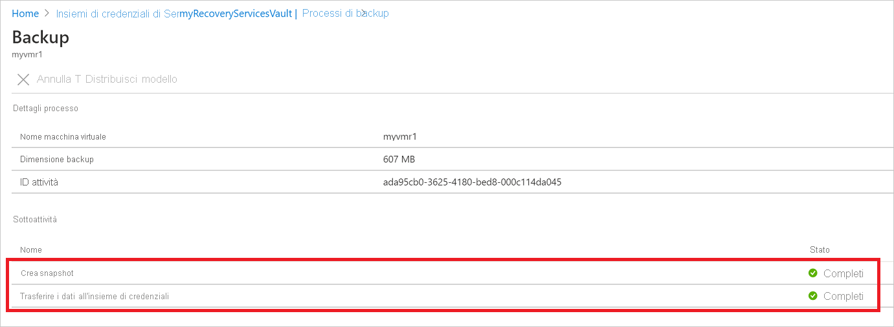

# <a name="back-up-azure-vms-in-a-recovery-services-vault"></a>Eseguire il backup di macchine virtuali di Azure in un insieme di credenziali di Servizi di ripristino

Questo articolo descrive come eseguire il backup di macchine virtuali di Azure in un insieme di credenziali di servizi di ripristino tramite il servizio [backup di Azure](backup-overview.md) .

In questo articolo viene spiegato come:

> [!div class="checklist"]
> * Preparare le macchine virtuali di Azure.
> * Creare un insieme di credenziali.
> * Individuare le VM e configurare un criterio di backup.
> * Abilitare il backup per le macchine virtuali di Azure.
> * Eseguire il backup iniziale.


> [!NOTE]
> Questo articolo descrive come configurare un insieme di credenziali e selezionare le macchine virtuali di cui eseguire il backup. È utile per eseguire il backup di più macchine virtuali. In alternativa, è possibile [eseguire il backup di una singola macchina virtuale di Azure](backup-azure-vms-first-look-arm.md) direttamente dalle impostazioni della macchina virtuale.

## <a name="before-you-start"></a>Prima di iniziare


- [Esaminare](backup-architecture.md#architecture-direct-backup-of-azure-vms) l'architettura di backup delle VM di Azure.
- [Informazioni su](backup-azure-vms-introduction.md) backup delle macchine virtuali di Azure ed estensione di backup.
- [Esaminare la matrice di supporto prima di configurare il](backup-support-matrix-iaas.md) backup.

Inoltre, in alcune circostanze potrebbe essere necessario eseguire alcune operazioni:

- **Installare l'agente di macchine virtuali nella macchina virtuale**: Backup di Azure esegue il backup di macchine virtuali di Azure tramite l'installazione di un'estensione per l'agente di macchine virtuali di Azure in esecuzione nel computer. Se la macchina virtuale è stata creata da un'immagine di Azure Marketplace, l'agente è installato e in esecuzione. Se si crea una VM personalizzata o si esegue la migrazione di un computer locale, potrebbe essere necessario [installare l'agente manualmente](#install-the-vm-agent).
- **Consenti in modo esplicito l'accesso in uscita**: In genere, non è necessario consentire in modo esplicito l'accesso alla rete in uscita per una macchina virtuale di Azure per poter comunicare con backup di Azure. Tuttavia, alcune macchine virtuali potrebbero riscontrare problemi di connessione, mostrando l'errore **ExtensionSnapshotFailedNoNetwork** durante il tentativo di connessione. In tal caso, è necessario [consentire in modo esplicito l'accesso in uscita](#explicitly-allow-outbound-access), in modo che l'estensione di backup di Azure possa comunicare con gli indirizzi IP pubblici di Azure per il traffico di backup.


## <a name="create-a-vault"></a>Creare un insieme di credenziali

 Un insieme di credenziali consente di archiviare i backup e i punti di ripristino creati nel corso del tempo, oltre ai criteri di backup associati ai computer sottoposti a backup. Creare un insieme di credenziali nel modo seguente:

1. Accedere al [portale di Azure](https://portal.azure.com/).
2. In Cerca digitare **servizi di ripristino**. In **Servizi**fare clic su insiemi di credenziali **dei servizi di ripristino**.

      <br/>

3. Nel menu insiemi di credenziali **dei servizi di ripristino** fare clic su **+ Aggiungi**.

     

4. Nell'insieme di credenziali di **servizi di ripristino**Digitare un nome descrittivo per identificare l'insieme di credenziali.
    - Il nome deve essere univoco per la sottoscrizione di Azure.
    - Può contenere da 2 a 50 caratteri.
    - Deve iniziare con una lettera e può contenere solo lettere, numeri e trattini.
5. Selezionare la sottoscrizione di Azure, il gruppo di risorse e l'area geografica in cui creare l'insieme di credenziali. Fare quindi clic su **Crea**.
    - La creazione dell'insieme di credenziali può richiedere alcuni minuti.
    - Monitorare le notifiche di stato nell'area superiore destra del portale.


 Una volta creato, l'insieme di credenziali viene visualizzato nell'elenco insiemi di credenziali dei servizi di ripristino. Se non viene visualizzato, selezionare **Aggiorna**.


> [!NOTE]
> Il servizio backup di Azure crea un gruppo di risorse distinto (diverso dal gruppo di risorse VM) per archiviare gli snapshot, con il formato di denominazione **AzureBackupRG_geography_number** (esempio: AzureBackupRG_northeurope_1). I dati in questo gruppo di risorse verranno conservati per la durata in giorni, come specificato nella sezione *Mantieni snapshot Instant Recovery* del criterio di backup della macchina virtuale di Azure.  L'applicazione di un blocco a questo gruppo di risorse può causare errori di backup.<br>
Questo gruppo di risorse deve essere escluso da qualsiasi restrizione relativa a nome/tag poiché i criteri di restrizione bloccano la creazione di raccolte di punti risorse in un nuovo errore causando errori di backup.


### <a name="modify-storage-replication"></a>Modificare la replica di archiviazione

Per impostazione predefinita, gli insiemi di credenziali usano l' [archiviazione con ridondanza geografica (GRS)](https://docs.microsoft.com/azure/storage/common/storage-redundancy-grs).

- Se l'insieme di credenziali è il meccanismo di backup principale, si consiglia di usare GRS.
- Per un'opzione più economica, è possibile usare l' [archiviazione con ridondanza locale (con ridondanza locale)](https://docs.microsoft.com/azure/storage/common/storage-redundancy-lrs?toc=%2fazure%2fstorage%2fblobs%2ftoc.json) .

Modificare il tipo di replica di archiviazione come segue:

1. Nel nuovo insieme di credenziali fare clic su **Proprietà** nella sezione **Impostazioni** .
2. In **Proprietà**, in **configurazione backup**, fare clic su **Aggiorna**.
3. Selezionare il tipo di replica di archiviazione e fare clic su **Salva**.

      
> [!NOTE]
   > Non è possibile modificare il tipo di replica di archiviazione dopo che l'insieme di credenziali è stato configurato e contiene elementi di backup. Se si vuole eseguire questa operazione, è necessario ricreare l'insieme di credenziali.

## <a name="apply-a-backup-policy"></a>Applicare un criterio di backup

Configurare un criterio di backup per l'insieme di credenziali.

1. Nell'insieme di credenziali fare clic su **+ backup** nella sezione **Panoramica** .

   


2. In **obiettivo** > di backup in**cui è in esecuzione il carico di lavoro?** selezionare **Azure**. In **che cosa si vuole eseguire il backup?** selezionare **macchina** >  virtuale**OK**. In questo modo viene registrata l'estensione delle macchine virtuali nell'insieme di credenziali.

   

3. In **Criteri di backup** selezionare i criteri da associare all'insieme di credenziali.
    - Il criterio predefinito esegue il backup della VM una volta al giorno. I backup giornalieri vengono conservati per 30 giorni. Gli snapshot di ripristino istantaneo vengono conservati per due giorni.
    - Se non si vuole usare i criteri predefiniti, selezionare **Crea nuovo**e creare un criterio personalizzato come descritto nella procedura seguente.

      

4. In **Seleziona macchine virtuali**selezionare le VM di cui si vuole eseguire il backup usando il criterio. Fare quindi clic su **OK**.

   - Le macchine virtuali selezionate vengono convalidate.
   - È possibile selezionare solo macchine virtuali presenti nella stessa area dell'insieme di credenziali.
   - Il backup delle macchine virtuali può essere eseguito in un solo insieme di credenziali.

     

5. In **backup**fare clic su **Abilita backup**. Questa operazione consente di distribuire i criteri nell'insieme di credenziali e nelle macchine virtuali e installare l'estensione di backup nell'agente di macchine virtuali in esecuzione nella macchina virtuale di Azure.

     

Dopo l'abilitazione del backup:

- Il servizio Backup installa l'estensione di backup indipendentemente dal fatto che la VM sia in esecuzione o meno.
- Un backup iniziale viene eseguito in base alla pianificazione del backup.
- Quando vengono eseguiti i backup, tenere presente quanto segue:
    - Una macchina virtuale in esecuzione ha la massima probabilità di acquisire un punto di ripristino coerente con l'applicazione.
    - Tuttavia, anche se la macchina virtuale è spenta, viene eseguito il backup. Tale macchina virtuale è nota come macchina virtuale offline. In questo caso, il punto di ripristino sarà coerente con l'arresto anomalo del sistema.


### <a name="create-a-custom-policy"></a>Creare criteri personalizzati

Se si è scelto di creare un nuovo criterio di backup, specificare le impostazioni dei criteri.

1. In **Nome criterio**specificare un nome significativo.
2. In **pianificazione backup**specificare quando devono essere eseguiti i backup. È possibile eseguire backup giornalieri o settimanali per le macchine virtuali di Azure.
2. In **ripristino istantaneo**specificare per quanto tempo si vogliono mantenere gli snapshot localmente per il ripristino immediato.
    - Quando si esegue il ripristino, il backup dei dischi delle macchine virtuali viene copiato dalla risorsa di archiviazione attraverso la rete al percorso di archiviazione di ripristino. Con il ripristino istantaneo è possibile sfruttare gli snapshot archiviati localmente eseguiti durante un processo di backup, senza attendere il trasferimento dei dati di backup nell'insieme di credenziali.
    - È possibile mantenere gli snapshot per il ripristino immediato per un periodo compreso tra uno e cinque giorni. L'impostazione predefinita è due giorni.
3. In periodo di **mantenimento**dati specificare per quanto tempo si vogliono mantenere i punti di backup giornalieri o settimanali.
4. In **conservazione del punto di backup mensile**specificare se si vuole mantenere un backup mensile dei backup giornalieri o settimanali.
5. Fare clic su **OK** per salvare il criterio.

    

> [!NOTE]
   > Backup di Azure non supporta la regolazione automatica dell'orologio in base all'ora legale per i backup delle macchine virtuali di Azure. Quando si verificano modifiche temporali, modificare manualmente i criteri di backup come richiesto.

## <a name="trigger-the-initial-backup"></a>Attiva il backup iniziale

Il backup iniziale viene eseguito in base alla pianificazione, ma è possibile eseguirlo immediatamente come indicato di seguito:

1. Selezionare **Elementi di backup** dal menu dell'insieme di credenziali.
2. In **Elementi di backup** fare clic su **Macchine virtuali di Azure**.
3. Nell'elenco **elementi di backup** fare clic sui puntini di sospensione (...).
4. Fare clic su **Esegui backup ora**.
5. In **backup ora**usare il controllo calendario per selezionare l'ultimo giorno in cui deve essere mantenuto il punto di ripristino. Fare quindi clic su **OK**.
6. Monitorare le notifiche del portale. È possibile monitorare l'avanzamento del processo nel dashboard dell'insieme di credenziali > **Processi di Backup** > **In corso**. A seconda delle dimensioni della macchina virtuale, la creazione del backup iniziale potrebbe richiedere un po' di tempo.

## <a name="verify-backup-job-status"></a>Verificare lo stato del processo di backup

I dettagli del processo di backup per ogni backup della macchina virtuale sono costituiti da due fasi, la fase di **snapshot** seguita dalla fase di **trasferimento dei dati all'** insieme di credenziali.<br/>
La fase di snapshot garantisce la disponibilità di un punto di ripristino memorizzato insieme ai dischi per i ripristini istantanei e sono disponibili per un massimo di cinque giorni, a seconda del periodo di memorizzazione dello snapshot configurato dall'utente. Il trasferimento dei dati nell'insieme di credenziali crea un punto di ripristino nell'insieme di credenziali per la conservazione a lungo termine. Il trasferimento dei dati nell'insieme di credenziali viene avviato solo dopo il completamento della fase di snapshot.

  

Sono presenti due **sottoattività** in esecuzione nel back-end, una per il processo di backup front-end che può essere controllata dal pannello dei dettagli del **processo di backup** , come indicato di seguito:

  

Il completamento della fase di **trasferimento dei dati in** un insieme di credenziali può richiedere più giorni, a seconda delle dimensioni dei dischi, della varianza per ogni disco e di diversi altri fattori.

Lo stato del processo può variare a seconda dei seguenti scenari:

**Snapshot** | **Trasferire i dati nell'insieme di credenziali** | **Stato processo**
--- | --- | ---
Operazione completata | In corso | In corso
Operazione completata | Ignorata | Operazione completata
Operazione completata | Operazione completata | Operazione completata
Operazione completata | Failed | Completato con avviso
Failed | Failed | Failed


Ora con questa funzionalità, per la stessa macchina virtuale, due backup possono essere eseguiti in parallelo, ma in entrambe le fasi (snapshot, trasferimento di dati nell'insieme di credenziali) è possibile eseguire una sola attività secondaria. Quindi, in scenari in cui un processo di backup è stato eseguito, il backup del giorno successivo avrà esito negativo con questa funzionalità di separazione. Per i backup del giorno successivo è possibile completare lo snapshot mentre **i dati trasferiti** nell'insieme di credenziali sono stati ignorati se il processo di backup di un giorno precedente è in corso.
Il punto di ripristino incrementale creato nell'insieme di credenziali acquisirà tutta la varianza dall'ultimo punto di ripristino creato nell'insieme di credenziali. L'utente non ha alcun impatto sui costi.


## <a name="optional-steps-install-agentallow-outbound"></a>Passaggi facoltativi (Installa agente/Consenti in uscita)
### <a name="install-the-vm-agent"></a>Installare l'agente di macchine virtuali

Backup di Azure esegue il backup di macchine virtuali di Azure tramite l'installazione di un'estensione per l'agente di macchine virtuali di Azure in esecuzione nel computer. Se la macchina virtuale è stata creata da un'immagine di Azure Marketplace, l'agente è installato e in esecuzione. Se si crea una VM personalizzata o si esegue la migrazione di un computer locale, potrebbe essere necessario installare l'agente manualmente, come riepilogato nella tabella.

**VM** | **Dettagli**
--- | ---
**Windows** | 1. [Scaricare e installare](https://go.microsoft.com/fwlink/?LinkID=394789&clcid=0x409) il file MSI per l'agente.<br/><br/> 2. Eseguire l'installazione sul computer con autorizzazioni di amministratore.<br/><br/> 3. Verificare l'installazione. In *C:\WindowsAzure\Packages* nella macchina virtuale fare clic con il pulsante destro del mouse su**Proprietà** **WaAppAgent. exe** > . Nella scheda **Dettagli** la **versione del prodotto** deve essere 2.6.1198.718 o successiva.<br/><br/> Se si sta aggiornando l'agente, assicurarsi che non siano in esecuzione operazioni di backup e [reinstallare l'agente](https://go.microsoft.com/fwlink/?LinkID=394789&clcid=0x409).
**Linux** | Installare usando un pacchetto RPM o un pacchetto DEB dal repository del pacchetto della distribuzione. Questo è il metodo preferito per l'installazione e l'aggiornamento dell'agente Linux di Azure. Tutti i [provider di distribuzione supportati](https://docs.microsoft.com/azure/virtual-machines/linux/endorsed-distros) integrano il pacchetto agente Linux di Azure nelle immagini e nei repository. L'agente è disponibile in [GitHub](https://github.com/Azure/WALinuxAgent), ma non è consigliabile installarlo direttamente da questa posizione.<br/><br/> Se si sta aggiornando l'agente, assicurarsi che non siano in esecuzione operazioni di backup e aggiornare i file binari.

### <a name="explicitly-allow-outbound-access"></a>Consenti in modo esplicito l'accesso in uscita

L'estensione di backup in esecuzione nella macchina virtuale richiede l'accesso in uscita agli indirizzi IP pubblici di Azure.

- In genere non è necessario consentire in modo esplicito l'accesso alla rete in uscita per una macchina virtuale di Azure per poter comunicare con backup di Azure.
- Se si verificano problemi con le VM che si connettono o se viene visualizzato l'errore **ExtensionSnapshotFailedNoNetwork** durante il tentativo di connessione, è necessario consentire l'accesso in modo esplicito in modo che l'estensione di backup possa comunicare con gli indirizzi IP pubblici di Azure per il backup traffico. I metodi di accesso sono riepilogati nella tabella seguente.


**Opzione** | **Azione** | **Dettagli**
--- | --- | ---
**Configurare le regole del gruppo di sicurezza di rete** | consentire gli [intervalli IP del data center di Azure](https://www.microsoft.com/download/details.aspx?id=41653).<br/><br/> Anziché consentire e gestire ogni intervallo di indirizzi, è possibile aggiungere una regola che consenta l'accesso al servizio backup di Azure usando un [tag di servizio](backup-azure-arm-vms-prepare.md#set-up-an-nsg-rule-to-allow-outbound-access-to-azure). | [Altre informazioni](../virtual-network/security-overview.md#service-tags) sui tag di servizio.<br/><br/> I tag dei servizi semplificano la gestione degli accessi e non incorrono costi aggiuntivi.
**Distribuire un proxy** | Distribuire un server proxy HTTP per eseguire il routing del traffico | Possibilità di accesso a tutto l'ambiente Azure, non solo al servizio di archiviazione.<br/><br/> Possibilità di controllo granulare sugli URL di archiviazione.<br/><br/> Singolo punto di accesso Internet per le macchine virtuali.<br/><br/> Costi aggiuntivi per il proxy.
**Configurare il Firewall di Azure** | Consentire il traffico attraverso Firewall di Azure nella macchina virtuale usando un tag FQDN per il servizio Backup di Azure | Semplice da usare se il firewall di Azure è configurato in una subnet VNet.<br/><br/> Non è possibile creare tag FQDN personalizzati o modificare FQDN in un tag.<br/><br/> Se le macchine virtuali di Azure dispongono di dischi gestiti, potrebbe essere necessario aprire una porta aggiuntiva (8443) nei firewall.

#### <a name="establish-network-connectivity"></a>Stabilire la connettività di rete

Stabilire la connettività con NSG, tramite proxy o tramite il firewall

##### <a name="set-up-an-nsg-rule-to-allow-outbound-access-to-azure"></a>Configurare una regola del gruppo di sicurezza di rete per consentire l'accesso in uscita ad Azure

Se un NSG gestisce l'accesso alla macchina virtuale, consentire l'accesso in uscita per l'archiviazione di backup agli intervalli e alle porte richiesti.

1. Nelle proprietà della macchina virtuale > **rete**selezionare **Aggiungi regola porta in uscita**.
2. In **Aggiungi regola di sicurezza in uscita**selezionare **Avanzate**.
3. In **Origine** selezionare **Rete virtuale**.
4. In **intervalli di porte di origine**immettere un asterisco (*) per consentire l'accesso in uscita da qualsiasi porta.
5. In **Destinazione** selezionare **Service Tag** (Tag del servizio). Selezionare **Storage.region** dall'elenco. L'area è la posizione in cui si trovano l'insieme di credenziali e le macchine virtuali di cui si vuole eseguire il backup.
6. In **Intervalli di porte di destinazione** selezionare la porta.
    - VM con dischi non gestiti con account di archiviazione non crittografato: 80
    - VM che usa dischi non gestiti con l'account di archiviazione crittografato: 443 (impostazione predefinita)
    - VM con Managed disks: 8443
7. In **Protocollo** selezionare **TCP**.
8. In **Priorità** specificare un valore di priorità inferiore a tutte le regole di negazione di livello superiore.

   Se si dispone di una regola che nega l'accesso, la nuova regola Consenti deve essere maggiore. Se ad esempio la priorità di una regola **Deny_All** è impostata su 1000, la nuova regola deve essere impostata su un valore minore di 1000.
9. Specificare un nome e una descrizione per la regola e quindi fare clic su **OK**.

È possibile applicare la regola del gruppo di sicurezza di rete a più macchine virtuali per consentire l'accesso in uscita. Questo video illustra la procedura descritta.

>[!VIDEO https://www.youtube.com/embed/1EjLQtbKm1M]


##### <a name="route-backup-traffic-through-a-proxy"></a>Instradare il traffico di backup attraverso un proxy

È possibile instradare il traffico di backup attraverso un proxy e quindi concedere al proxy l'accesso agli intervalli di Azure necessari. Configurare la macchina virtuale del proxy per consentire le operazioni seguenti:

- La macchina virtuale di Azure deve instradare tutto il traffico HTTP diretto alla rete Internet pubblica attraverso il proxy.
- Il proxy deve consentire il traffico in ingresso dalle macchine virtuali nella rete virtuale applicabile.
- Il gruppo di sicurezza di rete **NSF-lockdown** necessita di una regola che consenta il traffico Internet in uscita dalla macchina virtuale del proxy.

###### <a name="set-up-the-proxy"></a>Configurare il proxy

Se non si ha un proxy di account di sistema, configurarne uno come indicato di seguito:

1. Scaricare [PsExec](https://technet.microsoft.com/sysinternals/bb897553).
2. Eseguire **PsExec.exe -i -s cmd.exe** per eseguire il prompt dei comandi con un account di sistema.
3. Eseguire il browser nel contesto di sistema. Ad esempio, usare **%ProgramFiles%\Internet Explorer\iexplore.exe** per Internet Explorer.  
4. Definire le impostazioni del proxy.
   - Nei computer Linux:
     - Aggiungere questa riga nel file **/etc/environment**:
       - **http_proxy = http:\//proxy indirizzo IP: porta proxy**
     - Aggiungere queste righe nel file **/etc/waagent.conf**:
         - **HttpProxy.Host=indirizzo IP proxy**
         - **HttpProxy.Port=porta proxy**
   - Nelle impostazioni del browser dei computer Windows specificare che deve essere usato un proxy. Se attualmente si usa un proxy per un account utente, è possibile usare questo script per applicare l'impostazione a livello di account di sistema.
       ```powershell
      $obj = Get-ItemProperty -Path Registry::"HKEY_CURRENT_USER\Software\Microsoft\Windows\CurrentVersion\Internet Settings\Connections"
      Set-ItemProperty -Path Registry::"HKEY_USERS\S-1-5-18\Software\Microsoft\Windows\CurrentVersion\Internet Settings\Connections" -Name DefaultConnectionSettings -Value $obj.DefaultConnectionSettings
      Set-ItemProperty -Path Registry::"HKEY_USERS\S-1-5-18\Software\Microsoft\Windows\CurrentVersion\Internet Settings\Connections" -Name SavedLegacySettings -Value $obj.SavedLegacySettings
      $obj = Get-ItemProperty -Path Registry::"HKEY_CURRENT_USER\Software\Microsoft\Windows\CurrentVersion\Internet Settings"
      Set-ItemProperty -Path Registry::"HKEY_USERS\S-1-5-18\Software\Microsoft\Windows\CurrentVersion\Internet Settings" -Name ProxyEnable -Value $obj.ProxyEnable
      Set-ItemProperty -Path Registry::"HKEY_USERS\S-1-5-18\Software\Microsoft\Windows\CurrentVersion\Internet Settings" -Name Proxyserver -Value $obj.Proxyserver

       ```

###### <a name="allow-incoming-connections-on-the-proxy"></a>Consentire le connessioni in ingresso sul proxy

Consentire le connessioni in ingresso nelle impostazioni del proxy.

1. In Windows Firewall aprire **Windows Firewall con sicurezza avanzata**.
2. Fare clic con il pulsante destro del mouse su **Regole in entrata** > **Nuova regola**.
3. In **tipo di regola**selezionare**Avanti** **personalizzato** > .
4. In **Programma** selezionare **Tutti i programmi** > **Avanti**.
5. In **protocolli e porte**:
   - Impostare il tipo su **TCP**.
   - Impostare le **porte locali** su **porte specifiche**.
   - Impostare **porta remota** su **tutte le porte**.

6. Completare la procedura guidata e specificare un nome per la regola.

###### <a name="add-an-exception-rule-to-the-nsg-for-the-proxy"></a>Aggiungere una regola al gruppo di sicurezza di rete per il proxy

Nel gruppo di sicurezza di rete **NSF-lockdown** consentire il traffico da qualsiasi porta su 10.0.0.5 a qualsiasi indirizzo Internet sulla porta 80 (HTTP) o 443 (HTTPS).

Lo script PowerShell seguente contiene un esempio per consentire il traffico.
Anziché consentire il traffico in uscita a tutti gli indirizzi Internet pubblici, è possibile specificare un intervallo di`-DestinationPortRange`indirizzi IP () o usare il tag del servizio storage. Region.   

```powershell
Get-AzureNetworkSecurityGroup -Name "NSG-lockdown" |
Set-AzureNetworkSecurityRule -Name "allow-proxy " -Action Allow -Protocol TCP -Type Outbound -Priority 200 -SourceAddressPrefix "10.0.0.5/32" -SourcePortRange "*" -DestinationAddressPrefix Internet -DestinationPortRange "80-443"
```

##### <a name="allow-firewall-access-with-an-fqdn-tag"></a>Consenti l'accesso al firewall con un tag FQDN

È possibile configurare il firewall di Azure per consentire l'accesso in uscita per il traffico di rete a backup di Azure.

- [Informazioni](https://docs.microsoft.com/azure/firewall/tutorial-firewall-deploy-portal) sulla distribuzione di Firewall di Azure.
- [Informazioni](https://docs.microsoft.com/azure/firewall/fqdn-tags) sui tag FQDN.


## <a name="next-steps"></a>Passaggi successivi

- Risolvere i problemi relativi agli [agenti VM di Azure](backup-azure-troubleshoot-vm-backup-fails-snapshot-timeout.md) o al [backup di macchine virtuali di Azure](backup-azure-vms-troubleshoot.md).
- [Ripristino](backup-azure-arm-restore-vms.md) di Macchine virtuali di Azure.
