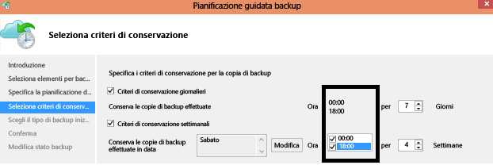

<properties
   pageTitle="Domande frequenti su Backup di Azure | Microsoft Azure"
   description="Risposte alle domande frequenti sul servizio Backup, l'agente di Backup, backup e conservazione, ripristino, sicurezza e altre domande frequenti sul backup e sul ripristino di emergenza."
   services="backup"
   documentationCenter=""
   authors="markgalioto"
   manager="jwhit"
   editor=""
   keywords="backup e ripristino di emergenza; servizio Backup"/>

<tags
   ms.service="backup"
   ms.workload="storage-backup-recovery"
	 ms.tgt_pltfrm="na"
	 ms.devlang="na"
	 ms.topic="get-started-article"
	 ms.date="04/04/2016"
	 ms.author="trinadhk; giridham; arunak; markgal; jimpark;"/>

# Servizio Backup di Azure: Domande frequenti

> [AZURE.SELECTOR]
- [Domande frequenti su Backup per la modalità classica](backup-azure-backup-faq.md)
- [Domande frequenti su Backup per la modalità Azure Resource Manager](backup-azure-backup-ibiza-faq.md)

Questo articolo contiene un elenco di domande comuni (e le relative risposte) sul servizio Backup di Azure. La community risponde rapidamente e, se una domanda viene fatta spesso, viene aggiunta a questo articolo. Le risposte alle domande contengono in genere informazioni di riferimento o di supporto. È possibile formulare le domande su Backup di Azure nella sezione Disqus di questo articolo o di un articolo correlato. È anche possibile inserire le domande sul servizio Backup di Azure nel [forum di discussione](https://social.msdn.microsoft.com/forums/azure/home?forum=windowsazureonlinebackup).

## Installazione e configurazione
**D1. Qual è l'elenco dei sistemi operativi supportati da cui è possibile eseguire il backup in Azure con Backup di Azure?** <br/> R1. Backup di Azure supporta l'elenco seguente di sistemi operativi.


| Sistema operativo | Piattaforma | SKU |
| :------------- |-------------| :-----|
| Windows 8 e versioni più recenti di SP | 64 bit | Enterprise, Pro |
| Windows 7 e versioni più recenti di SP | 64 bit | Ultimate, Enterprise, Professional, Home Premium, Home Basic, Starter |
| Windows 8.1 e versioni più recenti di SP | 64 bit | Enterprise, Pro |
| Windows 10 | 64 bit | Enterprise, Pro, Home |
|Windows Server 2012 R2 e più recenti SPs|	64 bit|	Standard, Datacenter, Foundation|
|Windows Server 2012 e versioni più recenti di SP|	64 bit|	Datacenter, Foundation, Standard|
|Windows Storage Server 2012 R2 e versioni più recenti di SP |64 bit|	Standard, Workgroup|
|Windows Storage Server 2012 e versioni più recenti di SP |64 bit |Standard, Workgroup
|Windows Server 2012 R2 e più recenti SPs |64 bit|	Essential|
|Windows Server 2008 R2 SP1, |64 bit|	Standard, Enterprise, Datacenter, Foundation|
|Windows Server 2008 SP2 |64 bit|	Standard, Enterprise, Datacenter, Foundation|

**D2. Dov'è possibile scaricare l'agente Backup di Azure più recente?** <br/> R2. È possibile scaricare l'agente più recente per il backup di Windows Server, System Center DPM o dei client Windows da [qui](http://aka.ms/azurebackup_agent). Per eseguire il backup di una macchina virtuale usare l'agente di macchine virtuali, che installa automaticamente l'estensione appropriata. L'agente di VM è già presente nelle macchine virtuali create dalla raccolta di Azure.

**D3. Quale versione del server SCDPM è supportata?** <br/> R3. È consigliabile installare la versione [più recente](http://aka.ms/azurebackup_agent) dell'agente Backup di Azure sull'aggiornamento cumulativo più recente di SCDPM (UR6 a luglio 2015)

****D4. Quando si configura l'agente di Backup di Azure, viene richiesto di immettere le **credenziali dell'insieme di credenziali**. Le credenziali dell'insieme di credenziali scadono? R4. Sì, le credenziali dell'insieme di credenziali scadono dopo 48 ore. Se il file scade, accedere al portale di Azure e scaricare i file delle credenziali di insieme dall'insieme di credenziali per il backup.

**D5. Esistono limiti al numero degli insiemi di credenziali per il backup che è possibile creare in ogni sottoscrizione di Azure?** <br/> R5. Sì. A partire da marzo 2015, è possibile creare 25 insiemi di credenziali per ogni sottoscrizione. Se sono necessari più insiemi di credenziali, creare una nuova sottoscrizione.

**D6. È necessario considerare l'insieme di credenziali come un'entità di fatturazione?** <br/> R6. Sebbene sia possibile ottenere una fattura dettagliata per ogni insieme di credenziali, è consigliabile considerare una sottoscrizione di Azure come un'entità di fatturazione. È infatti coerente in tutti i servizi ed è più facile da gestire.

**D7. Esistono limiti al numero di server/computer che possono essere registrati in ogni insieme di credenziali?** <br/> R7. Sì, è possibile registrare fino a 50 computer per ogni insieme di credenziali. Per le macchine virtuali IaaS di Azure, il limite è di 200 macchine virtuali per ogni insieme di credenziali. Se è necessario registrare più computer, creare un nuovo insieme di credenziali.

**D8. Esistono limiti alla quantità di dati di cui è possibile eseguire il backup da un server/client Windows o da un server SCDPM?** <br/> R8. No.

**D9. Come si registra un server in un altro data center?**<br/> R9. I dati di backup vengono inviati al data center del servizio di backup in cui sono registrati. Il modo più semplice per modificare il data center consiste nel disinstallare e reinstallare l'agente e registrarlo in un nuovo data center.

**D10. Cosa accade se si rinomina un server Windows che esegue il backup dei dati in Azure?**<br/> R10. Quando si rinomina un server, tutti i backup attualmente configurati vengono arrestati. È necessario registrare il nuovo nome del server con l'insieme di credenziali di Backup. Quando si crea una nuova registrazione, la prima operazione di backup è un backup completo e non incrementale. Se è necessario recuperare dati di cui in precedenza è stato eseguito il backup nell'insieme di credenziali con il vecchio nome server, è possibile recuperarli usando l'opzione [**Un altro server**](backup-azure-restore-windows-server.md#recover-to-an-alternate-machine) della procedura guidata **Recupera dati**.


**D11. Da quali tipi di unità è possibile eseguire il backup di file e cartelle?** <br/> R11. Non è possibile eseguire il backup del set di unità/volumi seguente:

- Supporti rimovibili: l'unità deve essere segnalata come fissa per poter essere usata come origine di backup.
- Volumi di sola lettura: il volume deve essere accessibile in scrittura per garantire il funzionamento del servizio Copia Shadow del volume (VSS).
- Volumi offline: il volume deve essere online per garantire il funzionamento del servizio VSS.
- Condivisione di rete: il volume deve essere in locale nel server per poter essere sottoposto a backup online.
- Volumi protetti da BitLocker: il volume deve essere sbloccato prima di poter eseguire il backup.
- Identificazione del sistema del file: NTFS è l'unico file system supportato per questa versione del servizio di backup online.

**D12. Di quali tipi di file e cartelle è possibile eseguire il backup dal server?**<br/> R12. Sono supportati i tipi seguenti:

- Crittografato
- Compresso
- Sparse
- Compresso + Sparse
- Collegamenti reali: non supportato, ignorato
- Punto di analisi: non supportato, ignorato
- Crittografato + compresso: non supportato, ignorato
- Crittografato + Sparse: non supportato, ignorato
- Flusso compresso: non supportato, ignorato
- Flusso di tipo sparse: non supportato, ignorato

**D13. Qual è il requisito di dimensioni minime per la cartella della cache?** <br/> R13. La dimensione della cartella della cache determina la quantità di dati sottoposti a backup. La cartella della cache deve essere circa il 5% dello spazio necessario per l'archivio dati.

**D14. Se l'organizzazione ha un insieme di credenziali di backup, come è possibile isolare i dati di un server da un altro server durante il ripristino dei dati?**<br/> R14. Tutti i server che vengono registrati nello stesso insieme di credenziali possono ripristinare i dati dei quali è stato eseguito il backup da altri server *che usano la stessa passphrase*. Se sono presenti server i cui dati di backup devono essere isolati dagli altri server dell'organizzazione, usare una passphrase designata per tali server. Ad esempio, per i server del reparto risorse umane può essere usata una passphrase, per quelli dell'ufficio contabilità un'altra e per quelli di archiviazione un'altra ancora.

**D15. È possibile eseguire la migrazione dei dati di backup tra sottoscrizioni?** <br/> R15: No

**D16. È possibile eseguire la migrazione dell'insieme di credenziali per il backup tra sottoscrizioni?** <br/> R16: No. L'insieme di credenziali viene creato a livello di sottoscrizione e non può essere riassegnato a un'altra sottoscrizione.

**D17. L'agente di Azure Backup funziona in un server che usa la deduplicazione di Windows Server 2012?** <br/> R17: Sì. Il servizio agente converte i dati deduplicati in dati normali quando si prepara l'operazione di backup. Quindi ottimizza i dati per il backup, crittografa i dati e infine invia i dati crittografati al servizio di backup online.

**D18. Se si annulla un processo di backup una volta avviato, i dati di backup trasferiti vengono eliminati?** <br/> R18: No. Nell'insieme di credenziali di backup vengono archiviati i dati sottoposti a backup trasferiti fino al momento dell'annullamento. Backup di Azure usa un meccanismo di checkpoint per aggiungere occasionalmente checkpoint ai dati di backup durante il backup. Dato che sono presenti checkpoint nei dati di backup, il processo di backup successivo può convalidare l'integrità dei file. Il successivo backup avviato risulterà incrementale rispetto ai dati erano stato eseguito il backup in precedenza. Un backup incrementale offre un migliore utilizzo della larghezza di banda in modo che non sia necessario trasferire ripetutamente gli stessi dati.

**D19. Perché viene visualizzato l'avviso "I backup di Azure non sono stati configurati per questo server", anche se in precedenza siano stati pianificati backup regolari?** <br/> R19. Questo avviso viene generato quando le impostazioni di pianificazione di backup archiviate nel server locale non sono identiche alle impostazioni archiviate nell'insieme di credenziali di backup. Quando il server o le impostazioni sono state ripristinate a uno stato noto soddisfacente, le pianificazioni di backup possono perdere la sincronizzazione. Se viene visualizzato questo avviso, [riconfigurare i criteri di backup](backup-azure-manage-windows-server.md) e quindi **eseguire subito il backup** per risincronizzare il server locale con Azure.

**D20. Quali regole del firewall devono essere configurate per Backup di Azure?** <br/> R20. Per proteggere facilmente i dati da locale ad Azure e da carico di lavoro ad Azure, è consigliabile consentire al firewall di comunicare con gli URL seguenti:

- www.msftncsi.com
- *.Microsoft.com
- windowsazure.com
- *.microsoftonline.com
- *.windows.net

**D21. È possibile installare l'agente di Backup di Azure in una macchina virtuale di Azure già supportata dal servizio Backup di Azure usando l'estensione per le VM?** <br/> R21. Certo. Backup di Azure consente il backup a livello di VM per le VM di Azure usando l'estensione per le VM. È possibile installare l'agente di Backup di Azure in un sistema operativo guest di Windows per proteggere file e cartelle in tale sistema operativo guest.

**D22. È possibile installare l'agente di Backup di Azure in una macchina virtuale di Azure per eseguire il backup di file e cartelle presenti nell'archivio temporaneo fornito dalla macchina virtuale di Azure?** <br/> R22. È possibile installare l'agente di Backup di Azure nel sistema operativo guest di Windows ed eseguire il backup di file e cartelle nell'archivio temporaneo. Tenere presente, tuttavia, che dopo la cancellazione dei dati dall'archivio temporaneo i backup avranno esito negativo. Se poi i dati nell'archivio temporaneo sono stati eliminati, è possibile eseguire il ripristino solo in un archivio non temporaneo.

**D23. È stato installato l'agente di Backup di Azure per proteggere i file e le cartelle. Ora è possibile installare SCDPM per usare l'agente di Backup di Azure per proteggere i carichi di lavoro di applicazioni/VM locali in Azure?** <br/> R23. Per usare Backup di Azure con SCDPM, è consigliabile installare prima SCDPM e solo in seguito installare l'agente di Backup di Azure. Questo garantisce una facile integrazione dell'agente di Backup di Azure con SCDPM e consente di proteggere file/cartelle, carichi di lavoro di applicazioni e VM in Azure, direttamente dal sistema di gestione di SCDPM. L'installazione di SCDPM dopo l'installazione dell'agente di Backup di Azure per gli scopi indicati sopra non è consigliabile né supportata.

**D24. Qual è la lunghezza del percorso file che può essere specificata come parte dei criteri di Backup di Azure usando l'agente di Backup di Azure?** <br/> R24. L'agente di Backup di Azure si basa su NTFS. La [specifica della lunghezza del percorso file è limitata dall'API Windows](https://msdn.microsoft.com/library/aa365247.aspx#fully_qualified_vs._relative_paths). In caso di backup di file con una lunghezza del percorso file superiore a quelle specificate dall'API Windows, i clienti possono scegliere di eseguire il backup della cartella padre o dell'unità disco dei file di backup.

**D25. Quali caratteri sono consentiti nel percorso file dei criteri di Backup di Azure che usano l'agente di Backup di Azure?** <br> R25. L'agente di Backup di Azure si basa su NTFS. Consente i [caratteri supportati da NTFS](https://msdn.microsoft.com/library/aa365247.aspx#naming_conventions) come parte della specifica file.

**D26. È possibile usare il server di Backup di Azure per creare un backup di ripristino bare metal per un server fisico?** <br/> R26. Sì.

**D27. È possibile configurare il servizio Backup per inviare un messaggio se un processo di backup non riesce?** <br/> R27. Sì, il servizio Backup ha diversi avvisi basati su eventi che possono essere usati con uno script di PowerShell. Per una descrizione completa, vedere [Notifiche di avviso](backup-azure-manage-vms.md#alert-notifications)


## Backup e conservazione
**D1. Esiste un limite alle dimensioni di ogni origine dati sottoposta a backup?** <br/> R1. A partire da agosto 2015, le dimensioni massime dell'origine dati per i sistemi operativi supportati sono:

|Numero S. |	Sistema operativo |	Dimensione massima origine dati |
| :-------------: |:-------------| :-----|
|1| Windows Server 2012 o versioni successive| 54400 GB|
|2| Windows 8 o versione successiva| 54400 GB|
|3| Windows Server 2008, Windows Server 2008 R2 | 1700 GB|
|4| Windows 7 | 1700 GB|

La tabella seguente illustra come vengono determinate le dimensioni di ogni origine dati.

|	Origine dati |	Dettagli |
| :-------------: |:-------------|
|Volume |Quantità di dati sottoposti a backup dal volume singolo di un computer server o client.|
|Macchina virtuale Hyper-V | Somma dei dati di tutti i dischi rigidi virtuali della macchina virtuale di cui viene eseguito il backup|
|Database di Microsoft SQL Server | Dimensioni di un singolo database SQL di cui viene eseguito il backup |
|Microsoft SharePoint |Somma dei database di contenuto e di configurazione in una farm di SharePoint di cui viene eseguito il backup|
|Microsoft Exchange |Somma di tutti i database di Exchange in un server di Exchange di cui viene eseguito il backup|
|Stato del sistema/ripristino bare metal |Ogni copia del ripristino bare metal o dello stato del sistema del computer di cui viene eseguito il backup|

**D2. Esistono limiti al numero di processi di backup giornalieri che è possibile pianificare?**<br/> R2. Sì, è possibile eseguire processi di backup in Windows Server o nei client Windows fino a tre volte al giorno. È possibile eseguire processi di backup in System Center DPM fino a due volte al giorno. È possibile eseguire un processo di backup per le VM IaaS una volta al giorno.

**D3. Esistono differenze tra i criteri di pianificazione per DPM e Windows Server (ad esempio, Windows Server senza DPM)?** <br/> R3. Sì. Usando DPM, è possibile specificare pianificazioni giornaliere, settimanali, mensili e annuali. Windows Server (senza DPM) consente di specificare solo pianificazioni giornaliere e settimanali.

**D4. Esistono differenze tra i criteri di conservazione per DPM e Windows Server/client Windows, ad esempio in Windows Server senza DPM?**<br/> R4. No, sia DPM che Windows Server/client prevedono criteri di conservazione giornalieri, settimanali, mensili e annuali.

**D5. È possibile configurare i criteri di conservazione in modo selettivo, ad esempio con frequenza settimanale e giornaliera ma non annuale e mensile?**<br/> R5. Sì, la struttura di memorizzazione del Backup di Azure consente di disporre della massima flessibilità nella definizione dei criteri di conservazione in base alle esigenze.

**D6. È possibile "pianificare un backup" alle 18.00 e specificare i "criteri di conservazione" a un orario diverso?**<br/> R6. No. I criteri di conservazione possono essere applicati solo ai punti di backup. Nell'immagine seguente viene specificato il criterio di conservazione per i backup eseguiti a mezzanotte e alle 18. <br/>

 <br/>

**D7. Viene trasferita una copia incrementale per i criteri di conservazione pianificati?** <br/> R7. No, la copia incrementale viene inviata in base all'ora indicata nella pagina di pianificazione del backup. I punti che possono essere conservati vengono determinati in base ai criteri di conservazione.

**D8. Se una copia di backup viene conservata a lungo, è necessario più tempo per ripristinare un punto dati meno recente?** <br/> R8. No, il tempo necessario per ripristinare il punto meno recente o il più recente è lo stesso. Ogni punto di ripristino si comporta come un punto completo.

**D9. Se ogni punto di ripristino si comporta come un punto completo, questo influisce sul totale dell'archiviazione di backup fatturabile?**<br/> R9. I punti di conservazione tipici a lungo termine archiviano i dati di backup come punti completi. I punti completi sono *inefficienti* dal punto di vista dell'archiviazione, ma consentono un ripristino più facile e veloce. Le copie incrementali sono *efficienti* dal punto di vista dell'archiviazione, ma richiedono il ripristino di una catena di dati, che influisce sui tempi di ripristino. L'architettura di archiviazione di Backup di Azure offre il meglio dei due mondi, garantendo un'archiviazione dei dati ottimale per ripristini veloci e costi di archiviazione ridotti. Questo approccio all'archiviazione dati assicura che la larghezza di banda in ingresso e in uscita venga usata in modo efficiente. Sia la quantità dell'archivio dati che il tempo necessario per ripristinare i dati vengono mantenuti a un livello minimo.

**D10. Esiste un limite al numero di punti di ripristino che è possibile creare?**<br/> R10. No. Sono stati eliminati i limiti nei punti di ripristino. È possibile creare tutti i punti di ripristino che si desidera.

**D11. Perché la quantità di dati trasferiti nel backup non equivale alla quantità di dati sottoposti a backup?**<br/> R11. Tutti i dati sottoposti a backup vengono compressi e crittografati prima di essere trasferiti. Una volta applicate la compressione e la crittografia, i dati nell'insieme di credenziali per il backup sono ridotti del 30-40%.

**D12. È possibile modificare la quantità di larghezza di banda usata dal servizio Backup?**<br/> R12. Sì, usare l'opzione **Modifica proprietà** nell'agente di Backup per modificare la larghezza di banda. Modificare la quantità di larghezza di banda e gli orari in cui si usa tale larghezza di banda. Per altre informazioni, vedere [Limitazione della larghezza di banda della rete](../backup-configure-vault.md#enable-network-throttling).

**D13. La larghezza di banda Internet è limitata per la quantità di dati di cui è necessario eseguire il backup. È possibile spostare i dati in una determinata posizione con una pipe di rete di grandi dimensioni ed effettuare il push di tali dati in Azure?** <br/> R13. È possibile eseguire il backup dei dati in Azure con il processo di backup online standard oppure è possibile usare il servizio Importazione/Esportazione di Azure per trasferire i dati nell'archivio BLOB in Azure. Non c'è altro modo per eseguire il backup nell'archiviazione di Azure. Per informazioni su come usare il servizio Importazione/Esportazione di Azure con Backup di Azure, vedere l'articolo [Flusso di lavoro di Backup offline](backup-azure-backup-import-export).


## Ripristino
**D1. Quanti ripristini è possibile eseguire sui dati sottoposti a backup in Azure?**<br/> R1. Non esistono limiti al numero di ripristini da Backup di Azure.

**D2. È necessario pagare per il traffico in uscita dal data center di Azure durante i ripristini?**<br/> R2. No. I ripristini sono gratuiti e non viene addebitato alcun costo per il traffico in uscita.

## Sicurezza
**D1. I dati inviati in Azure sono crittografati?** <br/> R1. Sì. I dati vengono crittografati nel computer server/client/SCDPM locale mediante AES256 e i dati vengono inviati tramite un collegamento HTTPS sicuro.

**D2. Anche i dati di backup in Azure sono crittografati?**<br/> R2. Sì. I dati inviati ad Azure rimangono crittografati (inattivi). Microsoft non decrittografa mai i dati di backup.

**D3. Qual è la lunghezza minima della chiave di crittografia usata per crittografare i dati di backup?** <br/> R3. La chiave di crittografia deve contenere almeno 16 caratteri.

**D4. Cosa accade se si smarrisce la chiave di crittografia? È possibile ripristinare i dati? Microsoft può recuperarli?** <br/> R4. La chiave usata per crittografare i dati di backup è disponibile solo nelle risorse del cliente. Microsoft non ne conserva una copia in Azure e non dispone dell'accesso alla chiave. Se il cliente smarrisce la chiave, Microsoft non può recuperare i dati di backup.

## Backup della cache

**D1. Come si modifica il percorso della cache specificato per l'agente di Backup di Azure?**<br/> R1. Scorrere in sequenza l'elenco puntato riportato di seguito per modificare il percorso della cache.
- Arrestare il motore Backup eseguendo il comando seguente in un prompt dei comandi con privilegi elevati:

  ```PS C:\> Net stop obengine```

- Non spostare i file. Copiare invece la cartella dello spazio della cache in un'altra unità con spazio sufficiente. Lo spazio della cache originale può essere rimosso dopo avere verificato che i backup usino il nuovo spazio della cache.

- Aggiornare le voci del Registro di sistema seguenti con il percorso della nuova cartella dello spazio della cache.<br/>

|Percorso del Registro | Chiave del Registro | Valore |
| ------ | ------- | ------|
| `HKEY_LOCAL_MACHINE\SOFTWARE\Microsoft\Windows Azure Backup\Config` | ScratchLocation | *Nuovo percorso della cartella della cache* |
| `HKEY_LOCAL_MACHINE\SOFTWARE\Microsoft\Windows Azure Backup\Config\CloudBackupProvider` | ScratchLocation | *Nuovo percorso della cartella della cache* |

- Riavviare il motore Backup eseguendo il comando seguente in un prompt dei comandi con privilegi elevati:

  ```PS C:\> Net start obengine```

  Una volta completata la creazione del backup nel nuovo percorso della cache, è possibile rimuovere la cartella della cache originale.
  
**D2. Dove è possibile salvare la cartella della cache perché l'agente di Backup di Azure funzioni come previsto?**<br/> R2. I percorsi seguenti per la cartella della cache non sono consigliati:

- Condivisione di rete o supporti rimovibili: la cartella della cache deve essere locale nel server di cui eseguire il backup con il backup online. I percorsi di rete o i supporti rimovibili, ad esempio le unità USB, non sono supportati.
- Volumi offline: la cartella della cache deve essere online per il backup previsto con l'agente di Backup di Azure.

**D3. Esistono attributi della cartella della cache non supportati?**<br/> R3. Gli attributi seguenti o le loro combinazioni non sono supportate per la cartella della cache:

- Crittografato
- De-duplicated
- Compresso
- Sparse
- Reparse-Point

Per il corretto funzionamento dell'agente di Backup di Azure, è consigliabile che né la cartella della cache né il disco rigido virtuale dei metadati abbiano gli attributi precedenti.

<!---HONumber=AcomDC_0518_2016-->