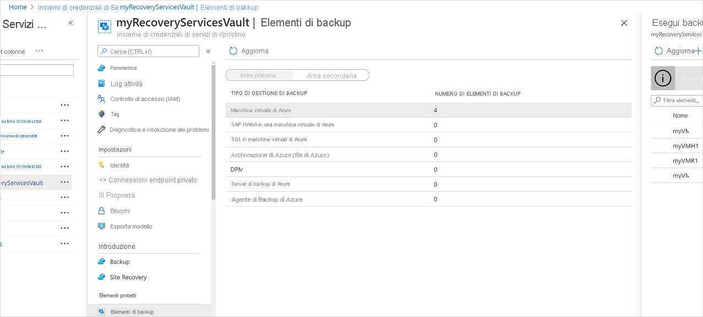
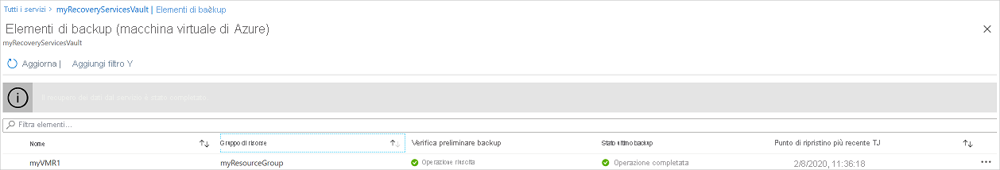
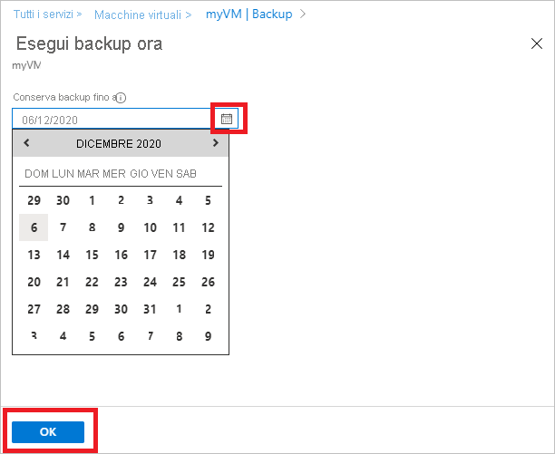

# Gestire i backup delle macchine virtuali di Azure
> [!div class="op_single_selector"]
> * [Gestire i backup delle macchine virtuali di Azure](backup-azure-manage-vms.md)
> * [Gestire i backup delle macchine virtuali classiche](backup-azure-manage-vms-classic.md)
>
>

Questo articolo contiene indicazioni sulla gestione dei backup delle VM e illustra le informazioni degli avvisi relativi al backup disponibili nel dashboard del portale. Le informazioni aggiuntive incluse in questo articolo si applicano all'uso di macchine virtuali con gli insiemi di credenziali di Servizi di ripristino. Questo articolo non illustra la creazione di macchine virtuali, né come proteggerle. Per una panoramica della protezione di macchine virtuali distribuite tramite Azure Resource Manager con un insieme di credenziali di Servizi di ripristino, vedere [Primi passi: eseguire il backup di VM di Azure Resource Manager in un insieme di credenziali dei servizi di ripristino](backup-azure-vms-first-look-arm.md).

## Gestire gli insiemi di credenziali e le macchine virtuali protette
Nel portale di Azure il dashboard dell'insieme di credenziali di Servizi di ripristino consente di accedere alle informazioni relative all'insieme di credenziali, quali:

* Snapshot di backup più recente, che corrisponde anche al punto di ripristino più recente <br\>
* Criteri di backup <br\>
* Dimensioni totali di tutti gli snapshot di backup <br\>
* Numero di macchine virtuali protette con l'insieme di credenziali <br\>

Molte attività di gestione per il backup di una macchina virtuale iniziano con l'apertura dell'insieme di credenziali nel dashboard. Dato che gli insiemi di credenziali possono essere usati per proteggere più elementi (o più VM), tuttavia, per visualizzare i dettagli relativi a una determinata VM aprire il dashboard dell'elemento dell'insieme di credenziali. La procedura seguente illustra come aprire il *dashboard dell'insieme di credenziali* per poi passare al *dashboard dell'elemento dell'insieme di credenziali*. Entrambe le procedure includono "suggerimenti" che indicano come aggiungere l'insieme di credenziali e l'elemento dell'insieme di credenziali al dashboard di Azure tramite il comando Aggiungi al dashboard. L'aggiunta al dashboard è un modo per creare un collegamento all'insieme di credenziali o a un elemento. Dal collegamento è anche possibile eseguire comandi comuni.

> [!TIP]
> Se sono aperti più dashboard e pannelli, usare il dispositivo di scorrimento blu nella parte inferiore della finestra per scorrere in modo bidirezionale il dashboard di Azure.
>
>

### Aprire un insieme di credenziali di Servizi di ripristino nel dashboard:
1. Accedere al [portale di Azure](https://portal.azure.com/).
2. Scegliere **Sfoglia** dal menu Hub e digitare **Servizi di ripristino** nell'elenco di risorse. Non appena si inizia a digitare, l'elenco viene filtrato in base all'input. Fare clic su **Insieme di credenziali dei servizi di ripristino**.

      

    Viene visualizzato l'elenco di insiemi di credenziali dei servizi di ripristino.

      

   > [!TIP]
   > Se si aggiunge un insieme di credenziali al dashboard di Azure, sarà immediatamente accessibile quando si apre il portale di Azure. Per aggiungere un insieme di credenziali al dashboard, nell'elenco di insiemi di credenziali fare clic con il pulsante destro del mouse sull'insieme desiderato e scegliere **Aggiungi al dashboard**.
   >
   >
3. Nell'elenco di insiemi di credenziali selezionare quello per cui si vuole aprire il dashboard. Quando si seleziona l'insieme di credenziali, vengono aperti il dashboard corrispondente e il relativo pannello **Impostazioni** . Nella figura seguente è evidenziato il dashboard **Contoso-vault** .

    

### Aprire il dashboard di un elemento dell'insieme di credenziali
Nella procedura precedente è stato aperto il dashboard dell'insieme di credenziali. Per aprire il dashboard di un elemento dell'insieme di credenziali:

1. Nel riquadro **Elementi di backup** del dashboard dell'insieme di credenziali fare clic su **Macchine virtuali di Azure**.

    

    Il pannello **Macchine virtuali di Azure** elenca l'ultimo processo di backup per ogni elemento. In questo esempio è presente una sola macchina virtuale, demovm-markgal, protetta da questo insieme di credenziali.  

    

   > [!TIP]
   > Per facilitare l'accesso, è possibile aggiungere un elemento dell'insieme di credenziali al dashboard di Azure. Per aggiungere un elemento dell'insieme di credenziali, nell'elenco di insiemi di credenziali fare clic con il pulsante destro del mouse sull'elemento desiderato e scegliere **Aggiungi al dashboard**.
   >
   >
2. Nel pannello **Elementi di backup** fare clic sull'elemento per aprire il dashboard dell'elemento dell'insieme di credenziali.

    

    Verranno visualizzati il dashboard dell'elemento dell'insieme di credenziali e il relativo pannello **Impostazioni** .

    

    Dal dashboard dell'elemento dell'insieme di credenziali è possibile eseguire molte attività di gestione importanti, ad esempio:

   * Modificare i criteri o creare nuovi criteri di backup<br\>
   * Visualizzare i punti di ripristino e vedere il relativo stato di coerenza <br\>
   * Eseguire il backup su richiesta di una macchina virtuale <br\>
   * Arrestare la protezione delle macchine virtuali <br\>
   * Riprendere la protezione delle macchine virtuali <br\>
   * Eliminare i dati di un backup o un punto di ripristino <br\>
   * [ripristinare i dischi di backup](backup-azure-arm-restore-vms.md#restore-backed-up-disks)  <br\>

Per le procedure seguenti, il punto di partenza è il dashboard dell'elemento dell'insieme di credenziali.

## Gestire i criteri di backup
1. Nel [dashboard dell'elemento dell'insieme di credenziali](backup-azure-manage-vms.md#open-a-vault-item-dashboard) fare clic su **All Settings** (Tutte le impostazioni) per aprire il pannello **Impostazioni**.

    
2. Nel pannello **Impostazioni** fare clic su **Criteri di backup** per aprire il pannello corrispondente.

    Nel pannello vengono visualizzati i dettagli relativi a intervallo di conservazione e frequenza di backup.

    
3. Dal menu **Scegliere i criteri di backup** :

   * Per modificare i criteri, selezionare criteri diversi e fare clic su **Salva**. Il nuovo criterio verrà immediatamente applicato all'insieme di credenziali. <br\>
   * Per creare i criteri, selezionare **Crea nuovo**.

     

     Per istruzioni sulla creazione di criteri di backup, vedere [Definizione di un criterio di backup](backup-azure-manage-vms.md#defining-a-backup-policy).

[!INCLUDE [backup-create-backup-policy-for-vm](../../includes/backup-create-backup-policy-for-vm.md)]

> [!NOTE]
> Durante la gestione dei criteri di backup, assicurarsi di seguire le [procedure consigliate](backup-azure-vms-introduction.md#best-practices) per garantire prestazioni di backup ottimali
>
>

## Backup su richiesta di una macchina virtuale
È possibile eseguire il backup su richiesta di una macchina virtuale dopo averla configurata per la protezione. Se il backup iniziale è in sospeso, il backup su richiesta crea una copia completa della macchina virtuale nell'insieme di credenziali dei servizi di ripristino. Se il backup iniziale è stato completato, un backup su richiesta invierà all'insieme di credenziali dei servizi di ripristino solo le modifiche rispetto allo snapshot precedente. I backup successivi sono sempre incrementali.

> [!NOTE]
> L'intervallo di conservazione per un backup su richiesta è il valore di conservazione specificato nei criteri per il punto di backup giornaliero. Se il punto di backup giornaliero non è selezionato, verrà usato quello settimanale.
>
>

Per attivare un backup su richiesta di una macchina virtuale:

* Nel [dashboard dell'elemento dell'insieme di credenziali](backup-azure-manage-vms.md#open-a-vault-item-dashboard)fare clic su **Esegui backup ora**.

    

    Il portale richiede di confermare l'avvio del processo di backup su richiesta. Per avviarlo, fare clic su **Sì** .

    

    Il processo di backup crea un punto di ripristino. L'intervallo di conservazione del punto di ripristino è uguale a quello specificato nei criteri associati alla macchina virtuale. Per tenere traccia dello stato di avanzamento del processo, nel dashboard dell'insieme di credenziali fare clic sul riquadro **Processi di backup** .  

## Arrestare la protezione delle macchine virtuali
Se si sceglie di arrestare la protezione di una macchina virtuale, viene chiesto se si vogliono mantenere i punti di ripristino. Per arrestare la protezione delle macchine virtuali è possibile procedere in due modi:

* interrompere tutti i processi di backup futuri ed eliminare tutti i punti di ripristino oppure
* interrompere tutti i processi di backup futuri mantenendo però i punti di ripristino.  

Al mantenimento dei punti di ripristino nella risorsa di archiviazione è associato un costo. Tuttavia, la possibilità di mantenere i punti di ripristino per ripristinare la macchina virtuale in un secondo momento, se necessario, costituisce un vantaggio. Per informazioni sul costo associato al mantenimento dei punti di ripristino, vedere [Dettagli prezzi](https://azure.microsoft.com/pricing/details/backup/). Se si sceglie di eliminare tutti i punti di ripristino, non sarà possibile ripristinare la macchina virtuale.

Per arrestare la protezione per una macchina virtuale:

1. Nel [dashboard dell'elemento dell'insieme di credenziali](backup-azure-manage-vms.md#open-a-vault-item-dashboard)fare clic su **Interrompi backup**.

    

    Verrà visualizzato il pannello Arresta backup.

    
2. Nel pannello **Interrompi backup** scegliere se mantenere o eliminare i dati di backup. La casella delle informazioni include i dettagli sulla scelta effettuata.

    
3. Se si è scelto di mantenere i dati di backup, andare al passaggio 4. Se si è scelto di eliminare i dati di backup, confermare l'arresto dei processi di backup ed eliminare i punti di ripristino, digitando il nome dell'elemento.

    

    Se non si è certi del nome dell'elemento, passare il puntatore sul punto esclamativo per visualizzarlo. Il nome dell'elemento si trova anche nella parte superiore del pannello **Interrompi backup** .
4. L'aggiunta di un **motivo** o **commento** è facoltativa.
5. Per interrompere il processo di backup per l'elemento corrente, fare clic sul pulsante 

    Un messaggio di notifica informa che i processi di backup sono stati arrestati.

    

## Riprendere la protezione di una macchina virtuale
Se quando è stata arrestata la protezione della macchina virtuale è stata scelta l'opzione **Conserva i dati di backup** , è possibile riprendere la protezione. Se è stata scelta l'opzione **Elimina dati di backup** , la protezione della macchina virtuale non può essere ripresa.

Per riprendere la protezione della macchina virtuale

1. Nel [dashboard dell'elemento dell'insieme di credenziali](backup-azure-manage-vms.md#open-a-vault-item-dashboard)fare clic su **Riprendi backup**.

    

    Verrà visualizzato il pannello Criteri di backup.

   > [!NOTE]
   > Quando si riattiva la protezione della macchina virtuale, è possibile scegliere un criterio diverso rispetto ai criteri con cui la macchina virtuale è stata protetta inizialmente.
   >
   >
2. Per assegnare i criteri della macchina virtuale, seguire la procedura descritta in [Gestire i criteri di backup](backup-azure-manage-vms.md#manage-backup-policies).

    Dopo l'applicazione dei criteri di backup alla macchina virtuale, verrà visualizzato il messaggio seguente.

    

## Elimina dati di backup
È possibile eliminare i dati di backup associati a una macchina virtuale durante il processo **Interrompi backup** o in qualsiasi momento dopo il completamento del backup. Attendere settimane o mesi prima di eliminare i punti di ripristino potrebbe anche essere utile. A differenza del recupero dei punti di ripristino, quando si eliminano i dati di backup, non è possibile scegliere di eliminare punti di ripristino specifici. Se si sceglie di eliminare i dati di backup, vengono eliminati tutti i punti di ripristino associati all'elemento.

Nella procedura seguente si presuppone che il processo di backup per la macchina virtuale sia stato arrestato o disabilitato. Dopo che è stato disabilitato il processo di backup, nel dashboard dell'elemento dell'insieme di credenziali sono disponibili le opzioni **Riprendi backup** ed **Elimina backup**.

Per eliminare i dati di backup in una macchina virtuale con il *backup disabilitato*:

1. Nel [dashboard dell'elemento dell'insieme di credenziali](backup-azure-manage-vms.md#open-a-vault-item-dashboard)fare clic su **Elimina dati di backup**.

    

    Verrà visualizzato il pannello **Elimina dati di backup** .

    
2. È necessario digitare il nome dell'elemento per confermare l'eliminazione dei punti di ripristino.

    

    Se non si è certi del nome dell'elemento, passare il puntatore sul punto esclamativo per visualizzarlo. Il nome dell'elemento si trova anche nella parte superiore del pannello **Elimina dati backup** .
3. L'aggiunta di un **motivo** o **commento** è facoltativa.
4. Per eliminare i dati di backup per l'elemento corrente, fare clic sul pulsante 

    Un messaggio di notifica informa che i dati di backup sono stati eliminati.

## Passaggi successivi
Per informazioni su come ricreare una macchina virtuale da un punto di ripristino, vedere [Ripristinare macchine virtuali in Azure](backup-azure-restore-vms.md). Per informazioni sulla protezione delle macchine virtuali, vedere [Primo approccio: Proteggere le VM di Azure con un insieme di credenziali dei servizi di ripristino](backup-azure-vms-first-look-arm.md). Per informazioni sul monitoraggio degli eventi, vedere [Monitor alerts for Azure virtual machine backups](backup-azure-monitor-vms.md)(Monitorare gli avvisi per i backup delle macchine virtuali di Azure).
