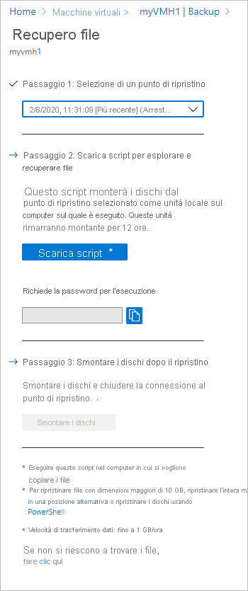
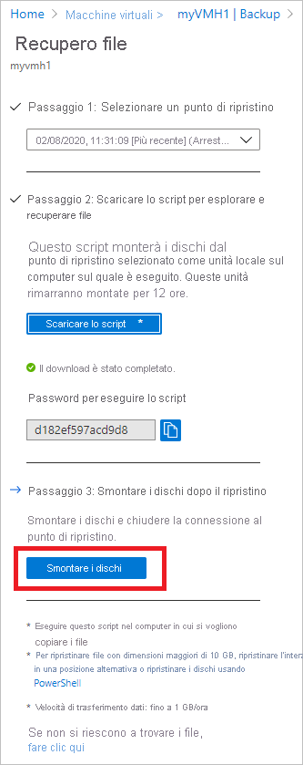

# <a name="recover-files-from-azure-virtual-machine-backup"></a>Ripristinare i file da un backup della macchina virtuale di Azure

Backup di Azure offre la possibilità di ripristinare [dischi e macchine virtuali (VM) di Azure](./backup-azure-arm-restore-vms.md) dai backup di VM di Azure, denominati anche punti di ripristino. Questo articolo illustra come ripristinare file e cartelle da un backup di VM di Azure. Il ripristino di file e cartelle è disponibile solo per le VM di Azure distribuite con il modello Resource Manager e protette in un insieme di credenziali dei servizi di ripristino.

> [!Note]
> Questa funzionalità è disponibile per le VM di Azure distribuite usando il modello Resource Manager e protette in un insieme di credenziali di Servizi di ripristino.
> Il ripristino di file da un backup della VM crittografato non è supportato.
>

## <a name="mount-the-volume-and-copy-files"></a>Montare il volume e copiare i file

Per ripristinare file o cartelle dal punto di ripristino, passare alla macchina virtuale e scegliere il punto di ripristino. 

1. Accedere al [portale di Azure](http://portal.Azure.com) e nel menu a sinistra fare clic su **Macchine virtuali**. Nell'elenco delle macchine virtuali selezionare la macchina virtuale per aprirne il dashboard. 

2. Nel menu della macchina virtuale fare clic su **Backup** per aprire il dashboard Backup.

    

3. Nel menu del dashboard Backup fare clic su **Ripristino file** per aprire il relativo menu.

    

4. Nel menu a discesa **Selezionare il punto di ripristino**, selezionare il punto di ripristino contenente i file desiderati. Per impostazione predefinita, il punto di ripristino più recente è già selezionato.

5. Per scaricare il software usato per copiare i file dal punto di ripristino, fare clic su **Download Executable** (Scarica eseguibile), per una VM Windows di Azure, oppure su **Scarica script**, per una VM Linux di Azure. 

    

    Azure scarica il file eseguibile o lo script sul computer locale.

    

    Per eseguire il file eseguibile o lo script come amministratore, è consigliabile salvare il download sul computer.

6. Il file eseguibile o lo script è protetto da password, che viene quindi richiesta. Nel menu **Ripristino file** fare clic sul pulsante di copia per caricare la password in memoria.

    

7. Nel percorso di download (in genere la cartella Download) fare clic con il pulsante destro del mouse sul file eseguibile o sullo script ed eseguirlo con credenziali di amministratore. Quando richiesto, digitare la password o incollarla dalla memoria e premere INVIO. Dopo l'immissione della password valida, lo script si connette al punto di ripristino.

    

    Se si esegue lo script in un computer con accesso limitato, verificare che sia disponibile l'accesso a:

    - download.microsoft.com
    - [Endpoint di Azure usati per i backup di VM di Azure](backup-azure-arm-vms-prepare.md#establish-network-connectivity)
    - porta in uscita 3260

    Per Linux, lo script richiede i componenti "open-iscsi" e "lshw" per la connessione al punto di ripristino. Se i componenti non sono presenti nel computer in cui viene eseguito, lo script chiede l'autorizzazione per installarli. Acconsentire all'installazione dei componenti necessari.
    
    Per accedere a download.microsoft.com è necessario scaricare i componenti usati per creare un canale sicuro tra il computer in cui viene eseguito lo script e i dati nel punto di ripristino.         

    È possibile eseguire lo script in qualsiasi computer con lo stesso sistema operativo (o compatibile) della macchina virtuale sottoposta a backup. Vedere la [tabella di sistemi operativi compatibili](backup-azure-restore-files-from-vm.md#system-requirements) per informazioni in proposito. Se la macchina virtuale di Azure protetta usa Spazi di archiviazione Windows (per VM Windows di Azure) o array RAID/LVM (per VM Linux), non è possibile eseguire il file eseguibile o lo script nella stessa macchina virtuale. Eseguire invece il file eseguibile o lo script in qualsiasi altro computer con un sistema operativo compatibile.
 

### <a name="identifying-volumes"></a>Identificazione dei volumi

#### <a name="for-windows"></a>Per Windows

Quando si esegue il file eseguibile, il sistema operativo monta i nuovi volumi e assegna lettere di unità. È possibile usare Esplora risorse o Esplora file per individuare queste unità. Le lettere di unità assegnate ai volumi potrebbero non essere le stesse lettere della macchina virtuale originale; il nome del volume viene tuttavia mantenuto. Il volume della macchina virtuale originale "Disco dati (E:`\`)", ad esempio, può essere collegato nel computer locale come "Disco dati ('Qualsiasi lettera':`\`)". Esplorare tutti i volumi indicati nell'output dello script fino a individuare il file o la cartella.  
       
   
           
#### <a name="for-linux"></a>Per Linux

In Linux i volumi del punto di ripristino sono montati nella cartella in cui viene eseguito lo script. I dischi collegati, i volumi e i percorsi di montaggio corrispondenti vengono visualizzati di conseguenza. Questi percorsi di montaggio sono visibili agli utenti con accesso a livello radice. Esplorare i volumi indicati nell'output dello script.

  
  

## <a name="closing-the-connection"></a>Chiusura della connessione

Dopo avere identificato i file e averli copiati in un percorso di archiviazione locale, rimuovere o smontare le unità aggiuntive. Per smontare le unità, nel menu **Ripristino file** del portale di Azure fare clic su **Unmount Disks** (Smonta dischi).



Dopo che i dischi sono stati smontati, viene visualizzato un messaggio indicante che l'operazione è stata eseguita correttamente. L'aggiornamento della connessione in modo che sia possibile rimuovere i dischi potrebbe richiedere alcuni minuti.

In Linux, dopo che la connessione al punto di ripristino viene interrotta, il sistema operativo non rimuove automaticamente i percorsi di montaggio corrispondenti, che rimangono come volumi "orfani" visibili, ma generano un errore in caso di accesso/scrittura di file. Questi percorsi possono essere rimossi manualmente. Quando viene eseguito, lo script identifica tutti i volumi di questo tipo esistenti da eventuali punti di ripristino precedenti e li elimina dopo avere ottenuto il consenso.

## <a name="special-configurations"></a>Configurazioni speciali

### <a name="dynamic-disks"></a>Dischi dinamici

Se la VM di Azure protetta ha volumi con una o entrambe le caratteristiche seguenti, non è possibile eseguire lo script eseguibile nella stessa VM. 

  - Volumi che includono più dischi (volumi con spanning e con striping)
  - Volumi a tolleranza di errore (volume RAID-5 e con mirroring) in dischi dinamici 

Eseguire invece lo script eseguibile in qualsiasi altro computer con un sistema operativo compatibile.

### <a name="windows-storage-spaces"></a>Spazi di archiviazione di Windows

Spazi di archiviazione Windows è una tecnologia Windows che consente di virtualizzare le risorse di archiviazione. Con Spazi di archiviazione Windows è possibile raggruppare dischi standard di settore in pool di archiviazione e quindi usare lo spazio disponibile in tali pool per creare dischi virtuali, detti spazi di archiviazione.

Se la VM di Azure protetta usa Spazi di archiviazione Windows, non è possibile eseguire lo script eseguibile nella stessa VM. Eseguire invece lo script eseguibile in qualsiasi altro computer con un sistema operativo compatibile.

### <a name="lvmraid-arrays"></a>LVM/matrici RAID

In Linux vengono usati la gestione dei volumi logici (LVM) e/o le matrici RAID software per gestire i volumi logici su più dischi. Se la VM Linux protetta usa array RAID e/o LVM, non è possibile eseguire lo script nella stessa VM. Eseguire invece lo script in qualsiasi altro computer con sistema operativo compatibile che supporti il file system della VM protetta.

L'output dello script seguente mostra dischi e volumi di array RAID e/o LVM con il tipo di partizione.

   
   
Per portare online queste partizioni, eseguire i comandi riportati nelle sezioni successive. 

**Per le partizioni LVM**

Per ottenere un elenco dei nomi del gruppo di volumi in un volume fisico:
```
$ pvs <volume name as shown above in the script output> 
```
Per ottenere un elenco di tutti i volumi logici, dei nomi e dei relativi percorsi in un gruppo di volumi:

```
$ lvdisplay <volume-group-name from the pvs command’s results> 
```

Per montare i volumi logici nel percorso scelto.

```
$ mount <LV path> </mountpath>
```


**Per le matrici RAID**

Il comando seguente visualizza informazioni dettagliate su tutti i dischi RAID.

```
$ mdadm –detail –scan
```
 Il disco RAID pertinente viene visualizzato come `/dev/mdm/<RAID array name in the protected VM>`

Usare il comando mount se il disco RAID dispone di volumi fisici.
```
$ mount [RAID Disk Path] [/mountpath]
```

Se nel disco RAID è configurata un'altra LVM, seguire la procedura precedente per le partizioni LVM usando però il nome del volume invece del nome del disco RAID.

## <a name="system-requirements"></a>Requisiti di sistema

### <a name="for-windows"></a>Per Windows

La tabella seguente illustra la compatibilità tra i sistemi operativi del server e del computer. Quando si esegue il ripristino di file, non è possibile ripristinare i file in una versione precedente o successiva del sistema operativo. Ad esempio, non è possibile ripristinare un file da una VM Windows Server 2016 a un computer Windows Server 2012 o Windows 8. È possibile ripristinare i file da una VM allo stesso sistema operativo server o al sistema operativo client compatibile.   

|Sistema operativo del server | Sistema operativo compatibile del client  |
| --------------- | ---- |
| Windows Server 2016    | Windows 10 |
| Windows Server 2012 R2 | Windows 8.1 |
| Windows Server 2012    | Windows 8  |
| Windows Server 2008 R2 | Windows 7   |

### <a name="for-linux"></a>Per Linux

In Linux, il sistema operativo del computer usato per ripristinare i file deve supportare il file system della macchina virtuale protetta. Quando si seleziona un computer per l'esecuzione dello script, assicurarsi che abbia un sistema operativo compatibile e che usi una delle versioni indicate nella tabella seguente:

|Sistema operativo Linux | Versioni  |
| --------------- | ---- |
| Ubuntu | 12.04 e versioni successive |
| CentOS | 6.5 e versioni successive  |
| RHEL | 6.7 e versioni successive |
| Debian | 7 e versioni successive |
| Oracle Linux | 6.4 e versioni successive |
| SLES | 12 e versioni successive |
| openSUSE | 42.2 e versioni successive |

Per l'esecuzione e la connessione sicura al punto di ripristino, lo script richiede anche componenti bash e Python.

|Componente | Versione  |
| --------------- | ---- |
| bash | 4 e versioni successive |
| python | 2.6.6 e versioni successive  |
| TLS | 1.2 dovrebbe essere supportata  |

## <a name="troubleshooting"></a>Risoluzione dei problemi

Se si verificano problemi durante il ripristino di file dalle macchine virtuali, controllare la tabella seguente per informazioni aggiuntive.

| Messaggio di errore/scenario | Possibile causa | Azione consigliata |
| ------------------------ | -------------- | ------------------ |
| Output del file exe: *Eccezione di connessione alla destinazione.* |Lo script non è in grado di accedere al punto di ripristino | Controllare se il computer soddisfa i requisiti di accesso indicati in precedenza. |  
|   Output del file exe: *Accesso alla destinazione già eseguito mediante una sessione iSCSI.* | Lo script è stato già eseguito nella stessa macchina virtuale e le unità sono state associate | I volumi del punto di ripristino sono già stati associati. È possibile che NON siano installati con le stesse lettere di unità della VM originale. Esplorare tutti i volumi disponibili in Esplora file per il file |
| Output di file exe: *Questo script non è valido perché è necessario smontare i dischi tramite il portale/è stato superato il limite di 12 ore. Scaricare un nuovo script dal portale.* | I dischi sono stati smontati dal portale o è stato superato il limite di 12 ore |    Non è possibile eseguire questo specifico file con estensione exe perché non è più valido. Se si vuole accedere ai file di questo punto di ripristino, visitare il portale per ottenere un nuovo file con estensione exe|
| Nella macchina virtuale in cui viene eseguito il file con estensione exe: i nuovi volumi non vengono smontati dopo avere selezionato il pulsante di disinstallazione |    L'iniziatore ISCSI nella macchina virtuale non sta rispondendo/aggiornando la connessione alla destinazione ed eseguendo la manutenzione della cache |    Attendere alcuni minuti dopo la pressione del pulsante per smontare. Se i nuovi volumi non sono ancora stati smontati, sfogliare tutti i volumi. In questo modo l'iniziatore deve aggiornare la connessione e il volume viene smontato con un messaggio di errore indicante che il disco non è disponibile|
| Output del file exe: lo script viene eseguito correttamente ma l'output indicante nuovi volumi associati non viene visualizzato nell'output dello script | Si tratta di un errore temporaneo   | I volumi sono stata già associati. Aprire Explorer per visualizzare lo stato. Se si sta usando la stessa macchina virtuale per eseguire gli script ogni volta, è consigliabile riavviare la macchina; l'elenco verrà visualizzato nelle successive esecuzioni del file eseguibile. |
| Specifico per Linux: non è possibile visualizzare i volumi desiderati | Il sistema operativo del computer in cui viene eseguito lo script potrebbe non riconoscere il file system sottostante della VM protetta | Controllare se il punto di ripristino è coerente con l'arresto anomalo del sistema o è coerente a livello di file. Se è coerente a livello di file, eseguire lo script in un altro computer il cui sistema operativo riconosce il file system della VM protetta |
| Specifico per Windows: non è possibile visualizzare i volumi desiderati | I dischi possono essere stati collegati, ma i volumi non sono stati configurati | Dalla schermata Gestione disco, identificare i dischi aggiuntivi correlati al punto di recupero. Se uno di questi dischi è in stato offline, provare a renderlo online facendo clic con il pulsante destro del mouse sul disco e fare clic su "Online"|
