# Backup di macchine virtuali di Azure in insiemi di credenziali di Servizi di ripristino
> [!div class="op_single_selector"]
> * [Proteggere le VM con un insieme di credenziali dei servizi di ripristino](backup-azure-vms-first-look-arm.md)
> * [Proteggere le VM con un insieme di credenziali per il backup](backup-azure-vms-first-look.md)
>
>

Questa esercitazione illustra i passaggi per creare un insieme di credenziali dei servizi di ripristino e per eseguire il backup di una macchina virtuale (VM) di Azure. Gli insiemi di credenziali dei servizi di ripristino proteggono:

* VM distribuite in Azure Resource Manager
* Macchine virtuali classiche
* Macchine virtuali di Archiviazione Standard
* Macchine virtuali di Archiviazione Premium
* Macchine virtuali in esecuzione su Managed Disks
* VM crittografate usando Crittografia dischi di Azure
* Backup coerente con le applicazioni di macchine virtuali Windows tramite VSS e di macchine virtuali Linux tramite script pre-snapshot e post-snapshot personalizzati

Per altre informazioni sulla protezione di macchine virtuali di Archiviazione Premium, vedere l'articolo [Backup e ripristino di macchine virtuali di Archiviazione Premium](backup-introduction-to-azure-backup.md#using-premium-storage-vms-with-azure-backup). Per altre informazioni sul supporto per macchine virtuali con Managed Disks, vedere [Backup e ripristino di macchine virtuali in Managed Disks](backup-introduction-to-azure-backup.md#using-managed-disk-vms-with-azure-backup). Per altre informazioni sul framework di script pre-snapshot e post-snapshot per il backup di macchine virtuali Linux, vedere [Backup coerente con le applicazioni di VM Linux di Azure] (https://docs.microsoft.com/azure/backup/backup-azure-linux-app-consistent).

Per altre informazioni sui casi in cui è possibile o non è possibile eseguire il backup, fare riferimento [qui](backup-azure-vms-prepare.md#limitations-when-backing-up-and-restoring-a-vm)

> [!NOTE]
> Questa esercitazione presuppone che sia disponibile una VM nella sottoscrizione di Azure e che al servizio Backup sia stato concesso l'accesso alla VM.
>
>

[!INCLUDE [learn-about-Azure-Backup-deployment-models](../../includes/backup-deployment-models.md)]

A seconda del numero di macchine virtuali da proteggere, è possibile iniziare da diversi punti. Se si desidera eseguire il backup di più macchine virtuali in un'unica operazione, passare all'insieme di credenziali di Servizi di ripristino e [avviare il processo di backup nel dashboard dell'insieme di credenziali](backup-azure-vms-first-look-arm.md#configure-the-backup-job-from-the-recovery-services-vault). Se si desidera eseguire il backup di una singola macchina virtuale, è possibile avviarne il processo dal pannello di gestione della macchina virtuale.

## Configurare il processo di backup dal pannello di gestione della macchina virtuale

Usare i passaggi seguenti per configurare il processo di backup dal pannello di gestione della macchina virtuale nel portale di Azure. Questi passaggi non si applicano alle macchine virtuali nel portale classico.

1. Accedere al [portale di Azure](https://portal.azure.com/).
2. Scegliere **Altri servizi** dal menu Hub e digitare **Macchine virtuali** nella finestra di dialogo Filtro. Durante la digitazione verrà filtrato l'elenco di risorse. Dopo averla individuata, selezionare la voce Macchine virtuali.

  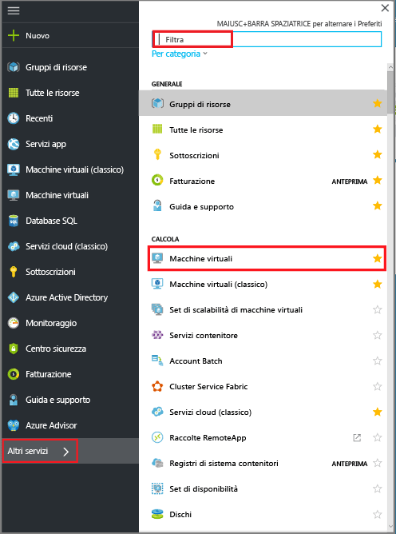

  Verrà visualizzato l'elenco di macchine virtuali (VM) nella sottoscrizione.

  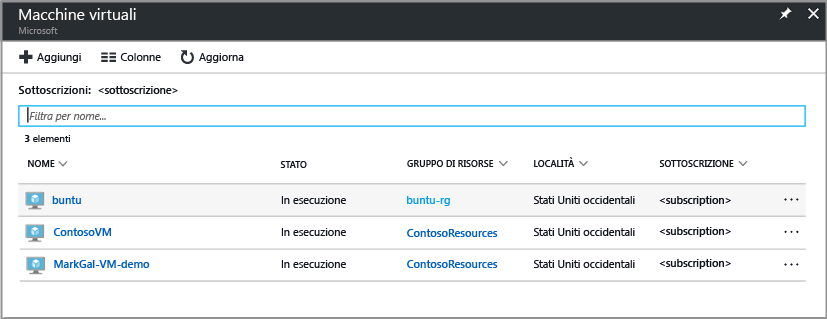

3. Dall'elenco selezionare la macchina virtuale di cui eseguire il backup.

  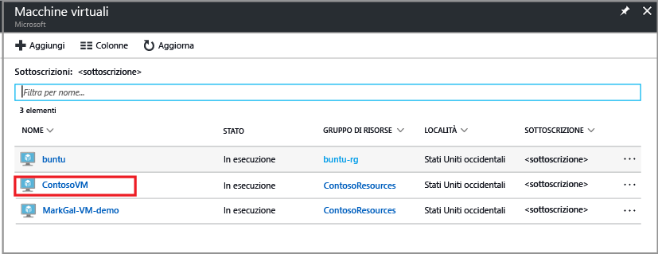

  Quando si seleziona la macchina virtuale, l'elenco di macchine virtuali si sposta a sinistra e si aprono il pannello di gestione e la dashboard della macchina virtuale.  
 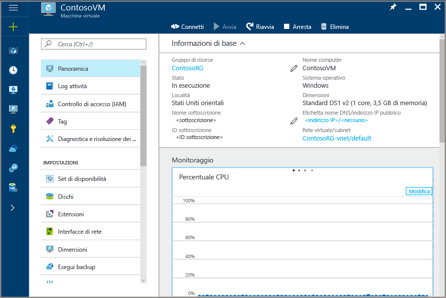

4. Nel pannello di gestione della macchina virtuale, nella sezione **Impostazioni** fare clic su **Backup**.  

  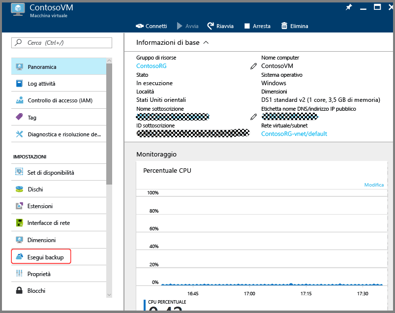

  Verrà aperto il pannello Abilita backup.

  

5. Per l'insieme di credenziali di Servizi di ripristino, fare clic su **Seleziona esistente** e scegliere l'insieme di credenziali dall'elenco a discesa.

  

  Se non sono presenti insiemi di credenziali di Servizi di ripristino o se si desidera usare un nuovo insieme, fare clic su **Crea nuovo** e inserire un nome per il nuovo insieme di credenziali. Viene creato un nuovo insieme nello stesso gruppo di risorse e nello stesso percorso della macchina virtuale. Se si desidera creare un insieme di credenziali di Servizi di ripristino con valori diversi, vedere la sezione su [come creare un insieme di credenziali di Servizi di ripristino](backup-azure-vms-first-look-arm.md#create-a-recovery-services-vault-for-a-vm).

6. Per visualizzare i dettagli dei criteri di backup, fare clic su **Criteri di backup**.

  Viene visualizzato il pannello **Criteri di backup** che indica i dettagli del criterio selezionato. Se sono presenti altri criteri, usare il menu a discesa per scegliere un diverso criterio di backup. Per creare un criterio, selezionare **Crea nuovo** dal menu a discesa. Per istruzioni sulla definizione di un criterio di backup, vedere [Definizione di un criterio di backup](backup-azure-vms-first-look-arm.md#defining-a-backup-policy). Per salvare le modifiche al criterio di backup e tornare al pannello Abilita backup, fare clic su **OK**.

  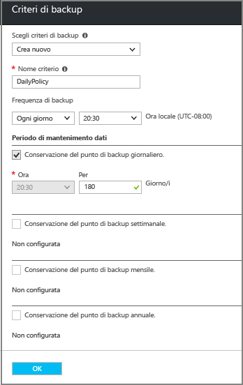

7. Nel pannello Abilita backup, fare clic su **Abilita backup** per distribuire il criterio. La distribuzione del criterio consente di associarlo all'insieme di credenziali e alle macchine virtuali.

  

8. È possibile monitorare l'avanzamento della configurazione tramite le notifiche visualizzate nel portale. L'esempio seguente mostra che la distribuzione ha avuto inizio.

  

9. Dopo aver completato la configurazione, fare clic su **Backup** nel pannello di gestione della macchina virtuale per aprire il pannello Elemento di backup e visualizzare i dettagli.

  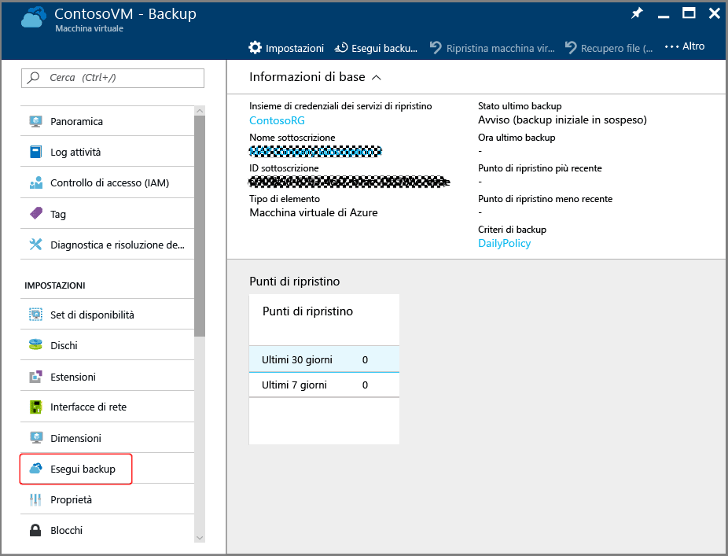

  Fino al completamento del backup iniziale, lo **stato dell'ultimo backup** è **Avviso (backup iniziale in sospeso)**. Per visualizzare la data e l'ora del processo di backup pianificato successivo, fare clic sul nome del criterio in **Criteri di backup**. Viene visualizzato il pannello Criteri di backup in cui viene indicata l'ora del backup pianificato.

10. Per eseguire un processo di backup e creare il punto di ripristino iniziale, fare clic su **Esegui backup ora** nel pannello Insieme di credenziali di backup.

  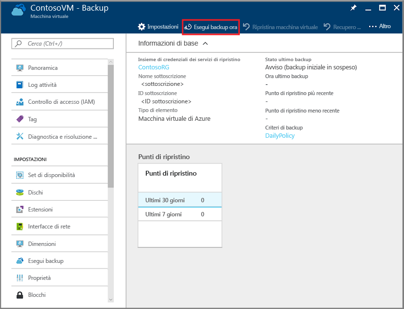

  Si apre il pannello Esegui backup ora.

  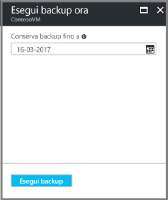

11. Nel pannello Esegui backup ora fare clic sull'icona del calendario, usare il comando del calendario per selezionare l'ultimo giorno di conservazione di tale punto di ripristino e fare clic su **Esegui backup**.

  

  Le notifiche sulla distribuzione consentono di sapere che il processo di backup è stato attivato e che è possibile monitorare lo stato di avanzamento del processo nella pagina Processi di backup.

## Configurare il processo di backup dall'insieme di credenziali di Servizi di ripristino
Per configurare il processo di backup, seguire questa procedura.  

1. Creare un insieme di credenziali di Servizi di ripristino per una macchina virtuale.
2. Usare il portale di Azure per selezionare uno scenario, impostare criteri di backup e identificare gli elementi da proteggere.
3. Eseguire il backup iniziale.

## Creare l'insieme di credenziali dei servizi di ripristino per una macchina virtuale
Un insieme di credenziali dei servizi di ripristino è un'entità che archivia tutti i backup e i punti di ripristino che sono stati creati nel corso del tempo. L'insieme di credenziali dei servizi di ripristino contiene anche i criteri di backup applicati alle VM protette.

> [!NOTE]
> Il backup delle VM è un processo locale. Non è possibile eseguire il backup delle VM da una località a un insieme di credenziali dei servizi di ripristino in un'altra località. Quindi in ogni località di Azure con VM di cui eseguire il backup deve esistere almeno un insieme di credenziali dei servizi di ripristino.
>
>

Per creare un insieme di credenziali dei servizi di ripristino:

1. Se questa operazione non è già stata eseguita, accedere al [portale di Azure](https://portal.azure.com/), usando la sottoscrizione di Azure.
2. Scegliere **Altri servizi** dal menu Hub e digitare **Servizi di ripristino** nella finestra di dialogo Filtro. Durante la digitazione verrà filtrato l'elenco di risorse. Quando viene visualizzato, fare clic su Insiemi di credenziali dei servizi di ripristino nell'elenco.

      

    Se nella sottoscrizione sono disponibili insiemi di credenziali di Servizi di ripristino, verranno elencati.

    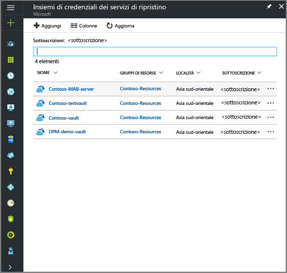
3. Scegliere **Aggiungi** dal menu **Insiemi di credenziali dei servizi di ripristino**.

    

    Verrà visualizzato il pannello degli insiemi di credenziali dei servizi di ripristino, in cui viene richiesto di specificare **Nome**, **Sottoscrizione**, **Gruppo di risorse** e **Località**.

    

4. Nel campo **Nome**digitare un nome descrittivo per identificare l'insieme di credenziali. Il nome deve essere univoco per la sottoscrizione di Azure. Digitare un nome che contenga tra i 2 e i 50 caratteri. Deve iniziare con una lettera e può contenere solo lettere, numeri e trattini.

5. Nella sezione **Sottoscrizione** usare il menu a discesa per scegliere la sottoscrizione di Azure. Se si usa una sola sottoscrizione, questa verrà visualizzata e sarà possibile andare al passaggio successivo. Se non si è certi di quale sottoscrizione usare, usare la sottoscrizione predefinita (o suggerita). Sono disponibili più scelte solo se l'account dell'organizzazione è associato a più sottoscrizioni di Azure.

6. Nella sezione **Gruppo di risorse**:

    * Selezionare **Crea nuovo** se si vuole creare un gruppo di risorse.
    Or
    * Selezionare **Usa esistente** e fare clic sul menu a discesa per visualizzare l'elenco di gruppi di risorse disponibili.

  Per informazioni complete sui gruppi di risorse, vedere [Panoramica di Azure Resource Manager](../azure-resource-manager/resource-group-overview.md).

7. Fare clic su **Località** per selezionare l'area geografica per l'insieme di credenziali. La scelta determina l'area geografica in cui vengono inviati i dati di backup.

  > [!IMPORTANT]
  > Se si non è certi della località della macchina virtuale, chiudere la finestra di dialogo di creazione dell'insieme di credenziali e passare all'elenco di macchine virtuali nel portale. Se si hanno macchine virtuali in più aree, creare un insieme di credenziali di Servizi di ripristino in ogni area. Creare l'insieme di credenziali nella prima località prima di passare a quella successiva. Non è necessario specificare gli account di archiviazione usati per archiviare i dati di backup, perché l'insieme di credenziali di Servizi di ripristino e il servizio Backup di Azure gestiscono l'archiviazione automaticamente.
  >

8. Nella parte inferiore del pannello Insieme di credenziali dei servizi di ripristino fare clic su **Crea**.

    La creazione dell'insieme di credenziali dei servizi di ripristino può richiedere alcuni minuti. Monitorare le notifiche di stato nell'area superiore destra del portale. L'insieme di credenziali, dopo essere stato creato, viene visualizzato negli insiemi di credenziali di Servizi di ripristino. Se l'insieme di credenziali non viene visualizzato dopo qualche minuto, fare clic su **Aggiorna**.

     

    Dopo la visualizzazione dell'insieme di credenziali nell'elenco corrispondente per i Servizi di ripristino, è possibile configurare la ridondanza di archiviazione.

Ora che l'insieme di credenziali è stato creato, è possibile apprendere come impostare la replica di archiviazione.

### Impostare la replica di archiviazione
L'opzione della replica di archiviazione consente di scegliere tra l'archiviazione con ridondanza geografica e l'archiviazione con ridondanza locale. Per impostazione predefinita, l'insieme di credenziali prevede l'archiviazione con ridondanza geografica. Se l'insieme di credenziali di Servizi di ripristino è il backup primario, lasciare l'opzione impostata sull'archiviazione con ridondanza geografica. Se si vuole un'opzione più economica ma non altrettanto permanente, scegliere l'archiviazione con ridondanza locale. Per altre informazioni sulle opzioni di archiviazione con [ridondanza geografica](../storage/common/storage-redundancy.md#geo-redundant-storage) e con [ridondanza locale](../storage/common/storage-redundancy.md#locally-redundant-storage), vedere la panoramica [Replica di Archiviazione di Azure](../storage/common/storage-redundancy.md).

Per modificare le impostazioni di replica di archiviazione:

1. Nel pannello **Insieme di credenziali dei servizi di ripristino** selezionare il nuovo insieme di credenziali.

  

  Quando si seleziona l'insieme di credenziali, si aprono il pannello Impostazioni, *con il nome dell'insieme di credenziali nella parte superiore*, e il pannello dei dettagli dell'insieme di credenziali.

  

2. Nel pannello Impostazioni del nuovo insieme di credenziali usare il dispositivo di scorrimento verticale per passare alla sezione Gestisci e fare clic su **Infrastruttura di backup**.
    Verrà visualizzato il pannello Infrastruttura di backup.
3. Nel pannello Infrastruttura di backup fare clic su **Configurazione backup** per aprire il pannello **Configurazione backup**.

    
4. Scegliere l'opzione di replica di archiviazione appropriata per l'insieme di credenziali.

    

    Per impostazione predefinita, l'insieme di credenziali prevede l'archiviazione con ridondanza geografica. Se si usa Azure come endpoint di archiviazione di backup primario, continuare a usare l'opzione **Con ridondanza geografica**. Se non si usa Azure come endpoint di archiviazione di backup primario, scegliere l'opzione **Con ridondanza locale**, che riduce i costi di archiviazione di Azure. Per altre informazioni sulle opzioni di archiviazione [con ridondanza geografica](../storage/common/storage-redundancy.md#geo-redundant-storage) e [con ridondanza locale](../storage/common/storage-redundancy.md#locally-redundant-storage), vedere [Panoramica della ridondanza di archiviazione](../storage/common/storage-redundancy.md).

## Selezionare un obiettivo di backup, impostare i criteri e definire gli elementi da proteggere
Prima di registrare una macchina virtuale in un insieme di credenziali, eseguire il processo di individuazione per verificare che vengano identificate le eventuali nuove macchine virtuali aggiunte alla sottoscrizione. Il processo esegue una query su Azure per ottenere l'elenco delle macchine virtuali disponibili nella sottoscrizione, insieme ad altre informazioni come il nome del servizio cloud e l'area. Nel portale di Azure lo scenario fa riferimento a ciò che si inserirà nell'insieme di credenziali dei servizi di ripristino. I criteri determinano la pianificazione relativa alla frequenza e al momento in cui acquisiti i punti di ripristino. I criteri includono anche il periodo di mantenimento dati per i punti di ripristino.

1. Se è già aperto un insieme di credenziali dei servizi di ripristino, procedere al passaggio 2. Altrimenti, scegliere **Altri servizi** dal menu Hub e nell'elenco di risorse digitare **Servizi di ripristino**, quindi fare clic su **Insiemi di credenziali dei servizi di ripristino**.

      

    Verrà visualizzato l'elenco degli insiemi di credenziali dei servizi di ripristino.

    

    Nell'elenco degli insiemi di credenziali di Servizi di ripristino selezionare un insieme di credenziali per aprire il relativo dashboard.

     

2. Scegliere **Backup** dal menu del dashboard dell'insieme di credenziali per aprire il pannello Backup.

    

    Si aprono i pannelli Backup e Obiettivo del backup.

    
3. Nel pannello Obiettivo di backup selezionare Azure dal menu **Dove è in esecuzione il carico di lavoro**. Dal menu a discesa **What do you want to backup?** (Elementi per il backup), scegliere Macchina virtuale, quindi fare clic su **OK**.

    Queste azioni registrano l'estensione della macchina virtuale nell'insieme di credenziali. Il pannello Obiettivo di backup si chiude e viene visualizzato il pannello **Criterio di backup**.

    

4. Nel pannello Criterio di backup selezionare il criterio di backup che si vuole applicare all'insieme di credenziali.

    

    I dettagli dei criteri predefiniti vengono elencati nel menu a discesa. Per creare un criterio, selezionare **Crea nuovo** dal menu a discesa. Per istruzioni sulla definizione di un criterio di backup, vedere [Definizione di un criterio di backup](backup-azure-vms-first-look-arm.md#defining-a-backup-policy).
    Fare clic su **OK** per associare il criterio di backup all'insieme di credenziali.

    Il pannello Criterio di backup si chiude e viene visualizzato il pannello **Seleziona macchine virtuali**.
5. Nel pannello **Seleziona macchine virtuali** scegliere le macchine virtuali da associare al criterio specificato e fare clic su **OK**.

    

    Viene convalidata la macchina virtuale selezionata. Se le macchine virtuali non sono visibili, controllare che esistano nello stesso percorso di Azure dell'insieme di credenziali di Servizi di ripristino. La posizione dell'insieme dei credenziali dei Servizi di ripristino viene visualizzata nel dashboard dell'insieme.

6. Dopo aver definito tutte le impostazioni per l'insieme di credenziali, nel pannello Backup fare clic su **Abilita backup** per distribuire il criterio nell'insieme di credenziali e nelle macchine virtuali. La distribuzione del criterio di backup non crea il punto di ripristino iniziale per la macchina virtuale.

    

Dopo avere abilitato correttamente il backup, il criterio di backup verrà eseguito come pianificato. Tuttavia, procedere con l'avvio del primo processo di backup.

## Backup iniziale
Distribuire un criterio di backup nella macchina virtuale non significa eseguire il backup dei dati. Per impostazione predefinita, il primo backup pianificato (definito nel criterio di backup) è il backup iniziale. Fino all'esecuzione del backup iniziale, lo stato dell'ultimo backup nel pannello **Processi di Backup** è **Avviso (backup iniziale in sospeso)**.

A meno che l'avvio del backup iniziale non sia imminente, è consigliabile scegliere l'opzione **Esegui backup ora**.

Per eseguire il processo di backup iniziale:

1. Nel dashboard dell'insieme di credenziali fare clic sul numero sotto **Elementi di backup** oppure fare clic sul riquadro **Elementi di backup**.  
  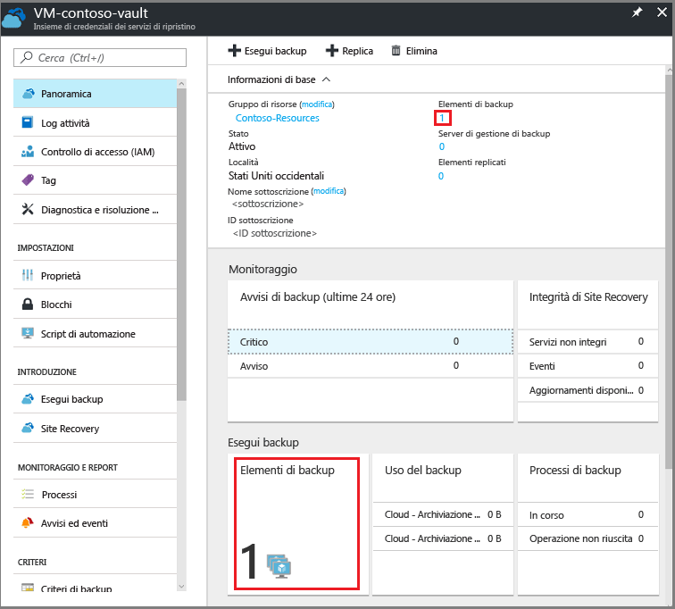

  Si apre il pannello **Elementi di backup** .

  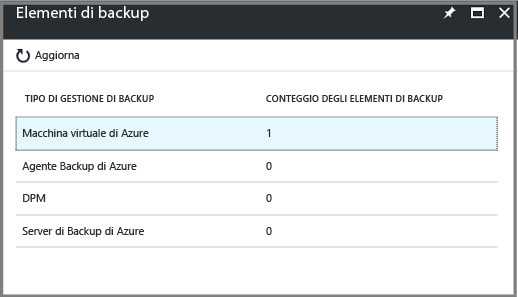

2. Nel pannello **Elementi di backup** selezionare l'elemento.

  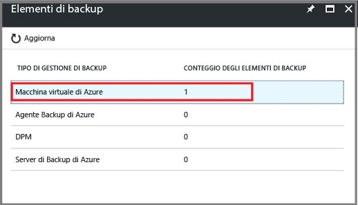

  Si apre l'elenco **Elementi di backup**.  

  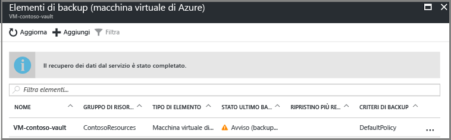

3. Nell'elenco **Elementi di backup** fare clic sui puntini di sospensione **...** per aprire il menu di scelta rapida.

  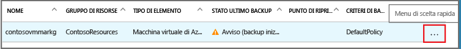

  Si apre il menu di scelta rapida.

  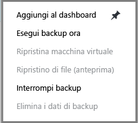

4. Nel menu di scelta rapida fare clic su **Esegui backup ora**.

  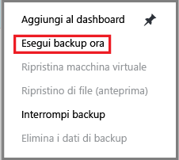

  Si apre il pannello Esegui backup ora.

  

5. Nel pannello Esegui backup ora fare clic sull'icona del calendario, usare il comando del calendario per selezionare l'ultimo giorno di conservazione di tale punto di ripristino e fare clic su **Esegui backup**.

  

  Le notifiche sulla distribuzione consentono di sapere che il processo di backup è stato attivato e che è possibile monitorare lo stato di avanzamento del processo nella pagina Processi di backup. A seconda delle dimensioni della macchina virtuale, la creazione del backup iniziale potrebbe richiedere un po' di tempo.

6. Per visualizzare o tenere traccia dello stato del backup iniziale, nel dashboard dell'insieme di credenziali, nel riquadro **Processi di backup** fare clic sul riquadro **In corso**.

  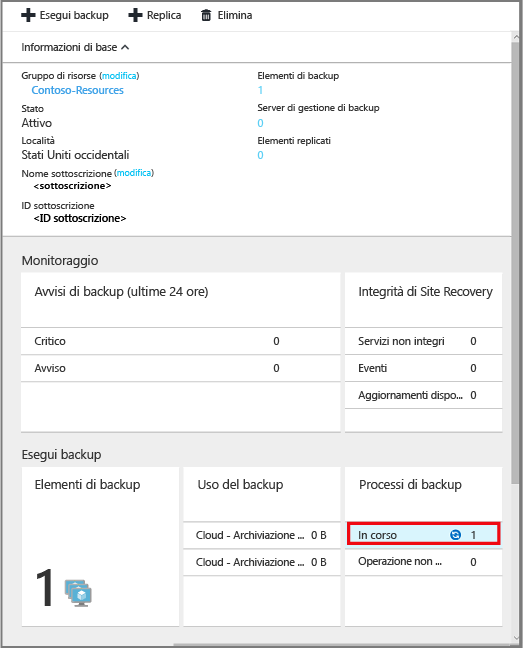

  Si apre il pannello dei processi di backup.

  

  Nel pannello **Processi di backup** è possibile visualizzare lo stato di tutti i processi. Controllare se il processo di backup per la macchina virtuale è ancora in corso o se è terminato. Al termine del processo di backup, lo stato è *Completato*.

  > [!NOTE]
  > Come parte dell'operazione di backup, il servizio Backup di Azure esegue un comando nell'estensione di backup in ogni VM per scaricare tutte le scritture e creare uno snapshot coerente.
  >
  >

[!INCLUDE [backup-create-backup-policy-for-vm](../../includes/backup-create-backup-policy-for-vm.md)]

## Installare l'agente di macchine virtuali nella macchina virtuale
Queste informazioni vengono fornite nel caso in cui siano necessarie. Per il funzionamento dell'estensione di backup, l'agente di macchine virtuali deve essere installato nella macchina virtuale di Azure. Se tuttavia la macchina virtuale è stata creata dalla raccolta di Azure, l'agente di macchine virtuali è già installato. Nelle macchine virtuali di cui viene eseguita la migrazione da data center locali l'agente di macchine virtuali non è installato. In tal caso l'agente di macchine virtuali deve essere installato. In caso di problemi con il backup della macchina virtuale di Azure, assicurarsi che l'agente di macchine virtuali di Azure sia installato correttamente nella macchina virtuale (vedere la tabella seguente). Se si crea una VM personalizzata, [assicurarsi che la casella di controllo **Installa l'agente di macchine virtuali** sia selezionata](../virtual-machines/windows/classic/agents-and-extensions.md?toc=%2fazure%2fvirtual-machines%2fwindows%2fclassic%2ftoc.json) prima che venga effettuato il provisioning della macchina virtuale.

Per altre informazioni, vedere gli articoli sull'[agente di macchine virtuale](https://go.microsoft.com/fwLink/?LinkID=390493&clcid=0x409) e sulla relativa [installazione](../virtual-machines/windows/classic/manage-extensions.md?toc=%2fazure%2fvirtual-machines%2fwindows%2fclassic%2ftoc.json).

La tabella seguente fornisce informazioni aggiuntive sull'agente di macchine virtuali per macchine virtuali Windows e Linux.

| **Operazione** | **Windows** | **Linux** |
| --- | --- | --- |
| Installazione dell'agente di macchine virtuali |<li>Scaricare e installare il file [MSI per l'agente](http://go.microsoft.com/fwlink/?LinkID=394789&clcid=0x409). Per completare l'installazione sono necessari privilegi di amministratore. <li>[Aggiornare le proprietà della VM](http://blogs.msdn.com/b/mast/archive/2014/04/08/install-the-vm-agent-on-an-existing-azure-vm.aspx) per indicare che l'agente è stato installato. |<li> Installare l' [agente Linux](https://github.com/Azure/WALinuxAgent) più recente da GitHub. Per completare l'installazione sono necessari privilegi di amministratore. <li> [Aggiornare le proprietà della VM](http://blogs.msdn.com/b/mast/archive/2014/04/08/install-the-vm-agent-on-an-existing-azure-vm.aspx) per indicare che l'agente è stato installato. |
| Aggiornamento dell'agente di VM |L'aggiornamento dell'agente di VM è semplice quanto la reinstallazione dei [file binari dell'agente di VM](http://go.microsoft.com/fwlink/?LinkID=394789&clcid=0x409).  Assicurarsi che non siano in esecuzione operazioni di backup durante l'aggiornamento dell'agente di VM. |Seguire le istruzioni sull'[aggiornamento dell'agente di macchine virtuali Linux ](../virtual-machines/linux/update-agent.md?toc=%2fazure%2fvirtual-machines%2flinux%2ftoc.json).  Assicurarsi che non siano in esecuzione operazioni di backup durante l'aggiornamento dell'agente di VM. |
| Convalida dell'installazione dell'agente di macchine virtuali |<li>Passare alla cartella *C:\WindowsAzure\Packages* nella VM di Azure, <li>che dovrebbe includere il file WaAppAgent.exe.<li> Fare clic con il pulsante destro del mouse sul file, scegliere **Proprietà** e quindi selezionare la scheda **Dettagli**. Il campo Versione prodotto deve essere 2.6.1198.718 o superiore. |N/D |

### Estensione di backup
Dopo aver installato l'agente di macchine virtuali nella macchina virtuale, il servizio Backup di Azure installa l'estensione di backup nell'agente di macchine virtuali. Il servizio Backup di Azure applica aggiornamenti e patch all'estensione di backup senza ulteriore intervento dell'utente.

Il servizio Backup installa l'estensione di backup anche se la VM non è in esecuzione. Una macchina virtuale in esecuzione consente di ottenere un punto di ripristino coerente con l'applicazione. Il servizio Backup di Azure continua tuttavia a eseguire il backup della macchina virtuale, anche se questa è spenta e non è stato possibile installare l'estensione. Questo tipo di backup è noto come macchina virtuale offline e il punto di ripristino è *coerente con l'arresto anomalo*.

## Informazioni sulla risoluzione dei problemi
In caso di problemi nell'esecuzione di alcune attività di questo articolo, vedere le [indicazioni per la risoluzione dei problemi](backup-azure-vms-troubleshoot.md).

## Prezzi
Il costo del backup delle macchine virtuali di Azure è basato sul numero di istanze protette. Per una definizione di istanza protetta, vedere [Che cos'è un'istanza protetta?](backup-introduction-to-azure-backup.md#what-is-a-protected-instance). Per un esempio di calcolo del costo del backup di una macchina virtuale, vedere [Modalità di calcolo delle istanze protette](backup-azure-vms-introduction.md#calculating-the-cost-of-protected-instances). Per informazioni sui [prezzi per Backup](https://azure.microsoft.com/pricing/details/backup/), vedere la pagina relativa ai prezzi di Backup di Azure.

## Domande?
In caso di domande o se si vuole che venga inclusa una funzionalità, è possibile [inviare commenti e suggerimenti](http://aka.ms/azurebackup_feedback).

