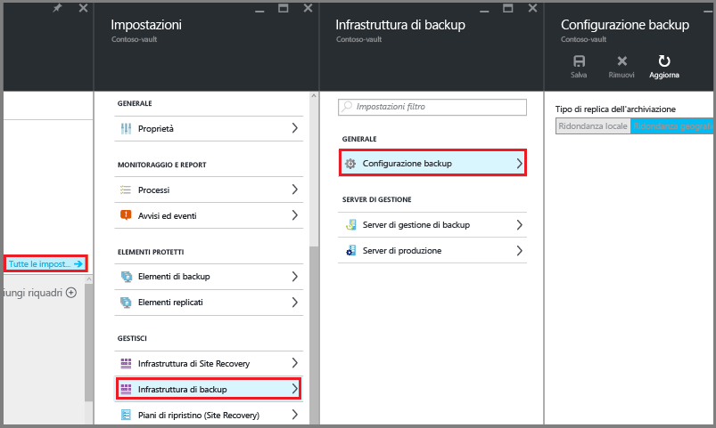
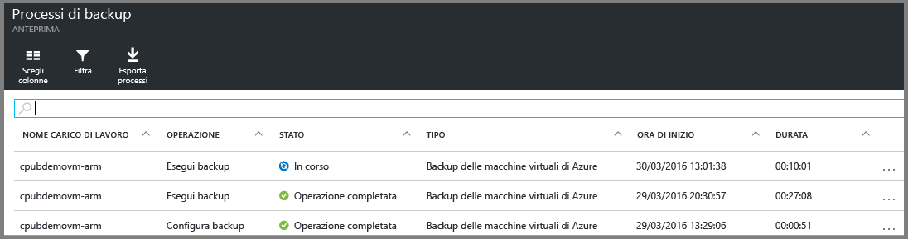

<properties
	pageTitle="Primo approccio: Proteggere le VM di Azure con un insieme di credenziali dei servizi di ripristino | Microsoft Azure"
	description="Proteggere le VM di Azure con un insieme di credenziali dei servizi di ripristino. Usare i backup delle VM distribuite con il modello di distribuzione Resource Manager e con il modello di distribuzione classica e delle VM di Archiviazione Premium per proteggere i dati. Creare e registrare un insieme di credenziali dei servizi di ripristino. Registrare macchine virtuali, creare criteri e proteggere macchine virtuali in Azure."
	services="backup"
	documentationCenter=""
	authors="markgalioto"
	manager="cfreeman"
	editor=""
	keyword="backups; vm backup"/>

<tags
	ms.service="backup"
	ms.workload="storage-backup-recovery"
	ms.tgt_pltfrm="na"
	ms.devlang="na"
	ms.topic="hero-article"
	ms.date="09/15/2016"
	ms.author="markgal; jimpark"/>

# Primo approccio: Proteggere le VM di Azure con un insieme di credenziali dei servizi di ripristino

> [AZURE.SELECTOR]
- [Proteggere le VM con un insieme di credenziali dei servizi di ripristino](backup-azure-vms-first-look-arm.md)
- [Proteggere le VM con un insieme di credenziali per il backup ](backup-azure-vms-first-look.md)

Questa esercitazione illustra i passaggi per creare un insieme di credenziali dei servizi di ripristino e per eseguire il backup di una macchina virtuale (VM) di Azure. Gli insiemi di credenziali dei servizi di ripristino proteggono:

- VM distribuite in Azure Resource Manager
- Macchine virtuali classiche
- Macchine virtuali di Archiviazione Standard
- Macchine virtuali di Archiviazione Premium
- VM crittografate usando Crittografia dischi di Azure, con file BEK e KEK (supportati con Powershell)

Per altre informazioni sulla protezione di VM di Archiviazione Premium, vedere [Backup e ripristino di macchine virtuali di Archiviazione Premium](backup-introduction-to-azure-backup.md#back-up-and-restore-premium-storage-vms).

>[AZURE.NOTE] Questa esercitazione presuppone che sia disponibile una VM nella sottoscrizione di Azure e che al servizio Backup sia stato concesso l'accesso alla VM.

[AZURE.INCLUDE [learn-about-Azure-Backup-deployment-models](../../includes/backup-deployment-models.md)]

Di seguito è riportata, a livello generale, la procedura da seguire.

1. Creare un insieme di credenziali dei servizi di ripristino per una VM.
2. Usare il portale di Azure per selezionare uno scenario, impostare i criteri e identificare gli elementi da proteggere.
3. Eseguire il backup iniziale.

## Creare l'insieme di credenziali dei servizi di ripristino per una macchina virtuale

Un insieme di credenziali dei servizi di ripristino è un'entità che archivia tutti i backup e i punti di ripristino che sono stati creati nel corso del tempo. L'insieme di credenziali dei servizi di ripristino contiene anche i criteri di backup applicati alle VM protette.

>[AZURE.NOTE] Il backup delle VM è un processo locale. Non è possibile eseguire il backup delle VM da una località a un insieme di credenziali dei servizi di ripristino in un'altra località. Di conseguenza, in ogni località di Azure con VM di cui eseguire il backup deve esistere almeno un insieme di credenziali dei servizi di ripristino.

Per creare un insieme di credenziali dei servizi di ripristino:

1. Accedere al [portale di Azure](https://portal.azure.com/).

2. Scegliere **Sfoglia** dal menu Hub e digitare **Servizi di ripristino** nell'elenco di risorse. Non appena si inizia a digitare, l'elenco viene filtrato in base all'input. Fare clic su **Insieme di credenziali dei servizi di ripristino**.

      

    Verrà visualizzato l'elenco degli insiemi di credenziali dei servizi di ripristino.

3. Scegliere **Aggiungi** dal menu **Insiemi di credenziali dei servizi di ripristino**.

    

    Si apre il pannello degli insiemi di credenziali dei servizi di ripristino in cui viene chiesto di specificare **Nome**, **Sottoscrizione**, **Gruppo di risorse** e **Località**.

    

4. Nel campo **Nome** digitare un nome descrittivo per identificare l'insieme di credenziali. Il nome deve essere univoco per la sottoscrizione di Azure. Digitare un nome che contenga tra i 2 e i 50 caratteri. Deve iniziare con una lettera e può contenere solo lettere, numeri e trattini.

5. Fare clic su **Sottoscrizione** per visualizzare l'elenco di sottoscrizioni disponibili. Se non si è certi di quale sottoscrizione usare, usare la sottoscrizione predefinita (o suggerita). Sono disponibili più scelte solo se l'account dell'organizzazione è associato a più sottoscrizioni di Azure.

6. Fare clic su **Gruppo di risorse** per visualizzare l'elenco dei gruppi di risorse disponibili oppure fare clic su **Nuovo** per crearne uno. Per informazioni complete sui gruppi di risorse, vedere [Panoramica di Azure Resource Manager](../resource-group-overview.md)

7. Fare clic su **Località** per selezionare l'area geografica per l'insieme di credenziali. L'insieme di credenziali **deve** trovarsi nella stessa area geografica delle macchine virtuali che si vuole proteggere.

    >[AZURE.IMPORTANT] Se si non è certi della località della macchina virtuale, chiudere la finestra di dialogo di creazione dell'insieme di credenziali e passare all'elenco di macchine virtuali nel portale. Se si hanno macchine virtuali in più aree, creare un insieme di credenziali dei servizi di ripristino in ogni area. Creare l'insieme di credenziali nella prima località prima di passare a quella successiva. Per archiviare i dati di backup, non è necessario specificare account di archiviazione perché l'insieme di credenziali dei servizi di ripristino e il servizio Backup di Azure gestiscono questa operazione in modo automatico.

8. Fare clic su **Crea**. La creazione dell'insieme di credenziali dei servizi di ripristino può richiedere alcuni minuti. Monitorare le notifiche di stato nell'area superiore destra del portale. L'insieme di credenziali, dopo essere stato creato, viene visualizzato nell'elenco degli insiemi di credenziali dei servizi di ripristino.

    



Ora che l'insieme di credenziali è stato creato, è possibile apprendere come impostare la replica di archiviazione.

### Impostare la replica di archiviazione

L'opzione della replica di archiviazione consente di scegliere tra l'archiviazione con ridondanza geografica e l'archiviazione con ridondanza locale. Per impostazione predefinita, l'insieme di credenziali prevede l'archiviazione con ridondanza geografica. Se si tratta del backup primario, lasciare l'opzione impostata sull'archiviazione con ridondanza geografica. Se si vuole un'opzione più economica ma non altrettanto permanente, scegliere l'archiviazione con ridondanza locale. Per altre informazioni sulle opzioni di archiviazione con [ridondanza geografica](../storage/storage-redundancy.md#geo-redundant-storage) e con [ridondanza locale](../storage/storage-redundancy.md#locally-redundant-storage), vedere la panoramica in [Replica di archiviazione di Azure](../storage/storage-redundancy.md).

Per modificare le impostazioni di replica di archiviazione:

1. Selezionare l'insieme di credenziali per aprire il dashboard dell'insieme di credenziali e il pannello Impostazioni. Se il pannello **Impostazioni** non si apre, fare clic su **Tutte le impostazioni** nel dashboard dell'insieme di credenziali.

2. Nel pannello **Impostazioni** fare clic su **Infrastruttura di backup** > **Configurazione backup** per aprire il pannello **Configurazione backup**. Nel pannello **Configurazione backup** scegliere l'opzione di replica di archiviazione per l'insieme di credenziali.

    



    Dopo aver scelto l'opzione di archiviazione per l'insieme di credenziali, è possibile associare la macchina virtuale all'insieme di credenziali. Per iniziare l'associazione, è necessario trovare e registrare le macchine virtuali di Azure.

## Selezionare un obiettivo di backup, impostare i criteri e definire gli elementi da proteggere

Prima di registrare una macchina virtuale in un insieme di credenziali, eseguire il processo di individuazione per verificare che vengano identificate le eventuali nuove macchine virtuali aggiunte alla sottoscrizione. Il processo esegue una query su Azure per ottenere l'elenco delle macchine virtuali disponibili nella sottoscrizione, insieme ad altre informazioni come il nome del servizio cloud e l'area. Nel portale di Azure lo scenario fa riferimento a ciò che si inserirà nell'insieme di credenziali dei servizi di ripristino. I criteri determinano la pianificazione relativa alla frequenza e al momento in cui acquisiti i punti di ripristino. I criteri includono anche il periodo di mantenimento dati per i punti di ripristino.

1. Se è già aperto un insieme di credenziali dei servizi di ripristino, procedere al passaggio 2. Se non è aperto alcun insieme di credenziali dei servizi di ripristino, ma ci si trova nel portale di Azure, scegliere **Sfoglia** dal menu Hub.

  - Nell'elenco di risorse digitare **Servizi di ripristino**.
  - Non appena si inizia a digitare, l'elenco viene filtrato in base all'input. Quando viene visualizzata l'opzione, fare clic su **Insiemi di credenziali dei servizi di ripristino**.

      

    Verrà visualizzato l'elenco degli insiemi di credenziali dei servizi di ripristino.
  - Nell'elenco degli insiemi di credenziali dei servizi di ripristino selezionare un insieme di credenziali.

    Viene aperto il dashboard dell'insieme di credenziali selezionato.

    



2. Scegliere **Backup** dal menu del dashboard dell'insieme di credenziali per aprire il pannello Backup.

    



    Quando si apre il pannello, il servizio Backup cerca le nuove macchine virtuali nella sottoscrizione.

    



3. Nel pannello Backup fare clic su **Obiettivo del backup** per aprire il pannello corrispondente.

    



4. Nel pannello Obiettivo del backup impostare **Posizione di esecuzione del carico di lavoro** su Azure ed **Elementi di cui eseguire il backup** su Macchina virtuale, quindi fare clic su **OK**.

    Il pannello Obiettivo di backup si chiude e viene visualizzato il pannello Criterio di backup.

    



5. Nel pannello Criterio di backup selezionare il criterio di backup che si vuole applicare all'insieme di credenziali e fare clic su **OK**.

    



    I dettagli dei criteri predefiniti vengono elencati nei dettagli. Per creare un criterio, selezionare **Crea nuovo** dal menu a discesa. Il menu a discesa contiene anche un'opzione per impostare l'orario in cui lo snapshot viene acquisito sulle 19. Per istruzioni sulla definizione di un criterio di backup, vedere [Definizione di un criterio di backup](backup-azure-vms-first-look-arm.md#defining-a-backup-policy). Dopo aver fatto clic su **OK**, il criterio di backup viene associato all'insieme di credenziali.

    Scegliere quindi le VM da associare all'insieme di credenziali.

6. Scegliere le macchine virtuali da associare al criterio specificato e fare clic su **Seleziona**.

    



    Se la VM desiderata non è visibile, controllare che esista nella stessa località di Azure dell'insieme di credenziali dei servizi di ripristino.

7. Dopo aver definito tutte le impostazioni per l'insieme di credenziali, nel pannello Backup fare clic su **Abilita backup** nella parte inferiore della pagina. Il criterio verrà distribuito nell'insieme di credenziali e nelle VM.

    



## Backup iniziale

Distribuire un criterio di backup nella macchina virtuale non significa eseguire il backup dei dati. Per impostazione predefinita, il primo backup pianificato (definito nel criterio di backup) è il backup iniziale. Fino all'esecuzione del backup iniziale, lo stato dell'ultimo backup nel pannello **Processi di Backup** è **Avviso (backup iniziale in sospeso)**.





A meno che l'avvio del backup iniziale non sia imminente, è consigliabile scegliere l'opzione **Esegui backup ora**.

Per usare **Esegui backup ora**:

1. Nel riquadro **Backup** del dashboard dell'insieme di credenziali fare clic su **Macchine virtuali di Azure**.   

    Si apre il pannello **Elementi di backup**.

2. Nel pannello **Elementi di backup** fare clic con il pulsante destro del mouse sull'insieme di credenziali di cui si vuole eseguire il backup e scegliere **Esegui backup**.

    

    Viene attivato il processo di backup.  

    

3. Per verificare che il backup iniziale sia stato completato, nel riquadro **Processi di backup** del dashboard dell'insieme di credenziali fare clic su **Macchine virtuali di Azure**.

    



    Si apre il pannello dei processi di backup.

4. Nel pannello dei processi di backup è possibile visualizzare lo stato di tutti i processi.

    



    >[AZURE.NOTE] Come parte dell'operazione di backup, il servizio Backup di Azure esegue un comando nell'estensione di backup in ogni VM per scaricare tutte le scritture e creare uno snapshot coerente.

    Al termine del processo di backup, lo stato è *Completato*.

[AZURE.INCLUDE [backup-create-backup-policy-for-vm](../../includes/backup-create-backup-policy-for-vm.md)]

## Installare l'agente di macchine virtuali nella macchina virtuale

Queste informazioni vengono fornite nel caso in cui siano necessarie. Per il funzionamento dell'estensione di backup, l'agente di macchine virtuali deve essere installato nella macchina virtuale di Azure. Se tuttavia la macchina virtuale è stata creata dalla raccolta di Azure, l'agente di macchine virtuali è già installato. Nelle macchine virtuali di cui viene eseguita la migrazione da data center locali l'agente di macchine virtuali non è installato. In tal caso l'agente di macchine virtuali deve essere installato. In caso di problemi con il backup della macchina virtuale di Azure, assicurarsi che l'agente di macchine virtuali di Azure sia installato correttamente nella macchina virtuale. Vedere in proposito la tabella seguente. Se si crea una VM personalizzata, [assicurarsi che la casella di controllo **Installa l'agente di macchine virtuali** sia selezionata](../virtual-machines/virtual-machines-windows-classic-agents-and-extensions.md) prima che venga effettuato il provisioning della macchina virtuale.

Per altre informazioni, leggere gli articoli relativi all'[agente VM](https://go.microsoft.com/fwLink/?LinkID=390493&clcid=0x409) e all'[installazione dell'agente VM](../virtual-machines/virtual-machines-windows-classic-manage-extensions.md).

La tabella seguente fornisce informazioni aggiuntive sull'agente di macchine virtuali per macchine virtuali Windows e Linux.

| **Operazione** | **Windows** | **Linux** |
| --- | --- | --- |
| Installazione dell'agente di macchine virtuali | <li>Scaricare e installare il file [MSI per l'agente](http://go.microsoft.com/fwlink/?LinkID=394789&clcid=0x409). Per completare l'installazione sono necessari privilegi di amministratore. <li>[Aggiornare le proprietà della VM](http://blogs.msdn.com/b/mast/archive/2014/04/08/install-the-vm-agent-on-an-existing-azure-vm.aspx) per indicare che l'agente è stato installato. | <li> Installare l'[agente Linux](https://github.com/Azure/WALinuxAgent) più recente da GitHub. Per completare l'installazione sono necessari privilegi di amministratore. <li> [Aggiornare le proprietà della VM](http://blogs.msdn.com/b/mast/archive/2014/04/08/install-the-vm-agent-on-an-existing-azure-vm.aspx) per indicare che l'agente è stato installato. |
| Aggiornamento dell'agente di VM | L'aggiornamento dell'agente di VM è semplice quanto la reinstallazione dei [file binari dell'agente di VM](http://go.microsoft.com/fwlink/?LinkID=394789&clcid=0x409).  Assicurarsi che non siano in esecuzione operazioni di backup durante l'aggiornamento dell'agente di VM. | Seguire le istruzioni sull'[aggiornamento dell'agente di VM Linux](../virtual-machines-linux-update-agent.md).  Assicurarsi che non siano in esecuzione operazioni di backup durante l'aggiornamento dell'agente di VM. |
| Convalida dell'installazione dell'agente di macchine virtuali | <li>Passare alla cartella *C:\\WindowsAzure\\Packages* nella macchina virtuale di Azure. <li>La cartella dovrebbe includere il file WaAppAgent.exe.<li> Fare clic con il pulsante destro del mouse sul file, passare a **Proprietà** e quindi scegliere la scheda **Dettagli**. Il campo Versione prodotto deve essere 2.6.1198.718 o superiore. | N/D |

### Estensione di backup

Dopo aver installato l'agente di macchine virtuali nella macchina virtuale, il servizio Backup di Azure installa l'estensione di backup nell'agente di macchine virtuali. Il servizio Backup di Azure applica aggiornamenti e patch all'estensione di backup senza ulteriore intervento dell'utente.

L'estensione di backup viene installata dal servizio Backup indipendentemente dal fatto che la VM sia in esecuzione. Una macchina virtuale in esecuzione consente di ottenere un punto di ripristino coerente con l'applicazione. Il servizio Backup di Azure continua tuttavia a eseguire il backup della macchina virtuale, anche se questa è spenta e non è stato possibile installare l'estensione. Questa situazione è detta macchina virtuale offline. In questo caso, il punto di ripristino sarà *coerente con l'arresto anomalo*.

## Informazioni sulla risoluzione dei problemi
In caso di problemi nell'esecuzione di alcune attività di questo articolo, vedere le [indicazioni per la risoluzione dei problemi](backup-azure-vms-troubleshoot.md).

## Domande?
In caso di domande o se si vuole che venga inclusa una funzionalità, è possibile [inviare commenti e suggerimenti](http://aka.ms/azurebackup_feedback).

<!---HONumber=AcomDC_0921_2016-->