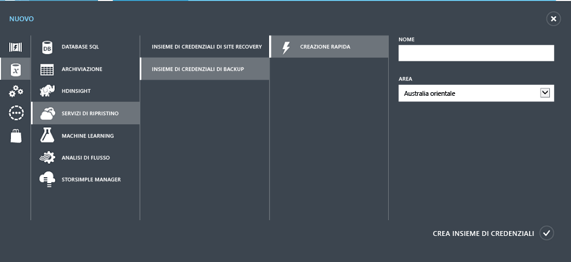

<properties
	pageTitle="Proteggere macchine virtuali in Azure con Backup di Azure | Microsoft Azure"
	description="Proteggere macchine virtuali di Azure con il servizio Backup di Azure. Esercitazione che illustra come creare un insieme di credenziali, registrare macchine virtuali, creare criteri e proteggere macchine virtuali in Azure."
	services="backup"
	documentationCenter=""
	authors="markgalioto"
	manager="jwhit"
	editor=""/>

<tags
	ms.service="backup"
	ms.workload="storage-backup-recovery"
	ms.tgt_pltfrm="na"
	ms.devlang="na"
	ms.topic="hero-article"
	ms.date="04/12/2016"
	ms.author="markgal; jimpark"/>

# Primo approccio: Backup di macchine virtuali di Azure

> [AZURE.SELECTOR]
- [Backup di VM di Azure Resource Manager](backup-azure-vms-first-look-arm.md)
- [Backup di VM in modalità classica](backup-azure-vms-first-look.md)

Questa esercitazione illustra i passaggi per eseguire il backup di una macchina virtuale (VM) di Azure. Per completare questa esercitazione, è necessario rispettare i prerequisiti seguenti:

- È stata creata una VM nella sottoscrizione di Azure.
- Il servizio Backup può accedere alla VM.

Ecco i passaggi generali dell'esercitazione.

1. Creare un insieme di credenziali di backup o identificarne uno esistente *nella stessa area della VM*.
2. Usare il portale di Azure per trovare e registrare le macchine virtuali nella sottoscrizione.
3. Installare l'agente di macchine virtuali nella VM. Se si usa una VM dalla raccolta di Azure, l'agente di macchine virtuali è già presente.
4. Creare i criteri per proteggere le macchine virtuali.
5. Eseguire il backup.

>[AZURE.NOTE] Per creare e utilizzare le risorse, Azure offre due modelli di distribuzione: [Azure Resource Manager e classica](../resource-manager-deployment-model.md). Il servizio Backup di Azure supporta VM basate su Azure Resource Manager, note anche come VM IaaS V2. Questa esercitazione si applica alle VM che possono essere create nel portale di Azure classico.

## Passaggio 1: Creare un insieme di credenziali di backup per una macchina virtuale

Un insieme di credenziali di backup è un'entità che archivia tutti i backup e i punti di ripristino che sono stati creati nel corso del tempo. L'insieme di credenziali di backup contiene anche i criteri di backup applicati alle macchine virtuali di cui viene eseguito il backup.

Questa figura mostra le relazioni tra le diverse entità di Backup di Azure: 

Per creare un insieme di credenziali per il backup:

1. Accedere al [portale di Azure](http://manage.windowsazure.com/).

2. Nell'angolo in basso a sinistra del portale di Azure fare clic su **Nuovo**.

    

3. Nella procedura guidata Creazione rapida fare clic su **Servizi dati** > **Servizi di ripristino** > **Insieme di credenziali per il backup** > **Creazione rapida**.

    

    La procedura guidata richiede di specificare **Nome** e **Area**. Se si amministra più di una sottoscrizione, viene visualizzata una finestra di dialogo per la scelta della sottoscrizione.

4. In **Nome** immettere un nome descrittivo per identificare l'insieme di credenziali. Il nome deve essere univoco per la sottoscrizione di Azure. Digitare un nome contenente da 2 a 50 caratteri. Deve iniziare con una lettera e può contenere solo lettere, numeri e trattini.

5. In **Region** selezionare l'area geografica per l'insieme di credenziali. L'insieme di credenziali **deve** trovarsi nella stessa area geografica delle macchine virtuali da proteggere.

    Se si non è certi dell'area geografica in cui si trova la macchina virtuale, chiudere la procedura guidata e fare clic su Macchine virtuali nell'elenco di servizi di Azure. La colonna Località indica il nome dell'area. Se si hanno macchine virtuali in più aree, creare un insieme di credenziali per il backup in ogni area.

6. Se nella procedura guidata non è presente una finestra di dialogo **Sottoscrizione**, andare al passaggio successivo. Se si utilizzano più sottoscrizioni, selezionarne una da associare al nuovo insieme di credenziali per il backup.

    

7. Fare clic su **Crea insieme di credenziali**. La creazione dell'insieme di credenziali per il backup può richiedere alcuni minuti. Monitorare le notifiche di stato nella parte inferiore del portale.

    

    Un messaggio conferma che l'insieme di credenziali è stato creato. È elencato nella pagina **Servizi di ripristino** come **Attivo**.

    

8. Nell'elenco di insiemi di credenziali nella pagina **Servizi di ripristino** selezionare quello appena creato per visualizzare la pagina **Avvio rapido**.

    

9. Nella pagina **Avvio rapido** fare clic su **Configura** per visualizzare l'opzione di replica di archiviazione. 

10. In **Replica archiviazione** scegliere l'opzione di replica per l'insieme di credenziali.

    

    Per impostazione predefinita, l'insieme di credenziali prevede l'archiviazione con ridondanza geografica. Se si usa Azure come endpoint primario di archiviazione dei backup, è consigliabile continuare a usare l'archiviazione con ridondanza geografica. Se si usa Azure come endpoint di archiviazione dei backup non primario, è possibile scegliere l'archiviazione con ridondanza locale, che consente di ridurre i costi di archiviazione dei dati in Azure. Per altre informazioni sulle opzioni di archiviazione [con ridondanza geografica](../storage/storage-redundancy.md#geo-redundant-storage) e [con ridondanza locale](../storage/storage-redundancy.md#locally-redundant-storage), vedere questa [panoramica](../storage/storage-redundancy.md).

Dopo aver scelto l'opzione di archiviazione per l'insieme di credenziali, è possibile associare la macchina virtuale all'insieme di credenziali. Per iniziare l'associazione, è necessario trovare e registrare le macchine virtuali di Azure.

## Passaggio 2: Trovare e registrare le macchine virtuali di Azure
Prima di registrare la VM con un insieme di credenziali, eseguire il processo di individuazione per identificare eventuali VM nuove. Il processo esegue una query su Azure per ottenere l'elenco delle macchine virtuali disponibili nella sottoscrizione, insieme ad altre informazioni come il nome del servizio cloud e l'area.

1. Accedere al [portale di Azure](http://manage.windowsazure.com/).

2. Nel portale di Azure classico fare clic su **Servizi di ripristino** per aprire l'elenco di insiemi di credenziali di Servizi di ripristino. 

3. Nell'elenco di insiemi di credenziali selezionare quello da usare per il backup di una VM.

    Quando si seleziona l'insieme di credenziali, viene visualizzata la pagina **Avvio rapido**.

4. Dal menu dell'insieme di credenziali, fare clic su **Elementi registrati**.

    

5. Scegliere **Macchina virtuale di Azure** dal menu **Tipo**.

    

6. Fare clic su **INDIVIDUA** nella parte inferiore della pagina. 

    Il processo di individuazione può richiedere alcuni minuti mentre le macchine virtuali vengono elencate in formato tabulare. Nella parte inferiore della schermata è presente una notifica che indica che il processo è in esecuzione.

    

    Al termine del processo, la notifica cambia.

    

7. Fare clic su **REGISTRA** nella parte inferiore della pagina. 

8. Nel menu di scelta rapida **Registra elementi** selezionare le macchine virtuali da registrare. Se sono presenti due o più macchine virtuali con lo stesso nome, usare il servizio cloud per distinguerle.

    >[AZURE.TIP] È possibile registrare più macchine virtuali contemporaneamente.

    Viene creato un processo per ogni macchina virtuale selezionata.

9. Fare clic su **Visualizza processo** nella notifica per passare alla pagina **Processi**.

    

    La macchina virtuale viene visualizzata anche nell'elenco di elementi registrati insieme allo stato dell'operazione di registrazione.

    

    Al termine dell'operazione lo stato diventerà *Registrato* per riflettere la modifica.

    

## Passaggio 3: Installare l'agente di macchine virtuali nella macchina virtuale

Per il funzionamento dell'estensione di backup, l'agente di macchine virtuali deve essere installato nella macchina virtuale di Azure. Se la VM è stata creata dalla raccolta di Azure, l'agente di macchine virtuali è già installato. È possibile passare a [Proteggere le macchine virtuali](backup-azure-vms-first-look.md#step-4---protect-azure-virtual-machines).

Se la migrazione della VM è stata eseguita da un data center locale, l'agente di macchine virtuali non è probabilmente installato nella VM. Prima di procedere alla protezione della VM, è necessario installare l'agente di macchine virtuali. Per informazioni dettagliate sull'installazione dell'agente di macchine virtuali, vedere la [sezione Agente di macchine virtuali dell'articolo sul backup di macchine virtuali](backup-azure-vms-prepare.md#vm-agent).

## Passaggio 4: Proteggere le macchine virtuali di Azure
Ora è possibile configurare i criteri di backup e conservazione per la macchina virtuale. È possibile proteggere più macchine virtuali usando una singola operazione. Gli insiemi di credenziali di Backup di Azure creati dopo maggio 2015 includono criteri predefiniti. Questi criteri predefiniti prevedono un periodo di conservazione predefinito di 30 giorni e una pianificazione per il backup una volta al giorno.

1. Passare all'insieme di credenziali per il backup disponibile in **Servizi di ripristino** nel portale di Azure e quindi fare clic su **Elementi registrati**.
2. Selezionare **Macchina virtuale di Azure** dal menu a discesa.

    

3. Fare clic su **PROTEGGI** in basso nella pagina. 

    Verrà visualizzata la procedura guidata **Proteggi elementi**, che elenca *solo* le macchine virtuali registrate e non protette.

    

4. Selezionare le macchine virtuali da proteggere.

    Se sono presenti due o più macchine virtuali con lo stesso nome, usare il servizio cloud per distinguerle.

5. Nel menu **Configura protezione** selezionare i criteri esistenti o crearne di nuovi per proteggere le macchine virtuali identificate.

    Ai singoli criteri di backup possono essere associate più macchine virtuali. Una macchina virtuale può tuttavia essere associata a un solo criterio alla volta.

    

    >[AZURE.NOTE] I criteri di backup includono uno schema di conservazione per i backup pianificati. Se sono stati selezionati criteri di backup esistenti, non sarà possibile modificare le opzioni di conservazione nel passaggio successivo.

6. In **Intervallo conservazione** definire l'ambito giornaliero, settimanale, mensile e annuale per i punti di backup specifici.

    

    I criteri di conservazione specificano il periodo di tempo per l'archiviazione di una copia di backup. È possibile specificare criteri di conservazione diversi in base alla momento in cui viene eseguito il backup.

7. Fare clic su **Processi** per visualizzare l'elenco dei processi in **Configura protezione**.

    

    Dopo aver stabilito i criteri, andare al passaggio successivo ed eseguire il backup iniziale.

## Passaggio 5: Backup iniziale

Dopo aver protetto la macchina virtuale con i criteri specificati, è possibile visualizzare la relazione nella scheda **Elementi protetti**. Finché non viene eseguito il backup iniziale, lo **Stato di protezione** risulta **Protetto (backup iniziale in sospeso)**. Per impostazione predefinita, il primo backup pianificato è il *backup iniziale*.

Per attivare il backup iniziale immediatamente dopo la configurazione della protezione:

1. In basso nella pagina **Elementi protetti ** fare clic **Esegui backup ora**. 

    Il servizio Backup di Azure crea un processo di backup per l'operazione di backup iniziale.

2. Fare clic sulla scheda **Processi** per visualizzare l'elenco dei processi.

    

    Al termine del backup iniziale, lo stato della macchina virtuale nella scheda **Elementi protetti** sarà *Protetto*.

    

    >[AZURE.NOTE] Il backup di macchine virtuali è un processo locale. Non è possibile eseguire il backup di macchine virtuali di un'area in un insieme di credenziali per il backup in un'altra area. Di conseguenza, per ogni area di Azure in cui sono presenti VM per cui deve essere eseguito il backup, è necessario creare almeno un insieme di credenziali per il backup in quell'area.

## Passaggi successivi
Ora che è stato eseguito il backup di una macchina virtuale, sono disponibili diversi passaggi successivi interessanti. Il passaggio più logico consiste nell'acquisire familiarità con il ripristino dei dati in una VM. Esistono tuttavia attività di gestione che aiutano a comprendere come proteggere i dati e ridurre al minimo i costi.

- [Gestire e monitorare il backup delle macchine virtuali di Azure](backup-azure-manage-vms.md)
- [Ripristino di macchine virtuali](backup-azure-restore-vms.md)
- [Guida alla risoluzione dei problemi](backup-azure-vms-troubleshoot.md)

## Domande?
In caso di domande o se si vuole che venga inclusa una funzionalità, è possibile [inviare commenti e suggerimenti](http://aka.ms/azurebackup_feedback).

<!---HONumber=AcomDC_0420_2016-->