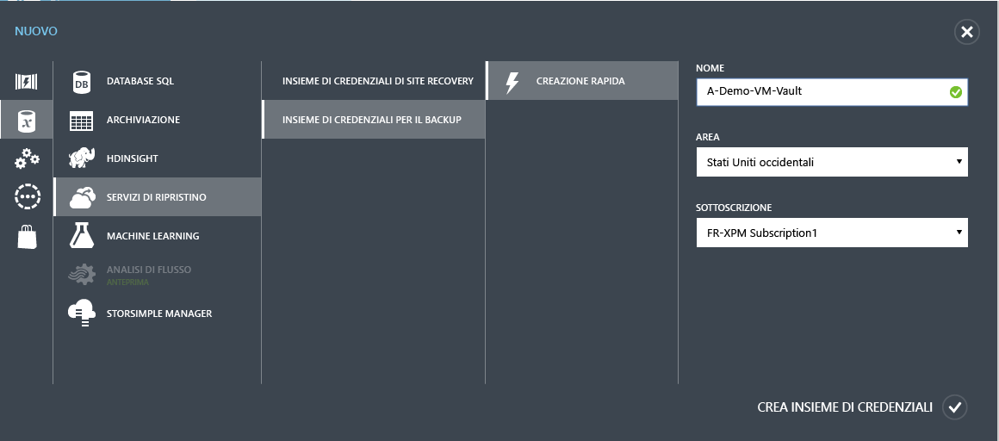
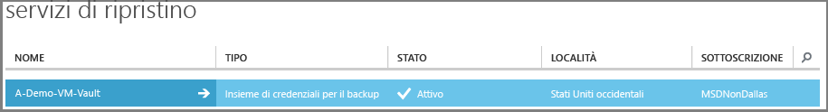
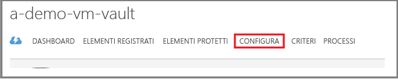
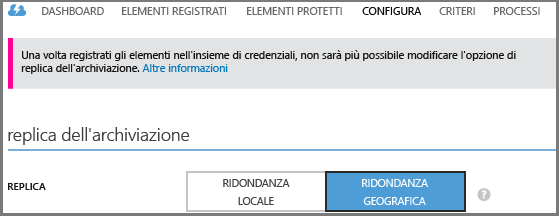

<properties
	pageTitle="Proteggere macchine virtuali in Azure con Backup di Azure | Microsoft Azure"
	description="Proteggere macchine virtuali di Azure con il servizio Backup di Azure. Esercitazione che illustra come creare un insieme di credenziali, registrare macchine virtuali, creare criteri e proteggere macchine virtuali in Azure."
	services="backup"
	documentationCenter=""
	authors="markgalioto"
	manager="jwhit"
	editor=""/>

<tags
	ms.service="backup"
	ms.workload="storage-backup-recovery"
	ms.tgt_pltfrm="na"
	ms.devlang="na"
	ms.topic="hero-article"
	ms.date="03/30/2016"
	ms.author="markgal; jimpark"/>

# Primo approccio: Backup di macchine virtuali di Azure

> [AZURE.SELECTOR]
- [Backup di VM di Azure Resource Manager](backup-azure-vms-first-look-arm.md)
- [Backup di VM in modalità classica](backup-azure-vms-first-look.md)

Questo articolo contiene un'esercitazione che illustra le operazioni di preparazione dell'ambiente Azure per il backup di una macchina virtuale di Azure. Questa esercitazione presuppone che sia disponibile una macchina virtuale nella sottoscrizione di Azure e che al servizio Backup sia stato concesso l'accesso alla macchina virtuale. Di seguito è riportata, a livello generale, la procedura da seguire.

1. Creare o accedere alla sottoscrizione di Azure.
2. Creare un insieme di credenziali di backup o identificare un insieme di credenziali di backup esistente *nella stessa area della macchina virtuale*.
3. Usare il portale di Azure per trovare e registrare le macchine virtuali nella sottoscrizione.
4. Installare l'agente VM nella macchina virtuale. Se si usa una VM della raccolta di Azure, l'agente VM sarà già presente.
5. Creare i criteri per proteggere le macchine virtuali.
6. Eseguire il backup.

>[AZURE.NOTE] Azure offre due modelli di distribuzione per creare e usare le risorse: [Azure Resource Manager e la distribuzione classica](../resource-manager-deployment-model.md). Attualmente, il servizio Backup di Azure non supporta macchine virtuali basate su Azure Resource Manager, note anche come macchine virtuali IaaS V2. Dal momento che le macchine virtuali IaaS V2 sono state rilasciate insieme al nuovo portale di Azure, questa esercitazione è progettata per l'uso con macchine virtuali che possono essere create nel portale di Azure classico.

## Passaggio 1: Creare un insieme di credenziali di backup per una macchina virtuale

Un insieme di credenziali di backup è un'entità che archivia tutti i backup e i punti di ripristino che sono stati creati nel corso del tempo. L'insieme di credenziali di backup contiene anche i criteri di backup che verranno applicati alle macchine virtuali di cui viene eseguito il backup.

Questa figura mostra le relazioni tra le diverse entità di Backup di Azure: 

Per creare un insieme di credenziali per il backup:

1. Accedere al [portale di Azure](http://manage.windowsazure.com/).

2. Nel portale di Azure fare clic su **Nuovo** > **Servizi dati** > **Servizi di ripristino** > **Insieme di credenziali di backup** > **Creazione rapida**, come nella figura seguente.

    

3. In **Nome** immettere un nome descrittivo per identificare l'insieme di credenziali. Il nome deve essere univoco per la sottoscrizione di Azure. Digitare un nome che contenga tra i 2 e i 50 caratteri. Deve iniziare con una lettera e può contenere solo lettere, numeri e trattini.

4. In **Region** selezionare l'area geografica per l'insieme di credenziali. L'insieme di credenziali **deve** trovarsi nella stessa area geografica delle macchine virtuali che si vuole proteggere.

    Se si non è certi dell'area geografica della macchina virtuale, chiudere la finestra di dialogo di creazione dell'insieme di credenziali e passare all'elenco di macchine virtuali nel portale. Se sono presenti macchine virtuali in più aree, è necessario creare un insieme di credenziali di backup in ogni area. È consigliabile completare la creazione dell'insieme di credenziali nella prima area prima di passare a quella successiva. Per archiviare i dati di backup, non è necessario specificare account di archiviazione perché l'insieme di credenziali per il backup e il servizio Backup di Azure gestiscono questa operazione in modo automatico.

5. In **Sottoscrizione** selezionare la sottoscrizione che si vuole associare all'insieme di credenziali di backup. Sono presenti scelte multiple solo se l'account dell'organizzazione è associato a più sottoscrizioni di Azure.

6. Fare clic su **Crea insieme di credenziali**. La creazione dell'insieme di credenziali per il backup può richiedere alcuni minuti. Monitorare le notifiche di stato nella parte inferiore del portale.

    

    La creazione dell'insieme di credenziali viene confermata da un messaggio. L'insieme verrà elencato come **Attivo** nella pagina **Servizi di ripristino**.

    

7. Nell'elenco degli insiemi di credenziali nella pagina **Servizi di ripristino** fare clic sull'insieme di credenziali creato per aprire la pagina di **Avvio rapido**.

    

8. Nella pagina di **Avvio rapido** fare clic su **Configura** per aprire l'opzione di replica di archiviazione. 

9. Nell'opzione **Replica archiviazione** scegliere l'opzione di replica per l'insieme di credenziali.

    

    Per impostazione predefinita, l'insieme di credenziali prevede l'archiviazione con ridondanza geografica. Se si usa Azure come endpoint primario di archiviazione dei backup, è consigliabile continuare a usare l'archiviazione con ridondanza geografica. Se si usa Azure come endpoint non primario di archiviazione dei backup, è anche possibile scegliere l'archiviazione con ridondanza locale, che consente di ridurre i costi di archiviazione dei dati in Azure. Per altre informazioni sulle opzioni di archiviazione [con ridondanza geografica](../storage/storage-redundancy.md#geo-redundant-storage) e [con ridondanza locale](../storage/storage-redundancy.md#locally-redundant-storage), vedere questa [panoramica](../storage/storage-redundancy.md).

Dopo aver scelto l'opzione di archiviazione per l'insieme di credenziali, è possibile associare la macchina virtuale all'insieme di credenziali. Per iniziare l'associazione, è necessario trovare e registrare le macchine virtuali di Azure.

## Passaggio 2: Trovare e registrare le macchine virtuali di Azure
Prima di registrare una macchina virtuale in un insieme di credenziali, eseguire il processo di individuazione per verificare che vengano identificate le eventuali nuove macchine virtuali aggiunte alla sottoscrizione. Il processo esegue una query su Azure per ottenere l'elenco delle macchine virtuali disponibili nella sottoscrizione, insieme ad altre informazioni come il nome del servizio cloud e l'area.

1. Accedere al [portale di Azure](http://manage.windowsazure.com/).

2. Nel portale di Azure classico fare clic su **Servizi di ripristino** per aprire l'elenco degli insiemi di credenziali di Servizi di ripristino. 

3. Nell'elenco degli insiemi di credenziali di **Servizi di ripristino** selezionare l'insieme di credenziali da usare per il backup di una macchina virtuale.

    Dopo aver selezionato l'insieme di credenziali, verrà visualizzata la pagina **Avvio rapido**.

4. Nel menu dell'insieme di credenziali nella parte superiore della pagina fare clic su **Elementi registrati**.

5. Scegliere **Macchina virtuale di Azure** dal menu **Tipo**.

    

6. Fare clic su **INDIVIDUA** nella parte inferiore della pagina. 

    Il processo di individuazione può richiedere alcuni minuti mentre le macchine virtuali vengono elencate in formato tabulare. Nella parte inferiore della schermata è presente una notifica che indica che il processo è in esecuzione.

    

    Al termine del processo, la notifica cambia.

    

7. Fare clic su **REGISTRA** nella parte inferiore della pagina. 

8. Nel menu di scelta rapida **Registra elementi** selezionare le macchine virtuali da registrare. Se sono presenti due o più macchine virtuali con lo stesso nome, usare il servizio cloud per distinguerle.

    >[AZURE.TIP] È possibile registrare più macchine virtuali contemporaneamente.

    Viene creato un processo per ogni macchina virtuale selezionata.

9. Fare clic su **Visualizza processo** nella notifica per passare alla pagina **Processi**.

    

    La macchina virtuale viene visualizzata anche nell'elenco di elementi registrati insieme allo stato dell'operazione di registrazione.

    

    Al termine dell'operazione, lo stato passerà a *registrato*.

    

## Passaggio 3: Installare l'agente di macchine virtuali nella macchina virtuale

Per il funzionamento dell'estensione di backup, l'agente di macchine virtuali deve essere installato nella macchina virtuale di Azure. Se la macchina virtuale è stata creata dalla raccolta di Azure, l'agente di macchine virtuali è già installato. Nelle macchine virtuali di cui viene eseguita la migrazione da data center locali, invece, l'agente di macchine virtuali non è installato. In tal caso l'agente di macchine virtuali deve essere installato in modo esplicito. Prima di provare a eseguire il backup della macchina virtuale di Azure, assicurarsi che l'agente di macchine virtuali di Azure sia installato correttamente nella macchina virtuale. Vedere in proposito la tabella seguente. Se si crea una macchina virtuale personalizzata, [assicurarsi che la casella di controllo **Installa l'agente di macchine virtuali** sia selezionata](../virtual-machines/virtual-machines-windows-classic-agents-and-extensions.md) prima che venga effettuato il provisioning della macchina virtuale.

Per altre informazioni, leggere gli articoli relativi all'[agente VM](https://go.microsoft.com/fwLink/?LinkID=390493&clcid=0x409) e all'[installazione dell'agente VM](../virtual-machines/virtual-machines-windows-classic-manage-extensions.md).

La tabella seguente fornisce informazioni aggiuntive sull'agente di macchine virtuali per macchine virtuali Windows e Linux.

| **Operazione** | **Windows** | **Linux** |
| --- | --- | --- |
| Installazione dell'agente di macchine virtuali | <li>Scaricare e installare il file [MSI per l'agente](http://go.microsoft.com/fwlink/?LinkID=394789&clcid=0x409). Per completare l'installazione sono necessari privilegi di amministratore. <li>[Aggiornare le proprietà della VM](http://blogs.msdn.com/b/mast/archive/2014/04/08/install-the-vm-agent-on-an-existing-azure-vm.aspx) per indicare che l'agente è stato installato. | <li> Installare l'[agente Linux](https://github.com/Azure/WALinuxAgent) più recente da GitHub. Per completare l'installazione sono necessari privilegi di amministratore. <li> [Aggiornare le proprietà della VM](http://blogs.msdn.com/b/mast/archive/2014/04/08/install-the-vm-agent-on-an-existing-azure-vm.aspx) per indicare che l'agente è stato installato. |
| Aggiornamento dell'agente di VM | L'aggiornamento dell'agente di VM è semplice quanto la reinstallazione dei [file binari dell'agente di VM](http://go.microsoft.com/fwlink/?LinkID=394789&clcid=0x409).  Assicurarsi che non siano in esecuzione operazioni di backup durante l'aggiornamento dell'agente di macchine virtuali. | Seguire le istruzioni relative all'[aggiornamento dell'agente di macchine virtuali Linux](../virtual-machines-linux-update-agent.md).  Assicurarsi che non siano in esecuzione operazioni di backup durante l'aggiornamento dell'agente di macchine virtuali. |
| Convalida dell'installazione dell'agente di macchine virtuali | <li>Passare alla cartella *C:\\WindowsAzure\\Packages* nella macchina virtuale di Azure. <li>La cartella dovrebbe includere il file WaAppAgent.exe.<li> Fare clic con il pulsante destro del mouse sul file, scegliere **Proprietà** e quindi selezionare la scheda **Dettagli**. Il campo Versione prodotto deve essere 2.6.1198.718 o superiore. | N/D |

### Estensione di backup

Dopo aver installato l'agente di macchine virtuali nella macchina virtuale, il servizio Backup di Azure installa l'estensione di backup nell'agente di macchine virtuali. Il servizio Backup di Azure applica aggiornamenti e patch all'estensione di backup senza ulteriore intervento dell'utente.

L'estensione di backup viene installata dal servizio Backup indipendentemente dal fatto che la macchina virtuale sia in esecuzione o meno. Una macchina virtuale in esecuzione consente di ottenere un punto di ripristino coerente con l'applicazione. Il servizio Backup di Azure continuerà tuttavia a eseguire il backup della macchina virtuale, anche se questa è spenta e non è stato possibile installare l'estensione. Questa situazione è detta macchina virtuale offline. In tal caso, il punto di ripristino sarà *coerente con l'arresto anomalo*.

## Passaggio 4: Proteggere le macchine virtuali di Azure
Ora è possibile configurare i criteri di backup e conservazione per la macchina virtuale. È possibile proteggere più macchine virtuali usando una singola operazione. Gli insiemi di credenziali di Backup di Azure creati dopo maggio 2015 includono criteri predefiniti. Questi criteri predefiniti prevedono un periodo di conservazione predefinito di 30 giorni e una pianificazione per il backup una volta al giorno.

1. Passare all'insieme di credenziali per il backup disponibile in **Servizi di ripristino** nel portale di Azure e quindi fare clic su **Elementi registrati**.
2. Selezionare **Macchina virtuale di Azure** dal menu a discesa.

    

3. Fare clic su **PROTEGGI** nella parte inferiore della pagina. 

    Viene visualizzata la procedura guidata **Proteggi elementi**, che elenca *solo* le macchine virtuali registrate e non protette.

    

4. Selezionare le macchine virtuali da proteggere.

    Se sono presenti due o più macchine virtuali con lo stesso nome, usare il servizio cloud per distinguerle.

5. In **Configura protezione** selezionare criteri esistenti o crearne di nuovi per proteggere le macchine virtuali identificate.

    Ai singoli criteri di backup possono essere associate più macchine virtuali. Una macchina virtuale può tuttavia essere associata a un solo criterio in un dato momento.

    

    >[AZURE.NOTE] I criteri di backup includono uno schema di conservazione per i backup pianificati. Se sono stati selezionati criteri di backup esistenti, non sarà possibile modificare le opzioni di conservazione nel passaggio successivo.

6. In **Intervallo conservazione** definire l'ambito giornaliero, settimanale, mensile e annuale per i punti di backup specifici.

    

    I criteri di conservazione specificano il periodo di tempo per l'archiviazione di una copia di backup. È possibile specificare criteri di conservazione diversi in base alla momento in cui viene eseguito il backup. Ad esempio, potrebbe essere necessario conservare il punto di backup eseguito alla fine di ogni trimestre per un periodo di tempo più lungo, a scopo di controllo, e conservare invece solo per 90 giorni il punto di backup eseguito quotidianamente e usato come punto di ripristino operativo.

    

    In questa immagine di esempio:

    - **Criteri di conservazione giornaliera**: i backup eseguiti ogni giorno vengono archiviati per 30 giorni.
    - **Criteri di conservazione settimanale**: i backup eseguiti ogni domenica vengono conservati per 104 settimane.
    - **Criteri di conservazione mensile**: i backup eseguiti l'ultima domenica di ogni mese vengono conservati per 120 mesi.
    - **Criteri di conservazione annuale**: i backup eseguiti la prima domenica di ogni gennaio vengono conservati per 99 anni.

    Viene creato un processo per configurare i criteri di protezione e associare ogni macchina virtuale selezionata a questi criteri.

6. Fare clic su **Processo** e scegliere il filtro appropriato per visualizzare l'elenco dei processi **Configura protezione**.

    

## Passaggio 5: Backup iniziale

Quando la macchina virtuale è protetta da criteri, è possibile visualizzare tale relazione nella scheda **Elementi protetti**. Finché non viene eseguito il backup iniziale di una macchina virtuale, lo **Stato di protezione** viene visualizzato come **Protetto (backup iniziale in sospeso)**. Per impostazione predefinita, il primo backup pianificato è il *backup iniziale*.

Per attivare il backup iniziale immediatamente dopo la configurazione della protezione:

1. Fare clic sul pulsante **Esegui backup ora** nella parte inferiore della pagina **Elementi protetti**. 

    Il servizio Backup di Azure crea un processo di backup per l'operazione di backup iniziale.

2. Fare clic sulla scheda **Processi** per visualizzare l'elenco dei processi.

    

    >[AZURE.NOTE] Come parte dell'operazione di backup, il servizio Backup di Azure esegue un comando nell'estensione per il backup in ogni macchina virtuale, in modo da scaricare tutte le scritture e creare uno snapshot coerente.

    Al termine del backup iniziale, lo stato della macchina virtuale nella scheda **Elementi protetti** sarà *Protetto*.

    

    >[AZURE.NOTE] Il backup di macchine virtuali è un processo locale. Non è possibile eseguire il backup di macchine virtuali di un'area in un insieme di credenziali per il backup in un'altra area. Di conseguenza, per ogni area di Azure in cui sono presenti VM per cui deve essere eseguito il backup, è necessario creare almeno un insieme di credenziali per il backup in quell'area.

## Passaggi successivi
Ora che è stato eseguito il backup di una macchina virtuale, sono disponibili diversi passaggi successivi interessanti. Il passaggio più logico è acquisire familiarità con il ripristino dei dati in una macchina virtuale, ma ci sono anche attività di gestione che permettono di proteggere i dati e tenere bassi i costi.

- [Gestire e monitorare il backup delle macchine virtuali di Azure](backup-azure-manage-vms.md)
- [Ripristino di macchine virtuali](backup-azure-restore-vms.md)
- [Guida alla risoluzione dei problemi](backup-azure-vms-troubleshoot.md)

## Domande?
In caso di domande o se si vuole che venga inclusa una funzionalità, è possibile [inviare commenti e suggerimenti](http://aka.ms/azurebackup_feedback).

<!---HONumber=AcomDC_0406_2016-->