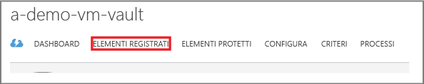
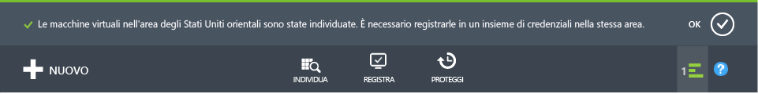

# Primo approccio: Backup di macchine virtuali di Azure
> [!div class="op_single_selector"]
> * [Proteggere le VM con un insieme di credenziali dei servizi di ripristino](backup-azure-vms-first-look-arm.md)
> * [Proteggere le VM di Azure con un insieme di credenziali per il backup](backup-azure-vms-first-look.md)
>
>

Questa esercitazione illustra i passaggi per eseguire il backup di una macchina virtuale di Azure in un insieme di credenziali di backup in Azure. Questo articolo descrive il modello di distribuzione classica o Service Manager per il backup di VM. I passaggi seguenti si applicano solo agli insiemi di credenziali di backup creati nel portale classico. Per le nuove distribuzioni è consigliabile usare il modello Resource Manager.

Per informazioni sul backup di una VM in un insieme di credenziali dei servizi di ripristino appartenente a un gruppo di risorse, vedere [Primo approccio: Proteggere le VM di Azure con un insieme di credenziali dei servizi di ripristino](backup-azure-vms-first-look-arm.md).

Per completare l'esercitazione seguente, è necessario rispettare questi prerequisiti:

* È stata creata una VM nella sottoscrizione di Azure.
* La VM può connettersi agli indirizzi IP pubblici di Azure. Per altre informazioni, vedere [Connettività di rete](backup-azure-vms-prepare.md#network-connectivity).

> [!NOTE]
> Azure offre due modelli di distribuzione per creare e usare le risorse: [Resource Manager e distribuzione classica](../azure-resource-manager/resource-manager-deployment-model.md). Questa esercitazione si applica alle macchine virtuali create nel portale classico.
>
>

## Creare un insieme di credenziali per il backup
Un insieme di credenziali di backup è un'entità che archivia tutti i backup e i punti di ripristino che sono stati creati nel corso del tempo. L'insieme di credenziali di backup contiene anche i criteri di backup applicati alle macchine virtuali di cui viene eseguito il backup.

> [!IMPORTANT]
> A partire da marzo 2017, non è più possibile usare il portale classico per creare insiemi di credenziali di backup.
> È ora possibile aggiornare gli insiemi di credenziali di Backup ad insiemi di credenziali dei servizi di ripristino. Per altre informazioni, vedere l'articolo [Aggiornare un insieme di credenziali di Backup a un insieme di credenziali di Servizi di ripristino](backup-azure-upgrade-backup-to-recovery-services.md). Microsoft consiglia di aggiornare gli insiemi di credenziali di Backup a insiemi di credenziali dei servizi di ripristino.  **A partire dal 1° novembre 2017**:
>- Eventuali insiemi di credenziali di Backup rimanenti verranno automaticamente aggiornati a insiemi di credenziali di servizi di ripristino
>- e non sarà più possibile accedere ai dati di backup nel portale classico. Sarà possibile invece usare il portale di Azure per accedere ai dati di backup negli insiemi di credenziali di servizi di ripristino.
>

## Individuare e registrare le macchine virtuali di Azure
Prima di registrare la VM con un insieme di credenziali, eseguire il processo di individuazione per identificare eventuali VM nuove. Verrà restituito un elenco delle macchine virtuali disponibili nella sottoscrizione, insieme ad altre informazioni come il nome del servizio cloud e l'area.

1. Accedere al [portale di Azure classico](http://manage.windowsazure.com/)
2. Nel portale di Azure classico fare clic su **Servizi di ripristino** per aprire l'elenco degli insiemi di credenziali dei servizi di ripristino.
    
3. Nell'elenco di insiemi di credenziali selezionare quello da usare per il backup di una VM.

    Quando si seleziona l'insieme di credenziali, viene visualizzata la pagina **Avvio rapido** .
4. Nel menu dell'insieme di credenziali fare clic su **Elementi registrati**.

    
5. Scegliere **Macchina virtuale di Azure** dal menu **Tipo**.

    
6. Fare clic su **INDIVIDUA** nella parte inferiore della pagina.
    

    Il processo di individuazione può richiedere alcuni minuti mentre le macchine virtuali vengono elencate in formato tabulare. Nella parte inferiore della schermata è presente una notifica che indica che il processo è in esecuzione.

    

    Al termine del processo, la notifica cambia.

    
7. Fare clic su **REGISTRA** nella parte inferiore della pagina.
    
8. Nel menu di scelta rapida **Registra elementi** selezionare le macchine virtuali da registrare.

   > [!TIP]
   > È possibile registrare più macchine virtuali contemporaneamente.
   >
   >

    Viene creato un processo per ogni macchina virtuale selezionata.
9. Fare clic su **Visualizza processo** nella notifica per passare alla pagina **Processi**.

    

    La macchina virtuale viene visualizzata anche nell'elenco di elementi registrati insieme allo stato dell'operazione di registrazione.

    

    Al termine dell'operazione, lo stato diventerà *Registrazione completata* per riflettere la modifica.

    

## Installare l'agente di macchine virtuali nella macchina virtuale
Per il funzionamento dell'estensione di backup, l'agente di macchine virtuali deve essere installato nella macchina virtuale di Azure. Se la VM è stata creata dalla raccolta di Azure, l'agente di macchine virtuali è già presente nella VM ed è possibile passare alla [protezione delle VM](backup-azure-vms-first-look.md#create-the-backup-policy).

Se la migrazione della VM è stata eseguita da un data center locale, l'agente di macchine virtuali non è probabilmente installato nella VM. Prima di procedere alla protezione della VM, è necessario installare l'agente di macchine virtuali. Per informazioni dettagliate sull'installazione dell'agente di macchine virtuali, vedere la [sezione Agente di macchine virtuali dell'articolo sul backup di macchine virtuali](backup-azure-vms-prepare.md#vm-agent).

## Creare i criteri di backup
Prima attivare il processo di backup iniziale, impostare la pianificazione per l'acquisizione degli snapshot di backup. La pianificazione per l'acquisizione degli snapshot di backup e la durata di conservazione di questi snapshot costituiscono i criteri di backup. Le informazioni sul periodo di conservazione si basano sullo schema di rotazione dei backup GFS (Grandfather-Father-Son).

1. Passare all'insieme di credenziali per il backup disponibile in **Servizi di ripristino** nel portale di Azure classico e fare clic su **Elementi registrati**.
2. Selezionare **Macchina virtuale di Azure** dal menu a discesa.

    
3. Fare clic su **PROTEGGI** in basso nella pagina.
    

    Verrà visualizzata la procedura guidata **Proteggi elementi** , che elenca *solo* le macchine virtuali registrate e non protette.

    
4. Selezionare le macchine virtuali da proteggere.

    Se sono presenti due o più macchine virtuali con lo stesso nome, usare il servizio cloud per distinguerle.
5. Nel menu **Configura protezione** selezionare i criteri esistenti o crearne di nuovi per proteggere le macchine virtuali identificate.

    Ai nuovi insiemi di credenziali di backup sono associati criteri predefiniti. Questi criteri acquisiscono uno snapshot giornaliero ogni sera, che viene mantenuto per 30 giorni. Ai singoli criteri di backup possono essere associate più macchine virtuali. Una macchina virtuale può tuttavia essere associata a un solo criterio alla volta.

    

   > [!NOTE]
   > I criteri di backup includono uno schema di conservazione per i backup pianificati. Se sono stati selezionati criteri di backup esistenti, non sarà possibile modificare le opzioni di conservazione nel passaggio successivo.
   >
   >
6. In **Intervallo conservazione** definire l'ambito giornaliero, settimanale, mensile e annuale per i punti di backup specifici.

    

    I criteri di conservazione specificano il periodo di tempo per l'archiviazione di una copia di backup. È possibile specificare criteri di conservazione diversi in base alla momento in cui viene eseguito il backup.
7. Fare clic su **Processi** per visualizzare l'elenco dei processi in **Configura protezione**.

    

    Dopo aver stabilito i criteri, andare al passaggio successivo ed eseguire il backup iniziale.

## Backup iniziale
Dopo aver protetto la macchina virtuale con i criteri specificati, è possibile visualizzare la relazione nella scheda **Elementi protetti** . Finché non viene eseguito il backup iniziale, **Stato di protezione** indica **Protetto (backup iniziale in sospeso)**. Per impostazione predefinita, il primo backup pianificato è il *backup iniziale*.

Per avviare il backup iniziale:

1. In basso nella pagina **Elementi protetti** fare clic su **Esegui backup ora**.
    

    Il servizio Backup di Azure crea un processo di backup per l'operazione di backup iniziale.
2. Fare clic sulla scheda **Processi** per visualizzare l'elenco dei processi.

    

    Al termine del backup iniziale, lo stato della macchina virtuale nella scheda **Elementi protetti** sarà *Protetto*.

    

   > [!NOTE]
   > Il backup di macchine virtuali è un processo locale. Non è possibile eseguire il backup di macchine virtuali di un'area in un insieme di credenziali per il backup in un'altra area. Di conseguenza, per ogni area di Azure in cui sono presenti VM per cui deve essere eseguito il backup, è necessario creare almeno un insieme di credenziali per il backup in quell'area.
   >
   >

## Passaggi successivi
Ora che è stato eseguito il backup di una macchina virtuale, sono disponibili diversi passaggi successivi interessanti. Il passaggio più logico consiste nell'acquisire familiarità con il ripristino dei dati in una VM. Esistono tuttavia attività di gestione che aiutano a comprendere come proteggere i dati e ridurre al minimo i costi.

* [Gestire e monitorare il backup delle macchine virtuali di Azure](backup-azure-manage-vms.md)
* [Ripristino di macchine virtuali](backup-azure-restore-vms.md)
* [Guida alla risoluzione dei problemi](backup-azure-vms-troubleshoot.md)

## Domande?
In caso di domande o se si vuole che venga inclusa una funzionalità, è possibile [inviare commenti e suggerimenti](http://aka.ms/azurebackup_feedback).

