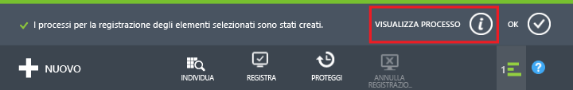
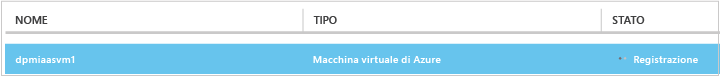
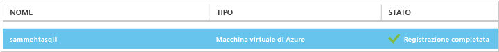
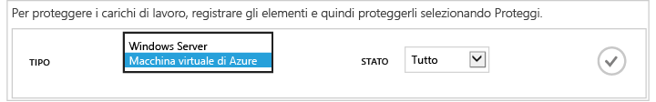
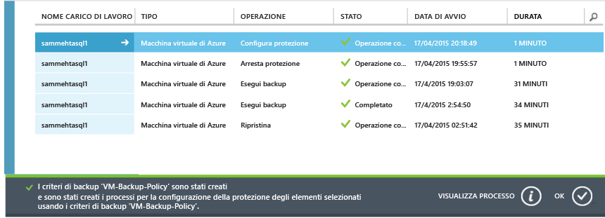
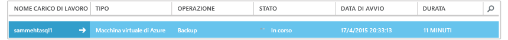
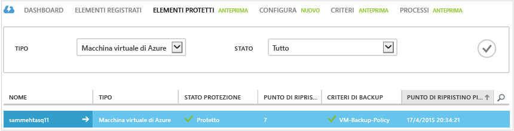
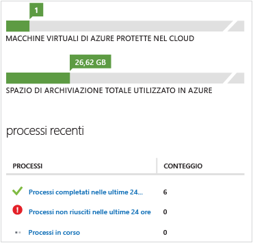

<properties
	pageTitle="Backup di una macchina virtuale di Azure - Backup | Microsoft Azure"
	description="Informazioni su come eseguire il backup di una macchina virtuale di Azure dopo la registrazione"
	services="backup"
	documentationCenter=""
	authors="aashishr"
	manager="shreeshd"
	editor=""/>

<tags ms.service="backup" ms.workload="storage-backup-recovery" ms.tgt_pltfrm="na" ms.devlang="na" ms.topic="hero-article" ms.date="07/30/2015" ms.author="aashishr"; "jimpark"/>

# Eseguire il backup di macchine virtuali di Azure
Questo articolo rappresenta la guida essenziale per eseguire il backup di macchine virtuali di Azure. Prima di procedere, assicurarsi che tutti i [prerequisiti](backup-azure-vms-introduction.md#prerequisites) siano stati soddisfatti.

L'esecuzione del backup di macchine virtuali di Azure prevede tre passaggi principali:

## 1\. Individuare le macchine virtuali di Azure
Il processo di individuazione esegue una query su Azure per ottenere l'elenco di macchine virtuali nella sottoscrizione, insieme ad altre informazioni quali il nome del servizio cloud e l'area.

> [AZURE.NOTE]Il processo di individuazione deve sempre essere eseguito come primo passaggio. Ciò consente di verificare che eventuali nuove macchine virtuali aggiunte alla sottoscrizione vengano identificate.

### Per attivare il processo di individuazione

1. Passare all'insieme di credenziali per il backup, che si trova in **Servizi di ripristino** nel portale di Azure e quindi fare clic sulla scheda **Elementi registrati**.

2. Scegliere il tipo di carico di lavoro nel menu a discesa come **Macchina virtuale di Azure** e quindi fare clic sul pulsante **Seleziona**.

    

3. Fare clic sul pulsante **INDIVIDUA** nella parte inferiore della pagina. 

4. Il processo di individuazione può durare alcuni pochi minuti, mentre le macchine virtuali vengono elencate in formato tabulare. Durante l'esecuzione del processo di individuazione, viene visualizzata una notifica di tipo avviso popup nella parte inferiore della schermata.

    

5. Al termine del processo di individuazione, viene visualizzata una notifica di tipo avviso popup.

    

##  2\. Registrare le macchine virtuali di Azure
Per poter essere protetta, una macchina virtuale deve essere registrata nel servizio Backup di Azure. Il processo di registrazione ha due obiettivi principali:

1. Inserire l'estensione di backup nell'agente VM della macchina virtuale.

2. Associare la macchina virtuale al servizio Backup di Azure.

La registrazione è in genere un'attività da eseguire una sola volta. Il servizio Backup di Azure gestisce senza problemi l'aggiornamento e l'applicazione di patch dell'estensione per il backup senza richiedere all'utente alcun intervento complesso. Questo riduce il carico di lavoro di gestione dell'agente che è in genere associato ai prodotti di backup.

### Per registrare le macchine virtuali

1. Passare all'insieme di credenziali per il backup, che si trova in **Servizi di ripristino** nel portale di Azure e quindi fare clic sulla scheda **Elementi registrati**.

2. Scegliere il tipo di carico di lavoro nel menu a discesa come **Macchina virtuale di Azure** e quindi fare clic sul pulsante Seleziona.

    

3. Fare clic sul pulsante **REGISTRA** nella parte inferiore della pagina. 

4. Nel menu di scelta rapida **Registra elementi** selezionare le macchine virtuali che si desidera registrare. Se sono presenti due o più macchine virtuali con lo stesso nome, usare il servizio cloud per distinguere tra le macchine virtuali.

    L'operazione **Registra** può essere effettuata su vasta scala, il che significa che è possibile selezionare contemporaneamente più macchine virtuali da registrare. Questo riduce notevolmente il tempo dedicato alla preparazione della macchina virtuale per il backup.

    >[AZURE.NOTE]Verranno visualizzate solo le macchine virtuali che non sono registrate e che si trovano nella stessa area dell'insieme di credenziali per il backup.

5. Viene creato un processo per ogni macchina virtuale da registrare. La notifica di tipo avviso popup visualizza lo stato di questa attività. Fare clic su **Visualizza processo** per accedere alla pagina **Processi**.

    

6. La macchina virtuale viene visualizzata anche nell'elenco di elementi registrati e viene visualizzato lo stato dell'operazione di registrazione.

    

7. Al termine dell'operazione, lo stato nel portale viene modificato per rispecchiare lo stato registrato.

    

## 3\. Protezione: eseguire il backup di macchine virtuali di Azure
Questo passaggio implica l'impostazione di un criterio di backup e conservazione per la macchina virtuale. Per proteggere una macchina virtuale, seguire la procedura seguente.

### Per eseguire il backup di macchine virtuali di Azure
1. Passare all'insieme di credenziali per il backup, che si trova in **Servizi di ripristino** nel portale di Azure e quindi fare clic sulla scheda **Elementi registrati**.
2. Scegliere il tipo di carico di lavoro nel menu a discesa come **Macchina virtuale di Azure** e quindi fare clic sul pulsante **Seleziona**.

    

3. Fare clic sul pulsante **PROTEGGI** nella parte inferiore della pagina. Verrà visualizzata la procedura guidata **Proteggi elementi**.

4. Tramite la procedura guidata **Proteggi elementi** è possibile selezionare le macchine virtuali da proteggere. Se sono presenti due o più macchine virtuali con lo stesso nome, usare il servizio cloud per distinguere tra le macchine virtuali.

    L'operazione **Proteggi** può essere effettuata su vasta scala, il che significa che è possibile selezionare contemporaneamente più macchine virtuali da registrare. Questo riduce notevolmente il tempo di preparazione della macchina virtuale per il backup.

    >[AZURE.NOTE]Solo le macchine virtuali che sono state registrate correttamente con il servizio Backup di Azure e che si trovano nella stessa area dell'insieme di credenziali per il backup verranno visualizzati qui.

5. Nella seconda schermata della procedura guidata **Proteggi elementi** selezionare un criterio di backup e conservazione per eseguire il backup delle macchine virtuali selezionate. Scegliere da un set di criteri esistente o definire un nuovo criterio.

    >[AZURE.NOTE]Per l'anteprima di backup sono supportati fino a 30 giorni di conservazione e massimo un backup giornaliero.

    In ogni insieme di credenziali per il backup è possibile avere più criteri di backup. I criteri rispecchiano i dettagli relativi alla modalità di pianificazione e conservazione del backup. Un criterio di backup potrebbe ad esempio essere destinato al backup giornaliero delle 22.00, mentre un altro criterio di backup potrebbe essere destinato al backup settimanale delle 06.00. Più criteri di backup consentono flessibilità nella pianificazione dei backup per l'infrastruttura delle macchine virtuali.

    Ogni criterio di backup può avere più macchine virtuali che sono associate al criterio. La macchina virtuale può essere associata a un solo criterio in un qualsiasi momento.

6. Per ogni macchina virtuale viene creato un processo per configurare il criterio di protezione e associare le macchine virtuali al criterio. Fare clic sulla scheda **Processi** e scegliere il filtro appropriato per visualizzare l'elenco dei processi **Configura protezione**.

    

7. Al termine, le macchine virtuali sono protette con un criterio e devono attendere il completamento del tempo di backup pianificato per il backup iniziale. La macchina virtuale verrà visualizzata nella scheda **Elementi protetti** e avrà lo stato di protezione *Protetto* (in attesa di backup iniziale).
    >[AZURE.NOTE]L'avvio del backup iniziale immediatamente dopo la configurazione della protezione non è un'azione attualmente disponibile.

8. All'ora pianificata, il servizio Backup di Azure crea un processo di backup per ogni macchina virtuale di cui eseguire il backup. Fare clic sulla scheda **Processi** per visualizzare l'elenco dei processi di **Backup**. Come parte dell'operazione di backup, il servizio Backup di Azure esegue un comando di estensione per il backup in ogni macchina virtuale per scaricare tutte le scritture e creare uno snapshot coerente.

    

9. Al termine, lo stato di protezione della macchina virtuale nella scheda **Elementi protetti** verrà visualizzato come *Protetto*.

    

## Visualizzazione dello stato di backup e dei relativi dettagli
Dopo la protezione, il numero di macchine virtuali aumenta anche nella pagina di riepilogo **Dashboard**. Inoltre, nella pagina **Dashboard** viene mostrato il numero di processi che hanno avuto esito positivo e che non sono riusciti nelle ultime 24 ore, nonché quelli ancora in corso. Facendo clic su qualsiasi categoria verrà eseguito il drill-down in quella categoria nella pagina **Processi**.

## Risoluzione dei problemi
È possibile risolvere gli errori rilevati durante l'uso di Backup di Azure con le informazioni elencate nella tabella seguente.

| Operazione di backup | Dettagli errore | Soluzione alternativa |
| -------- | -------- | -------|
| Individuazione | Non è stato possibile individuare nuovi elementi. Si è verificato un errore interno del backup di Microsoft Azure. Attendere alcuni minuti e ripetere l'operazione. | Ripetere il processo di individuazione dopo 15 minuti.
| Individuazione | Non è stato possibile individuare nuovi elementi. Un'altra operazione di individuazione è già in corso. Attendere fino al completamento dell'operazione di individuazione corrente. | Nessuna. |
| Registra | Lo stato del ruolo VM di Azure non consente di installare l'estensione. Verificare che la VM si trovi nello stato di esecuzione. L'estensione dei servizi di ripristino di Azure richiede che VM sia in esecuzione. | Avviare la macchina virtuale e quando è nello stato di esecuzione, ripetere l'operazione di registrazione.|
| Registra | Il numero di dischi dati collegati alla macchina virtuale ha superato il limite supportato. Scollegare alcuni dischi dati in questa macchina virtuale e ripetere l'operazione. Il backup di Azure supporta un massimo di 5 dischi dati collegati a una macchina virtuale di Azure per il backup. | Nessuna. |
| Registra | Microsoft Azure Backup ha rilevato un errore interno. Attendere qualche minuto prima di ripetere l'operazione. Se il problema persiste, contattare il supporto tecnico Microsoft. | È possibile che questo errore sia provocato da una delle configurazioni non supportate seguenti: <ol><li>Archiviazione con ridondanza locale Premium. <li>Scheda di interfaccia di rete multipla. <li>Bilanciamento del carico. </ol> |
| Registra | Il certificato dell'agente guest di macchine virtuali non è stato trovato. | Seguire queste istruzioni per risolvere l'errore: <ol><li>Scaricare la versione più recente dell'agente di VM da [qui](http://go.microsoft.com/fwlink/?LinkID=394789&clcid=0x409). Assicurarsi che la versione dell'agente scaricato sia 2.6.1198.718 o successiva. <li>Installare l'agente di VM nella macchina virtuale.</ol> [Informazioni](#validating-vm-agent-installation) su come verificare la versione dell'agente di VM. |
| Registra | Registrazione non riuscita con timeout dell'operazione dell'agente di installazione. | Controllare se la versione del sistema operativo della macchina virtuale è supportata. |
| Registra | L'esecuzione del comando non è riuscita. In questo elemento è già in corso un'altra operazione. Attendere il completamento dell'operazione precedente. | Nessuna. |
| Backup | Si è verificato il timeout della copia dei dischi rigidi virtuali dall'insieme di credenziali per il backup. Attendere qualche minuto prima di ripetere l'operazione. Se il problema persiste, contattare il supporto tecnico Microsoft. | Questo errore si verifica quando la quantità di dati da copiare è eccessiva. Controllare se sono disponibili almeno 6 dischi dati. |
| Backup | Si è verificato il timeout della sottoattività di creazione snapshot della macchina virtuale. Attendere qualche minuto prima di ripetere l'operazione. Se il problema persiste, contattare il supporto tecnico Microsoft. | Questo errore viene generato se si verifica un problema con l'agente di VM o se l'accesso di rete all'infrastruttura di Azure è bloccato in qualche modo. <ul><li>Informazioni sul [debug dei problemi relativi all'agente VM](#Troubleshooting-vm-agent-related-issues). <li>Informazioni sul [debug dei problemi di rete](#troubleshooting-networking-issues). </ul> |
| Backup | Il backup non è riuscito e si è verificato un errore interno. Attendere qualche minuto prima di ripetere l'operazione. Se il problema persiste, contattare il supporto tecnico Microsoft. | Questo errore si può verificare per due motivi: <ol><li> La quantità di dati da copiare è eccessiva. Controllare se sono disponibili almeno 6 dischi. <li>La VM originale è stata eliminata e non è quindi possibile eseguire il backup. Per mantenere i dati di backup per una VM eliminata ma evitare gli errori di backup, annullare la protezione della VM e scegliere l'opzione relativa alla conservazione dei dati. La pianificazione del backup verrà interrotta e non verranno più visualizzati i messaggi di errore ricorrenti. |
| Backup | Non è stato possibile installare l'estensione Servizi di ripristino di Azure nell'elemento selezionato. L'agente VM è un prerequisito dell'estensione Servizi di ripristino di Azure. Installare l'agente VM di Azure e riavviare l'operazione di registrazione. | <ol> <li>Controllare se l'agente di VM è stato installato correttamente. <li>Assicurarsi che il flag sul file di configurazione della VM sia impostato correttamente.</ol> [Altre informazioni](#validating-vm-agent-installation) sull'installazione dell'agente di VM e su come convalidare l'installazione dell'agente di VM. |
| Backup | L'esecuzione del comando non è riuscita. In questo elemento è attualmente in corso un'altra operazione. Attendere il completamento dell'operazione precedente, quindi riprovare. | È in esecuzione un processo di backup o ripristino esistente per la VM e non è possibile avviare un nuovo processo mentre è in esecuzione il processo esistente.   Se si vuole rendere possibile l'annullamento di un processo in corso, aggiungere il proprio voto al [forum di feedback su Microsoft Azure](http://feedback.azure.com/forums/258995-azure-backup-and-scdpm/suggestions/7941501-add-feature-to-allow-cancellation-of-backup-restor). |

### Risoluzione dei problemi correlati all'agente di VM

#### Configurazione dell'agente di VM
L'agente di VM è in genere già presente nelle VM create dalla raccolta di Azure. Nelle macchine virtuali di cui viene eseguita la migrazione da data center locali non è installato l'agente di VM. Per queste VM è necessario installare esplicitamente l'agente di VM. Altre informazioni sull'[installazione dell'agente di VM in una VM esistente](http://blogs.msdn.com/b/mast/archive/2014/04/08/install-the-vm-agent-on-an-existing-azure-vm.aspx).

Per VM di Windows:

- Scaricare e installare il file [MSI per l'agente](http://go.microsoft.com/fwlink/?LinkID=394789&clcid=0x409). Per completare l'installazione sono necessari privilegi di amministratore.
- [Aggiornare le proprietà della VM](http://blogs.msdn.com/b/mast/archive/2014/04/08/install-the-vm-agent-on-an-existing-azure-vm.aspx) per indicare che l'agente è stato installato.

#### Aggiornamento dell'agente di VM
L'aggiornamento dell'agente di VM è semplice quanto la reinstallazione dei [file binari dell'agente di VM](http://go.microsoft.com/fwlink/?LinkID=394789&clcid=0x409). È tuttavia necessario assicurarsi che non siano in esecuzione operazioni di backup durante l'aggiornamento dell'agente di VM.

#### Convalida dell'installazione dell'agente di VM
Come controllare la versione dell'agente di VM nelle macchine virtuali di Windows:

1. Accedere alla macchina virtuale di Azure e passare alla cartella *C:\\WindowsAzure\\Packages*, che dovrebbe includere il file WaAppAgent.exe nella cartella Packages.
2. Fare clic con il pulsante destro del mouse sul file, passare a **Proprietà** e quindi scegliere la scheda **Dettagli**. Il campo Versione prodotto deve essere 2.6.1198.718 o versioni successive.

### Risoluzione del problemi di rete
Analogamente a tutte le estensioni, per il funzionamento delle estensioni di Backup è necessario l'accesso a Internet pubblico. L'assenza di accesso a Internet pubblico può manifestarsi in diversi modi:

- Possono verificarsi errori di installazione dell'estensione.
- Possono verificarsi errori delle operazioni di backup, ad esempio lo snapshot del disco.
- Possono verificarsi errori di visualizzazione dello stato dell'operazione di backup.

La necessità di risolvere gli indirizzi Internet pubblici è stata illustrata [qui](http://blogs.msdn.com/b/mast/archive/2014/06/18/azure-vm-provisioning-stuck-on-quot-installing-extensions-on-virtual-machine-quot.aspx). Sarà necessario controllare le configurazioni DNS per la rete virtuale e assicurarsi che sia possibile risolvere gli URI di Azure.

Dopo la corretta risoluzione dei nomi, sarà necessario fornire anche l'accesso agli IP di Azure. Per sbloccare l'accesso all'infrastruttura di Azure, eseguire la procedura seguente:

1. Ottenere l'elenco di [IP dei data center di Azure](https://msdn.microsoft.com/library/azure/dn175718.aspx) sicuri.
2. Sbloccare gli IP mediante il cmdlet [New-NetRoute](https://technet.microsoft.com/library/hh826148.aspx). Eseguire questo cmdlet entro la VM di VM, in una finestra di PowerShell con privilegi elevati, eseguita come amministratore.

## Coerenza dei punti di ripristino
Quando si tratta di gestione dei dati di backup, i clienti si preoccupano per il comportamento delle VM dopo il ripristino. Le domande tipiche che i clienti pongono sono:

- La macchina virtuale si riavvierà?
- I dati saranno disponibili sul disco (o) è presente perdita di dati?
- L'applicazione sarà in grado di leggere i dati o i dati sono danneggiati?
- I dati saranno coerenti con l'applicazione con loro stessi quando vengono letti dall'applicazione?

La tabella seguente illustra i tipi di coerenza che si verificano durante il backup e il ripristino delle VM di Azure.

| Coerenza | Basato su VSS | Spiegazione e dettagli |
|-------------|-----------|---------|
| Coerenza con l'applicazione | Sì | Questa è la posizione ideale per i carichi di lavoro Microsoft in quanto garantisce:<ol><li> Il *riavvio* della macchina virtuale. <li>L'assenza di *corruzione*. <li>L'assenza di *perdita di dati*.<li> La coerenza dei dati con l'applicazione che li usa, tramite il coinvolgimento dell'applicazione al momento del backup mediante il Servizio Copia Shadow.</ol> Il Servizio snapshot del volume garantisce che i dati vengano scritti correttamente nell'archivio. La maggior parte dei carichi di lavoro di Microsoft ha writer del Servizio snapshot del volume che eseguono azioni specifiche di un carico di lavoro correlate alla coerenza dei dati. Ad esempio, Microsoft SQL Server ha un writer del Servizio snapshot del volume che garantisce l'esecuzione corretta delle operazioni di scrittura nel file di log delle transazioni e nel database.   Per il backup delle VM di Azure, il recupero di un punto di ripristino coerente con un'applicazione significa che l'estensione per il backup è riuscita a richiamare il flusso di lavoro del Servizio snapshot del volume e a essere completata *correttamente* prima dell'esecuzione dello snapshot della VM. Naturalmente, questo significa che anche i writer del Servizio snapshot del volume di tutte le applicazioni nella VM di Azure sono stati richiamati.  Leggere le [nozioni di base del Servizio snapshot del volume](http://blogs.technet.com/b/josebda/archive/2007/10/10/the-basics-of-the-volume-shadow-copy-service-vss.aspx) per approfondimenti sui dettagli di [funzionamento](https://technet.microsoft.com/library/cc785914%28v=ws.10%29.aspx). |
| Coerenza con i file system | Sì, per i computer Windows | Esistono due scenari in cui il punto di ripristino può essere coerente con i file system:<ul><li>Backup di VM in Azure, poiché Linux non dispone di una piattaforma equivalente al Servizio snapshot del volume.<li>Errore del Servizio snapshot del volume durante il backup di VM in Azure.</li></ul> In entrambi i casi, la cosa migliore da fare è garantire: <ol><li> Il *riavvio* della macchina virtuale. <li>L'assenza di *corruzione*.<li>L'assenza di *perdita di dati*.</ol> Le applicazioni devono implementare il proprio meccanismo di correzione sui dati ripristinati.|
| Coerenza dei dati | No | Questa situazione è equivalente a quella di un computer che si sia arrestato in modo anomalo (a causa di un ripristino software o hardware). Ciò si verifica in genere quando la macchina virtuale di Azure viene arrestata durante il backup. Per il backup della macchina virtuale di Azure, il recupero di un punto di ripristino coerenti con l'arresto anomalo indica che Backup di Azure non offre alcuna garanzia di coerenza dei dati sul supporto di archiviazione, dal punto di vista del sistema operativo o dal punto di vista dell'applicazione. Solo i dati già esistente sul disco al momento del backup vengono acquisiti e sottoposti a backup.     Anche se non vi sono garanzie, nella maggior parte dei casi il sistema operativo si avvierà. Questa operazione è in genere seguita da una procedura di controllo come chkdsk per risolvere eventuali errori di danneggiamento del disco. I dati in memoria o le scritture che non sono state scaricate completamente sul disco andranno persi. In genere l'applicazione esegue il proprio meccanismo di verifica nel caso in cui sia necessario effettuare il rollback di dati. Per il backup delle VM di Azure, ottenere un punto di ripristino coerente con l'arresto anomalo significa che Backup di Azure non offre il alcuna garanzia riguardo alla coerenza dei dati di archiviazione, sia dal punto di vista del sistema operativo che dell'applicazione. Questo accade solitamente quando la VM di Azure viene arrestata al momento del backup.  Ad esempio, se il log delle transazioni contiene voci che non sono presenti nel database, il software del database esegue un rollback fino a quando i dati sono coerenti. Quando si usano dati distribuiti tra più dischi virtuali (ad esempio volumi con spanning), un punto di ripristino coerente con l'arresto anomalo del sistema non fornisce alcuna garanzia della correttezza dei dati.|

## Passaggi successivi
Per altre informazioni sulle operazioni iniziali Backup di Azure, vedere:

- [Ripristino di macchine virtuali](backup-azure-restore-vms.md)
- [Gestire le macchine virtuali](backup-azure-manage-vms.md)

<!---HONumber=August15_HO9-->