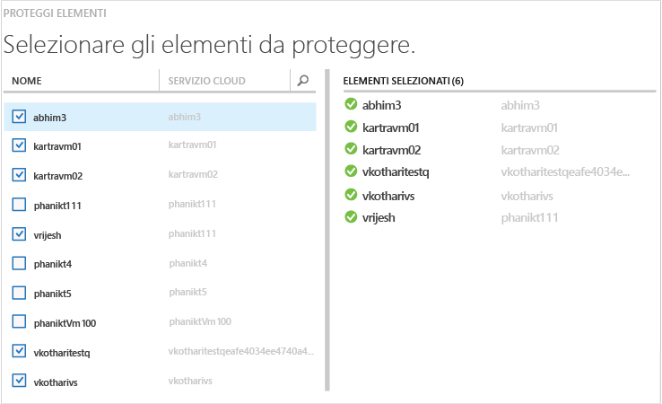
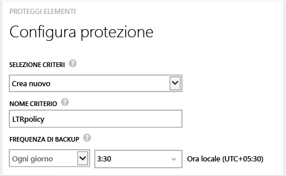
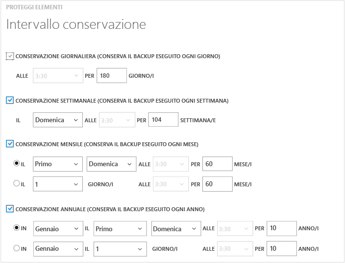
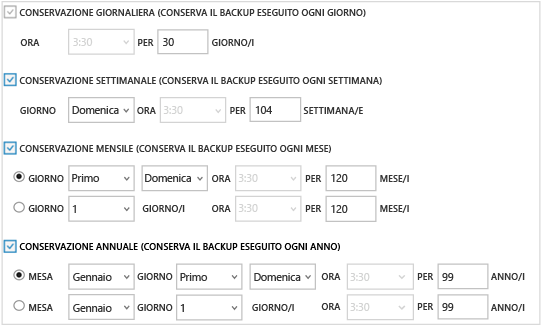

<properties
	pageTitle="Backup di macchine virtuali di Azure | Microsoft Azure"
	description="Questo articolo include le procedure per eseguire il backup di una macchina virtuale di Azure."
	services="backup"
	documentationCenter=""
	authors="Jim-Parker"
	manager="jwhit"
	editor=""/>

<tags
	ms.service="backup"
	ms.workload="storage-backup-recovery"
	ms.tgt_pltfrm="na"
	ms.devlang="na"
	ms.topic="hero-article"
	ms.date="10/23/2015"
	ms.author="trinadhk; aashishr; jimpark; markgal"/>

# Eseguire il backup di macchine virtuali di Azure
Questo articolo include le procedure per eseguire il backup delle macchine virtuali esistenti, per proteggerle in conformità ai criteri di backup e conservazione della società.

Prima di poter eseguire il backup di una macchina virtuale di Azure, è necessario occuparsi di alcuni aspetti. Se non è già stato fatto, completare i [prerequisiti](backup-azure-vms-prepare.md) per preparare l'ambiente per il backup della VM prima di procedere.

Per informazioni sulla [pianificazione dell'infrastruttura di backup delle VM in Azure](backup-azure-vms-introduction.md) o sulle [macchine virtuali di Azure](https://azure.microsoft.com/documentation/services/virtual-machines/), è possibile usare questi collegamenti.

L'esecuzione del backup di macchine virtuali di Azure prevede tre passaggi principali:

>[AZURE.NOTE] Il backup della macchina virtuale è locale. Non è possibile eseguire il backup di macchine virtuali di un'area in un insieme di credenziali per il backup in un'altra area. Di conseguenza, per ogni area di Azure in cui sono presenti macchine virtuali per le quali deve essere eseguito il backup, è necessario creare almeno un insieme di credenziali per il backup in quell'area.

## Passaggio 1: Individuare le macchine virtuali di Azure
Il processo di individuazione deve essere sempre eseguito come primo passaggio, per assicurare che vengano identificate le eventuali nuove macchine virtuali aggiunte alla sottoscrizione. Il processo esegue una query su Azure per ottenere l'elenco delle macchine virtuali nella sottoscrizione, insieme ad altre informazioni come il nome del servizio cloud e l'area.

1. Passare all'insieme di credenziali per il backup disponibile in **Servizi di ripristino** nel portale di Azure e fare clic su **Elementi registrati**.

2. Selezionare **Macchina virtuale di Azure** dal menu a discesa.

    

3. Fare clic su **INDIVIDUA** nella parte inferiore della pagina.
    

    Il processo di individuazione può richiedere alcuni minuti mentre le macchine virtuali vengono elencate in formato tabulare. Nella parte inferiore della schermata è presente una notifica che indica che il processo è in esecuzione.

    

    Al termine del processo, la notifica cambia.

    

##  Passaggio 2: Registrare le macchine virtuali di Azure
Si registra una macchina virtuale per associarla al servizio Backup di Azure. Questa attività viene in genere eseguita una sola volta.

1. Passare all'insieme di credenziali per il backup disponibile in **Servizi di ripristino** nel portale di Azure e fare clic su **Elementi registrati**.

2. Selezionare **Macchina virtuale di Azure** dal menu a discesa.

    

3. Fare clic su **REGISTRA** nella parte inferiore della pagina.
    

4. Nel menu di scelta rapida **Registra elementi** selezionare le macchine virtuali da registrare. Se sono presenti due o più macchine virtuali con lo stesso nome, usare il servizio cloud per distinguerle.

    >[AZURE.TIP]È possibile registrare più macchine virtuali contemporaneamente.

    Viene creato un processo per ogni macchina virtuale selezionata.

5. Fare clic su **Visualizza processo** nella notifica per passare alla pagina **Processi**.

    

    La macchina virtuale viene visualizzata anche nell'elenco di elementi registrati insieme allo stato dell'operazione di registrazione.

    

    When the operation completes, the status will change to reflect the *registered* state.

    

## Passaggio 3: Proteggere le macchine virtuali di Azure
Ora è possibile configurare i criteri di backup e conservazione per la macchina virtuale. È possibile proteggere più macchine virtuali con una singola operazione.

Gli insiemi di credenziali di Backup di Azure creati dopo maggio 2015 includono criteri predefiniti. Questi criteri predefiniti prevedono un periodo di conservazione predefinito di 30 giorni e una pianificazione per il backup una volta al giorno.

1. Passare all'insieme di credenziali per il backup disponibile in **Servizi di ripristino** nel portale di Azure e fare clic su **Elementi registrati**.

2. Selezionare **Macchina virtuale di Azure** dal menu a discesa.

    

3. Fare clic su **PROTEGGI** nella parte inferiore della pagina.

    Verrà visualizzata la procedura guidata **Proteggi elementi**. La procedura guidata elenca solo le macchine virtuali registrate e non protette. Qui è possibile selezionare le macchine virtuali da proteggere.

    Se sono presenti due o più macchine virtuali con lo stesso nome, usare il servizio cloud per distinguere tra le macchine virtuali.

    >[AZURE.TIP]È possibile proteggere più macchine virtuali contemporaneamente.

    

4. Scegliere una **pianificazione per il backup** per eseguire il backup delle macchine virtuali selezionate. È possibile scegliere da un set di criteri esistenti o definirne di nuovi.

    Ai singoli criteri di backup possono essere associate più macchine virtuali. Una macchina virtuale può tuttavia essere associata a un solo criterio in un dato momento.

    

    >[AZURE.NOTE] I criteri di backup includono uno schema di conservazione per i backup pianificati. Se sono stati selezionati criteri di backup esistenti, non sarà possibile modificare le opzioni di conservazione nel passaggio successivo.

5. Scegliere un **intervallo di conservazione** da associare ai backup.

    

    I criteri di conservazione specificano l'intervallo di tempo per l'archiviazione di un backup e si possono specificare criteri di conservazione diversi in base al momento in cui viene eseguito il backup. Ad esempio, potrebbe essere necessario conservare il punto di backup eseguito alla fine di ogni trimestre per un periodo di tempo più lungo, a scopo di controllo, mentre il punto di backup eseguito quotidianamente, usato come punto di ripristino operativo, deve essere conservato solo per 90 giorni.

    

    In questa immagine di esempio:

    - **Criteri di Conservazione giornaliera**: i backup eseguiti ogni giorno vengono archiviati per 30 giorni.
    - **Criteri di Conservazione settimanale**: i backup eseguiti ogni domenica vengono conservati per 104 settimane.
    - **Criteri di Conservazione mensile**: i backup eseguiti l'ultima domenica di ogni mese vengono conservati per 120 mesi.
    - **Criteri di Conservazione annuale**: i backup eseguiti la prima domenica di ogni gennaio vengono conservati per 99 anni.

    Viene creato un processo per configurare i criteri di protezione e associare ogni macchina virtuale selezionata a questi criteri.

6. Fare clic su **Processo** e scegliere il filtro appropriato per visualizzare l'elenco dei processi **Configura protezione**.

    

## Backup iniziale
Dopo avere applicato i criteri di protezione alla macchina virtuale, questa verrà visualizzata nella scheda **Elementi protetti** e avrà lo stato *Protetto (backup iniziale in sospeso)*. Per impostazione predefinita, il primo backup pianificato è il *backup iniziale*.

Per attivare il backup iniziale immediatamente dopo la configurazione della protezione:

1. Fare clic sul pulsante **Esegui backup ora** nella parte inferiore della pagina **Elementi protetti**.

    Il servizio Backup di Azure crea un processo di backup per l'operazione di backup iniziale.

2. Fare clic sulla scheda **Processi** per visualizzare l'elenco dei processi.

    

>[AZURE.NOTE] Come parte dell'operazione di backup, il servizio Backup di Azure esegue un comando nell'estensione per il backup in ogni macchina virtuale, in modo da scaricare tutte le scritture e creare uno snapshot coerente.

Al termine del backup iniziale, lo stato della macchina virtuale nella scheda **Elementi protetti** sarà *Protetto*.

## Visualizzazione dello stato di backup e dei relativi dettagli
Dopo la protezione, il numero di macchine virtuali aumenta anche nella pagina di riepilogo **Dashboard**. Nella pagina **Dashboard** viene visualizzato anche il numero di processi *completati*, *non riusciti* e ancora *in corso* nelle ultime 24 ore. Facendo clic su una categoria qualsiasi, verrà eseguito il drill-down in quella categoria nella pagina **Processi**.

I valori nel dashboard vengono aggiornati ogni 24 ore.

## Risoluzione dei problemi
In caso di problemi durante il backup della macchina virtuale, vedere le informazioni aggiuntive sulla [risoluzione dei problemi](backup-azure-vms-troubleshoot.md) per assistenza.

## Passaggi successivi

- [Gestire e monitorare il backup delle macchine virtuali di Azure](backup-azure-manage-vms.md)
- [Ripristinare una macchina virtuale di Azure](backup-azure-restore-vms.md)

<!-----HONumber=Nov15_HO1-->
<!-----Line 75 blankspace-->
