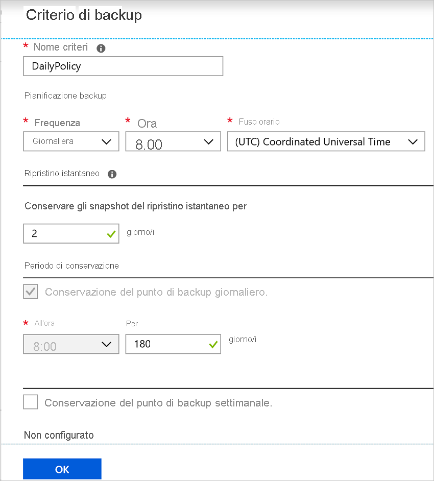

# Abilitare il backup quando si crea una macchina virtuale di Azure

Usare il servizio Backup di Azure per eseguire il backup di macchine virtuali di Azure (VM). Backup delle macchine virtuali in base a una pianificazione specificata in un criterio di backup e i punti di ripristino vengono creati dalle copie di backup. I punti di ripristino vengono archiviati negli insiemi di credenziali di servizi di ripristino.

Questo articolo illustra come abilitare il backup quando si crea una macchina virtuale (VM) nel portale di Azure.  

## Prima di iniziare

- [Controllare](backup-support-matrix-iaas.md#supported-backup-actions) quali sistemi operativi sono supportati se si abilita il backup quando si crea una macchina virtuale.

## Accedi ad Azure

Se si non sono già connessi al proprio account, accedere al [portale di Azure](https://portal.azure.com).
 
## Creare una macchina virtuale con Backup configurato

1. Nel portale di Azure, fare clic su **crea una risorsa**.

2. In Azure Marketplace, fare clic su **calcolo**e quindi selezionare un'immagine di macchina virtuale.

3. Configurare la macchina virtuale in base al [Windows](https://docs.microsoft.com/azure/virtual-machines/windows/quick-create-portal) oppure [Linux](https://docs.microsoft.com/azure/virtual-machines/linux/quick-create-portal) istruzioni.

4. Nel **Management** nella scheda **Abilita backup**, fare clic su **su**.
5. Backup di Azure Backup per un insieme di credenziali di servizi di ripristino. Fare clic su **Crea nuovo** se non si dispone di un insieme di credenziali esistente.
6. Accettare il nome dell'insieme di credenziali suggerita oppure specificarne uno personale.
7. Specificare o creare un gruppo di risorse in cui sarà disponibile l'insieme di credenziali. L'insieme di credenziali di gruppo di risorse può essere diverso dal gruppo di risorse della macchina virtuale.

     

8. Accettare i criteri di backup predefinito oppure modificare le impostazioni.
    - Un criterio di backup specifica la frequenza con cui eseguire snapshot del backup della macchina virtuale e tempo di conservazione delle copie di backup. 
    - Il criterio predefinito esegue il backup della macchina virtuale una volta al giorno.
    - È possibile personalizzare il proprio criterio di backup per una macchina virtuale di Azure eseguire i backup giornalieri o settimanali.
    - [Altre informazioni](backup-azure-vms-introduction.md#backup-and-restore-considerations) sulle considerazioni sul backup per macchine virtuali di Azure.
    - [Altre informazioni](backup-instant-restore-capability.md) nel momento in cui ripristinare la funzionalità.

       

## Avviare un backup dopo aver creato la macchina virtuale 

In conformità con i criteri di backup verrà eseguito il backup delle macchine Virtuali. Tuttavia, è consigliabile eseguire un backup iniziale. 

Dopo aver creata la macchina virtuale, eseguire le operazioni seguenti:

1. Nelle proprietà della VM, fare clic su **Backup**. Lo stato della macchina virtuale è in sospeso Backup iniziale fino a quando non viene eseguito il backup iniziale
2. Fare clic su **Esegui backup ora** per eseguire un backup su richiesta.

     

## Usare un modello di Resource Manager per distribuire una macchina virtuale protetta

I passaggi precedenti illustrano come usare il portale di Azure per creare una macchina virtuale e proteggerla in un insieme di credenziali di servizi di ripristino. Per distribuire uno o più macchine virtuali e proteggerle in un insieme di credenziali di servizi di ripristino, vedere il modello [distribuire una VM Windows e abilitare il backup](https://azure.microsoft.com/resources/templates/101-recovery-services-create-vm-and-configure-backup/).

## Passaggi successivi 

Ora che è stato protetto la macchina virtuale, informazioni su come gestire e ripristinarli.

- [Gestire e monitorare le macchine virtuali](backup-azure-manage-vms.md) 
- [Ripristinare la macchina virtuale](backup-azure-arm-restore-vms.md) 

Se si verificano problemi, [esaminare](backup-azure-vms-troubleshoot.md) Guida alla risoluzione dei problemi.
