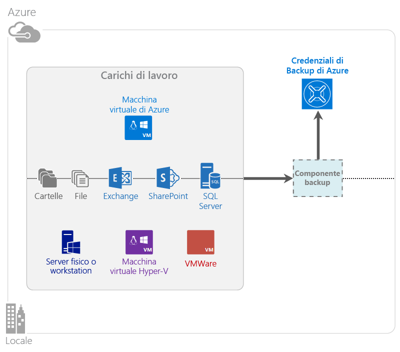

<properties
	pageTitle="Che cos'è Azure Backup? | Microsoft Azure"
	description="Con Azure Backup e i servizi di ripristino è possibile eseguire il backup e il ripristino di dati e applicazioni da server Windows, computer client Windows, server System Center DPM e macchine virtuali di Azure."
	services="backup"
	documentationCenter=""
	authors="Jim-Parker"
	manager="jwhit"
	editor="tysonn"
	keywords="backup e ripristino; servizi di ripristino; soluzioni di backup"/>

<tags
	ms.service="backup"
	ms.workload="storage-backup-recovery"
	ms.tgt_pltfrm="na"
	ms.devlang="na"
	ms.topic="get-started-article"
	ms.date="04/13/2016"
	ms.author="jimpark; trinadhk"/>

# Informazioni su Backup di Azure
Backup di Azure è il servizio usato per eseguire il backup e il ripristino dei dati in Microsoft Cloud. Sostituisce la soluzione di backup locale o esterna esistente con una soluzione basata sul cloud affidabile, sicura e conveniente. Consente anche di proteggere gli asset eseguiti nel cloud. Backup di Azure fornisce servizi di ripristino basati su un'infrastruttura di altissimo livello che garantisce scalabilità, durabilità e disponibilità elevata.

[Panoramica video di Backup di Azure](https://azure.microsoft.com/documentation/videos/what-is-azure-backup/)

## Perché usare Backup di Azure
Le soluzioni di backup tradizionali si sono evolute e considerano ora il cloud come un endpoint analogo a un disco o un nastro. Questo approccio, anche se semplice, è limitato e non sfrutta pienamente una piattaforma cloud sottostante, finendo per rivelarsi una soluzione costosa e poco efficiente. Backup di Azure, al contrario, offre tutti i vantaggi di una soluzione di backup cloud efficace e conveniente. Ecco alcuni dei vantaggi principali offerti da Backup di Azure:

| Funzionalità | Vantaggi |
| ------- | ------- |
| Gestione automatica dell'archiviazione | Nessuna spesa di investimento necessaria per dispositivi di archiviazione locale. Backup di Azure alloca e gestisce automaticamente le risorse di archiviazione di backup e usa un modello di utilizzo con pagamento in base al consumo. |
| Scalabilità illimitata | Consente di sfruttare le garanzie di disponibilità elevata senza costi di manutenzione e monitoraggio. Backup di Azure usa la potenza e la scalabilità sottostanti del cloud di Azure, con funzionalità di scalabilità automatica non intrusive. |
| Più opzioni di archiviazione | È possibile scegliere l'archivio di backup più adatto alle esigenze: <li>un BLOB in blocchi di archiviazione con ridondanza locale è la soluzione ideale per i clienti attenti ai costi, senza rinunciare alla protezione dei dati da errori hardware locali. <li>Un BLOB in blocchi di archiviazione con replica geografica offre altre tre copie in un data center abbinato. Queste copie aggiuntive assicurano la disponibilità elevata dei dati di backup anche se si verifica un'emergenza a livello di sito di Azure. |
| Trasferimento dati illimitato | Non è previsto alcun addebito per il trasferimento dati in uscita durante un'operazione di ripristino dall'insieme di credenziali di Backup. Non sono previsti addebiti neanche per i dati in ingresso in Azure. Usa il servizio di importazione, se disponibile. |
| Crittografia dei dati | La crittografia dei dati consente la trasmissione e l'archiviazione protette dei dati del cliente nel cloud pubblico. La passphrase di crittografia viene archiviata nell'origine e non viene mai trasmessa o archiviata in Azure. La chiave di crittografia è necessaria per ripristinare i dati e solo per il cliente è disponibile l'accesso completo ai dati nel servizio. |  
| Backup coerente con l'applicazione | I backup coerenti con l'applicazione in Windows eliminano la necessità di correzioni al momento del ripristino, riducendo così l'obiettivo del tempo di ripristino. Questo permette ai clienti di tornare più rapidamente a uno stato in corso di esecuzione. |
| Conservazione a lungo termine | Invece di pagare per soluzioni di backup esterne su nastro, i clienti possono eseguire il backup in Azure, che offre una soluzione interessante simile a nastro a un costo ridotto. |

## Componenti di Backup di Azure
Essendo una soluzione di backup ibrida, Backup di Azure è costituita da più componenti che interagiscono per abilitare flussi di lavoro di backup e ripristino end-to-end.

### Scenari di distribuzione

| Componente | Può essere distribuito in Azure? | Può essere distribuito in locale? | Archiviazione di destinazione supportata|
| --- | --- | --- | --- |
| Agente di Backup di Azure | 
**Sì**
 
L'agente di Backup di Azure può essere distribuito in qualsiasi macchina virtuale Windows Server eseguita in Azure.
 | 
**Sì**
 
L'agente di backup può essere distribuito in qualunque computer fisico o macchina virtuale Windows Server.
 | 
Insieme di credenziali di Backup di Azure
 |
| System Center Data Protection Manager (DPM) | 
**Sì**

Altre informazioni su [come proteggere i carichi di lavoro in Azure con System Center DPM](http://blogs.technet.com/b/dpm/archive/2014/09/02/azure-iaas-workload-protection-using-data-protection-manager.aspx).
 | 
**Sì**
 
Altre informazioni su [come proteggere i carichi di lavoro e le macchine virtuali nel data center](https://technet.microsoft.com/library/hh758173.aspx).
 | 
Disco collegato al computer locale,
 
insieme di credenziali di Backup di Azure,
 
nastro (solo in locale)
 |
| Server di backup di Azure | 
**Sì**

Altre informazioni su [come proteggere i carichi di lavoro in Azure con il server di Backup di Azure](backup-azure-microsoft-azure-backup.md).
 | 
**Sì**
 
Altre informazioni su [come proteggere i carichi di lavoro in Azure con il server di Backup di Azure](backup-azure-microsoft-azure-backup.md).
 | 
Disco collegato al computer locale,
 
insieme di credenziali di Backup di Azure
 |
| Backup di Azure (estensione VM) | 
**Sì**

Parte dell'infrastruttura di Azure

Specializzato per il [backup di macchine virtuali di infrastruttura distribuita come servizio (IaaS) di Azure](backup-azure-vms-introduction.md).
 | 
**No**
 
Usare System Center DPM per il backup delle macchine virtuali nel data center.
 | 
Insieme di credenziali di Backup di Azure
 |

### Limitazioni e vantaggi a livello di componente

| Componente | Vantaggi | Limitazioni | Granularità ripristino |
| --- | --- | --- | --- |
| Agente di Backup di Azure (MARS) | <li>Può eseguire il backup di file e cartelle in un computer con sistema operativo Windows, fisico o virtuale (le VM possono essere ovunque, locali o in Azure)<li>Non è necessario un server di backup separato<li>Usa l'insieme di credenziali di Backup di Azure | <li>Ripristino a livello di backup/file tre volte al giorno<li>Solo ripristino a livello di file/cartella/volume, senza riconoscimento dell'applicazione<li>Nessun supporto per Linux | file/cartelle/volumi |
| System Center Data Protection Manager | <li>Snapshot con riconoscimento dell'app (Servizio Copia Shadow del volume)<li>Flessibilità completa per decidere quando eseguire i backup<li>Granularità ripristino (tutto)<li>Può usare l'insieme di credenziali di Backup di Azure<li>Supporto Linux (se ospitato in Hyper-V) | <li>Mancanza di supporto eterogeneo (backup di macchine virtuali VMware, backup di carichi di lavoro Oracle) | file/cartelle/volumi /VM/applicazioni |
| Server Backup di Microsoft Azure | <li>Snapshot con riconoscimento dell'app (Servizio Copia Shadow del volume)<li>Flessibilità completa per decidere quando eseguire i backup<li>Granularità ripristino (tutto)<li>Può usare l'insieme di credenziali di Backup di Azure<li>Supporto Linux (se ospitato in Hyper-V)<li>Non richiede una licenza per System Center | <li>Mancanza di supporto eterogeneo (backup di macchine virtuali VMware, backup di carichi di lavoro Oracle)<li>Richiede sempre una sottoscrizione di Azure attiva<li>Nessun supporto per il backup su nastro | file/cartelle/volumi /VM/applicazioni |
| Backup di VM IaaS di Azure | <li>Backup nativi per Windows/Linux<li>Non è necessario installare alcun agente specifico<li>Backup a livello di infrastruttura senza bisogno di un'infrastruttura di backup | <li>Ripristino a livello di backup/disco una volta al giorno<li>Non può eseguire il backup in locale | VM Tutti i dischi (con PowerShell) |

## Applicazioni e carichi di lavoro di cui è possibile eseguire il backup

| Carico di lavoro | Computer di origine | Soluzione di Backup di Azure |
| --- | --- |---|
| File e cartelle | Windows Server | 
[Agente di Backup di Azure](backup-configure-vault.md),
 
[System Center DPM](backup-azure-dpm-introduction.md) (+ l'agente di Backup di Azure),
 
[Server di Backup di Azure](backup-azure-microsoft-azure-backup.md) (include l'agente di Backup di Azure)
 |
| File e cartelle | Client Windows | 
[Agente di Backup di Azure](backup-configure-vault.md),
 
[System Center DPM](backup-azure-dpm-introduction.md) (+ l'agente di Backup di Azure),
 
[Server di Backup di Azure](backup-azure-microsoft-azure-backup.md) (include l'agente di Backup di Azure)
 |
| Macchina virtuale Hyper-V (Windows) | Windows Server | 
[System Center DPM](backup-azure-backup-sql.md) (+ l'agente di Backup di Azure),
 
[Server di Backup di Azure](backup-azure-microsoft-azure-backup.md) (include l'agente di Backup di Azure)
 |
| Macchina virtuale Hyper-V (Linux) | Windows Server | 
[System Center DPM](backup-azure-backup-sql.md) (+ l'agente di Backup di Azure),
 
[Server di Backup di Azure](backup-azure-microsoft-azure-backup.md) (include l'agente di Backup di Azure)
 |
| Microsoft SQL Server | Windows Server | 
[System Center DPM](backup-azure-backup-sql.md) (+ l'agente di Backup di Azure),
 
[Server di Backup di Azure](backup-azure-microsoft-azure-backup.md) (include l'agente di Backup di Azure)
 |
| Microsoft SharePoint | Windows Server | 
[System Center DPM](backup-azure-backup-sql.md) (+ l'agente di Backup di Azure),
 
[Server di Backup di Azure](backup-azure-microsoft-azure-backup.md) (include l'agente di Backup di Azure)
 |
| Microsoft Exchange | Windows Server | 
[System Center DPM](backup-azure-backup-sql.md) (+ l'agente di Backup di Azure),
 
[Server di Backup di Azure](backup-azure-microsoft-azure-backup.md) (include l'agente di Backup di Azure)
 |
| Macchine virtuali IaaS di Azure (Windows) | - | [Backup di Azure (estensione VM)](backup-azure-vms-introduction.md) | | Macchine virtuali IaaS di Azure (Linux) | - | [Backup di Azure (estensione VM)](backup-azure-vms-introduction.md) |

## Supporto Linux e ARM

| Componente | Supporto ARM | Supporto Linux (approvato per Azure) |
| --- | --- | --- |
| Agente di Backup di Azure (MARS) | Sì | No (solo agente basato su Windows) |
| System Center Data Protection Manager | Sì (agente in guest) | Solo Hyper-V (non VM di Azure) È possibile eseguire soltanto backup coerenti a livello di file |
| Server di backup di Azure (MABS) | Sì (agente in guest) | Solo Hyper-V (non VM di Azure) È possibile eseguire soltanto backup coerenti a livello di file (come per DPM) |
| Backup di VM IaaS di Azure | Nell'anteprima pubblica | Nell'anteprima pubblica - VM Linux nel modello di distribuzione di Azure Resource Manager  (coerenza a livello di file system)  Sì per le VM Linux nel modello di distribuzione classica |

[AZURE.INCLUDE [learn-about-deployment-models](../../includes/learn-about-deployment-models-include.md)]

## Backup e ripristino di macchine virtuali di Archiviazione Premium

Il servizio Backup di Azure ora protegge le macchine virtuali di Archiviazione Premium.

### Backup di macchine virtuali di Archiviazione Premium

Durante il backup di macchine virtuali di Archiviazione Premium, il servizio Backup crea un percorso di gestione temporanea nell'account di archiviazione Premium. Il percorso di gestione temporanea, denominato "AzureBackup-", è uguale alla dimensione totale dei dati dei dischi Premium collegati alla macchina virtuale.

>[AZURE.NOTE] Non modificare in alcun modo il percorso di gestione temporanea.

Al termine del processo di backup, il percorso di gestione temporanea viene eliminato. Il prezzo della risorsa di archiviazione usata per il percorso di gestione temporanea è in linea con gli altri [prezzi di Archiviazione Premium](../storage/storage-premium-storage.md#pricing-and-billing).

### Ripristino di macchine virtuali di Archiviazione Premium

Il processo tipo consiste nel ripristino di un punto di ripristino della macchina virtuale di Archiviazione Premium in Archiviazione Premium. Tuttavia, può risultare più economico ripristinare un punto di ripristino della macchina virtuale di Archiviazione Premium in Archiviazione Standard. Si può usare questo tipo di ripristino se è necessario un subset di file dalla macchina virtuale.

Di seguito sono riportati i passaggi per ripristinare un punto di ripristino della macchina virtuale di Archiviazione Premium in Archiviazione Premium:

1. [Ripristinare il punto di ripristino della macchina virtuale in Archiviazione Standard](backup-azure-restore-vms.md).
2. [Copiare i dischi in Archiviazione Premium](../storage/storage-use-azcopy.md).
3. [Creare la macchina virtuale IaaS di Azure](../virtual-machines/virtual-machines-windows-hero-tutorial.md).

## Funzionalità
Le cinque tabelle seguenti forniscono un riepilogo di come viene gestita la funzionalità di backup in ogni componente.

### Archiviazione

| Funzionalità | Agente di Backup di Azure | System Center DPM | Server di backup di Azure | Backup di Azure (estensione VM) |
| ------- | --- | --- | --- | ---- |
| Insieme di credenziali di Backup di Azure | ![Sì][green] | ![Sì][green] | ![Sì][green] | ![Sì][green] |
| Archiviazione su disco | | ![Sì][green] | ![Sì][green] | |
| Archiviazione su nastro | | ![Sì][green] | | |
| Compressione (nell'insieme di credenziali per il backup) | ![Sì][green] | ![Sì][green]| ![Sì][green] | |
| Backup incrementale | ![Sì][green] | ![Sì][green] | ![Sì][green] | ![Sì][green] |
| Deduplicazione dei dischi | | ![Parzialmente][yellow] | ![Parzialmente][yellow]| | |

L'insieme di credenziali di Backup è la destinazione di archiviazione preferita in tutti i componenti. System Center DPM e il server di Backup consentono anche di avere una copia del disco locale. Solo System Center DPM consente tuttavia di scrivere i dati su un dispositivo di archiviazione su nastro.

#### Backup incrementale
Ogni componente supporta il backup incrementale indipendentemente dall'archivio di destinazione, che sia un disco, un nastro o un insieme di credenziali di backup. Il backup incrementale garantisce l'archiviazione e la rapidità dei backup, trasferendo solo le modifiche apportate dall'ultimo backup.

#### Compressione
I backup vengono compressi per ridurre lo spazio di archiviazione necessario. L'estensione della macchina virtuale è il solo componente che non usa alcuna compressione. Con l'estensione VM, tutti i dati di backup vengono copiati dall'account di archiviazione del cliente all'insieme di credenziali di backup nella stessa area, senza compressione. La procedura senza compressione comporta un leggero aumento dello spazio di archiviazione usato, ma consente di abbreviare i tempi di ripristino.

#### Deduplicazione
La deduplicazione è supportata per System Center DPM e per il server di Backup quando sono [distribuiti in una macchina virtuale Hyper-V](http://blogs.technet.com/b/dpm/archive/2015/01/06/deduplication-of-dpm-storage-reduce-dpm-storage-consumption.aspx). La deduplicazione viene eseguita a livello di host usando la deduplicazione di Windows Server nei dischi rigidi virtuali (VHD) collegati alla macchina virtuale come archivio di backup.

>[AZURE.WARNING] La deduplicazione non è disponibile in Azure per i componenti di Backup. Quando System Center DPM e il server di Backup vengono distribuiti in Azure, i dischi di archiviazione collegati alla macchina virtuale non possono essere deduplicati.

### Sicurezza

| Funzionalità | Agente di Backup di Azure | System Center DPM | Server di backup di Azure | Backup di Azure (estensione VM) |
| ------- | --- | --- | --- | ---- |
| Sicurezza di rete (in Azure) | ![Sì][green] |![Sì][green] | ![Sì][green] | ![Parzialmente][yellow]|
| Sicurezza dei dati (in Azure) | ![Sì][green] |![Sì][green] | ![Sì][green] | ![Parzialmente][yellow]|

Tutto il traffico di backup dai server all'insieme di credenziali di Backup viene crittografato con Advanced Encryption Standard 256. I dati vengono inviati tramite un collegamento HTTPS protetto. I dati di backup vengono archiviati anche nell'insieme di credenziali di Backup in formato crittografato. Solo il cliente ha la passphrase per sbloccare i dati. Microsoft non può decrittografare i dati di backup

>[AZURE.WARNING] La chiave usata per crittografare i dati di backup è unicamente a disposizione del cliente. Microsoft non ne conserva una copia in Azure e non dispone dell'accesso alla chiave. Se la chiave viene smarrita, Microsoft non può recuperare i dati di backup.

Per il backup delle VM di Azure, è necessario configurare la crittografia *nella* macchina virtuale. Usare BitLocker nelle macchine virtuali di Windows e **dm-crypt** nelle macchine virtuali di Linux. Backup di Azure non esegue automaticamente la crittografia dei dati di backup provenienti da questo percorso.

### Carichi di lavoro supportati

| Funzionalità | Agente di Backup di Azure | System Center DPM | Server di backup di Azure | Backup di Azure (estensione VM) |
| ------- | --- | --- | --- | ---- |
| Computer Windows Server: file e cartelle | ![Sì][green] | ![Sì][green] | ![Sì][green] | |
| Computer client di Windows: file e cartelle | ![Sì][green] | ![Sì][green] | ![Sì][green] | |
| Macchina virtuale Hyper-V (Windows) | | ![Sì][green] | ![Sì][green] | |
| Macchina virtuale Hyper-V (Linux) | | ![Sì][green] | ![Sì][green] | |
| Microsoft SQL Server | | ![Sì][green] | ![Sì][green] | |
| Microsoft SharePoint | | ![Sì][green] | ![Sì][green] | |
| Microsoft Exchange | | ![Sì][green] | ![Sì][green] | |
| Macchina virtuale di Azure (Windows) | | | | ![Sì][green] |
| Macchina virtuale di Azure (Linux) | | | | ![Sì][green] |

### Rete

| Funzionalità | Agente di Backup di Azure | System Center DPM | Server di backup di Azure | Backup di Azure (estensione VM) |
| ------- | --- | --- | --- | ---- |
| Compressione di rete (nel server di backup) | | ![Sì][green] | ![Sì][green] | |
| Compressione di rete (nell'insieme di credenziali di backup) | ![Sì][green] | ![Sì][green] | ![Sì][green] | |
| Protocollo di rete (nel server di backup) | | TCP | TCP | |
| Protocollo di rete (nell'insieme di credenziali di backup) | HTTPS | HTTPS | HTTPS | HTTPS |

Poiché l'estensione della macchina virtuale legge i dati direttamente dall'account di archiviazione di Azure attraverso la rete di archiviazione, non è necessario ottimizzare il traffico. Il traffico attraversa la rete di archiviazione locale nel data center di Azure, quindi considerata la larghezza di banda non c'è una particolare esigenza di compressione.

Per coloro che eseguono il backup dei dati in un server di backup, come DPM o il server di Backup, è possibile comprimere il traffico dal server primario al server di backup per ridurre l'uso della larghezza di banda.

#### Limitazione della larghezza di banda della rete
L'agente di Backup di Azure offre una funzionalità di limitazione che consente di controllare quanta larghezza di banda di rete viene usata durante il trasferimento dati. La limitazione può essere utile se è necessario eseguire il backup dei dati durante l'orario di lavoro, ma senza che il processo di backup interferisca con il resto del traffico Internet. La limitazione per il trasferimento dati si applica alle attività di backup e ripristino.

### Backup e conservazione

| | Agente di Backup di Azure | System Center DPM | Server di backup di Azure | Backup di Azure (estensione VM) |
| --- | --- | --- | --- | --- |
| Frequenza di backup (nell'insieme di credenziali di backup) | 3 backup al giorno | 2 backup al giorno |2 backup al giorno | 1 backup al giorno |
| Frequenza di backup (su disco) | Non applicabile | 
Ogni 15 minuti per SQL Server
 
Ogni ora per altri carichi di lavoro
 | 
Ogni 15 minuti per SQL Server
 
Ogni ora per altri carichi di lavoro
 |Non applicabile |
| Opzioni di conservazione | Giornaliera, settimanale, mensile, annuale | Giornaliera, settimanale, mensile, annuale | Giornaliera, settimanale, mensile, annuale |Giornaliera, settimanale, mensile, annuale |
| Periodo di conservazione | Fino a 99 anni | Fino a 99 anni | Fino a 99 anni | Fino a 99 anni |
| Punti di ripristino nell'insieme di credenziali di Backup | Senza limiti | Senza limiti | Senza limiti | Senza limiti |
| Punti di ripristino nel disco locale | Non applicabile | 64 per i file server  448 per i server applicazioni | 64 per i file server  448 per i server applicazioni |Non applicabile |
| Punti di ripristino su nastro | Non applicabile | Senza limiti | Non applicabile | Non applicabile |

## Informazioni sul file delle credenziali di insieme

Il file delle credenziali di insieme è un certificato generato dal portale per ogni insieme di credenziali per il backup. Il portale carica quindi la chiave pubblica nel Servizio di controllo di accesso (o ACS). La chiave privata viene fornita all'utente durante il download delle credenziali e quindi immessa durante la registrazione del computer. La chiave privata autentica il computer per l'invio dei dati di backup a un insieme di credenziali identificato nel servizio Backup di Azure.

Il file delle credenziali di insieme viene usato solo durante il flusso di lavoro di registrazione. È responsabilità dell'utente garantire che il file delle credenziali dell'insieme di credenziali non venga danneggiato. Nelle mani di un utente non autorizzato il file delle credenziali di insieme può essere usato per registrare altri computer nello stesso insieme di credenziali. Poiché i dati di backup sono crittografati con una passphrase appartenente solo al cliente, i dati di backup esistenti non possono tuttavia essere compromessi. Per attenuare questo problema, le credenziali dell'insieme di credenziali sono impostate per scadere in 48 ore. Anche se è possibile scaricare le credenziali di un insieme di credenziali per il backup un numero illimitato di volte, durante la registrazione del flusso di lavoro è applicabile solo il file più recente.

## Differenze tra Backup di Azure e Azure Site Recovery
Molti clienti fanno confusione tra ripristino del backup e ripristino di emergenza. Entrambi acquisiscono dati e forniscono una semantica di ripristino, ma la proposta di valore alla base è diversa.

Backup di Azure esegue il backup dei dati in locale o nel cloud. Azure Site Recovery coordina la replica, il failover e il failback di macchine virtuali e server fisici. Entrambi i servizi sono importanti perché la soluzione di ripristino di emergenza deve fare in modo che i dati siano protetti e ripristinabili (Backup) *e* deve mantenere i carichi di lavoro disponibili (Site Recovery) quando si verificano interruzioni.

I concetti seguenti consentono di prendere importanti decisioni relative al backup e al ripristino di emergenza.

| Concetto | Dettagli | Backup | Ripristino di emergenza |
| ------- | ------- | ------ | ----------------- |
| Obiettivo del punto di ripristino (RPO) | Quantità di perdita di dati accettabile se si rende necessario un ripristino. | Le soluzioni di backup presentano un'ampia variabilità a livello di RPO accettabile. I backup delle macchine virtuali hanno in genere un RPO di un giorno, mentre i backup dei database hanno RPO fino a un minimo di 15 minuti. | Le soluzioni di ripristino di emergenza hanno RPO bassi. La copia di ripristino di emergenza può risalire a pochi minuti o pochi secondi prima. |
| Obiettivo del tempo di ripristino (RTO) | Quantità di tempo necessario per completare un ripristino o un recupero. | Dato l'RPO più alto, la quantità di dati che deve essere elaborata dalla soluzione di backup è in genere molto più grande e questo comporta un RTO maggiore. Ad esempio, il ripristino dei dati dai nastri può richiedere giorni, a seconda del tempo richiesto per il trasporto del nastro da una posizione esterna. | Le soluzioni di ripristino di emergenza hanno RTO più bassi, perché il livello di sincronizzazione con l'origine è maggiore e il numero di modifiche da elaborare è ridotto. |
| Conservazione | Periodo di tempo per il quale i dati devono essere archiviati. | Per scenari che richiedono il ripristino operativo, per danneggiamento dei dati, eliminazione accidentale dei file o errori del sistema operativo, i dati di backup sono in genere conservati per un massimo di 30 giorni. Dal punto di vista della conformità, potrebbe essere necessario archiviare i dati per mesi o anche per anni. In questi casi, i dati di backup sono particolarmente adatti per l'archiviazione. | Il ripristino di emergenza richiede soltanto dati di ripristino operativo. I tempi sono in genere di poche ore o di un giorno al massimo. A causa degli intervalli di acquisizione dei dati così ridotti nelle soluzioni di ripristino di emergenza, l'uso di questi dati per la conservazione a lungo termine non è consigliabile. |

## Passaggi successivi

Provare a eseguire un semplice backup di Azure. Per istruzioni, vedere le esercitazioni seguenti:

- [Valutazione di Backup di Azure](backup-try-azure-backup-in-10-mins.md)
- [Provare il backup di VM di Azure](backup-azure-vms-first-look.md)

Tali esercitazioni illustrano solo il percorso più diretto per il backup dei dati, perché consentono di eseguire rapidamente il backup. Per altre informazioni sul tipo di backup che si vuole eseguire, vedere:

- [Eseguire il backup di un computer Windows](backup-configure-vault.md)
- [Eseguire il backup di carichi di lavoro delle applicazioni](backup-azure-microsoft-azure-backup.md)
- [Eseguire il backup di VM IaaS di Azure](backup-azure-vms-prepare.md)

[green]: ./media/backup-introduction-to-azure-backup/green.png
[yellow]: ./media/backup-introduction-to-azure-backup/yellow.png
[red]: ./media/backup-introduction-to-azure-backup/red.png

<!---HONumber=AcomDC_0420_2016-->