# Primi passi: eseguire il backup di file e cartelle in una distribuzione Resource Manager
Questo articolo illustra come eseguire il backup di file e cartelle di Windows Server o di un computer Windows in Azure usando una distribuzione Resource Manager. Si tratta di un'esercitazione che illustra le informazioni di base, l'ideale per iniziare a usare Backup di Azure.

Per altre informazioni su Backup di Azure, vedere questa [panoramica](backup-introduction-to-azure-backup.md).

Per eseguire il backup di file e cartelle in Azure, è necessario eseguire queste attività:

 Ottenere una sottoscrizione di Azure (se non se ne possiede già una). 
 Creare l'insieme di credenziali di Servizi di ripristino. 
 Scaricare i file necessari. 
 Installare e registrare l'agente di Servizi di ripristino. 
 Eseguire il backup di file e cartelle.

## Ottenere una sottoscrizione di Azure
Se non è disponibile una sottoscrizione di Azure, creare un [account gratuito](https://azure.microsoft.com/free/) che consente di accedere a qualsiasi servizio di Azure.

## Creare un insieme di credenziali di Servizi di ripristino
Per eseguire il backup dei file e delle cartelle, è necessario creare un insieme di credenziali di Servizi di ripristino nell'area in cui archiviare i dati. È anche necessario determinare la modalità di replica di archiviazione.

### Per creare un insieme di credenziali di Servizi di ripristino
1. Se questa operazione non è già stata eseguita, accedere al [portale di Azure](https://portal.azure.com/) , tramite la sottoscrizione di Azure.
2. Scegliere **Altri servizi** dal menu Hub e nell'elenco di risorse digitare **Servizi di ripristino**, quindi fare clic su **Insiemi di credenziali dei servizi di ripristino**.

    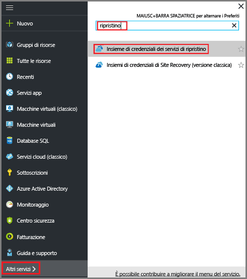  

    Se presenti nella sottoscrizione, gli insiemi di credenziali dei servizi di ripristino vengono elencati.
3. Scegliere **Aggiungi** dal menu **Insiemi di credenziali dei servizi di ripristino**.

    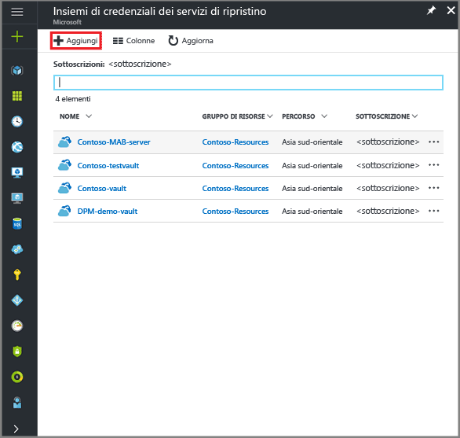

    Verrà visualizzato il pannello degli insiemi di credenziali dei servizi di ripristino, in cui viene richiesto di specificare **Nome**, **Sottoscrizione**, **Gruppo di risorse** e **Località**.

    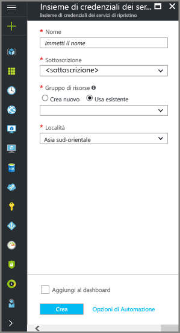

4. Nel campo **Nome**digitare un nome descrittivo per identificare l'insieme di credenziali. Il nome deve essere univoco per la sottoscrizione di Azure. Digitare un nome che contenga tra i 2 e i 50 caratteri. Deve iniziare con una lettera e può contenere solo lettere, numeri e trattini.

5. Nella sezione **Sottoscrizione** usare il menu a discesa per scegliere la sottoscrizione di Azure. Se si usa una sola sottoscrizione, questa verrà visualizzata e sarà possibile andare al passaggio successivo. Se non si è certi di quale sottoscrizione usare, usare la sottoscrizione predefinita (o suggerita). Sono disponibili più scelte solo se l'account dell'organizzazione è associato a più sottoscrizioni di Azure.

6. Nella sezione **Gruppo di risorse**:

    * Selezionare **Crea nuovo** per creare un nuovo gruppo di risorse.
    Or
    * Selezionare **Usa esistente** e fare clic sul menu a discesa per visualizzare l'elenco di gruppi di risorse disponibili.

  Per informazioni complete sui gruppi di risorse, vedere [Panoramica di Azure Resource Manager](../azure-resource-manager/resource-group-overview.md).

7. Fare clic su **Località** per selezionare l'area geografica per l'insieme di credenziali. La scelta determina l'area geografica in cui vengono inviati i dati di backup.
8. Nella parte inferiore del pannello Insieme di credenziali dei servizi di ripristino fare clic su **Crea**.

    La creazione dell'insieme di credenziali dei servizi di ripristino può richiedere alcuni minuti. Monitorare le notifiche di stato nell'area superiore destra del portale. L'insieme di credenziali, dopo essere stato creato, viene visualizzato negli insiemi di credenziali di Servizi di ripristino. Se l'insieme di credenziali non viene visualizzato dopo qualche minuto, fare clic su **Aggiorna**.

    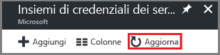 

    Dopo la visualizzazione dell'insieme di credenziali nell'elenco corrispondente per i Servizi di ripristino, è possibile configurare la ridondanza di archiviazione.

### Impostare la ridondanza di archiviazione dell'insieme di credenziali
Quando si crea un insieme di credenziali dei Servizi di ripristino, assicurarsi che la ridondanza di archiviazione sia configurata in base alle proprie esigenze.

1. Nel pannello **Insieme di credenziali dei servizi di ripristino** fare clic sul nuovo insieme di credenziali.

    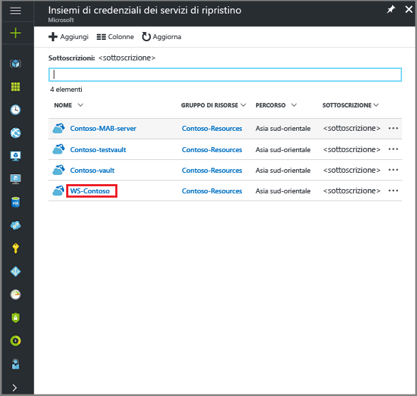

    Quando si seleziona l'insieme di credenziali, il pannello **Insieme di credenziali dei servizi di ripristino** si restringe e vengono aperti il pannello Impostazioni,*con il nome dell'insieme di credenziali nella parte superiore*, e il pannello dei dettagli dell'insieme di credenziali.

    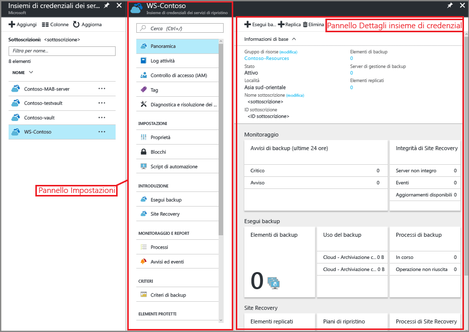
2. Nel pannello Impostazioni del nuovo insieme di credenziali usare il dispositivo di scorrimento verticale per passare alla sezione Gestisci e fare clic su **Infrastruttura di backup**.
    Verrà visualizzato il pannello Infrastruttura di backup.
3. Nel pannello Infrastruttura di backup fare clic su **Configurazione backup** per aprire il pannello **Configurazione backup**.

    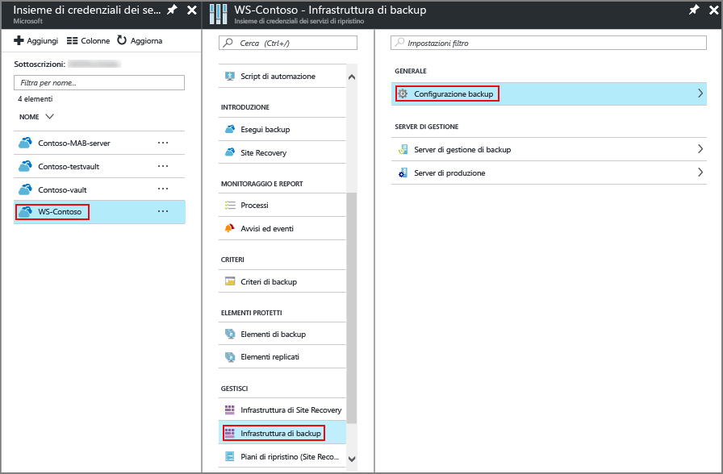
4. Scegliere l'opzione di replica di archiviazione appropriata per l'insieme di credenziali.

    

    Per impostazione predefinita, l'insieme di credenziali prevede l'archiviazione con ridondanza geografica. Se si usa Azure come endpoint di archiviazione di backup primario, continuare a usare l'opzione **Con ridondanza geografica**. Se non si usa Azure come endpoint di archiviazione di backup primario, scegliere l'opzione **Con ridondanza locale**, che riduce i costi di archiviazione di Azure. Per altre informazioni sulle opzioni di archiviazione [con ridondanza geografica](../storage/storage-redundancy.md#geo-redundant-storage) e [con ridondanza locale](../storage/storage-redundancy.md#locally-redundant-storage), vedere [Panoramica della ridondanza di archiviazione](../storage/storage-redundancy.md).

Dopo aver creato un insieme di credenziali, configurarlo per il backup di file e cartelle.

## Configurare l'insieme di credenziali
1. Nel pannello dell'insieme di credenziali dei servizi di ripristino appena creato, nella sezione Attività iniziali fare clic su **Backup** e nel pannello **Introduzione al backup** selezionare **Obiettivo del backup**.

    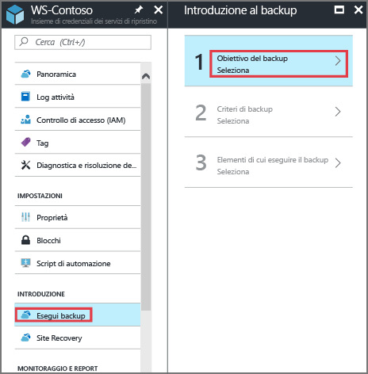

    Verrà visualizzato il pannello **Obiettivo del backup**.

    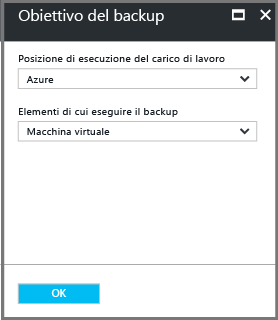

2. Scegliere **Locale** dal menu a discesa **Posizione di esecuzione del carico di lavoro**.

    Si sceglie **Locale** perché il server di Windows o il computer Windows è un computer fisico che non si trova in Azure.

3. Scegliere **File e cartelle** dal menu **Elementi di cui eseguire il backup**, quindi fare clic su **OK**.

    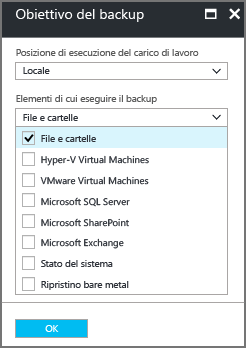

    Dopo aver fatto clic su OK verrà visualizzato un segno di spunta accanto a **Obiettivo del backup** e si aprirà il pannello **Preparare l'infrastruttura**.

    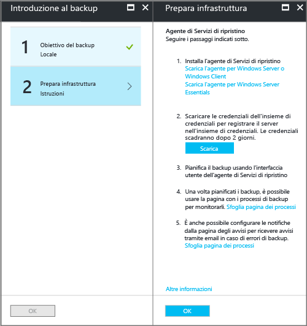

4. Nel pannello **Preparare l'infrastruttura** fare clic su **Scaricare l'agente per Windows Server o Windows Client**.

    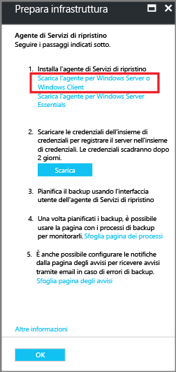

    Se si usa Windows Server Essentials, scegliere di scaricare l'agente per Windows Server Essentials. Un menu a comparsa chiederà di eseguire o salvare MARSAgentInstaller.exe.

    

5. Fare clic su **Salva** nel menu a comparsa del download.

    Per impostazione predefinita, il file **MARSagentinstaller.exe** viene salvato nella cartella Downloads. Al termine del programma di installazione verrà visualizzato un messaggio popup che chiede se eseguire il programma di installazione o aprire la cartella.

    

    Non è ancora necessario installare l'agente. È possibile installare l'agente al termine del download delle credenziali dell'insieme di credenziali.

6. Fare clic su **Scarica** nel pannello **Preparare l'infrastruttura**.

    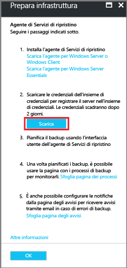

    Le credenziali dell'insieme di credenziali verranno scaricate nella cartella Download locale. Al termine del download delle credenziali dell'insieme di credenziali verrà visualizzato un messaggio popup che chiede se aprire o salvare le credenziali. Fare clic su **Save**. Se si fa clic accidentalmente su **Apri**, attendere che il tentativo di apertura delle credenziali termini con un errore. Non è possibile aprire le credenziali dell'insieme di credenziali. Procedere con il passaggio successivo. Le credenziali dell'insieme di credenziali si trovano nella cartella Downloads.   

    

## Installare e registrare l'agente

> [!NOTE]
> L'abilitazione del backup tramite il portale di Azure non è ancora disponibile. Usare l'agente di Servizi di ripristino di Microsoft Azure per eseguire il backup di file e cartelle.
>

1. Cercare e fare doppio clic sul file **MARSagentinstaller.exe** nella cartella Downloads o nella cartella in cui è stato salvato.

    Il programma di installazione visualizzerà una serie di messaggi durante l'estrazione, l'installazione e la registrazione dell'agente di Servizi di ripristino.

    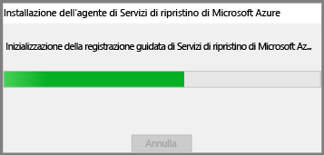

2. Completare l'Installazione guidata di Agente servizi di ripristino di Microsoft Azure. Per completare la procedura guidata, è necessario:

   * Scegliere un percorso per la cartella di installazione e della cache.
   * Fornire le informazioni sul server proxy se si usa un server proxy per connettersi a Internet.
   * Se si usa un proxy autenticato, immettere il nome utente e la password.
   * Fornire le credenziali dell'insieme di credenziali scaricate.
   * Salvare la passphrase di crittografia in un luogo sicuro.

     > [!NOTE]
     > Se la passphrase viene persa o dimenticata, Microsoft non potrà offrire assistenza per il recupero dei dati di backup. Salvare il file in una posizione sicura. È necessario per ripristinare un backup.
     >
     >

L'agente ora è installato e il computer è registrato nell'insieme di credenziali. Ora è possibile configurare e pianificare il backup.

## Eseguire il backup di file e cartelle
Il backup iniziale comprende due attività fondamentali:

* Pianificare il backup
* Eseguire il backup di file e cartelle per la prima volta

Per completare il backup iniziale, usare l'agente di Servizi di ripristino di Microsoft Azure.

### Per pianificare il processo di backup
1. Aprire l'agente di Servizi di ripristino di Microsoft Azure. È possibile trovarlo se si cerca **Backup di Microsoft Azure**nel computer.

    
2. Nell'agente di Servizi di ripristino fare clic su **Pianifica backup**.

    
3. Nella pagina Guida introduttiva della Pianificazione guidata backup fare clic su **Avanti**.
4. Nella pagina Seleziona elementi per backup fare clic su **Aggiungi elementi**.
5. Selezionare i file e le cartelle di cui si vuole eseguire il backup e fare clic su **OK**.
6. Fare clic su **Avanti**.
7. Nella pagina **Specificare la pianificazione del backup** specificare la **pianificazione del backup** e fare clic su **Avanti**.

    È possibile pianificare backup giornalieri, da eseguire non più di tre volte al giorno, o settimanali.

    

   > [!NOTE]
   > Per altre informazioni su come specificare la pianificazione del backup vedere l'articolo [Usare Backup di Azure per sostituire l'infrastruttura basata su nastro](backup-azure-backup-cloud-as-tape.md).
   >

8. Nella pagina **Seleziona criteri di conservazione** selezionare i **criteri di conservazione** per la copia di backup.

    I criteri di conservazione specificano la durata dell'archiviazione dei dati di backup. Anziché specificare un "criterio semplice" per tutti i punti di backup, è possibile specificare criteri di conservazione diversi in base al momento in cui viene eseguito il backup. È possibile modificare i criteri di conservazione giornalieri, settimanali, mensili e annuali in base alle proprie esigenze.
9. Nella pagina Scegliere il tipo di backup iniziale selezionare il tipo di backup iniziale. Lasciare selezionata l'opzione **Automaticamente tramite la rete** e fare clic su **Avanti**.

    È possibile eseguire il backup automaticamente in rete oppure offline. Il resto di questo articolo descrive il processo di backup automatico. Se si preferisce eseguire un backup offline, vedere l'articolo [Flusso di lavoro di backup offline in Backup di Azure](backup-azure-backup-import-export.md) per altre informazioni.
10. Nella pagina Conferma esaminare le informazioni e fare clic su **Fine**.
11. Dopo aver creato la pianificazione del backup tramite la procedura guidata, fare clic su **Chiudi**.

### Per eseguire il backup di file e cartelle per la prima volta
1. Nell'agente di Servizi di ripristino fare clic su **Esegui backup** per completare il seeding iniziale sulla rete.

    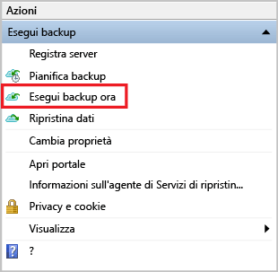
2. Nella pagina Conferma riesaminare le impostazioni che l'Esecuzione guidata backup userà per il backup del computer. Fare clic su **Backup**.
3. Fare clic su **Chiudi** per chiudere la procedura guidata. Se si chiude la procedura guidata prima che venga completato il processo di backup, l'esecuzione guidata proseguirà in background.

Al termine del backup iniziale, nella console Backup comparirà lo stato **Processo completato** .

## Domande?
In caso di domande o se si vuole che venga inclusa una funzionalità, è possibile [inviare commenti e suggerimenti](http://aka.ms/azurebackup_feedback).

## Passaggi successivi
* Sono disponibili altre informazioni sul [backup di computer Windows](backup-configure-vault.md).
* Ora che si è eseguito il backup dei file e delle cartelle, è possibile [gestire l'insieme di credenziali e i server](backup-azure-manage-windows-server.md).
* Se è necessario ripristinare un backup, usare questo articolo per [ripristinare i file in un computer Windows](backup-azure-restore-windows-server.md).

<!--HONumber=Feb17_HO2-->

