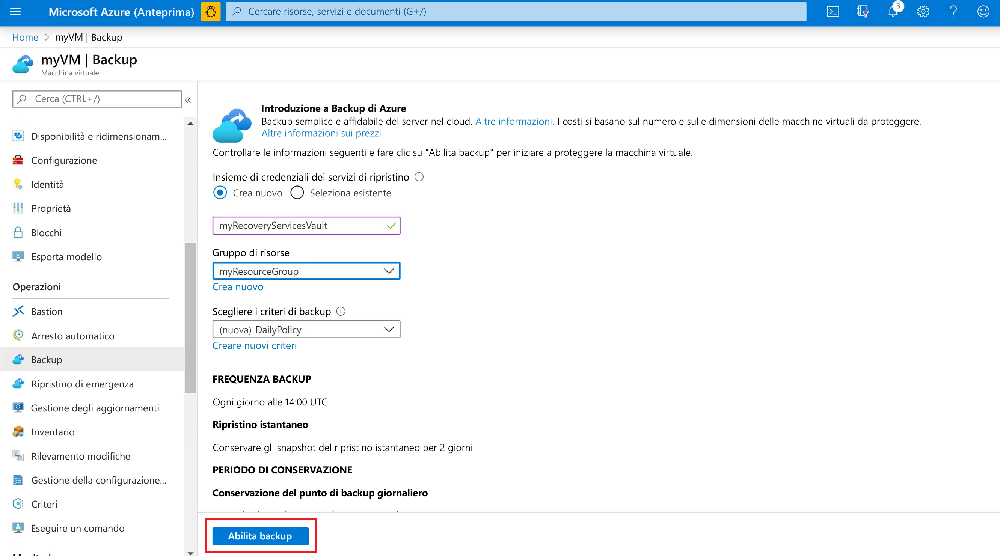
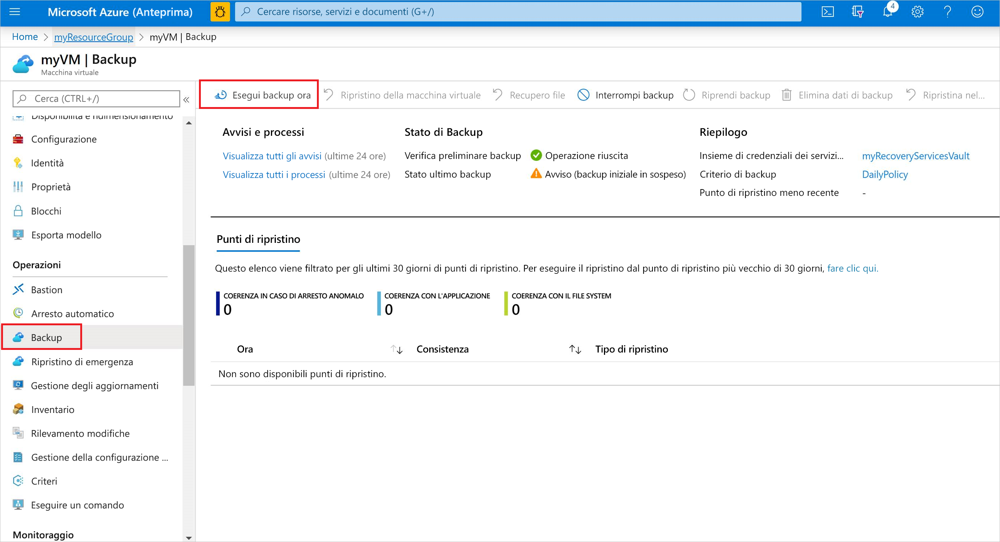
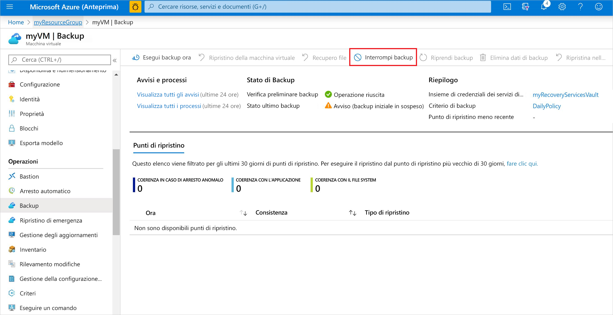

# Eseguire il backup di una macchina virtuale in Azure
È possibile creare backup di Azure tramite il portale di Azure. Questo metodo offre un'interfaccia utente basata su browser per la creazione e la configurazione dei backup di Azure e di tutte le risorse correlate. È possibile proteggere i dati eseguendo backup a intervalli regolari. Backup di Azure crea punti di ripristino che possono essere archiviati in insiemi di credenziali di ripristino con ridondanza geografica. Questo articolo illustra in modo dettagliato come eseguire il backup di una macchina virtuale (VM) con il portale di Azure. 

Questa guida introduttiva abilita il backup in una VM di Azure esistente. Se necessario, è possibile [creare una VM con il portale di Azure](../virtual-machines/windows/quick-create-portal.md).

## Accedere ad Azure

Accedere al portale di Azure all'indirizzo http://portal.azure.com.

## Selezionare una VM di cui eseguire il backup
Creare un semplice backup giornaliero pianificato per un insieme di credenziali di Servizi di ripristino. 

1. Nel menu a sinistra selezionare **Macchine virtuali**. 
2. Nell'elenco selezionare una VM di cui eseguire il backup. Se sono stati usati i comandi di esempio della guida introduttiva per le VM, la VM è denominata *myVM* ed è inclusa nel gruppo di risorse *myResourceGroup*.
3. Nella sezione **Operazioni** scegliere **Backup**. Verrà visualizzata la finestra **Abilita backup**.

## Abilitare il backup per una VM
Un insieme di credenziali dei servizi di ripristino è un contenitore logico in cui vengono archiviati i dati di backup per ogni risorsa protetta, ad esempio per le VM di Azure. Quando viene eseguito, il processo di backup per una risorsa protetta crea un punto di ripristino all'interno dell'insieme di credenziali dei servizi di ripristino. È quindi possibile usare uno di questi punti di ripristino per ripristinare i dati a un dato momento.

1. Selezionare **Crea nuovo** e specificare un nome per il nuovo insieme di credenziali, ad esempio *myRecoveryServicesVault*.
2. Se l'opzione non è già selezionata, selezionare **Usa esistente** e quindi scegliere il gruppo di risorse della VM dal menu a discesa.

    

    Per impostazione predefinita, l'insieme di credenziali è impostato per l'archiviazione con ridondanza geografica. Questo livello di ridondanza dell'archiviazione garantisce la replica dei dati di backup in un'area di Azure secondaria distante centinaia di chilometri dall'area primaria, per una maggiore protezione dei dati.

    Per definire quando verrà eseguito un processo di backup e per quanto tempo verranno archiviati i punti di ripristino, si creano e si usano criteri. I criteri di protezione predefiniti eseguono un processo di backup ogni giorno e conservano i punti di ripristino per 30 giorni. È possibile usare questi valori dei criteri predefiniti per proteggere rapidamente la VM. 

3. Per accettare i valori dei criteri di backup predefiniti, selezionare **Abilita backup**.

La creazione dell'insieme di credenziali di Servizi di ripristino richiede alcuni minuti.

## Avviare un processo di backup
È possibile avviare subito un backup anziché attendere che il processo venga eseguito dai criteri predefiniti all'ora pianificata. Il primo processo di backup crea un punto di ripristino completo. Tutti i processi di backup successivi a questo backup iniziale creano punti di ripristino incrementali. I punti di ripristino incrementali sono veloci ed efficienti in termini di archiviazione, perché trasferiscono solo le modifiche eseguite dopo l'ultimo backup.

1. Nella finestra **Backup** della VM selezionare **Esegui backup ora**.

    

2. Per accettare il criterio di conservazione dei backup di 30 giorni, lasciare la data predefinita in **Conserva backup fino a**. Per avviare il processo, selezionare **Backup**.

## Monitorare il processo di backup
Nella finestra **Backup** della VM vengono visualizzati lo stato del backup e il numero di punti di ripristino completati. Al termine del processo di backup della VM, sul lato destro della finestra **Panoramica** vengono visualizzate le informazioni relative a **Ora ultimo backup**, **Punto di ripristino più recente** e **Punto di ripristino meno recente**.

## Pulire la distribuzione
Quando non è più necessaria, è possibile disabilitare la protezione per la VM, rimuovere i punti di ripristino e l'insieme di credenziali dei servizi di ripristino e quindi eliminare il gruppo di risorse e le risorse della VM associate.

Se si intende proseguire con l'esercitazione relativa al backup che illustra come ripristinare i dati per la VM, ignorare i passaggi in questa sezione e andare a [Passaggi successivi](#next-steps).

1. Selezionare l'opzione **Backup** per la VM.

2. Selezionare **Altro** per visualizzare opzioni aggiuntive e quindi scegliere **Interrompi backup**.

    

3. Scegliere **Elimina dati di backup** dal menu a discesa.

4. Nella finestra di dialogo **Digitare il nome dell'elemento di backup** immettere il nome della VM, ad esempio *myVM*. Selezionare **Interrompi backup**.

    Dopo l'interruzione del backup della VM e la rimozione dei punti di ripristino, è possibile eliminare il gruppo di risorse. Se è stata usata una VM esistente, potrebbe essere utile mantenere il gruppo di risorse e la VM.

5. Nel menu a sinistra selezionare **Gruppi di risorse**. 
6. Selezionare il gruppo di risorse nell'elenco. Se sono stati usati i comandi di esempio della guida introduttiva per le VM, il gruppo di risorse è denominato *myResourceGroup*.
7. Selezionare **Elimina gruppo di risorse**. Per confermare, immettere il nome del gruppo di risorse e quindi selezionare **Elimina**.

    

## Passaggi successivi
In questa guida introduttiva è stato creato un insieme di credenziali di Servizi di ripristino, è stata abilitata la protezione per una VM ed è stato creato il punto di ripristino iniziale. Per altre informazioni su Backup e Servizi di ripristino di Azure, proseguire con le esercitazioni.

> [!div class="nextstepaction"]
> [Eseguire il backup di più macchine virtuali di Azure](./tutorial-backup-vm-at-scale.md)
