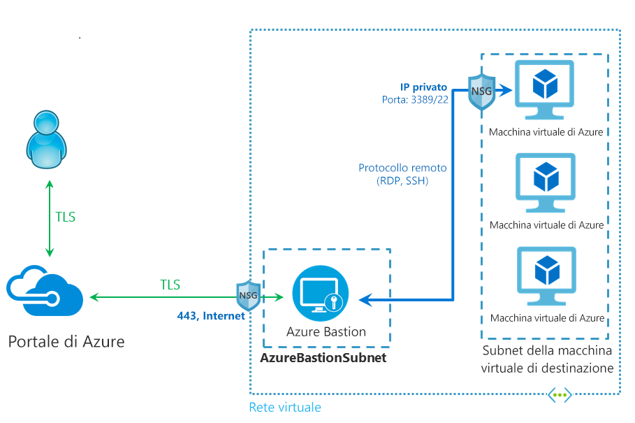

# Che cos'è Azure Bastion?

Azure Bastion è un nuovo servizio PaaS completamente gestito dalla piattaforma di cui è possibile eseguire il provisioning all'interno della rete virtuale. Offre connettività RDP/SSH sicura e ininterrotta con le macchine virtuali direttamente nel portale di Azure tramite SSL. Quando ci si connette tramite Azure Bastion, per le macchine virtuali non è necessario un indirizzo IP pubblico.

 Bastion offre connettività RDP e SSH sicura per tutte le macchine virtuali nella rete virtuale in cui viene effettuato il provisioning del servizio. L'uso di Azure Bastion consente di proteggere le macchine virtuali dall'esposizione delle porte RDP/SSH all'esterno, offrendo al tempo stesso l'accesso sicuro tramite RDP/SSH. Con Azure Bastion ci si connette alla macchina virtuale direttamente dal portale di Azure. Non è necessario un client, un agente o software aggiuntivo.

## Architettura

Azure Bastion viene distribuito nella rete virtuale e, dopo la distribuzione, rende disponibile l'esperienza RDP/SSH sicura per tutte le macchine virtuali nella rete virtuale. Dopo aver effettuato il provisioning del servizio Azure Bastion nella rete virtuale, l'esperienza RDP/SSH è disponibile per tutte le macchine virtuali all'interno della stessa rete virtuale. La distribuzione viene effettuata per rete virtuale e non per sottoscrizione/account o macchina virtuale.

RDP e SSH sono alcuni dei mezzi fondamentali tramite i quali è possibile connettersi ai carichi di lavoro in esecuzione in Azure. L'esposizione delle porte RDP/SSH su Internet non è consigliabile e viene considerata una superficie di rischio significativa, spesso a causa di vulnerabilità del protocollo. Per contenere l'esposizione agli attacchi, è possibile distribuire bastion host (noti anche come jump server) sul lato pubblico della rete perimetrale. I server bastion host sono progettati e configurati per resistere agli attacchi. I server bastion offrono anche la connettività RDP e SSH per i carichi di lavoro dietro il bastion, nonché all'interno della rete.

Questa figura illustra l'architettura di una distribuzione di Azure Bastion. In questo diagramma:

* Il bastion host viene distribuito nella rete virtuale.
* L'utente si connette al portale di Azure tramite qualsiasi browser HTML5.
* L'utente seleziona la macchina virtuale a cui connettersi.
* Con un solo clic, la sessione RDP/SSH viene aperta nel browser.
* Non è richiesto alcun indirizzo IP pubblico nella macchina virtuale di Azure.

## Funzionalità principali

Sono disponibili le funzionalità seguenti:

* **RDP e SSH direttamente nel portale di Azure:** è possibile accedere direttamente alla sessione RDP e SSH nel portale di Azure con una semplice esperienza con singolo clic.
* **Sessione remota su SSL e attraversamento del firewall per RDP/SSH:** Azure Bastion usa un client Web basato su HTML5 trasmesso automaticamente al dispositivo locale, in modo da poter accedere alla sessione RDP/SSH su SSL sulla porta 443, con attraversamento sicuro dei firewall aziendali.
* **Nessun indirizzo IP pubblico richiesto nella macchina virtuale di Azure:** Azure Bastion apre la connessione RDP/SSH alla macchina virtuale di Azure usando l'indirizzo IP privato nella macchina virtuale. Non è necessario un indirizzo IP pubblico nella macchina virtuale.
* **Non occorre gestire gruppi di sicurezza di rete:** Azure Bastion è un servizio PaaS completamente gestito dalla piattaforma di Azure con protezione avanzata internamente per offrire connettività RDP/SSH sicura. Non è necessario applicare alcun gruppo di sicurezza di rete nella subnet di Azure Bastion. Dato che Azure Bastion si connette alle macchine virtuali tramite un indirizzo IP privato, è possibile configurare i gruppi di sicurezza di rete per consentire la connettività RDP/SSH solo da Azure Bastion. In questo modo non è più necessario gestire gruppi di sicurezza di rete ogni volta che occorre connettersi in modo sicuro alle macchine virtuali.
* **Protezione dall'analisi delle porte:** non essendo necessario esporle alla rete Internet pubblica, le macchine virtuali sono protette dall'analisi delle porte eseguita da utenti non autorizzati e malintenzionati all'esterno della rete virtuale.
* **Protezione da exploit zero-day. Protezione avanzata in un'unica posizione:** Azure Bastion è un servizio PaaS completamente gestito dalla piattaforma. Essendo collocato sul perimetro della rete virtuale, non è necessario preoccuparsi della protezione avanzata di ognuna delle macchine virtuali nella rete virtuale. La piattaforma Azure protegge dagli exploit zero-day gestendo automaticamente la protezione avanzata di Azure Bastion e mantenendo sempre aggiornato il servizio.

## Domande frequenti

[!INCLUDE [Bastion FAQ](../../includes/bastion-faq-include.md)]

## Passaggi successivi

* [Creare una risorsa host di Azure Bastion](bastion-create-host-portal.md).
* Informazioni su alcune altre [funzionalità di rete](../networking/networking-overview.md) chiave di Azure.
