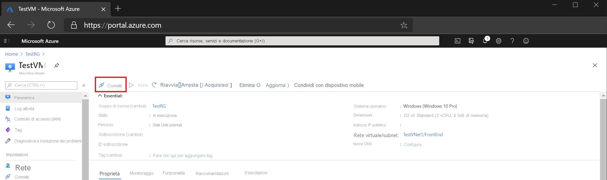

# Guida introduttiva: connettersi a una macchina virtuale usando un indirizzo IP privato e Azure Bastion

Questo articolo introduttivo illustra come connettersi a una macchina virtuale usando un indirizzo IP privato. Quando ci si connette tramite Bastion, le macchine virtuali non necessitano di un indirizzo IP pubblico. I passaggi descritti in questo articolo consentono di distribuire Bastion alla rete virtuale tramite la macchina virtuale nel portale. Una volta eseguito il provisioning del servizio, l'esperienza RDP/SSH è disponibile per tutte le macchine virtuali nella stessa rete virtuale.

## Prerequisiti

* Una rete virtuale di Azure.
* Una macchina virtuale di Azure che si trova nella rete virtuale con la porta 3389 aperta.

### Valori di esempio

|**Nome** | **Valore** |
| --- | --- |
| Name |  VNet1Bastion |
| Region | eastus |
| Rete virtuale |  VNet1 |
| + Nome subnet | AzureBastionSubnet |
| Indirizzi AzureBastionSubnet |  10.1.254.0/27 |
| Indirizzo IP pubblico |  Creare un nuovo gruppo di risorse |
| Nome dell'indirizzo IP pubblico | VNet1BastionPIP  |
| SKU indirizzo IP pubblico |  Standard  |
| Assegnazione  | Statico |

## Creare un host Bastion

Quando si crea un host Bastion nel portale usando una macchina virtuale esistente, per impostazione predefinita le varie impostazioni corrispondono automaticamente alla macchina virtuale e/o alla rete virtuale.

1. Aprire il [portale di Azure](https://portal.azure.com). Passare alla macchina virtuale e quindi fare clic su **Connetti**.

   
1. Nell'elenco a discesa selezionare **Bastion**.
1. Nella pagina Connetti selezionare **use Bastion**.

   

1. Nella pagina Bastion compilare i campi delle impostazioni seguenti:

   * **Nome**: assegnare un nome all'host Bastion
   * **Subnet**: la subnet all'interno della rete virtuale in cui verrà distribuita la risorsa Bastion. La subnet deve essere creata con il nome **AzureBastionSubnet**. Il nome consente ad Azure di individuare la subnet in cui distribuire la risorsa Bastion. Questa operazione è diversa rispetto a una subnet del gateway. Usare una subnet di almeno/27 o più grande (/27,/26,/25 e così via).
   
      * Selezionare **Gestisci configurazione subnet**, quindi selezionare **+ Subnet**.
      * Nella pagina Aggiungi subnet digitare **AzureBastionSubnet**.
      * Specificare l'intervallo di indirizzi nella notazione CIDR. Ad esempio, 10.1.254.0/27.
      * Selezionare **OK** per creare la subnet. Nella parte superiore della pagina tornare a Bastion per completare le altre impostazioni.

         
   * **Indirizzo IP pubblico**: si tratta dell'indirizzo IP pubblico della risorsa Bastion a cui si accederà RDP/SSH (sulla porta 443). Creare un nuovo indirizzo IP pubblico o utilizzarne uno esistente. L'indirizzo IP pubblico deve trovarsi nella stessa area della risorsa Bastion che si sta creando.
   * **Nome dell'indirizzo IP pubblico**: il nome della risorsa indirizzo IP pubblico.
1. Nella schermata convalida fare clic su **Crea**. Attendere circa 5 minuti per la creazione e la distribuzione della risorsa Bastion.

   

## Connessione

Dopo che Bastion è stato distribuito nella rete virtuale, la schermata viene modificata nella pagina Connect.

1. Digitare il nome utente e la password per la macchina virtuale. Selezionare **Connect** (Connetti).

   
1. La connessione RDP a questa macchina virtuale tramite Bastion verrà aperta direttamente nella portale di Azure (su HTML5) usando la porta 443 e il servizio Bastion.

   

## Pulizia delle risorse

Al termine dell'uso della rete virtuale e delle macchine virtuali, eliminare il gruppo di risorse e tutte le risorse in esso contenute:

1. Immettere *TestRG1* nella casella di **ricerca** nella parte superiore del portale e selezionare **TestRG1** nei risultati della ricerca.

2. Selezionare **Elimina gruppo di risorse**.

3. Immettere *TestRG1* per **digitare il nome del gruppo di risorse** e selezionare **Elimina**.

## Passaggi successivi

In questa Guida introduttiva è stato creato un host Bastion per la rete virtuale e quindi si è connessi a una macchina virtuale in modo sicuro tramite l'host Bastion.

* Per altre informazioni su Azure Bastion, vedere [Panoramica Bastion](bastion-overview.md) e [domande frequenti su Bastion](bastion-faq.md).
* Per usare i gruppi di sicurezza di rete con la subnet di Azure Bastion, vedere usare [gruppi](bastion-nsg.md).
* Per istruzioni che contengono spiegazioni delle impostazioni dell'host Bastion di Azure, vedere l' [esercitazione](bastion-create-host-portal.md).
* Per connettersi a un set di scalabilità di macchine virtuali, vedere [connettersi a un set di scalabilità di macchine virtuali con Azure Bastion](bastion-connect-vm-scale-set.md).