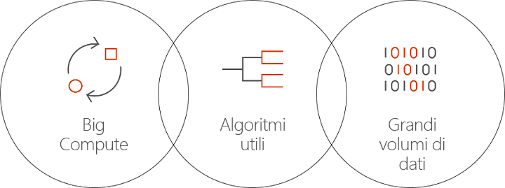

# Informazioni su Batch per intelligenza artificiale in Azure
Batch per intelligenza artificiale è un servizio gestito che consente ai data scientist e ai ricercatori in ambito di intelligenza artificiale di eseguire il training dell'intelligenza artificiale e di altri modelli di apprendimento automatico in cluster di macchine virtuali di Azure, incluse le VM senza supporto GPU. È sufficiente descrivere i requisiti del processo, dove trovare gli input e archiviare gli output. Tutto il resto viene gestito da Batch per intelligenza artificiale.  
 
## Perché usare Batch per intelligenza artificiale 
Lo sviluppo di algoritmi di intelligenza artificiale avanzati è un processo a elevato utilizzo di calcolo e iterativo. I data scientist e i ricercatori in ambito di intelligenza artificiale usano set di dati sempre più grandi. Sviluppano modelli con più livelli e per questo cresce la sperimentazione sulla struttura di rete con l'ottimizzazione di iperparametri. Per farlo in modo efficiente, sono necessarie più CPU o GPU per modello e si devono eseguire esperimenti in parallelo e disporre di spazio di archiviazione condiviso per dati di training, log e output dei modelli.   
 

I data scientist e i ricercatori in ambito di intelligenza artificiale sono esperti nei rispettivi campi, ma la gestione dell'infrastruttura su vasta scala può essere d'ostacolo. Lo sviluppo dell'intelligenza artificiale su vasta scala richiede più attività di infrastruttura: provisioning di cluster di VM, installazione di software e contenitori, accodamento di operazioni, assegnazione della priorità e pianificazione dei processi, gestione dei guasti, distribuzione dei dati, condivisione dei risultati, ridimensionamento delle risorse per gestire i costi e integrazione con strumenti e flussi di lavoro. Batch per intelligenza artificiale gestisce queste attività. 
 
## Informazioni su Batch per intelligenza artificiale 

Batch per intelligenza artificiale offre soluzioni di gestione delle risorse e pianificazione dei processi specializzate per il training e il test dell'intelligenza artificiale. Le funzionalità chiave includono: 

* Esecuzione di processi batch di lunga durata, sperimentazione iterativa e training interattivo 
* Ridimensionamento automatico o manuale di cluster di VM con GPU o CPU 
* Configurazione della comunicazione SSH tra le VM e per l'accesso remoto 
* Supporto per qualsiasi framework di apprendimento avanzato o apprendimento automatico, con configurazione ottimizzata per i toolkit più diffusi, ad esempio [Microsoft Cognitive Toolkit](https://github.com/Microsoft/CNTK) (CNTK), [TensorFlow](https://www.tensorflow.org/) e [Chainer](https://chainer.org/) 
* Coda di processi basata sulla priorità per condividere i cluster e sfruttare le VM con priorità bassa e le istanze riservate  
* Opzioni di archiviazione flessibili, inclusi File di Azure e un server NFS gestito 
* Montaggio di condivisioni file remote nella VM e contenitore facoltativo 
* Indicazione dello stato del processo e riavvio in caso di errori delle VM 
* Accesso a log di output, stdout, stderr e modelli, incluso il flusso da Archiviazione di Azure 
* [Interfaccia della riga di comando](/cli/azure) di Azure, SDK per [Python](https://github.com/Azure/azure-sdk-for-python), [C#](https://www.nuget.org/packages/Microsoft.Azure.Management.BatchAI/1.0.0-preview) e Java, monitoraggio nel portale di Azure e integrazione con gli strumenti per intelligenza artificiale Microsoft 

Batch AI SDK supporta la scrittura di script o applicazioni per la gestione del training delle pipeline e l'integrazione con gli strumenti. L'SDK fornisce attualmente Python, C#, Java e le API REST.  
 

Batch per intelligenza artificiale usa Azure Resource Manager per le operazioni del piano di controllo (creazione, elenco, acquisizione, eliminazione). Azure Active Directory viene usato per l'autenticazione e il controllo degli accessi in base al ruolo.  
 
## Come usare Batch per intelligenza artificiale 

Per usare Batch per intelligenza artificiale, si definiscono e gestiscono *cluster* e *processi*. 

 
I **cluster** descrivono i requisiti di calcolo: 
* Area di Azure scelta per l'esecuzione 
* Famiglia e dimensioni della VM da usare, ad esempio una VM NC24, che contiene 4 GPU NVIDIA K80 
* Numero di VM o numero minimo e massimo per la scalabilità automatica 
* Immagine della VM, ad esempio Ubuntu 16.04 LTS o [Microsoft Deep Learning Virtual Machine](https://azuremarketplace.microsoft.com/marketplace/apps/microsoft-ads.dsvm-deep-learning)
* Eventuali volumi di condivisioni di file remoti da montare, ad esempio da File di Azure o da un server NFS gestito da Batch per intelligenza artificiale 
* Nome utente e password o chiave SSH da configurare nelle VM per abilitare l'accesso interattivo per il debug  
 

I **processi** descrivono: 
* Il cluster e l'area da usare 
* Numero di VM per il processo 
* Directory di input e di output da passare al processo durante l'avvio. Viene in genere usato il file system condiviso montato durante la configurazione del cluster 
* Contenitore facoltativo per eseguire il software o lo script di installazione 
* Configurazione specifica del framework di intelligenza artificiale o riga di comando e parametri per avviare il processo 
 

Iniziare a usare Batch per intelligenza artificiale con l'[interfaccia della riga di comando di Azure](/cli/azure) e i file di configurazione per cluster e processi. Usare questo approccio per creare rapidamente il cluster quando è necessario ed eseguire i processi per provare a usare la struttura di rete o gli iperparametri.  
 

Batch per intelligenza artificiale consente di lavorare facilmente in parallelo con più GPU. Quando è necessario distribuire i processi in più GPU, Batch per intelligenza artificiale configura la connettività di rete protetta tra le VM. Quando viene usato InfiniBand, Batch per intelligenza artificiale configura i driver e avvia MPI nei nodi di un processo.  

## Gestione dei dati
Batch per intelligenza artificiale fornisce opzioni flessibili per script, dati e output di training:
  
* Usare il **disco locale** per la sperimentazione iniziale e i set di dati più piccoli. Per questo scenario potrebbe essere necessario connettersi alla macchina virtuale tramite SSH per modificare gli script e leggere i log. 

* Usare **File di Azure** per condividere i dati di training tra più processi e archiviare i log di output e i modelli in un'unica posizione 

* Configurare un **server NFS** per supportare una maggior quantità di dati e VM per il training. Batch per intelligenza artificiale può configurare automaticamente un server NFS come tipo di cluster speciale con i dischi supportati in Archiviazione di Azure. 
 
* Un **file system parallelo** offre ulteriore scalabilità per i dati e il training parallelo. Azure Batch per intelligenza artificiale non gestisce i file system paralleli, ma sono disponibili modelli di distribuzione di esempio per Lustre, Gluster e BeeGFS.  

## Passaggi successivi

* Iniziare a creare il primo processo di training di Batch per intelligenza artificiale usando l'[interfaccia della riga di comando di Azure](quickstart-cli.md) o [Python](quickstart-python.md).
* Vedere i [recipe di training](https://github.com/Azure/BatchAI) di esempio per i diversi framework.

