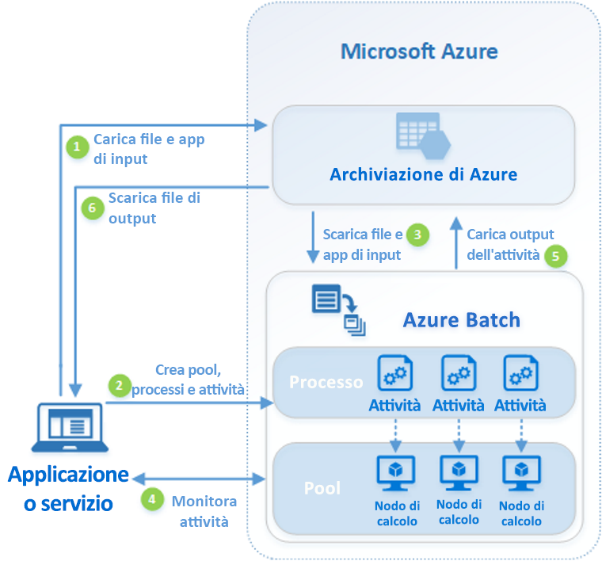

# Informazioni su Azure Batch

Usare Azure Batch per eseguire in modo efficiente processi batch paralleli e HPC (High Performance Computing) su larga scala in Azure. Azure Batch crea e gestisce un pool di nodi di calcolo (macchine virtuali), installa le applicazioni da eseguire e pianifica l'esecuzione dei processi nei nodi. Non è necessario installare, gestire o ridimensionare cluster o software di pianificazione dei processi. Si usano invece [API e strumenti Batch](batch-apis-tools.md), script della riga di comando o il portale di Azure per configurare, gestire e monitorare i processi. 

Gli sviluppatori possono usare Batch come un servizio di piattaforma per compilare applicazioni SaaS o app client in cui è richiesta l'esecuzione su larga scala. Creare ad esempio un servizio con Batch per eseguire una simulazione di rischio Monte Carlo per un'azienda di servizi finanziari oppure un servizio per l'elaborazione di molte immagini.

Non sono previsti costi aggiuntivi per l'uso di Batch. Si pagano solo le risorse sottostanti utilizzate, ad esempio macchine virtuali, archiviazione e rete.

Per un confronto tra Batch e altre soluzioni HPC in Azure, vedere [HPC, Batch, and Big Compute solutions](../virtual-machines/linux/high-performance-computing.md) (Soluzioni HPC, Batch e Big Compute).

## Eseguire carichi di lavoro paralleli
Batch funziona bene con carichi di lavoro intrinsecamente paralleli, a volte definiti "imbarazzantemente paralleli". I carichi di lavoro intrinsecamente paralleli sono quelli in cui le applicazioni possono essere eseguite in modo indipendente e ogni istanza completa parte del lavoro. Quando sono in esecuzione, le applicazioni possono accedere ad alcuni dati comuni, ma non comunicano con altre istanze dell'applicazione. I carichi di lavoro intrinsecamente paralleli possono essere quindi eseguiti su larga scala, a seconda della quantità di risorse di calcolo disponibili per l'esecuzione simultanea di applicazioni.

Alcuni esempi di carichi di lavoro intrinsecamente paralleli che possono essere usati in Batch sono i seguenti:

* Modellazione di rischi finanziari tramite simulazioni Monte Carlo
* Rendering di immagini VFX e 3D
* Analisi ed elaborazione di immagini
* Transcodifica multimediale
* Analisi delle sequenze genetiche
* Riconoscimento ottico dei caratteri (OCR)
* Inserimento dati, elaborazione e operazioni ETL
* Esecuzione di test del software

È inoltre possibile usare Batch per [eseguire carichi di lavoro strettamente associati](batch-mpi.md); si tratta di carichi di lavoro in cui le applicazioni in esecuzione devono comunicare tra loro, in contrapposizione all'esecuzione indipendente. Le applicazioni strettamente associate usano generalmente l'API MPI (Message Passing Interface). È possibile eseguire i carichi di lavoro strettamente associati con Batch usando [Microsoft MPI](https://msdn.microsoft.com/library/bb524831(v=vs.85).aspx) o Intel MPI. Migliorare le prestazioni delle applicazioni con dimensioni delle macchine virtuali specializzate per [HPC](../virtual-machines/linux/sizes-hpc.md) e [ottimizzate per la GPU](../virtual-machines/linux/sizes-gpu.md).

Alcuni esempi di carichi di lavoro strettamente associati sono i seguenti:
* Analisi degli elementi limitati
* Fluidodinamica
* Training di intelligenza artificiale multinodo

È possibile eseguire molti processi strettamente associati in parallelo con Batch. Ad esempio, eseguire più simulazioni di un liquido che scorre in un tubo di vari diametri.

## Altre funzionalità Batch

Per Azure Batch sono anche disponibili funzionalità di livello superiore e specifiche per i carichi di lavoro:
* Batch supporta [carichi di lavoro di rendering](batch-rendering-service.md) su larga scala con strumenti di rendering che includono Autodesk Maya, 3ds Max, Arnold e V-Ray. 
* Gli utenti di R possono installare il [pacchetto doAzureParallel R](https://github.com/Azure/doAzureParallel) per aumentare facilmente il numero di istanze di esecuzione di algoritmi R nei pool Batch.

È anche possibile eseguire processi Batch nell'ambito di un flusso di lavoro di Azure più ampio per la trasformazione dei dati, gestito da strumenti come [Azure Data Factory](../data-factory/v1/data-factory-data-processing-using-batch.md).

## Funzionamento
Uno scenario comune per Batch comporta l'aumento del numero di istanze di lavoro intrinsecamente parallelo, ad esempio nel rendering di immagini per scene 3D, in un pool di nodi di calcolo. Il pool di nodi di calcolo può essere usato come una "farm di rendering" che può fornire fino a migliaia di core per il processo di rendering.

Il diagramma seguente mostra i passaggi di un normale flusso di lavoro di Batch con un'applicazione client o un servizio ospitato che usa Batch per l'esecuzione di un carico di lavoro parallelo.

|Passaggio  |DESCRIZIONE  |
|---------|---------|
|1.  Caricare i **file di input** e le **applicazioni** per l'elaborazione dei file nell'account di archiviazione di Azure.     |I file di input possono essere tutti i dati elaborati dall'applicazione, ad esempio dati di modellazione finanziaria o file video da transcodificare. I file dell'applicazione possono includere script o applicazioni che elaborano i dati, ad esempio un transcodificatore di file multimediali.|
|2.  Creare un **pool** Batch di nodi di calcolo nell'account Batch, un **processo** per eseguire il carico di lavoro nel pool e **attività** nel processo.     | I nodi del pool sono le macchine virtuali che eseguono le attività. Specificare le proprietà, ad esempio il numero e le dimensioni dei nodi, un'immagine di macchina virtuale Windows o Linux e l'applicazione da installare quando i nodi vengono aggiunti al pool. Gestire il costo e le dimensioni del pool usando [macchine virtuali con priorità bassa](batch-low-pri-vms.md) oppure [ridimensionando automaticamente](batch-automatic-scaling.md) il numero di nodi in funzione del carico di lavoro.   Quando si aggiungono attività a un processo, il servizio Batch pianifica automaticamente le attività per l'esecuzione nei nodi di calcolo del pool. Ogni attività usa l'applicazione caricata per elaborare i file di input. |
|3.  Scaricare i **file di input** e le **applicazioni** in Batch     |Prima dell'esecuzione, l'attività può scaricare i dati di input che dovrà elaborare nel nodo di calcolo assegnato. Se l'applicazione non è già installata nei nodi del pool, è possibile scaricarla a questo punto. Al termine del download da Archiviazione di Azure, l'attività viene eseguita nel nodo assegnato.|
|4.  Monitorare l'**esecuzione delle attività**     |Durante l'esecuzione delle attività, eseguire query sul servizio Batch per monitorare lo stato del processo e le relative attività. L'applicazione o il servizio client comunica con il servizio Batch tramite HTTPS. Poiché è possibile che si monitorino migliaia di attività in esecuzione in migliaia di nodi di calcolo, assicurarsi di [effettuare una query del servizio Batch in modo efficiente](batch-efficient-list-queries.md).|
|5.  Caricare **l'output dell'attività**     |Man mano che vengono completate, le attività possono caricare i dati dei risultati in Archiviazione di Azure. È anche possibile recuperare i file direttamente dal file system in un nodo di calcolo.|
|6.  Scaricare i **file di output**     |Quando il monitoraggio rileva che sono state completate le attività nel processo, l'applicazione o il servizio client può scaricare i dati di output per l'ulteriore elaborazione.|

Tenere presente che questo è soltanto uno dei modi in cui è possibile usare Batch e che questo scenario descrive solo alcune delle sue funzionalità. È ad esempio possibile eseguire [più attività in parallelo](batch-parallel-node-tasks.md) in ogni nodo di calcolo, nonché usare [attività di preparazione e completamento di processi](batch-job-prep-release.md) per preparare i nodi per i processi e quindi eseguire la pulizia in un secondo momento. 

Vedere [Panoramica delle funzionalità di Batch per sviluppatori](batch-api-basics.md) per informazioni più dettagliate su pool, nodi, processi e attività e sulle numerose funzionalità delle API che è possibile usare durante la compilazione dell'applicazione Batch. Vedere anche gli [aggiornamenti più recenti per il servizio Batch](https://azure.microsoft.com/updates/?product=batch).

## Passaggi successivi

Iniziare a usare Azure Batch con una di queste guide introduttive:
* [Eseguire il primo processo Batch con l'interfaccia della riga di comando di Azure](quick-create-cli.md)
* [Eseguire il primo processo Batch con il portale di Azure](quick-create-portal.md)
* [Eseguire il primo processo Batch con l'API .NET](quick-run-dotnet.md)
* [Eseguire il primo processo Batch con l'API Python](quick-run-python.md)

