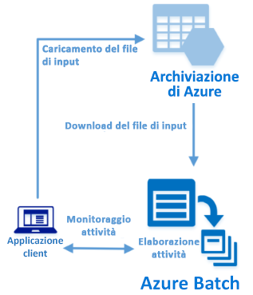

# <a name="quickstart-run-your-first-azure-batch-job-with-the-net-api"></a>Guida introduttiva: Eseguire il primo processo Azure Batch con l'API .NET

Questa guida introduttiva esegue un processo Azure Batch da un'applicazione C# compilata con l'API .NET di Azure Batch. L'applicazione carica più file di dati di input nell'archivio di Azure e quindi crea un *pool* di nodi di calcolo Batch (macchine virtuali). Crea quindi un *processo* di esempio che esegue *attività* per l'elaborazione di ogni file di input nel pool usando un comando di base. Dopo aver completato questa guida introduttiva, saranno chiari i concetti fondamentali del servizio Batch e sarà possibile provare Batch con carichi di lavoro più realistici su scala più ampia.



[!INCLUDE [quickstarts-free-trial-note.md](../../includes/quickstarts-free-trial-note.md)]

## <a name="prerequisites"></a>prerequisiti

* [IDE di Visual Studio](https://www.visualstudio.com/vs) (Visual Studio 2015 o una versione più recente). 

* Un account Batch e un account di archiviazione per utilizzo generico collegato. Per creare questi account, vedere le guide introduttive di Batch usando il [portale di Azure](quick-create-portal.md) o l'[interfaccia della riga di comando di Azure](quick-create-cli.md). 

## <a name="sign-in-to-azure"></a>Accedere ad Azure

Accedere al portale di Azure all'indirizzo [https://portal.azure.com](https://portal.azure.com).

[!INCLUDE [batch-common-credentials](../../includes/batch-common-credentials.md)]

## <a name="download-the-sample"></a>Scaricare l'esempio

[Scaricare o clonare l'app di esempio](https://github.com/Azure-Samples/batch-dotnet-quickstart) da GitHub. Per clonare il repository dell'app di esempio con un client Git, usare il comando seguente:

```
git clone https://github.com/Azure-Samples/batch-dotnet-quickstart.git
```

Passare alla directory contenente il file di soluzione Visual Studio `BatchDotNetQuickstart.sln`.

Aprire il file di soluzione in Visual Studio e aggiornare le stringhe delle credenziali in `program.cs` con i valori ottenuti per gli account. Ad esempio: 

```csharp
// Batch account credentials
private const string BatchAccountName = "mybatchaccount";
private const string BatchAccountKey  = "xxxxxxxxxxxxxxxxE+yXrRvJAqT9BlXwwo1CwF+SwAYOxxxxxxxxxxxxxxxx43pXi/gdiATkvbpLRl3x14pcEQ==";
private const string BatchAccountUrl  = "https://mybatchaccount.mybatchregion.batch.azure.com";

// Storage account credentials
private const string StorageAccountName = "mystorageaccount";
private const string StorageAccountKey  = "xxxxxxxxxxxxxxxxy4/xxxxxxxxxxxxxxxxfwpbIC5aAWA8wDu+AFXZB827Mt9lybZB1nUcQbQiUrkPtilK5BQ==";
```

## <a name="build-and-run-the-app"></a>Compilare ed eseguire l'app

Per vedere il flusso di lavoro di Batch in azione, compilare ed eseguire l'applicazione. Dopo l'esecuzione dell'applicazione, esaminare il codice per comprendere le operazioni eseguite da ogni parte dell'applicazione. 

* In Esplora soluzioni fare clic con il pulsante destro del mouse sulla soluzione e scegliere **Compila soluzione**. 

* Confermare il ripristino di eventuali pacchetti NuGet, se richiesto. Se è necessario scaricare i pacchetti mancanti, verificare che lo strumento [Gestione pacchetti NuGet](https://docs.nuget.org/consume/installing-nuget) sia installato.

Eseguire quindi lo strumento. Quando si esegue l'applicazione di esempio, l'output della console è simile al seguente. Durante l'esecuzione si verifica una pausa in corrispondenza di `Monitoring all tasks for 'Completed' state, timeout in 00:30:00...` mentre vengono avviati i nodi di calcolo del pool. Le attività vengono accodate per l'esecuzione non appena il primo nodo di calcolo è in esecuzione. Passare all'account Batch nel [portale di Azure](https://portal.azure.com) per monitorare il pool, i nodi di calcolo, il processo e le attività.

```
Sample start: 12/4/2017 4:02:54 PM

Container [input] created.
Uploading file taskdata0.txt to container [input]...
Uploading file taskdata1.txt to container [input]...
Uploading file taskdata2.txt to container [input]...
Creating pool [DotNetQuickstartPool]...
Creating job [DotNetQuickstartJob]...
Adding 3 tasks to job [DotNetQuickstartJob]...
Monitoring all tasks for 'Completed' state, timeout in 00:30:00...
```

Dopo il completamento delle attività, verrà visualizzato un output simile al seguente per ogni attività:

```
Printing task output.
Task: Task0
Node: tvm-2850684224_3-20171205t000401z
Standard out:
Batch processing began with mainframe computers and punch cards. Today it still plays a central role in business, engineering, science, and other pursuits that require running lots of automated tasks....
stderr:
...
```

Se si esegue l'applicazione con la configurazione predefinita, il tempo di esecuzione tipico è di circa 5 minuti. La maggior parte del tempo è necessaria per la configurazione iniziale del pool. Per eseguire nuovamente il processo, eliminarlo dall'esecuzione precedente e non eliminare il pool. In un pool preconfigurato, il processo viene completato in pochi secondi.


## <a name="review-the-code"></a>Esaminare il codice

L'app .NET in questa guida introduttiva esegue queste operazioni:

* Carica tre piccoli file di testo in un contenitore BLOB nell'account di archiviazione di Azure. Questi file sono input per l'elaborazione da parte di Batch.
* Crea un pool di nodi di calcolo che eseguono Windows Server.
* Crea un processo e tre attività da eseguire nei nodi. Ogni attività elabora uno dei file di input tramite una riga di comando di Windows. 
* Visualizza i file restituiti dalle attività.

Per altre informazioni, vedere il file `Program.cs` e le sezioni seguenti. 

### <a name="preliminaries"></a>Operazioni preliminari

Per interagire con un account di archiviazione, l'app usa la libreria client di Archiviazione di Azure per .NET. Crea un riferimento all'account con [CloudStorageAccount](/dotnet/api/microsoft.windowsazure.storage.cloudstorageaccount), da cui viene quindi creato un oggetto [CloudBlobClient](/dotnet/api/microsoft.windowsazure.storage.blob.cloudblobclient).

```csharp
CloudBlobClient blobClient = storageAccount.CreateCloudBlobClient();
```

L'app usa il riferimento `blobClient` per creare un contenitore nell'account di archiviazione e caricarvi i file di dati. I file nel contenitore di archiviazione sono definiti come oggetti [ResourceFile](/dotnet/api/microsoft.azure.batch.resourcefile) di Batch che successivamente Batch può scaricare nei nodi di calcolo.

```csharp
List<string> inputFilePaths = new List<string>
{
    @"..\..\taskdata0.txt",
    @"..\..\taskdata1.txt",
    @"..\..\taskdata2.txt"
};

List<ResourceFile> inputFiles = new List<ResourceFile>();

foreach (string filePath in inputFilePaths)
{
    inputFiles.Add(UploadFileToContainer(blobClient, inputContainerName, filePath));
}
```

L'app crea un oggetto [BatchClient](/dotnet/api/microsoft.azure.batch.batchclient) per creare e gestire pool, processi e attività nel servizio Batch. Il client Batch nell'esempio usa l'autenticazione con chiave condivisa. Batch supporta anche l'autenticazione di Azure Active Directory.

```csharp
BatchSharedKeyCredentials cred = new BatchSharedKeyCredentials(BatchAccountUrl, BatchAccountName, BatchAccountKey);

using (BatchClient batchClient = BatchClient.Open(cred))
...    
```

### <a name="create-a-pool-of-compute-nodes"></a>Creare un pool di nodi di calcolo

Per creare un pool Batch, l'app usa il metodo [BatchClient.PoolOperations.CreatePool](/dotnet/api/microsoft.azure.batch.pooloperations.createpool) per impostare il numero di nodi, le dimensioni delle VM e una configurazione del pool. In questo caso, un oggetto [VirtualMachineConfiguration](/dotnet/api/microsoft.azure.batch.virtualmachineconfiguration) specifica un oggetto [ImageReference](/dotnet/api/microsoft.azure.batch.imagereference) che fa riferimento a un'immagine di Windows Server pubblicata in Azure Marketplace. Batch supporta una vasta gamma di immagini di Linux e Windows Server in Azure Marketplace, oltre che immagini di VM personalizzate.

Il numero di nodi (`PoolNodeCount`) e le dimensioni delle VM (`PoolVMSize`) sono costanti definite. L'esempio crea per impostazione predefinita un pool con 2 nodi di dimensioni *Standard_A1_v2*. Le dimensioni consigliate offrono un buon compromesso in termini di costi/prestazioni per questo esempio rapido. 

Il metodo [Commit](/dotnet/api/microsoft.azure.batch.cloudpool.commit) invia il pool al servizio Batch.

```csharp
ImageReference imageReference = new ImageReference(
    publisher: "MicrosoftWindowsServer",
    offer: "WindowsServer",
    sku: "2012-R2-Datacenter-smalldisk",
    version: "latest");

VirtualMachineConfiguration virtualMachineConfiguration =
new VirtualMachineConfiguration(
   imageReference: imageReference,
   nodeAgentSkuId: "batch.node.windows amd64");

try
{
    CloudPool pool = batchClient.PoolOperations.CreatePool(
    poolId: PoolId,
    targetDedicatedComputeNodes: PoolNodeCount,
    virtualMachineSize: PoolVMSize,
    virtualMachineConfiguration: virtualMachineConfiguration);

    pool.Commit();
}
...

```
### <a name="create-a-batch-job"></a>Creare un processo Batch

Un processo Batch è un gruppo logico di una o più attività. Un processo include le impostazioni comuni per le attività, ad esempio la priorità e il pool nel quale eseguire le attività. L'app usa il metodo [BatchClient.JobOperations.CreateJob](/dotnet/api/microsoft.azure.batch.joboperations.createjob) per creare un processo nel pool. 

Il metodo [Commit](/dotnet/api/microsoft.azure.batch.cloudjob.commit) invia il processo al servizio Batch. Inizialmente il processo è privo di attività.

```csharp
try
{
    CloudJob job = batchClient.JobOperations.CreateJob();
    job.Id = JobId;
    job.PoolInformation = new PoolInformation { PoolId = PoolId };

    job.Commit(); 
}
...       
```

### <a name="create-tasks"></a>Creare le attività
L'applicazione crea un elenco di oggetti [CloudTask](/dotnet/api/microsoft.azure.batch.cloudtask). Ogni attività elabora un oggetto `ResourceFile` di input usando una proprietà [CommandLine](/dotnet/api/microsoft.azure.batch.cloudtask.commandline). Nell'esempio, la riga di comando esegue il comando `type` di Windows per visualizzare il file di input. Questo comando è un esempio semplice fornito a scopo dimostrativo. Quando si usa Batch, in questa riga di comando si specifica l'app o lo script. Batch offre una serie di modi per distribuire app e script nei nodi di calcolo.

L'app aggiunge quindi le attività al processo con il metodo [AddTask](/dotnet/api/microsoft.azure.batch.joboperations.addtask), che le accoda per l'esecuzione nei nodi di calcolo. 

```csharp
for (int i = 0; i < inputFiles.Count; i++)
{
    string taskId = String.Format("Task{0}", i);
    string inputFilename = inputFiles[i].FilePath;
    string taskCommandLine = String.Format("cmd /c type {0}", inputFilename);

    CloudTask task = new CloudTask(taskId, taskCommandLine);
    task.ResourceFiles = new List<ResourceFile> { inputFiles[i] };
    tasks.Add(task);
}

batchClient.JobOperations.AddTask(JobId, tasks);
```
 
### <a name="view-task-output"></a>Visualizzare l'output dell'attività

L'app crea un oggetto [TaskStateMonitor](/dotnet/api/microsoft.azure.batch.taskstatemonitor) per monitorare le attività affinché vengano completate. L'app usa quindi la proprietà [CloudTask.ComputeNodeInformation](/dotnet/api/microsoft.azure.batch.cloudtask.computenodeinformation) per visualizzare il file `stdout.txt` generato da ogni attività completata. Quando l'attività viene eseguita correttamente, l'output del comando dell'attività viene scritto in `stdout.txt`:

```csharp
foreach (CloudTask task in completedtasks)
{
    string nodeId = String.Format(task.ComputeNodeInformation.ComputeNodeId);
    Console.WriteLine("Task: {0}", task.Id);
    Console.WriteLine("Node: {0}", nodeId);
    Console.WriteLine("Standard out:");
    Console.WriteLine(task.GetNodeFile(Constants.StandardOutFileName).ReadAsString());
}
```

## <a name="clean-up-resources"></a>Pulire le risorse

L'app elimina automaticamente il contenitore di archiviazione creato e consente di scegliere se eliminare il processo e il pool di Batch. Vengono addebitati i costi del pool mentre i nodi sono in esecuzione, anche se non sono pianificati processi. Quando il pool non è più necessario, eliminarlo. Quando si elimina il pool, tutto l'output delle attività nei nodi viene eliminato.

Quando non sono più necessari, eliminare il gruppo di risorse, l'account Batch e l'account di archiviazione. A tale scopo, nel portale di Azure selezionare il gruppo di risorse per l'account Batch e fare clic su **Elimina gruppo di risorse**.

## <a name="next-steps"></a>Passaggi successivi

In questa guida introduttiva è stata eseguita una piccola app compilata con l'API .NET di Batch per creare un pool Batch e un processo Batch. Il processo ha eseguito attività di esempio e ha scaricato l'output creato nei nodi. Ora che sono stati appresi i concetti fondamentali del servizio Batch, è possibile provare Batch con carichi di lavoro più realistici su scala più ampia. Per altre informazioni su Azure Batch e la descrizione di un carico di lavoro parallelo con un'applicazione reale, continuare con l'esercitazione su .NET per Batch.


> [!div class="nextstepaction"]
> [Elaborare un carico di lavoro parallelo con .NET](tutorial-parallel-dotnet.md)
