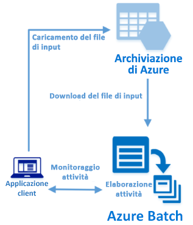

# <a name="quickstart-run-your-first-batch-job-with-the-python-api"></a>Guida introduttiva: Eseguire il primo processo Batch con l'API Python

Questa guida introduttiva esegue un processo Azure Batch da un'applicazione compilata con l'API Python di Azure Batch. L'applicazione carica più file di dati di input nell'archivio di Azure e quindi crea un *pool* di nodi di calcolo Batch (macchine virtuali). Crea quindi un *processo* di esempio che esegue *attività* per l'elaborazione di ogni file di input nel pool usando un comando di base. Dopo aver completato questa guida introduttiva, saranno chiari i concetti fondamentali del servizio Batch e sarà possibile provare Batch con carichi di lavoro più realistici su scala più ampia.
 


[!INCLUDE [quickstarts-free-trial-note.md](../../includes/quickstarts-free-trial-note.md)]

## <a name="prerequisites"></a>prerequisiti

* [Python versione 2.7, 3.3 o successiva](https://www.python.org/downloads/)

* Gestione pacchetti [pip](https://pip.pypa.io/en/stable/installing/)

* Un account Azure Batch e un account di archiviazione di Azure per utilizzo generico collegato. Per creare questi account, vedere le guide introduttive di Batch usando il [portale di Azure](quick-create-portal.md) o l'[interfaccia della riga di comando di Azure](quick-create-cli.md). 

## <a name="sign-in-to-azure"></a>Accedere ad Azure

Accedere al portale di Azure all'indirizzo [https://portal.azure.com](https://portal.azure.com).

[!INCLUDE [batch-common-credentials](../../includes/batch-common-credentials.md)]

## <a name="download-the-sample"></a>Scaricare l'esempio

[Scaricare o clonare l'app di esempio](https://github.com/Azure-Samples/batch-python-quickstart) da GitHub. Per clonare il repository dell'app di esempio con un client Git, usare il comando seguente:

```
git clone https://github.com/Azure-Samples/batch-python-quickstart.git
```

Passare alla directory contenente lo script Python `python_quickstart_client.py`.

Nell'ambiente di sviluppo Python installare i pacchetti necessari usando `pip`.

```bash
pip install -r requirements.txt
```

Aprire il file `python_quickstart_client.py`. Aggiornare le stringhe delle credenziali degli account di archiviazione e Batch con i valori ottenuti per gli account. Ad esempio: 


```Python
_BATCH_ACCOUNT_NAME = 'mybatchaccount'
_BATCH_ACCOUNT_KEY = 'xxxxxxxxxxxxxxxxE+yXrRvJAqT9BlXwwo1CwF+SwAYOxxxxxxxxxxxxxxxx43pXi/gdiATkvbpLRl3x14pcEQ=='
_BATCH_ACCOUNT_URL = 'https://mybatchaccount.mybatchregion.batch.azure.com'
_STORAGE_ACCOUNT_NAME = 'mystorageaccount'
_STORAGE_ACCOUNT_KEY = 'xxxxxxxxxxxxxxxxy4/xxxxxxxxxxxxxxxxfwpbIC5aAWA8wDu+AFXZB827Mt9lybZB1nUcQbQiUrkPtilK5BQ=='
```

## <a name="run-the-app"></a>Esecuzione dell'app

Per vedere il flusso di lavoro di Batch in azione, eseguire questo script:

```
python python_quickstart_client.py
```

Dopo l'esecuzione dello script, esaminare il codice per comprendere le operazioni eseguite da ogni parte dell'applicazione. 

Quando si esegue l'applicazione di esempio, l'output della console è simile al seguente. Durante l'esecuzione si verifica una pausa in corrispondenza di `Monitoring all tasks for 'Completed' state, timeout in 00:30:00...` mentre vengono avviati i nodi di calcolo del pool. Le attività vengono accodate per l'esecuzione non appena il primo nodo di calcolo è in esecuzione. Passare all'account Batch nel [portale di Azure](https://portal.azure.com) per monitorare il pool, i nodi di calcolo, il processo e le attività.

```
Sample start: 12/4/2017 4:02:54 PM

Container [input] created.
Uploading file taskdata0.txt to container [input]...
Uploading file taskdata1.txt to container [input]...
Uploading file taskdata2.txt to container [input]...
Creating pool [PythonQuickstartPool]...
Creating job [PythonQuickstartJob]...
Adding 3 tasks to job [PythonQuickstartJob]...
Monitoring all tasks for 'Completed' state, timeout in 00:30:00...
```

Dopo il completamento delle attività, verrà visualizzato un output simile al seguente per ogni attività:

```
Printing task output...
Task: Task0
Node: tvm-2850684224_3-20171205t000401z
Standard out:
Batch processing began with mainframe computers and punch cards. Today it still plays a central role in business, engineering, science, and other pursuits that require running lots of automated tasks....
...
```

Se si esegue l'applicazione con la configurazione predefinita, il tempo di esecuzione tipico è di circa 3 minuti. La maggior parte del tempo è necessaria per la configurazione iniziale del pool.

## <a name="review-the-code"></a>Esaminare il codice

L'app Python in questa guida introduttiva esegue queste operazioni:

* Carica tre piccoli file di testo in un contenitore BLOB nell'account di archiviazione di Azure. Questi file sono input per l'elaborazione da parte di attività Batch.
* Crea un pool di due nodi di calcolo che eseguono Ubuntu 16.04 LTS.
* Crea un processo e tre attività da eseguire nei nodi. Ogni attività elabora uno dei file di input tramite una riga di comando della shell Bash.
* Visualizza i file restituiti dalle attività.

Per altre informazioni, vedere il file `python_quickstart_client.py` e le sezioni seguenti. 

### <a name="preliminaries"></a>Operazioni preliminari

Per interagire con un account di archiviazione, l'app usa il pacchetto [azure-storage-blob](https://pypi.python.org/pypi/azure-storage-blob) per creare un oggetto [BlockBlobService](/python/api/azure.storage.blob.blockblobservice.blockblobservice).

```python
blob_client = azureblob.BlockBlobService(
    account_name=_STORAGE_ACCOUNT_NAME,
    account_key=_STORAGE_ACCOUNT_KEY)
```

L'app usa il riferimento `blob_client` per creare un contenitore nell'account di archiviazione e caricarvi i file di dati. I file nel contenitore di archiviazione sono definiti come oggetti [ResourceFile](/python/api/azure.batch.models.resourcefile) di Batch che successivamente Batch può scaricare nei nodi di calcolo.

```python
input_file_paths = [os.path.realpath('./data/taskdata0.txt'),
                    os.path.realpath('./data/taskdata1.txt'),
                    os.path.realpath('./data/taskdata2.txt')]
input_files = [
    upload_file_to_container(blob_client, input_container_name, file_path)
    for file_path in input_file_paths]
```

L'app crea un oggetto [BatchServiceClient](/python/api/azure.batch.batchserviceclient) per creare e gestire pool, processi e attività nel servizio Batch. Il client Batch nell'esempio usa l'autenticazione con chiave condivisa. Batch supporta anche l'autenticazione di Azure Active Directory.

```python
credentials = batchauth.SharedKeyCredentials(_BATCH_ACCOUNT_NAME,
    BATCH_ACCOUNT_KEY)

batch_client = batch.BatchServiceClient(
    credentials,
    base_url=_BATCH_ACCOUNT_URL)
```


### <a name="create-a-pool-of-compute-nodes"></a>Creare un pool di nodi di calcolo

Per creare un pool di Batch, l'app usa la classe [PoolAddParameter](/python/api/azure.batch.models.pooladdparameter) per impostare il numero di nodi, le dimensioni delle VM e una configurazione del pool. In questo caso, un oggetto [VirtualMachineConfiguration](/python/api/azure.batch.models.virtualmachineconfiguration) specifica un oggetto [ImageReference](/python/api/azure.batch.models.imagereference) che fa riferimento a un'immagine di Ubuntu Server 16.04 LTS pubblicata in Azure Marketplace. Batch supporta una vasta gamma di immagini di Linux e Windows Server in Azure Marketplace, oltre che immagini di VM personalizzate.

Il numero di nodi (`_POOL_NODE_COUNT`) e le dimensioni delle VM (`_POOL_VM_SIZE`) sono costanti definite. L'esempio crea per impostazione predefinita un pool con 2 nodi di dimensioni *Standard_A1_v2*. Le dimensioni consigliate offrono un buon compromesso in termini di costi/prestazioni per questo esempio rapido.

Il metodo [pool.add](/python/api/azure.batch.operations.pooloperations#azure_batch_operations_PoolOperations_add) invia il pool al servizio Batch.

```python
new_pool = batch.models.PoolAddParameter(
    id=pool_id,
    virtual_machine_configuration=batchmodels.VirtualMachineConfiguration(
        image_reference=batchmodels.ImageReference(
            publisher="Canonical",
            offer="UbuntuServer",
            sku="16.04.0-LTS",
            version="latest"
            ),
        node_agent_sku_id="batch.node.ubuntu 16.04"),
    vm_size=_POOL_VM_SIZE,
    target_dedicated_nodes=_POOL_NODE_COUNT
)
batch_service_client.pool.add(new_pool)
```

### <a name="create-a-batch-job"></a>Creare un processo Batch

Un processo Batch è un gruppo logico di una o più attività. Un processo include le impostazioni comuni per le attività, ad esempio la priorità e il pool nel quale eseguire le attività. L'app usa la classe [JobAddParameter](/python/api/azure.batch.models.jobaddparameter) per creare un processo nel pool. Il metodo [job.add](/python/api/azure.batch.operations.joboperations#azure_batch_operations_JobOperations_add) invia il pool al servizio Batch. Inizialmente il processo è privo di attività.

```python
job = batch.models.JobAddParameter(
    job_id,
    batch.models.PoolInformation(pool_id=pool_id))
batch_service_client.job.add(job)
```

### <a name="create-tasks"></a>Creare le attività

Questa app crea un elenco di oggetti attività usando la classe [TaskAddParameter](/python/api/azure.batch.models.taskaddparameter). Ogni attività elabora un oggetto `resource_files` di input usando un parametro `command_line`. Nell'esempio, la riga di comando esegue il comando `cat` della shell Bash per visualizzare il file di testo. Questo comando è un esempio semplice fornito a scopo dimostrativo. Quando si usa Batch, in questa riga di comando si specifica l'app o lo script. Batch offre una serie di modi per distribuire app e script nei nodi di calcolo.

L'app aggiunge quindi le attività al processo con il metodo [task.add_collection](/python/api/azure.batch.operations.taskoperations#azure_batch_operations_TaskOperations_add_collection), che le accoda per l'esecuzione nei nodi di calcolo. 

```python
tasks = list()

for idx, input_file in enumerate(input_files): 
    command = "/bin/bash -c \"cat {}\"".format(input_file.file_path)
    tasks.append(batch.models.TaskAddParameter(
        id='Task{}'.format(idx),
        command_line=command,
        resource_files=[input_file]
    )
)
batch_service_client.task.add_collection(job_id, tasks)
```

### <a name="view-task-output"></a>Visualizzare l'output dell'attività

L'app esegue il monitoraggio dello stato dell'attività affinché venga completata. Visualizza quindi il file `stdout.txt` generato da ogni attività completata. Quando l'attività viene eseguita correttamente, l'output del comando dell'attività viene scritto in `stdout.txt`:

```python
tasks = batch_service_client.task.list(job_id)

for task in tasks:
    
    node_id = batch_service_client.task.get(job_id, task.id).node_info.node_id
    print("Task: {}".format(task.id))
    print("Node: {}".format(node_id))

    stream = batch_service_client.file.get_from_task(job_id, task.id, _STANDARD_OUT_FILE_NAME)

    file_text = _read_stream_as_string(
        stream,
        encoding)
    print("Standard output:")
    print(file_text)
```

## <a name="clean-up-resources"></a>Pulire le risorse

L'app elimina automaticamente il contenitore di archiviazione creato e consente di scegliere se eliminare il processo e il pool di Batch. Vengono addebitati i costi del pool mentre i nodi sono in esecuzione, anche se non sono pianificati processi. Quando il pool non è più necessario, eliminarlo. Quando si elimina il pool, tutto l'output delle attività nei nodi viene eliminato. 

Quando non sono più necessari, eliminare il gruppo di risorse, l'account Batch e l'account di archiviazione. A tale scopo, nel portale di Azure selezionare il gruppo di risorse per l'account Batch e fare clic su **Elimina gruppo di risorse**.

## <a name="next-steps"></a>Passaggi successivi

In questa guida introduttiva è stata eseguita una piccola app compilata con l'API Python di Batch per creare un pool Batch e un processo Batch. Il processo ha eseguito attività di esempio e ha scaricato l'output creato nei nodi. Ora che sono stati appresi i concetti fondamentali del servizio Batch, è possibile provare Batch con carichi di lavoro più realistici su scala più ampia. Per altre informazioni su Azure Batch e la descrizione di un carico di lavoro parallelo con un'applicazione reale, continuare con l'esercitazione su Python per Batch.

> [!div class="nextstepaction"]
> [Elaborare un carico di lavoro parallelo con Python](tutorial-parallel-python.md)
