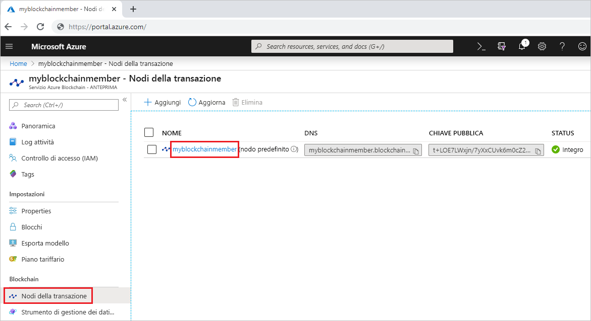
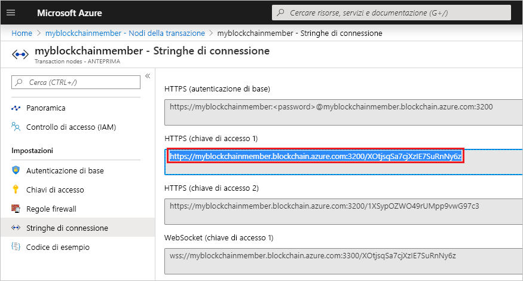
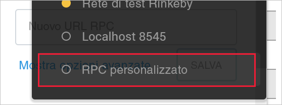
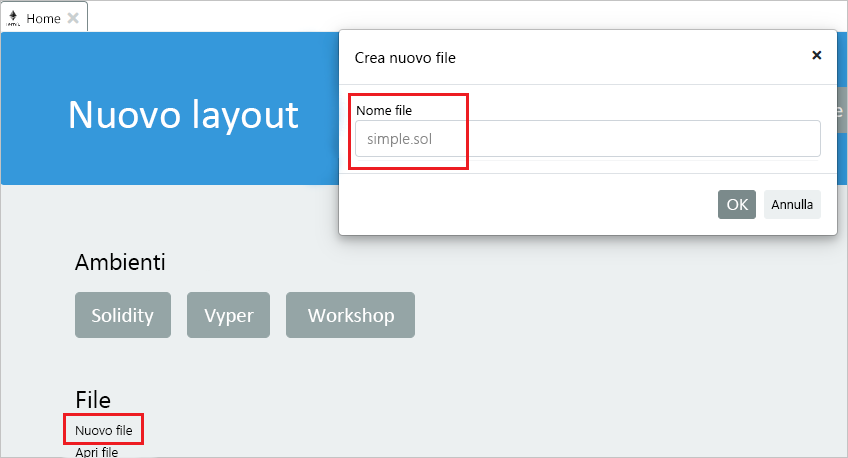
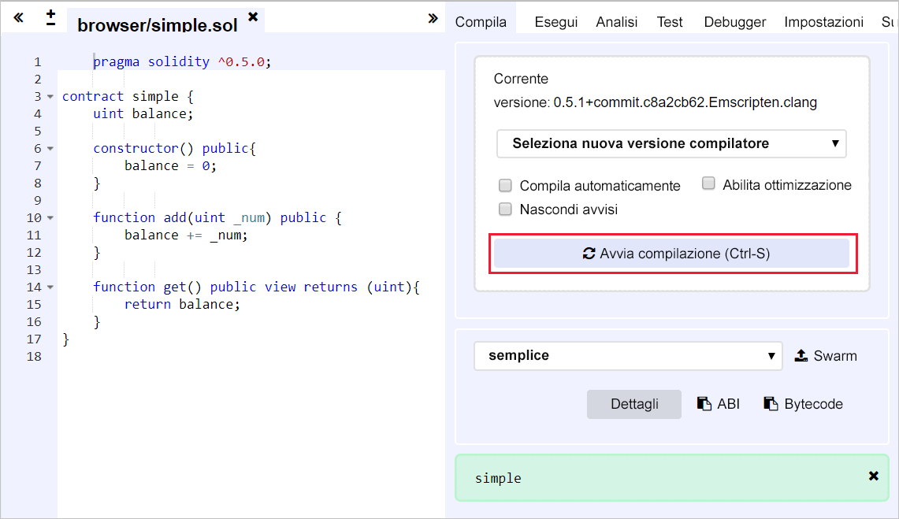
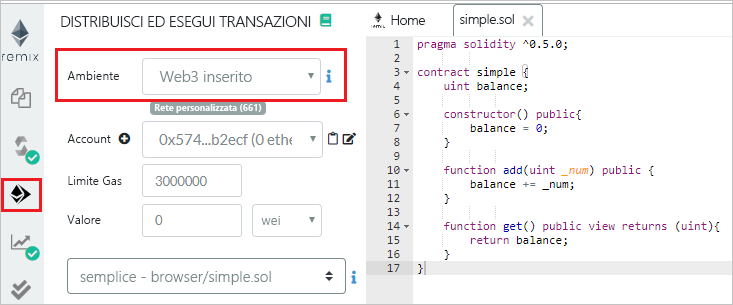
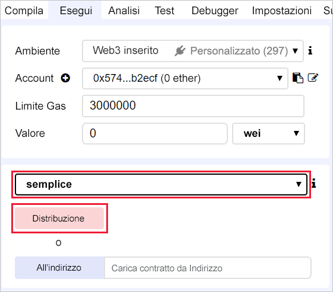
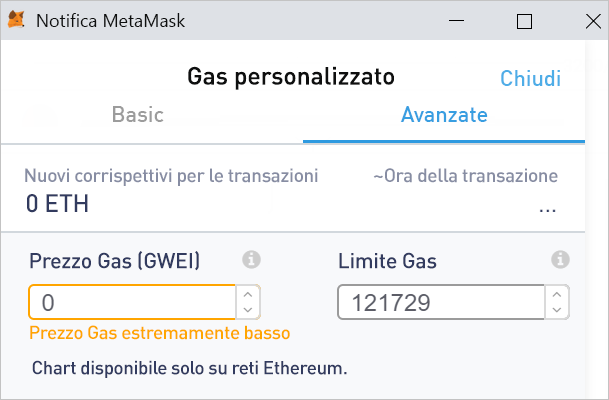
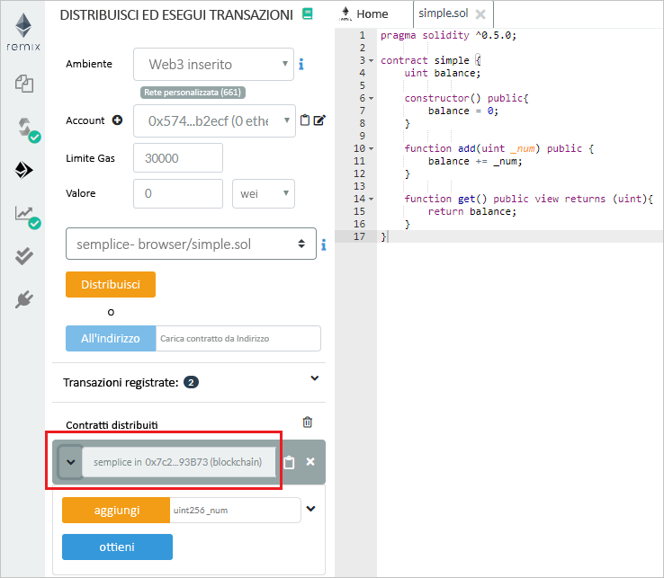
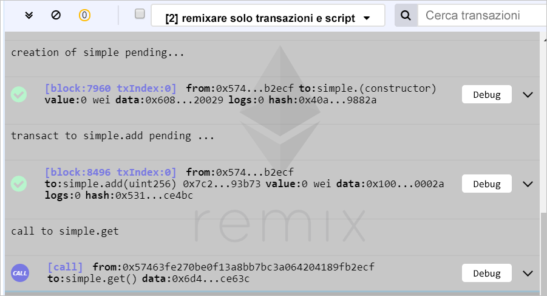

# <a name="quickstart-use-metamask-to-connect-and-deploy-a-smart-contract"></a>Guida introduttiva: Usare MetaMask per connettersi e distribuire un contratto intelligente

In questo argomento di avvio rapido si userà MetaMask per connettersi a una rete del servizio Azure Blockchain e usare Remix per distribuire un contratto intelligente. Metamask è un'estensione del browser per gestire un portafoglio Ether ed eseguire azioni di contratto intelligente.

[!INCLUDE [quickstarts-free-trial-note](../../../includes/quickstarts-free-trial-note.md)]

## <a name="prerequisites"></a>Prerequisiti

* Completare [Avvio rapido: Creare un membro della blockchain con il portale di Azure](create-member.md) o [Avvio rapido: Creare un membro della blockchain del servizio Azure Blockchain usando l'interfaccia della riga di comando di Azure](create-member-cli.md)
* Installare l'[estensione del browser MetaMask](https://metamask.io)
* Generare un [portafoglio](https://metamask.zendesk.com/hc/en-us/articles/360015488971-New-to-MetaMask-Learn-How-to-Setup-MetaMask-the-First-Time) MetaMask

## <a name="get-endpoint-address"></a>Ottenere l'indirizzo endpoint

È necessario l'indirizzo endpoint del servizio Azure Blockchain per connettersi alla rete blockchain. È possibile trovare l'indirizzo endpoint e le chiavi di accesso sul portale di Azure.

1. Accedere al [portale di Azure](https://portal.azure.com).
1. Passare al membro del servizio Azure Blockchain. Selezionare **Transaction nodes** (Nodi transazione) e il collegamento al nodo della transazione predefinito.

    

1. Selezionare **Connection strings > Access keys** (Stringhe di connessione > Chiavi di accesso).
1. Copiare l'indirizzo endpoint da **HTTPS (Access key 1)** . L'indirizzo è necessario per la sezione successiva.

    

## <a name="connect-metamask"></a>Connettere MetaMask

1. Aprire l'estensione del browser MetaMask e accedere.
1. Nell'elenco a discesa della rete, selezionare **Custom RPC** (RPC personalizzato).

    

1. In **New Network > New RPC URL** (Nuova rete > Nuovo URL RPC), immettere l'indirizzo endpoint copiato dalla sezione precedente.
1. Selezionare **Salva**.

    Se connessione è riuscita, la rete privata viene visualizzata nell'elenco a discesa della rete.

    

## <a name="deploy-smart-contract"></a>Distribuire il contratto intelligente

Remix è un ambiente di sviluppo Solidity basato su browser. L'uso congiunto di MetaMask e Remix permette di distribuire ed eseguire operazioni sui contratti intelligenti.

1. Nel browser passare a `https://remix.ethereum.org`.
1. Nella scheda **Home** selezionare **New file** (Nuovo file) sotto **File**.

    Assegnare al nuovo file il nome `simple.sol`.

    

    Selezionare **OK**.
1. Nell'editor Remix, incollare il seguente codice di **contratto intelligente semplice**.

    ```solidity
    pragma solidity ^0.5.0;
             
    contract simple {
        uint balance;
                 
        constructor() public{
            balance = 0;
        }
                 
        function add(uint _num) public {
            balance += _num;
        }
                 
        function get() public view returns (uint){
            return balance;
        }
    }
    ```

    Il **contratto semplice** dichiara una variabile di stato denominata **balance**. Sono disponibili due funzioni definite. La funzione **add** aggiunge un numero a **balance**. La funzione **get** restituisce il valore di **balance**.
1. Per compilare il contratto, selezionare prima di tutto il riquadro del compilatore Solidity e quindi **Compile simple.sol** (Compila simple.sol). 

    

1. Selezionare il riquadro **Deploy & Run** (Distribuisci ed esegui) e quindi impostare **Environment** (Ambiente) **Injected Web3** (Web3 inserito) per connettersi tramite MetaMask al membro della blockchain.

    

1. Selezionare il contratto **simple** (semplice), quindi **Deploy** (Distribuisci).

    


1. Viene visualizzata una notifica MetaMask che avvisa che i fondi sono insufficienti per eseguire la transazione.

    Per una rete pubblica blockchain, sarebbe stato necessario Ether per pagare il costo della transazione. Poiché in questo caso si tratta di una rete privata in un consorzio, è possibile impostare il prezzo del gas su zero.

1.  Selezionare **Gas Fee > Edit > Advanced** (Tariffa gas > Modifica > Avanzata) e impostare il prezzo del gas in **Gas Price** su 0.

    

    Selezionare **Salva**.

1. Selezionare **Confirm** (Conferma) per distribuire il contratto intelligente nella blockchain.
1. Nella sezione **Deployed Contracts** (Contratti distribuiti), espandere il contratto **semplice**.

    

    Esistono due azioni, **add** e **get**, che eseguono il mapping alle funzioni definite nel contratto.

1. Per eseguire una transazione **add** nella blockchain, immettere un numero da aggiungere, quindi selezionare **add**. Potrebbe essere visualizzato un messaggio di errore della stima del gas da Remix. Si sta inviando la transazione a una blockchain privata che non richiede dati relativi al gas. Selezionare **Send Transaction** (Invia transazione) per forzare la transazione.
1. Analogamente a quando è stato distribuito il contratto, viene visualizzata una notifica MetaMask che avvisa dei fondi insufficienti per eseguire la transazione.

    Poiché in questo caso si tratta di una rete privata in un consorzio, è possibile impostare il prezzo del gas su zero.

1.  Selezionare **Gas Fee > Edit > Advanced** (Tariffa gas > Modifica > Avanzata), impostare il prezzo del gas in **Gas Price** su 0 e infine selezionare **Save** (Salva).
1. Selezionare **Confirm** (Conferma) per inviare la transazione alla blockchain.
1. Selezionare l'azione **get**. Si tratta di una chiamata per eseguire query sui dati del nodo. Non è necessaria una transazione.
1. Nel riquadro di debug di Remix, è possibile visualizzare i dettagli sulle transazioni nella blockchain.

    

    È possibile visualizzare la creazione del contratto **semplice**, la transazione per **simple.add** e la chiamata a **simple.get**.

1. È anche possibile visualizzare la cronologia delle transazioni in MetaMask. Aprire l'estensione del browser MetaMask.
1. Nella sezione **History** (Cronologia) è possibile vedere un log del contratto distribuito e delle transazioni.

## <a name="next-steps"></a>Passaggi successivi

In questo argomento di avvio rapido è stata usata l'estensione del browser MetaMask per connettersi a un nodo della transazione del servizio Azure Blockchain, distribuire un contratto intelligente e inviare una transazione alla blockchain. Provare l'esercitazione successiva per usare Azure Blockchain Development Kit per Ethereum e Truffle per creare, compilare, distribuire ed eseguire una funzione di contratto intelligente tramite una transazione.

> [!div class="nextstepaction"]
> [Usare Visual Studio Code per creare, compilare e distribuire contratti intelligenti](send-transaction.md)